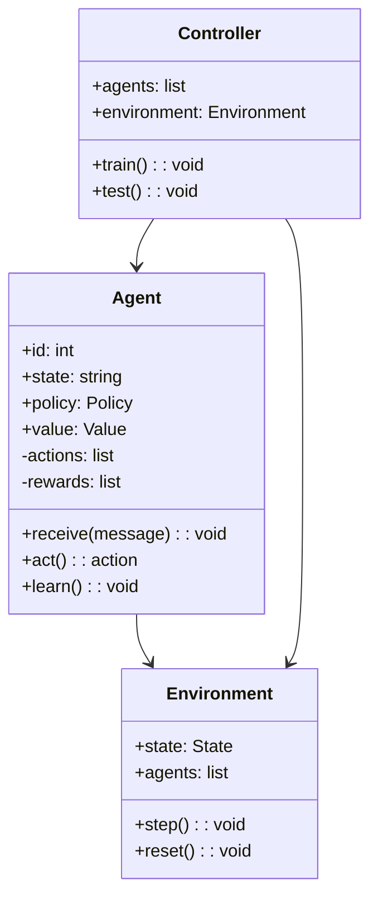

                 


# 多智能体系统优化价值投资的动态资产配置

> 关键词：多智能体系统，价值投资，动态资产配置，强化学习，多智能体协作，数学建模

> 摘要：本文探讨了如何利用多智能体系统优化价值投资的动态资产配置。通过分析多智能体系统的协作机制、价值投资的核心理念以及动态资产配置的意义，结合强化学习和多智能体协作算法，提出了一种基于多智能体系统的动态资产配置模型，并通过实际案例分析验证了模型的有效性。

---

## 第一部分：引言

### 第1章：引言

#### 1.1 多智能体系统与价值投资的结合
- **1.1.1 多智能体系统的定义与特点**
  - 多智能体系统（Multi-Agent System，MAS）是由多个智能体组成的系统，每个智能体能够感知环境、自主决策并协同工作。
  - 特点：分布性、协作性、动态性、适应性。

- **1.1.2 价值投资的核心理念**
  - 价值投资强调以低于内在价值的价格买入优质资产，长期持有，获得超额收益。
  - 核心要素：基本面分析、安全边际、长期视角。

- **1.1.3 动态资产配置的意义**
  - 动态资产配置通过调整资产组合，适应市场变化，优化风险收益比。
  - 优势：灵活性、适应性、风险控制。

#### 1.2 问题背景与研究意义
- **1.2.1 传统投资策略的局限性**
  - 传统投资策略依赖人工判断，存在主观性、滞后性和不一致性。
  - 例如：单一分析师的判断可能导致决策偏差。

- **1.2.2 多智能体系统在投资中的优势**
  - 多智能体系统能够模拟市场中多个投资者的行为，捕捉市场动态。
  - 通过协作优化，提高决策的科学性和准确性。

- **1.2.3 研究的价值与应用前景**
  - 提供一种新的投资决策框架，提升投资效率和收益。
  - 为智能投顾、量化投资等领域提供技术支持。

#### 1.3 本书结构与目标
- **1.3.1 本书的主要内容**
  - 分析多智能体系统的基本概念与模型。
  - 探讨价值投资与动态资产配置的核心理念。
  - 提出基于多智能体系统的优化算法。
  - 通过案例分析验证模型的有效性。

- **1.3.2 读者对象与学习目标**
  - 读者对象：投资者、金融工程师、人工智能研究人员。
  - 学习目标：理解多智能体系统在投资中的应用，掌握优化算法，能够实际应用到投资决策中。

---

## 第二部分：多智能体系统基础

### 第2章：多智能体系统概述

#### 2.1 多智能体系统的基本概念
- **2.1.1 多智能体系统的定义与特点**
  - 多智能体系统是由多个智能体组成的系统，每个智能体能够感知环境、自主决策并协同工作。
  - 特点：分布性、协作性、动态性、适应性。

- **2.1.2 多智能体系统的分类**
  - 分布式多智能体系统：智能体之间通过分布式通信协作。
  - 集中式多智能体系统：智能体之间通过中央协调器协作。
  - 混合式多智能体系统：结合分布式和集中式的特点。

- **2.1.3 多智能体系统的核心特点**
  - 分布式计算：每个智能体独立计算，减少单点故障。
  - 协作性：智能体之间通过协作实现共同目标。
  - 动态性：系统能够适应环境的变化。

#### 2.2 多智能体系统的模型与架构
- **2.2.1 分布式多智能体系统**
  - 每个智能体独立运行，通过消息传递进行协作。
  - 适用于去中心化的应用场景。

- **2.2.2 集中式多智能体系统**
  - 有一个中央协调器，负责协调智能体的行动。
  - 适用于需要统一调度的应用场景。

- **2.2.3 混合式多智能体系统**
  - 结合分布式和集中式的特点，部分智能体独立运行，部分通过中央协调器协作。
  - 适用于复杂场景，兼顾灵活性和协调性。

#### 2.3 多智能体系统中的协作与竞争
- **2.3.1 协作机制**
  - 协作目的：实现共同目标。
  - 协作方式：信息共享、任务分配、联合决策。
  - 协作优势：提高整体效率和决策质量。

- **2.3.2 竞争机制**
  - 竞争目的：优化个体行为。
  - 竞争方式：资源争夺、策略对抗。
  - 竞争优势：激发个体积极性，避免资源浪费。

- **2.3.3 协作与竞争的平衡**
  - 协作与竞争并非对立，可以通过机制设计实现动态平衡。
  - 例如：通过奖励机制激励协作，同时引入竞争机制优化个体行为。

---

### 2.4 多智能体系统的数学建模与分析
- **2.4.1 多智能体系统的协作模型**
  - 每个智能体都有自己的目标函数和约束条件。
  - 协作目标：全局目标函数的最大化或最小化。
  - 协作机制：通过消息传递或中间人协调实现协作。

- **2.4.2 多智能体系统的博弈论模型**
  - 多智能体系统可以看作是一个博弈过程。
  - 每个智能体选择策略以最大化自身收益。
  - 博弈结果：纳什均衡或其他均衡状态。

- **2.4.3 多智能体系统的优化模型**
  - 定义优化目标：最大化收益或最小化风险。
  - 约束条件：资金分配、风险承受能力等。
  - 求解方法：分布式优化算法、强化学习等。

---

## 第三部分：价值投资与动态资产配置

### 第3章：价值投资的核心理念

#### 3.1 价值投资的基本原理
- **3.1.1 价值投资的定义与特点**
  - 价值投资是一种长期投资策略，强调购买价格低于内在价值的资产。
  - 核心理念：寻找市场先生的错误定价。

- **3.1.2 价值投资的决策框架**
  - 基本面分析：分析企业的财务状况、行业地位、竞争优势等。
  - 安全边际：买入价格低于内在价值，以降低风险。
  - 长期视角：关注企业的长期价值，而非短期波动。

#### 3.2 动态资产配置的意义
- **3.2.1 动态资产配置的定义与特点**
  - 动态资产配置是一种投资策略，根据市场变化调整资产组合。
  - 特点：灵活性、适应性、风险控制。

- **3.2.2 动态资产配置的优势**
  - 适应市场变化：及时调整资产配置，抓住市场机会。
  - 降低风险：通过分散投资降低单一资产的风险。
  - 提高收益：通过动态调整优化收益与风险比。

---

### 第4章：动态资产配置的数学模型

#### 4.1 动态资产配置的优化目标
- **4.1.1 收益最大化**
  - 定义收益函数：最大化投资组合的收益。
  - 约束条件：资金分配、风险承受能力等。

#### 4.2 动态资产配置的风险控制
- **4.2.1 风险度量方法**
  - 方差：衡量资产组合的波动性。
  - Value at Risk (VaR)：在给定置信水平下的潜在损失。
  - Conditional Value at Risk (CVaR)：VaR的改进版本，考虑尾部风险。

#### 4.3 动态资产配置的数学公式
- **4.3.1 收益最大化模型**
  $$ \max_{w} \mu^T w $$
  $$ \text{s.t. } w^T \Sigma w \leq \sigma^2 $$
  其中，$w$ 是权重向量，$\mu$ 是收益向量，$\Sigma$ 是协方差矩阵，$\sigma^2$ 是风险容忍度。

- **4.3.2 风险最小化模型**
  $$ \min_{w} w^T \Sigma w $$
  $$ \text{s.t. } \mu^T w \geq r $$
  其中，$r$ 是最低收益要求。

---

## 第四部分：多智能体系统优化价值投资的动态资产配置

### 第5章：多智能体系统优化价值投资的算法设计

#### 5.1 基于强化学习的优化算法
- **5.1.1 强化学习的基本原理**
  - 通过智能体与环境的交互，学习最优策略。
  - 奖励机制：智能体通过最大化累积奖励来优化行为。

- **5.1.2 多智能体强化学习的挑战**
  - 协作与竞争：智能体之间需要协调行为。
  - 状态空间：多智能体系统中状态空间巨大。
  - 通信与协调：智能体之间需要有效通信以实现协作。

#### 5.2 基于多智能体协作的优化算法
- **5.2.1 多智能体协作算法**
  - 任务分配：根据智能体的能力分配任务。
  - 信息共享：通过共享信息提高协作效率。
  - 联合决策：多个智能体共同制定决策。

---

### 5.3 算法实现与代码示例

#### 5.3.1 强化学习算法实现
- **代码示例：强化学习策略网络**
  ```python
  import torch
  import torch.nn as nn

  class PolicyNetwork(nn.Module):
      def __init__(self, input_dim, output_dim):
          super(PolicyNetwork, self).__init__()
          self.fc1 = nn.Linear(input_dim, 64)
          self.fc2 = nn.Linear(64, output_dim)
          self.softmax = nn.Softmax(dim=-1)

      def forward(self, x):
          x = self.fc1(x)
          x = self.fc2(x)
          x = self.softmax(x)
          return x
  ```

#### 5.3.2 多智能体协作算法实现
- **代码示例：多智能体协作网络**
  ```python
  import torch
  import torch.nn as nn

  class MultiAgentCollaboration(nn.Module):
      def __init__(self, input_dim, output_dim):
          super(MultiAgentCollaboration, self).__init__()
          self.agents = nn.ModuleList([AgentNetwork(input_dim, output_dim) for _ in range(5)])
          self.communication = nn.Linear(output_dim, output_dim)

      def forward(self, inputs):
          for i in range(5):
              output = self.agents[i](inputs[i])
              if i < 4:
                  output = self.communication(output)
                  inputs[i+1] = output
          return output
  ```

---

## 第五部分：系统分析与架构设计

### 第6章：系统分析与架构设计

#### 6.1 问题场景介绍
- **6.1.1 投资市场的动态变化**
  - 股市、债市等金融市场的波动性。
  - 经济周期、政策变化对市场的影响。

#### 6.2 系统功能设计
- **6.2.1 数据采集模块**
  - 数据来源：股票价格、财务报表、市场新闻等。
  - 数据预处理：清洗、标准化、特征提取。

- **6.2.2 策略制定模块**
  - 基于多智能体系统的优化算法制定投资策略。
  - 生成交易信号：买入、卖出或持有。

- **6.2.3 资产分配模块**
  - 根据优化结果动态调整资产权重。
  - 实现风险控制和收益最大化。

---

### 6.3 系统架构设计

#### 6.3.1 领域模型（Mermaid类图）


#### 6.3.2 系统架构（Mermaid架构图）
```mermaid
archi
    title 多智能体系统优化价值投资的动态资产配置架构
    client --> API网关: 请求
    API网关 --> 数据源: 数据获取
    数据源 --> 数据存储: 存储
    数据存储 --> 数据处理: 处理
    数据处理 --> 智能体网络: 处理
    智能体网络 --> 决策模块: 决策
    决策模块 --> 执行模块: 执行
    执行模块 --> API网关: 返回结果
    API网关 --> 客户端: 返回结果
```

---

## 第六部分：项目实战

### 第7章：项目实战

#### 7.1 环境安装与配置
- **7.1.1 安装Python与相关库**
  - Python 3.8+
  - NumPy, Pandas, Scikit-learn, PyTorch, Gym等。

- **7.1.2 安装多智能体框架**
  - 使用Magent2或其他多智能体框架。

#### 7.2 核心代码实现
- **7.2.1 数据处理代码**
  ```python
  import pandas as pd
  import numpy as np

  # 加载数据
  df = pd.read_csv('stock_data.csv')
  # 数据预处理
  data = df.values
  normalized_data = (data - np.mean(data, axis=0)) / np.std(data, axis=0)
  ```

- **7.2.2 多智能体协作网络代码**
  ```python
  import torch
  import torch.nn as nn

  class AgentNetwork(nn.Module):
      def __init__(self, input_dim, output_dim):
          super(AgentNetwork, self).__init__()
          self.fc1 = nn.Linear(input_dim, 64)
          self.fc2 = nn.Linear(64, output_dim)
          self.softmax = nn.Softmax(dim=-1)

      def forward(self, x):
          x = self.fc1(x)
          x = self.fc2(x)
          x = self.softmax(x)
          return x
  ```

#### 7.3 实际案例分析与结果解读
- **7.3.1 实验结果**
  - 模型在不同市场环境下的表现。
  - 对比传统投资策略的收益与风险。

- **7.3.2 结果解读**
  - 验证模型的有效性。
  - 分析模型的优势与不足。

---

## 第七部分：总结与展望

### 第8章：总结与展望

#### 8.1 最佳实践
- **8.1.1 数据质量的重要性**
  - 高质量的数据是模型准确性的基础。
  - 数据清洗、特征工程的重要性。

- **8.1.2 模型调优的技巧**
  - 参数调整、超参数优化。
  - 使用交叉验证、网格搜索等方法。

- **8.1.3 系统的可扩展性**
  - 随着市场的变化，系统需要具备扩展性。
  - 模型的实时性与适应性。

#### 8.2 总结
- 多智能体系统为价值投资的动态资产配置提供了新的思路。
- 通过协作与竞争机制，优化投资决策。
- 提供了一种科学的投资决策框架。

#### 8.3 未来展望
- 智能投顾的普及与应用。
- 多智能体系统在量化投资中的深度应用。
- 更复杂市场环境下的多智能体协作优化。

---

## 附录

### 附录A：数学公式汇总
- 动态资产配置的优化目标函数：
  $$ \max_{w} \mu^T w $$
  $$ \text{s.t. } w^T \Sigma w \leq \sigma^2 $$

### 附录B：代码库与工具
- Python库：NumPy, Pandas, PyTorch, Gym。
- 开发工具：Jupyter Notebook, VS Code。

### 附录C：参考文献
- West, D. (2021). Multi-Agent Systems: A Tutorial.
- Goodfellow, I., Bengio, Y., & Courville, A. (2016). Deep Learning.

---

## 结语

通过本文的详细讲解，读者可以全面了解多智能体系统在优化价值投资动态资产配置中的应用。从理论到实践，从算法到系统设计，我们提供了一套完整的解决方案，为投资决策提供了新的思路和方法。希望本文能够为投资者和研究人员提供有价值的参考和启发。

