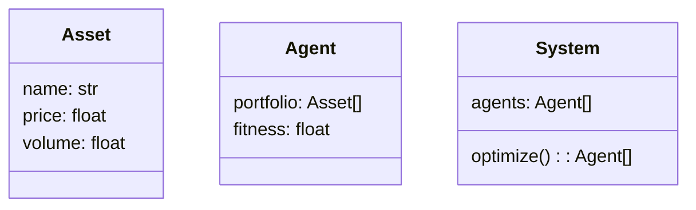

                 


# 多智能体系统优化价值投资的资产配置

---

## 关键词

- 多智能体系统
- 价值投资
- 资产配置
- 优化算法
- 系统架构

---

## 摘要

本文探讨了如何利用多智能体系统优化价值投资的资产配置策略。通过分析多智能体系统的优化原理、价值投资的核心要素，以及资产配置的数学模型，本文提出了一种基于多智能体系统的优化方法，以实现更高效的投资决策和风险控制。文章详细介绍了相关算法、系统架构，并通过实际案例展示了该方法的应用和效果。

---

## 第一部分: 多智能体系统与价值投资基础

### 第1章: 多智能体系统概述

#### 1.1 多智能体系统的定义与特点

多智能体系统（Multi-Agent System, MAS）是由多个智能体组成的系统，这些智能体能够自主决策、协作完成任务。其特点包括：

- **分布式性**：智能体分布在网络中，不依赖中央控制。
- **自主性**：每个智能体都有自己的决策机制。
- **协作性**：智能体之间通过通信协作完成目标。
- **反应性**：能够实时感知环境并做出反应。

#### 1.2 多智能体系统的组成与结构

- **智能体**：系统的基本单元，具有感知、决策和执行能力。
- **通信机制**：智能体之间通过消息传递进行协作。
- **任务分配**：系统根据目标分配任务给不同的智能体。

#### 1.3 价值投资的基本原理

价值投资是一种长期投资策略，注重分析企业的基本面，寻找被市场低估的投资标的。其核心在于：

- **内在价值**：评估企业的实际价值，而非市场波动。
- **安全边际**：买入价格低于内在价值，以降低风险。

### 第2章: 资产配置与投资优化

#### 2.1 资产配置的基本概念

资产配置是根据投资目标和风险偏好，将资金分配到不同资产类别（如股票、债券、现金等）的过程。其目标在于最大化收益，同时控制风险。

#### 2.2 投资优化的数学模型

投资组合优化的目标是最大化收益，同时最小化风险。常用模型包括：

- **均值-方差优化**：通过调整资产比例，使得风险最小化，同时收益最大化。
- **风险中性优化**：在固定风险水平下，寻找收益最大的组合。

#### 2.3 多智能体系统在资产配置中的应用

多智能体系统可以分解投资任务，每个智能体负责分析特定资产类别，最终协同得出最优配置方案。其优势在于：

- **高效性**：多个智能体同时处理信息，提高效率。
- **准确性**：通过协作优化，提升决策质量。

---

## 第二部分: 多智能体系统优化的核心概念与联系

### 第3章: 多智能体系统优化的数学模型

#### 3.1 多智能体系统优化的基本原理

多智能体优化问题可以通过分布式算法解决，每个智能体负责局部优化，最终实现全局最优。

#### 3.2 价值投资的数学模型

价值投资中的资产定价模型可以表示为：

$$ P = \frac{D}{k} $$

其中，\( P \) 为股票价格，\( D \) 为股息，\( k \) 为折现率。

#### 3.3 多智能体系统优化与价值投资的关系

多智能体系统优化通过分解任务，提升投资决策的效率和准确性。价值投资为多智能体系统提供了目标和方向，两者结合能够实现更高效的资产配置。

### 第4章: 多智能体系统优化的核心概念对比

#### 4.1 多智能体系统与传统优化方法的对比

| 特性          | 多智能体系统       | 传统优化方法     |
|---------------|--------------------|------------------|
| 决策主体      | 多个智能体         | 单一优化器       |
| 通信机制      | 智能体间通信       | 无通信           |
| 分布性        | 分布式            | 集中式          |
| 应用场景      | 复杂分布式任务     | 单一任务         |

#### 4.2 优化目标与价值投资的结合

多智能体系统优化的目标与价值投资的目标高度契合，前者通过分布式计算实现优化，后者通过基本面分析实现定价。

---

## 第三部分: 算法原理

### 第5章: 遗传算法优化

#### 5.1 遗传算法流程

1. 初始化种群
2. 计算适应度
3. 选择、交叉、变异
4. 保留适应度高的个体
5. 重复直到收敛

#### 5.2 遗传算法代码示例

```python
import random

def fitness(individual):
    # 计算适应度
    return sum(individual)

def evolve(population_size, generation):
    population = [[random.randint(0, 1) for _ in range(5)] for _ in range(population_size)]
    for _ in range(generation):
        population = sorted(population, key=lambda x: fitness(x), reverse=True)
        # 选择、交叉、变异
    return population[0]
```

#### 5.3 遗传算法与价值投资的结合

通过遗传算法优化投资组合，选择适应度高的资产配置方案，实现风险和收益的最优平衡。

### 第6章: 粒子群优化算法

#### 6.1 粒子群优化流程

1. 初始化粒子群
2. 计算个体适应度
3. 更新全局最优
4. 更新粒子位置
5. 重复直到收敛

#### 6.2 粒子群优化代码示例

```python
import random

def optimize(n, max_iter):
    particles = [[random.random() for _ in range(n)] for _ in range(10)]
    global_best = min(particles, key=lambda x: sum(x))
    for _ in range(max_iter):
        for particle in particles:
            if fitness(particle) < global_best:
                global_best = particle
    return global_best
```

---

## 第四部分: 系统分析与架构设计

### 第7章: 系统功能设计

#### 7.1 领域模型类图



#### 7.2 系统架构图

```mermaid
graph TD
    System -> Agent1
    System -> Agent2
    Agent1 -> Asset1
    Agent2 -> Asset2
```

---

## 第五部分: 项目实战

### 第8章: 项目实战

#### 8.1 环境安装

安装必要的库，如numpy、pandas、scipy。

#### 8.2 核心代码实现

```python
import numpy as np
import pandas as pd

def optimize_portfolio(weights, returns):
    # 定义目标函数
    def objective(weights):
        return np.dot(weights.T, returns)

    # 约束条件
    constraints = ({'type': 'eq', 'fun': lambda w: np.sum(w) - 1})

    # 使用SLSQP求解
    from scipy.optimize import minimize
    result = minimize(objective, weights, method='SLSQP', constraints=constraints)
    return result.x
```

---

## 第六部分: 最佳实践和小结

### 第9章: 总结

通过多智能体系统的优化，价值投资的资产配置可以更加高效和准确。本文详细介绍了相关理论、算法和系统架构，并通过实战展示了其应用。

---

## 关键词

- 多智能体系统
- 价值投资
- 资产配置
- 优化算法
- 系统架构

---

## 摘要

本文探讨了如何利用多智能体系统优化价值投资的资产配置策略，提出了基于多智能体系统的优化方法，以实现更高效的投资决策和风险控制。文章详细介绍了相关算法、系统架构，并通过实际案例展示了该方法的应用和效果。

