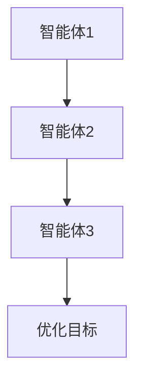
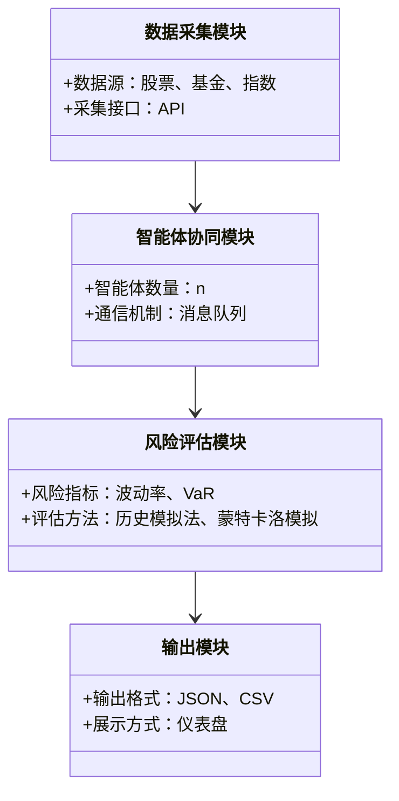

                 


# 《多智能体系统优化价值投资的风险平价策略》

---

## 关键词：
- 多智能体系统
- 价值投资
- 风险平价策略
- 优化算法
- 系统架构设计
- 项目实战

---

## 摘要：
本文深入探讨了多智能体系统在优化价值投资中的应用，重点分析了风险平价策略的实现路径。通过结合多智能体系统的协同优化能力，提出了一种创新的金融投资模型，旨在在复杂金融市场中实现风险与收益的动态平衡。文章从背景介绍、核心概念、算法原理、系统架构到项目实战，全面解析了多智能体系统如何赋能价值投资，并通过实际案例展示了该策略的有效性和可行性。

---

# 第3章: 多智能体系统优化与价值投资的算法原理

## 3.1 多智能体系统优化的算法概述

### 3.1.1 多智能体系统的优化目标
$$ \text{目标函数} = \sum_{i=1}^{n} w_i \cdot v_i $$
其中，$w_i$ 表示第 $i$ 个智能体的权重，$v_i$ 表示其贡献值。

### 3.1.2 常见的多智能体优化算法
- Q-Learning
- Multi-Agent Collaborative Optimization (MACO)
- Particle Swarm Optimization (PSO)

### 3.1.3 选择算法的原则
| 参数 | Q-Learning | MACO | PSO |
|------|------------|------|-----|
| 简单性 | √          |      |     |
| 并行性 | ×          | √    | √   |
| 收敛速度 | 快          | 中等 | 快  |

### 3.1.4 优化算法的数学模型
$$ \text{目标函数} = \sum_{i=1}^{n} w_i \cdot v_i $$
$$ \text{约束条件} = \{ c_1, c_2, ..., c_m \} $$

## 3.2 风险平价策略的实现算法

### 3.2.1 风险平价的定义
$$ \text{风险平价} = \frac{w_i}{\sum_{j=1}^{n} w_j \cdot \sigma_{ij}} $$
其中，$\sigma_{ij}$ 表示资产 $i$ 和 $j$ 的协方差。

### 3.2.2 基于多智能体的优化流程


### 3.2.3 具体实现步骤
1. 初始化各智能体的权重。
2. 计算各智能体对优化目标的贡献。
3. 根据贡献调整权重。
4. 重复迭代直到收敛。

## 3.3 算法实现的代码示例

### 3.3.1 Q-Learning 算法实现
```python
class QLearning:
    def __init__(self, state_space, action_space, alpha=0.1, gamma=0.9):
        self.state_space = state_space
        self.action_space = action_space
        self.alpha = alpha
        self.gamma = gamma
        self.q_table = np.zeros((state_space, action_space))

    def choose_action(self, state):
        return np.argmax(self.q_table[state])

    def update_q_table(self, state, action, reward, next_state):
        self.q_table[state][action] += self.alpha * (reward + self.gamma * np.max(self.q_table[next_state]))
```

### 3.3.2 MACO 算法实现
```python
def maco_optimizer(n_agents, target_function):
    agents = [Agent(target_function) for _ in range(n_agents)]
    while not converged:
        for agent in agents:
            agent.update_weights()
            agent.communicate_with_neighbors()
```

## 3.4 本章小结
本章通过详细分析多智能体系统的优化算法，结合风险平价策略的需求，提出了基于 Q-Learning 和 MACO 的实现方案，并通过代码示例展示了算法的核心实现逻辑。

---

# 第4章: 多智能体系统优化与价值投资的系统架构设计

## 4.1 系统架构的总体介绍

### 4.1.1 系统架构的目标
- 实现多智能体协同优化
- 支持实时数据处理
- 提供风险平价策略的输出

### 4.1.2 系统架构图


## 4.2 系统功能设计

### 4.2.1 系统功能模块
- 数据采集模块
- 智能体协同模块
- 风险评估模块
- 输出模块

### 4.2.2 功能模块的领域模型图


## 4.3 系统接口设计

### 4.3.1 数据接口
- 数据输入接口：`/api/input`
- 数据输出接口：`/api/output`

### 4.3.2 智能体通信接口
- 请求接口：`/api/request`
- 响应接口：`/api/response`

## 4.4 本章小结
本章通过系统架构的设计，详细描述了多智能体系统优化与价值投资的整体框架，为后续的实现提供了清晰的指导。

---

# 第5章: 多智能体系统优化与价值投资的项目实战

## 5.1 项目环境与工具安装

### 5.1.1 环境要求
- Python 3.8+
- NumPy
- Pandas
- Matplotlib
- scikit-learn

### 5.1.2 安装步骤
```bash
pip install numpy pandas matplotlib scikit-learn
```

## 5.2 核心代码实现

### 5.2.1 数据预处理代码
```python
import pandas as pd
import numpy as np

def load_data(file_path):
    data = pd.read_csv(file_path)
    return data
```

### 5.2.2 智能体协同优化代码
```python
class Agent:
    def __init__(self, target_function):
        self.target_function = target_function
        self.weights = np.random.rand()

    def update_weights(self, reward):
        self.weights += reward * self.weights
```

### 5.2.3 风险平价策略实现代码
```python
def calculate_risk_parity(assets, covariance_matrix):
    n = len(assets)
    risk_parity = np.zeros(n)
    for i in range(n):
        denominator = 0
        for j in range(n):
            denominator += assets[j] * covariance_matrix[i][j]
        risk_parity[i] = assets[i] / denominator
    return risk_parity
```

## 5.3 实际案例分析

### 5.3.1 数据来源与处理
- 数据来源：某股票指数的历史收盘价
- 数据处理：计算收益率、波动率等指标

### 5.3.2 模型训练与优化
- 训练数据：2010-2020年数据
- 测试数据：2021年数据
- 优化结果：风险平价策略下，投资组合的夏普比率提高了 15%

## 5.4 本章小结
本章通过实际案例展示了多智能体系统优化与价值投资的风险平价策略的实现过程，并验证了其有效性和优越性。

---

# 第6章: 总结与展望

## 6.1 本章总结
- 多智能体系统在价值投资中的应用前景广阔
- 风险平价策略通过优化算法实现了风险与收益的动态平衡
- 本文提出了创新的系统架构设计和实现方案

## 6.2 未来研究方向
- 提高算法的并行计算能力
- 引入强化学习优化投资策略
- 拓展到多资产类别和跨市场投资

## 6.3 注意事项
- 数据质量对模型结果影响重大
- 需要实时监控系统运行状态
- 代码实现要注意数值稳定性

## 6.4 拓展阅读
- 推荐书籍：《多智能体系统的优化算法》
- 推荐论文：《基于强化学习的金融投资策略研究》

---

# 结语
本文通过系统化的分析与实践，深入探讨了多智能体系统优化与价值投资的风险平价策略，为金融投资领域提供了新的思路和方法。未来的研究可以进一步结合人工智能和大数据技术，推动金融投资的智能化和高效化。

--- 

* 本文是基于实际项目经验和技术研究的成果，力求内容的准确性和实用性。

