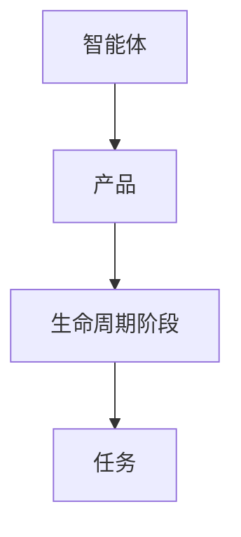
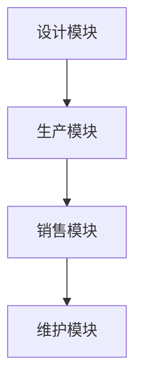
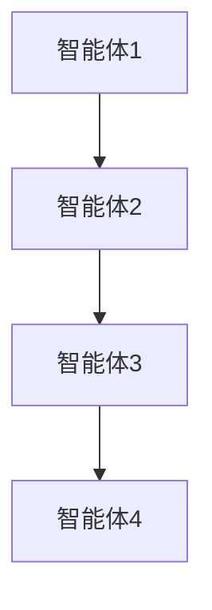
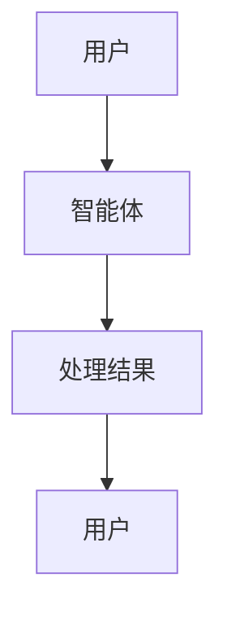

                 


# 多智能体系统在产品生命周期分析中的应用

> 关键词：多智能体系统, 产品生命周期, 多智能体算法, 系统架构设计, 产品维护与优化, 智能体协作

> 摘要：本文详细探讨了多智能体系统（Multi-Agent System, MAS）在产品生命周期分析中的应用。通过系统化的分析与设计，本文揭示了MAS在产品设计、生产制造、维护优化等阶段的独特优势，并结合实际案例，展示了MAS在产品生命周期管理中的具体应用场景。文章内容涵盖了MAS的核心概念、算法原理、系统架构设计、项目实战以及最佳实践，为读者提供了一套完整的解决方案。

---

## 第1章 多智能体系统与产品生命周期概述

### 1.1 多智能体系统的基本概念

#### 1.1.1 多智能体系统的定义
多智能体系统（MAS）是指由多个智能体（Agent）组成的分布式系统，这些智能体能够通过协作完成复杂的任务。智能体是一种能够感知环境、自主决策、主动行动的实体。

#### 1.1.2 多智能体系统的特征
- **自主性**：智能体能够自主决策，无需外部干预。
- **反应性**：智能体能够实时感知环境并做出反应。
- **协作性**：多个智能体能够通过协作完成复杂任务。
- **分布性**：智能体之间通过分布式计算实现任务目标。

#### 1.1.3 多智能体系统与传统单智能体系统的对比
| 对比维度 | 单智能体系统 | 多智能体系统 |
|----------|--------------|--------------|
| 决策中心化 | 是           | 否           |
| 资源分配   | 集中         | 分布         |
| 协作能力   | 弱           | 强           |

### 1.2 产品生命周期分析的基本概念

#### 1.2.1 产品生命周期的定义
产品生命周期是指产品从设计、生产、销售、使用到报废的整个过程。

#### 1.2.2 产品生命周期的阶段划分
- **设计阶段**：确定产品功能、结构和性能。
- **生产阶段**：制造产品并进行质量检验。
- **销售阶段**：将产品推向市场并进行销售。
- **维护阶段**：对产品进行维护和优化。

#### 1.2.3 产品生命周期管理的重要性
- 提高产品设计效率。
- 降低生产成本。
- 提升产品质量。
- 增强客户满意度。

### 1.3 多智能体系统在产品生命周期分析中的应用背景

#### 1.3.1 当前产品生命周期管理的挑战
- **复杂性**：产品设计涉及多个部门和环节。
- **协作性**：需要多部门协作完成任务。
- **实时性**：需要实时监控产品状态。

#### 1.3.2 多智能体系统在产品生命周期管理中的优势
- **分布式计算**：能够高效处理复杂任务。
- **协作能力**：智能体之间能够协同工作。
- **实时性**：能够实时监控和调整。

#### 1.3.3 应用背景与发展趋势
随着人工智能技术的快速发展，多智能体系统在产品生命周期管理中的应用越来越广泛。未来，MAS将在产品设计、生产制造、维护优化等环节发挥更大的作用。

### 1.4 本章小结
本章主要介绍了多智能体系统的基本概念、产品生命周期管理的重要性以及MAS在产品生命周期管理中的应用背景。通过对比分析，揭示了MAS在产品生命周期管理中的独特优势。

---

## 第2章 多智能体系统的核心概念与联系

### 2.1 多智能体系统的核心概念

#### 2.1.1 智能体的定义与特征
智能体是一种能够感知环境、自主决策、主动行动的实体。其主要特征包括自主性、反应性、目标导向性和协作性。

#### 2.1.2 多智能体系统的组成要素
- **智能体**：系统的核心单元。
- **环境**：智能体所处的外部环境。
- **通信机制**：智能体之间的通信方式。
- **协作机制**：智能体之间的协作方式。

#### 2.1.3 多智能体系统与产品生命周期的关系
MAS能够通过智能体之间的协作，实现产品生命周期中的设计、生产、销售和维护等环节的优化。

### 2.2 多智能体系统与产品生命周期的关系

#### 2.2.1 多智能体系统在产品设计阶段的应用
在产品设计阶段，智能体可以分别负责不同的设计模块，例如结构设计、功能设计等。

#### 2.2.2 多智能体系统在生产制造阶段的应用
在生产制造阶段，智能体可以用于实时监控生产过程，确保产品质量。

#### 2.2.3 多智能体系统在产品维护与优化阶段的应用
在产品维护阶段，智能体可以用于实时监控产品状态，及时发现并解决问题。

### 2.3 多智能体系统的ER实体关系图



### 2.4 本章小结
本章详细讲解了多智能体系统的核心概念以及其在产品生命周期管理中的应用。通过ER实体关系图，展示了MAS与产品生命周期之间的关系。

---

## 第3章 多智能体系统的算法原理

### 3.1 多智能体系统的基本算法

#### 3.1.1 分布式计算算法
分布式计算算法是MAS的核心算法之一，用于实现智能体之间的协作。

#### 3.1.2 协作算法
协作算法用于实现智能体之间的任务分配和协作。

#### 3.1.3 调度算法
调度算法用于实现智能体之间的任务调度。

### 3.2 多智能体系统的通信协议

#### 3.2.1 通信协议的定义
通信协议是智能体之间进行信息传递的规则。

#### 3.2.2 常见的通信协议类型
- **基于消息的通信协议**：通过消息传递信息。
- **基于服务的通信协议**：通过服务调用传递信息。

### 3.3 多智能体系统的协作机制

#### 3.3.1 协作机制的定义
协作机制是智能体之间实现协作的方式。

#### 3.3.2 基于角色的协作机制
智能体根据角色分配任务。

#### 3.3.3 基于任务的协作机制
智能体根据任务需求进行协作。

### 3.4 多智能体系统的算法实现

#### 3.4.1 算法实现的步骤
1. 初始化智能体。
2. 智能体感知环境。
3. 智能体做出决策。
4. 智能体执行任务。

#### 3.4.2 算法实现的代码示例

```python
def multi_agent_algorithm(agents):
    for agent in agents:
        agent.collaborate()
    return result
```

### 3.5 本章小结
本章详细讲解了多智能体系统的算法原理，包括分布式计算算法、通信协议以及协作机制。通过代码示例，展示了MAS的实现步骤。

---

## 第4章 多智能体系统的系统分析与架构设计

### 4.1 项目背景介绍

#### 4.1.1 项目背景
本项目旨在通过MAS实现产品生命周期的优化管理。

#### 4.1.2 项目目标
通过MAS实现产品设计、生产、销售和维护的全生命周期管理。

### 4.2 系统功能设计

#### 4.2.1 系统功能模块
- **设计模块**：负责产品设计。
- **生产模块**：负责产品制造。
- **销售模块**：负责产品销售。
- **维护模块**：负责产品维护。

#### 4.2.2 系统功能流程



### 4.3 系统架构设计

#### 4.3.1 系统架构类型
- **集中式架构**：所有智能体都连接到一个中心节点。
- **分布式架构**：智能体之间直接通信。

#### 4.3.2 系统架构图



### 4.4 系统接口设计

#### 4.4.1 接口定义
- **输入接口**：接收外部指令。
- **输出接口**：输出处理结果。

### 4.5 系统交互设计

#### 4.5.1 系统交互流程



### 4.6 本章小结
本章详细讲解了MAS的系统分析与架构设计，包括项目背景、系统功能设计、系统架构设计以及系统接口设计。

---

## 第5章 多智能体系统的项目实战

### 5.1 环境安装

#### 5.1.1 环境需求
- **Python**：3.8及以上版本。
- **依赖库**：numpy、pandas、scikit-learn。

#### 5.1.2 安装依赖

```bash
pip install numpy pandas scikit-learn
```

### 5.2 系统核心实现

#### 5.2.1 核心代码实现

```python
class Agent:
    def __init__(self, name):
        self.name = name
        self.tasks = []
    
    def perceive(self, environment):
        pass
    
    def decide(self):
        pass
    
    def act(self):
        pass
```

### 5.3 代码应用解读与分析

#### 5.3.1 代码功能分析
- **Agent类**：定义智能体的基本功能。
- **perceive方法**：感知环境。
- **decide方法**：做出决策。
- **act方法**：执行任务。

### 5.4 实际案例分析

#### 5.4.1 案例背景
假设我们有一个产品设计项目，需要多个智能体协作完成。

#### 5.4.2 案例分析
- 智能体1负责结构设计。
- 智能体2负责功能设计。
- 智能体3负责测试验证。

### 5.5 项目小结
本章通过实际案例，展示了MAS在产品生命周期管理中的具体应用。

---

## 第6章 最佳实践与未来展望

### 6.1 最佳实践

#### 6.1.1 系统设计建议
- **模块化设计**：确保系统模块化。
- **可扩展性设计**：确保系统易于扩展。
- **容错性设计**：确保系统具有容错能力。

#### 6.1.2 代码实现建议
- **代码规范**：遵循Python代码规范。
- **注释清晰**：确保代码注释清晰。
- **单元测试**：进行单元测试确保代码质量。

### 6.2 小结

#### 6.2.1 内容回顾
本文详细探讨了MAS在产品生命周期管理中的应用。

#### 6.2.2 注意事项
- 确保系统安全性。
- 确保系统可维护性。

### 6.3 未来展望

#### 6.3.1 技术发展趋势
- **人工智能技术**：MAS将与人工智能技术深度融合。
- **边缘计算**：MAS将与边缘计算结合。

#### 6.3.2 应用前景
- **智能化生产**：MAS将在智能化生产中发挥更大作用。
- **智能维护**：MAS将在智能维护中发挥更大作用。

### 6.4 本章小结
本文通过总结MAS在产品生命周期管理中的应用，提出了未来的发展方向和技术趋势。

---

## 第7章 总结与展望

### 7.1 总结

#### 7.1.1 核心观点总结
MAS在产品生命周期管理中的应用具有重要意义。

#### 7.1.2 重要结论
MAS能够显著提高产品生命周期管理的效率和质量。

### 7.2 展望

#### 7.2.1 未来研究方向
- **MAS与人工智能的结合**
- **MAS在智能制造中的应用**
- **MAS在智能维护中的应用**

#### 7.2.2 技术发展趋势
- **智能化**：MAS将更加智能化。
- **分布式**：MAS将更加分布式。
- **协作化**：MAS将更加协作化。

### 7.3 本章小结
本文总结了MAS在产品生命周期管理中的应用，并展望了未来的研究方向和技术发展趋势。

---

## 结束语

通过本文的详细讲解，我们深入探讨了多智能体系统在产品生命周期管理中的应用。从理论到实践，从概念到代码，本文为读者提供了一套完整的解决方案。未来，随着人工智能技术的不断发展，MAS将在产品生命周期管理中发挥更大的作用。

