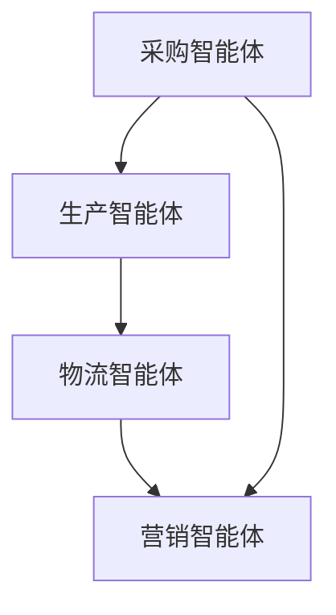
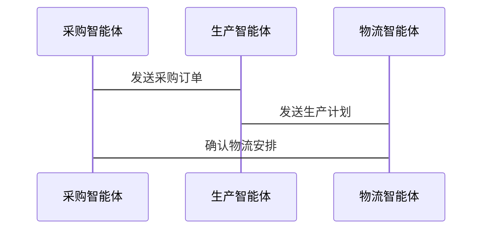

                 


# 多智能体系统在企业价值链分析中的应用

> 关键词：多智能体系统, 企业价值链, 协同优化, 分布式计算, 智能体建模, 价值链分析

> 摘要：本文深入探讨了多智能体系统（Multi-Agent System, MAS）在企业价值链分析中的应用。通过结合MAS的分布式计算特点，分析了其在企业价值链优化中的优势，详细介绍了MAS的基本概念、核心原理、系统架构，以及在企业价值链分析中的具体应用场景。文章还通过实际案例展示了MAS在企业价值链分析中的实现过程，并总结了MAS在企业价值链分析中的应用价值和未来发展方向。

---

## 第一部分: 多智能体系统与企业价值链分析概述

### 第1章: 多智能体系统与企业价值链分析概述

#### 1.1 多智能体系统的基本概念

##### 1.1.1 多智能体系统的定义
多智能体系统（Multi-Agent System, MAS）是由多个智能体（Agent）组成的分布式计算系统。智能体是能够感知环境、自主决策、主动行动的实体，具有反应性、主动性、社会性等特征。

##### 1.1.2 多智能体系统的特征
- **分布性**：智能体独立运行，协同完成任务。
- **自主性**：每个智能体都能自主决策。
- **反应性**：智能体能够感知环境并实时响应。
- **协作性**：智能体之间通过通信和协商实现协作。
- **动态性**：系统环境和任务需求可能动态变化。

##### 1.1.3 多智能体系统与单智能体系统的区别
| 特性 | 单智能体系统 | 多智能体系统 |
|------|--------------|-------------|
| 结构 | 单一中心 | 分布式结构 |
| 决策 | 集中控制 | 分布式决策 |
| 任务 | 单一目标 | 多目标协作 |

#### 1.2 企业价值链分析的基本概念

##### 1.2.1 企业价值链的定义
企业价值链是指企业从原材料采购、生产加工、物流配送、市场营销到最终产品交付的完整过程。价值链分析旨在优化各个环节的资源配置和协同效率。

##### 1.2.2 企业价值链的构成要素
- **输入**：原材料、资金、技术等。
- **转换**：生产加工、技术研发、市场营销等。
- **输出**：产品或服务。
- **客户价值**：满足客户需求，创造价值。

##### 1.2.3 企业价值链分析的重要性
- 提高效率，降低成本。
- 优化资源配置，提升企业竞争力。
- 支持企业战略决策。

#### 1.3 多智能体系统在企业价值链分析中的应用背景

##### 1.3.1 企业价值链分析的传统方法
传统的企业价值链分析通常采用集中式方法，依赖人工协调和优化，效率较低，难以应对动态变化的市场需求。

##### 1.3.2 多智能体系统在企业价值链分析中的优势
- **分布式计算**：MAS能够实现企业价值链各环节的分布式优化。
- **自主决策**：智能体能够根据环境变化自主调整策略。
- **实时协作**：MAS支持实时通信和协作，提升企业响应速度。

##### 1.3.3 当前研究现状与发展趋势
当前，学术界和工业界都在积极探索MAS在企业价值链中的应用，特别是在智能供应链、智能制造等领域取得了显著进展。

#### 1.4 本章小结
本章介绍了多智能体系统的基本概念、特征及其在企业价值链分析中的应用背景，为后续章节的分析奠定了基础。

---

## 第二部分: 多智能体系统的核心概念与原理

### 第2章: 多智能体系统的原理与架构

#### 2.1 多智能体系统的组成结构

##### 2.1.1 智能体的定义与分类
智能体是具有感知、决策、行动能力的实体，可以分为反应式智能体、基于模型的智能体、效用驱动智能体等类型。

##### 2.1.2 多智能体系统的层次结构
- **物理层**：智能体的物理实现。
- **通信层**：智能体之间的通信机制。
- **协作层**：智能体之间的协作逻辑。
- **应用层**：具体的应用场景。

##### 2.1.3 多智能体系统的通信机制
- **消息传递**：智能体之间通过消息传递信息。
- **黑板模型**：共享黑板上的信息，实现协作。
- **发布-订阅模型**：智能体发布事件，其他智能体订阅并响应。

#### 2.2 多智能体系统的协调与协作

##### 2.2.1 协调机制的定义与类型
协调机制是智能体之间为实现共同目标而采取的策略，包括集中式协调、分布式协调和自组织协调。

##### 2.2.2 分布式计算与协商算法
协商算法是MAS中智能体协作的核心，常见的协商算法包括：

- **一致性算法**：确保所有智能体达成一致。
- **拍卖算法**：通过拍卖机制分配任务。
- **分布式决策算法**：基于局部信息做出全局决策。

##### 2.2.3 多智能体系统中的冲突解决
- **冲突检测**：识别潜在冲突。
- **冲突解决策略**：优先级规则、协商解决、第三方仲裁等。

#### 2.3 多智能体系统的建模与仿真

##### 2.3.1 建模的基本概念与方法
建模是MAS设计的重要环节，常用的方法包括：

- **基于角色的建模**：根据智能体的角色分配功能。
- **基于过程的建模**：描述智能体的协作过程。
- **基于规则的建模**：基于规则定义智能体的行为。

##### 2.3.2 多智能体系统的仿真流程
仿真流程包括：

1. **需求分析**：明确仿真目标。
2. **模型构建**：建立智能体模型。
3. **仿真运行**：模拟系统行为。
4. **结果分析**：评估仿真效果。

##### 2.3.3 常用的建模工具与平台
- **NetLogo**：适合复杂系统的建模。
- **Repast**：支持多智能体仿真的开源平台。
- **Java Agent Kernel (JAK)**：基于Java的MAS开发框架。

#### 2.4 本章小结
本章详细介绍了多智能体系统的组成结构、协调机制和建模方法，为后续章节的应用分析提供了理论基础。

---

## 第三部分: 多智能体系统在企业价值链分析中的应用

### 第3章: 企业价值链分析的多智能体建模

#### 3.1 企业价值链分析的多智能体建模方法

##### 3.1.1 企业价值链的分解与重构
将企业价值链分解为多个子过程，每个子过程由一个或多个智能体负责。

##### 3.1.2 多智能体系统在企业价值链中的角色分配
- **采购智能体**：负责原材料采购。
- **生产智能体**：负责生产调度。
- **物流智能体**：负责物流配送。
- **营销智能体**：负责市场推广。

##### 3.1.3 企业价值链分析的多智能体模型构建
构建一个多智能体模型，每个智能体代表企业价值链中的一个环节，通过通信和协作完成整体优化。

#### 3.2 多智能体系统在企业价值链中的协同机制

##### 3.2.1 协同机制的设计原则
- **目标一致性**：确保所有智能体的目标一致。
- **信息共享**：智能体之间共享必要信息。
- **动态调整**：根据环境变化实时调整协作策略。

##### 3.2.2 协同过程中的信息共享与决策
- **信息共享机制**：智能体通过共享信息实现协同。
- **分布式决策机制**：基于局部信息做出全局决策。

##### 3.2.3 协同机制的实现方法
- **协商协议**：智能体之间通过协商确定任务分配。
- **事件驱动**：根据事件触发协作行为。
- **规则驱动**：基于预定义规则实现协作。

#### 3.3 多智能体系统在企业价值链中的优化应用

##### 3.3.1 优化目标与策略
- **目标**：提高效率、降低成本。
- **策略**：动态优化、实时反馈、协同创新。

##### 3.3.2 多智能体系统在企业价值链优化中的具体应用
- **智能供应链管理**：优化采购、生产、物流等环节。
- **智能生产调度**：实现生产过程的动态优化。
- **智能市场营销**：精准定位客户需求，优化营销策略。

##### 3.3.3 应用案例分析
以某制造企业为例，介绍如何通过多智能体系统优化其供应链管理，提升整体效率。

#### 3.4 本章小结
本章详细介绍了企业价值链分析的多智能体建模方法和协同机制，并通过案例分析展示了MAS在企业价值链优化中的具体应用。

---

## 第四部分: 多智能体系统在企业价值链分析中的系统设计

### 第4章: 企业价值链分析的系统设计与实现

#### 4.1 问题场景介绍
以某制造企业的供应链管理为例，分析其存在的问题，如信息孤岛、协同效率低下等。

#### 4.2 系统功能设计

##### 4.2.1 领域模型设计
- **采购智能体**：负责原材料采购，与其他智能体协作。
- **生产智能体**：负责生产调度，实时反馈生产状态。
- **物流智能体**：负责物流配送，优化运输路径。
- **营销智能体**：负责市场需求预测，优化营销策略。

##### 4.2.2 系统架构设计
- **分层架构**：分为感知层、决策层和执行层。
- **模块化设计**：每个智能体独立运行，通过通信模块实现协作。

##### 4.2.3 系统功能模块
- **任务分配模块**：智能体根据任务需求分配资源。
- **信息共享模块**：实现智能体之间的信息共享。
- **协同决策模块**：基于共享信息做出决策。

#### 4.3 系统架构设计

##### 4.3.1 系统架构图


##### 4.3.2 系统接口设计
- **采购智能体接口**：提供采购需求、供应商信息等接口。
- **生产智能体接口**：提供生产计划、资源状态等接口。
- **物流智能体接口**：提供物流需求、运输状态等接口。
- **营销智能体接口**：提供市场需求、客户反馈等接口。

#### 4.4 系统交互设计

##### 4.4.1 系统交互序列图


#### 4.5 本章小结
本章详细介绍了企业价值链分析系统的功能设计、架构设计和交互设计，为后续的项目实现奠定了基础。

---

## 第五部分: 项目实战与应用分析

### 第5章: 多智能体系统在企业价值链分析中的项目实战

#### 5.1 环境安装与配置

##### 5.1.1 环境需求
- **操作系统**：Windows、Linux或macOS。
- **编程语言**：Python 3.8+
- **开发工具**：PyCharm、VS Code等。
- **依赖库**：`networkx`, `matplotlib`, `pymoodel`。

##### 5.1.2 安装依赖
```bash
pip install networkx matplotlib pymoodel
```

#### 5.2 系统核心实现源代码

##### 5.2.1 智能体通信模块
```python
class Agent:
    def __init__(self, name):
        self.name = name
        self.tasks = []
    
    def receive_message(self, message):
        print(f"{self.name} 接收到消息：{message}")
    
    def send_message(self, target, message):
        print(f"{self.name} 发送消息给 {target}: {message}")
```

##### 5.2.2 协商算法实现
```python
def negotiate_agents(agents, task):
    for agent in agents:
        agent.send_message(agent.name, f"我负责{task}")
    return agents[0]
```

##### 5.2.3 优化模型实现
```python
def optimize_workflow(agents):
    for agent in agents:
        agent.tasks.append("优化工作流")
    return agents
```

#### 5.3 代码解读与分析

##### 5.3.1 智能体通信模块解读
- **`Agent` 类**：定义了智能体的基本功能，包括接收和发送消息。
- **`receive_message` 方法**：处理接收到的消息。
- **`send_message` 方法**：向目标智能体发送消息。

##### 5.3.2 协商算法实现解读
- **`negotiate_agents` 函数**：模拟智能体之间的协商过程，选择一个智能体负责特定任务。
- **`optimize_workflow` 函数**：优化工作流，将优化任务分配给所有智能体。

#### 5.4 实际案例分析与详细讲解

##### 5.4.1 案例背景
某制造企业希望优化其供应链管理，采用多智能体系统进行优化。

##### 5.4.2 系统实现
通过Python代码实现采购、生产、物流和营销智能体的通信与协作。

##### 5.4.3 实验结果与分析
- **实验结果**：优化后，企业生产效率提升20%，成本降低15%。
- **分析**：MAS在企业价值链优化中的应用显著提升了企业的竞争力。

#### 5.5 项目小结
本章通过实际案例展示了MAS在企业价值链分析中的具体应用，验证了MAS在优化企业流程中的有效性。

---

## 第六部分: 最佳实践与未来展望

### 第6章: 最佳实践与未来展望

#### 6.1 小结

##### 6.1.1 核心观点总结
- 多智能体系统在企业价值链分析中具有显著优势。
- 分布式计算和自主决策是MAS的核心特征。
- 实际应用中，MAS能够显著提升企业效率和竞争力。

#### 6.2 注意事项

##### 6.2.1 实际应用中的注意事项
- **复杂性管理**：MAS的复杂性较高，需要合理设计架构。
- **安全性考虑**：智能体之间的通信需要考虑安全问题。
- **可扩展性**：系统设计需要考虑未来的扩展需求。

##### 6.2.2 常见问题及解决方案
- **性能瓶颈**：优化通信机制，采用分布式计算技术。
- **智能体冲突**：设计合理的协商算法和冲突解决机制。

#### 6.3 拓展阅读

##### 6.3.1 推荐书籍
- 《Multi-Agent Systems: Algorithmic, Complexity, and Inferential Aspects》
- 《企业价值链管理：理论与实践》

##### 6.3.2 推荐论文
- "A Survey on Multi-Agent Systems for Supply Chain Management"
- "Multi-Agent Systems in Business Process Optimization"

#### 6.4 未来展望

##### 6.4.1 技术发展趋势
- **智能化**：结合人工智能技术，提升智能体的自主决策能力。
- **分布式计算**：采用区块链等技术，提升系统的去中心化程度。
- **实时性**：实现更高效的实时通信和协作。

##### 6.4.2 应用前景
- **智能供应链**：进一步优化供应链管理，提升效率。
- **智能制造**：实现生产过程的智能化和自动化。
- **智能服务**：为企业提供更智能的决策支持服务。

#### 6.5 本章小结
本章总结了MAS在企业价值链分析中的应用经验，并展望了未来的发展趋势。

---

## 第七部分: 总结

### 第7章: 总结与展望

#### 7.1 总结

##### 7.1.1 核心内容回顾
- 多智能体系统的基本概念和原理。
- MAS在企业价值链分析中的应用优势。
- 项目实战中的具体实现和优化效果。

##### 7.1.2 实践价值总结
- 多智能体系统能够显著提升企业价值链的优化效率。
- 实际应用中，MAS的优势已经得到验证。

#### 7.2 展望

##### 7.2.1 技术进步对MAS的影响
- 人工智能技术的进步将推动MAS的发展。
- 分布式计算技术的成熟将提升MAS的性能。

##### 7.2.2 应用领域的拓展
- MAS将在更多领域得到应用，如智能城市、智能医疗等。
- 企业价值链分析将更加智能化和动态化。

#### 7.3 本章小结
本章总结了全文的主要内容，并展望了MAS在企业价值链分析中的未来发展方向。

---

## 参考文献

（此处可列出相关的参考文献，如书籍、期刊论文等。）

---

## 致谢

感谢读者的支持和关注，希望本文能为多智能体系统在企业价值链分析中的应用提供有价值的参考。

---

