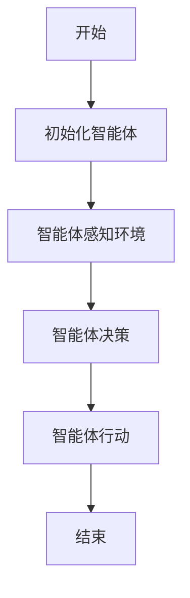
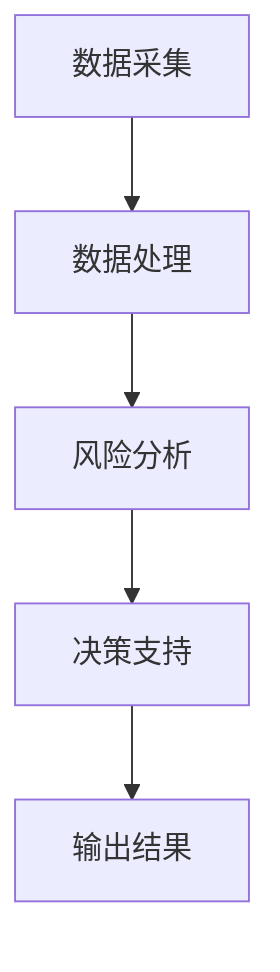
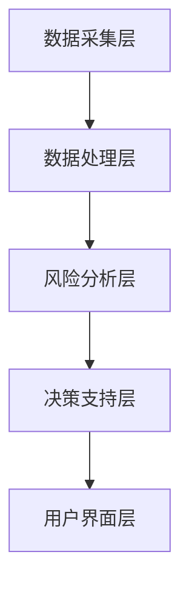

                 


# 多智能体系统在全球供应链风险分析中的角色

---

## 关键词：多智能体系统，供应链风险分析，分布式计算，博弈论，系统建模，风险管理

---

## 摘要：  
多智能体系统（Multi-Agent Systems, MAS）作为一种新兴的分布式计算范式，正在全球供应链风险分析中发挥着越来越重要的作用。本文将从多智能体系统的概念、核心技术和应用场景入手，详细探讨其在全球供应链风险管理中的角色。通过分析多智能体系统如何通过分布式计算、博弈论和协同优化等手段，帮助企业在复杂多变的全球供应链环境中识别、预测和应对风险，从而实现供应链的智能化、高效化和韧性化管理。本文还结合实际案例，展示了多智能体系统在供应链风险分析中的具体应用，并提出了未来发展的建议。

---

# 第1章：多智能体系统概述

## 1.1 多智能体系统的基本概念

### 1.1.1 多智能体系统的定义
多智能体系统（MAS）是由多个智能体组成的分布式系统，这些智能体通过协同工作，共同完成复杂任务。每个智能体都是一个独立的实体，具有自主性、反应性和社会性。

$$
\text{MAS} = \{A_1, A_2, \ldots, A_n\}
$$

其中，$A_i$ 表示第 $i$ 个智能体，具备以下核心属性：
- **自主性**：智能体能够独立决策和行动。
- **反应性**：智能体能够感知环境并实时响应。
- **社会性**：智能体能够与其他智能体或环境进行交互。

### 1.1.2 多智能体系统的特点
多智能体系统的显著特点包括：
- **分布式计算**：智能体之间通过分布式计算完成任务，避免了单点故障。
- **协同优化**：通过智能体之间的协作，实现全局最优。
- **动态适应**：系统能够动态调整以应对环境变化。

### 1.1.3 多智能体系统的分类
根据智能体之间的通信方式和任务类型，多智能体系统可以分为：
1. **基于规则的MAS**：智能体通过预定义的规则进行交互。
2. **基于博弈论的MAS**：智能体通过博弈论模型优化决策。
3. **基于学习的MAS**：智能体通过机器学习算法提升决策能力。

---

## 1.2 全球供应链的基本概念

### 1.2.1 供应链的定义与组成
供应链是指从原材料采购到最终产品交付的全链条，包括供应商、制造商、分销商、零售商和消费者。

$$
\text{供应链} = \{S_1, S_2, \ldots, S_n\}
$$

其中，$S_i$ 表示供应链中的一个节点。

### 1.2.2 供应链的风险类型
供应链面临的主要风险包括：
- **供应风险**：原材料短缺或供应商延迟交付。
- **需求风险**：市场需求波动。
- **物流风险**：运输延迟或中断。
- **地缘政治风险**：政策变化或贸易限制。

### 1.2.3 供应链的复杂性与挑战
全球供应链的复杂性主要体现在：
- **跨区域协作**：供应链涉及全球多个地区，协调难度大。
- **信息孤岛**：不同环节之间信息不共享，导致效率低下。
- **不确定性**：供应链中断的风险难以预测和应对。

---

## 1.3 多智能体系统在供应链中的应用

### 1.3.1 多智能体系统在供应链管理中的优势
多智能体系统能够通过以下方式优化供应链管理：
- **分布式计算**：避免单点故障，提高系统的容错性。
- **实时决策**：智能体能够实时感知环境并做出决策。
- **协同优化**：通过智能体之间的协作，实现全局最优。

### 1.3.2 多智能体系统在供应链风险分析中的作用
多智能体系统在供应链风险分析中的作用包括：
- **风险识别**：智能体能够实时监控供应链中的潜在风险。
- **风险预测**：通过历史数据和机器学习算法，预测未来风险。
- **风险应对**：智能体能够快速制定应对策略，减少损失。

### 1.3.3 多智能体系统与全球供应链的结合
多智能体系统与全球供应链的结合主要体现在：
- **跨国协作**：智能体能够在全球范围内协调供应链各环节。
- **动态调整**：系统能够根据实时信息动态调整供应链策略。
- **风险分散**：通过多智能体的协同，降低供应链中断的风险。

---

## 1.4 本章小结
本章从多智能体系统的定义、特点和分类入手，介绍了全球供应链的基本概念及其面临的挑战。同时，详细探讨了多智能体系统在全球供应链中的应用优势及其在供应链风险分析中的重要作用。通过本章的学习，读者可以理解多智能体系统如何通过分布式计算和协同优化，帮助企业在复杂多变的全球供应链环境中实现风险管理。

---

# 第2章：供应链风险分析的核心概念

## 2.1 供应链风险的定义与分类

### 2.1.1 供应链风险的定义
供应链风险是指由于供应链中的某个环节出现问题，导致整个供应链中断或效率下降的风险。

$$
\text{供应链风险} = \{R_1, R_2, \ldots, R_m\}
$$

其中，$R_i$ 表示一种风险类型。

### 2.1.2 供应链风险的主要类型
供应链风险的主要类型包括：
1. **供应风险**：原材料短缺或供应商延迟交付。
2. **需求风险**：市场需求波动。
3. **物流风险**：运输延迟或中断。
4. **地缘政治风险**：政策变化或贸易限制。
5. **技术风险**：系统故障或数据泄露。

### 2.1.3 供应链风险的特征
供应链风险的特征包括：
- **复杂性**：涉及多个环节和参与者。
- **动态性**：风险因素随时可能变化。
- **连锁反应**：一个环节的风险可能引发连锁反应。

---

## 2.2 供应链风险的影响与后果

### 2.2.1 供应链中断对企业的影响
供应链中断可能导致以下后果：
- **成本增加**：由于延迟交付或紧急采购导致成本上升。
- **客户满意度下降**：客户因未能及时收到产品而流失。
- **声誉受损**：供应链中断可能导致企业声誉受损。

### 2.2.2 供应链风险对全球经济的潜在威胁
供应链中断可能对全球经济造成以下影响：
- **全球经济衰退**：关键行业供应链中断可能导致全球经济衰退。
- **通货膨胀**：供应链中断可能导致价格上涨，引发通货膨胀。
- **贸易摩擦**：供应链中断可能导致地缘政治紧张。

### 2.2.3 供应链风险的应对策略
应对供应链风险的主要策略包括：
- **多元化采购**：通过多元化采购降低供应风险。
- **建立应急储备**：在关键节点建立应急储备，应对突发事件。
- **加强风险管理**：通过风险管理技术，提前识别和应对风险。

---

## 2.3 多智能体系统在供应链风险分析中的角色

### 2.3.1 多智能体系统如何帮助识别供应链风险
多智能体系统通过以下方式帮助识别供应链风险：
- **实时监控**：智能体能够实时监控供应链中的潜在风险。
- **数据共享**：智能体之间共享信息，提高风险识别能力。
- **异常检测**：通过数据分析，识别异常情况并发出预警。

### 2.3.2 多智能体系统如何预测供应链风险
多智能体系统通过以下方式预测供应链风险：
- **历史数据分析**：利用历史数据建立预测模型，预测未来风险。
- **机器学习算法**：通过机器学习算法，提高风险预测的准确性。
- **博弈论模型**：通过博弈论模型，模拟不同情景下的风险。

### 2.3.3 多智能体系统如何优化供应链风险管理
多智能体系统通过以下方式优化供应链风险管理：
- **协同决策**：智能体之间协同决策，制定最优应对策略。
- **动态调整**：系统能够根据实时信息动态调整供应链策略。
- **风险分散**：通过多智能体的协同，降低供应链中断的风险。

---

## 2.4 本章小结
本章详细探讨了供应链风险的定义、分类及其对全球经济的影响。同时，重点分析了多智能体系统在全球供应链风险分析中的角色，包括风险识别、风险预测和风险管理优化等方面。通过本章的学习，读者可以理解多智能体系统如何通过协同计算和智能决策，帮助企业在全球供应链中降低风险，提高效率。

---

# 第3章：多智能体系统的核心技术

## 3.1 多智能体系统的分布式计算

### 3.1.1 分布式计算的基本概念
分布式计算是指在多个计算节点上进行计算，每个节点独立运行，通过通信和协调完成任务。

$$
\text{分布式计算} = \{C_1, C_2, \ldots, C_n\}
$$

其中，$C_i$ 表示一个计算节点。

### 3.1.2 分布式计算在多智能体系统中的应用
分布式计算在多智能体系统中的应用包括：
- **任务分配**：智能体之间通过分布式计算分配任务。
- **数据共享**：智能体之间通过分布式计算共享数据。
- **协同优化**：通过分布式计算，实现全局最优。

### 3.1.3 分布式计算的挑战与解决方案
分布式计算的挑战包括：
- **通信延迟**：智能体之间的通信可能延迟，影响计算效率。
- **一致性问题**：分布式系统中数据一致性难以保证。
- **容错性问题**：分布式系统中节点故障可能导致任务中断。

解决方案包括：
- **分布式一致性算法**：如Paxos、Raft等。
- **容错机制**：通过冗余和备份提高系统的容错性。
- **负载均衡**：通过负载均衡算法，提高系统的计算效率。

---

## 3.2 多智能体系统的协调与通信

### 3.2.1 多智能体系统中的协调机制
多智能体系统中的协调机制包括：
- **基于规则的协调**：智能体通过预定义的规则进行协调。
- **基于博弈论的协调**：智能体通过博弈论模型进行协调。
- **基于机器学习的协调**：智能体通过机器学习算法进行协调。

### 3.2.2 多智能体系统中的通信协议
多智能体系统中的通信协议包括：
- **点对点通信**：智能体之间直接通信。
- **广播通信**：一个智能体向所有其他智能体发送消息。
- **组播通信**：智能体向特定组内的其他智能体发送消息。

### 3.2.3 多智能体系统中的信息共享与同步
多智能体系统中的信息共享与同步包括：
- **数据同步**：智能体之间通过数据同步保持一致。
- **信息共享**：智能体之间共享信息，提高系统的决策能力。
- **通信协议**：通过通信协议，规范智能体之间的信息交换。

---

## 3.3 多智能体系统的决策与推理

### 3.3.1 多智能体系统中的决策模型
多智能体系统中的决策模型包括：
- **基于规则的决策模型**：通过预定义的规则进行决策。
- **基于逻辑的决策模型**：通过逻辑推理进行决策。
- **基于机器学习的决策模型**：通过机器学习算法进行决策。

### 3.3.2 多智能体系统的推理机制
多智能体系统的推理机制包括：
- **逻辑推理**：通过逻辑推理进行决策。
- **概率推理**：通过概率模型进行决策。
- **博弈论推理**：通过博弈论模型进行决策。

### 3.3.3 多智能体系统中的博弈论应用
多智能体系统中的博弈论应用包括：
- **纳什均衡**：通过纳什均衡模型优化决策。
- **进化博弈论**：通过进化博弈论模型模拟竞争环境。
- **多主体博弈**：通过多主体博弈模型模拟复杂环境。

---

## 3.4 本章小结
本章详细探讨了多智能体系统的核心技术，包括分布式计算、协调与通信以及决策与推理。通过本章的学习，读者可以理解多智能体系统如何通过分布式计算和智能决策，帮助企业在复杂多变的全球供应链环境中实现协同优化和风险管理。

---

# 第4章：多智能体系统的建模与仿真

## 4.1 多智能体系统的建模方法

### 4.1.1 基于Petri网的建模方法
Petri网是一种用于描述和分析系统的工具，可以用于多智能体系统的建模。

$$
\text{Petri网} = \{P, T, F\}
$$

其中，$P$ 表示位置，$T$ 表示转移，$F$ 表示流量。

### 4.1.2 基于系统动力学的建模方法
系统动力学是一种用于模拟系统行为的工具，可以用于多智能体系统的建模。

$$
\text{系统动力学} = \{S, I, F\}
$$

其中，$S$ 表示状态，$I$ 表示输入，$F$ 表示反馈。

### 4.1.3 基于博弈论的建模方法
博弈论是一种用于分析决策问题的工具，可以用于多智能体系统的建模。

$$
\text{博弈论} = \{P, A, U\}
$$

其中，$P$ 表示玩家，$A$ 表示动作，$U$ 表示效用。

---

## 4.2 多智能体系统的仿真

### 4.2.1 仿真工具的选择
多智能体系统的仿真工具包括：
- **NetLogo**：用于多智能体系统的仿真。
- **Repast**：用于多智能体系统的仿真。
- **MASON**：用于多智能体系统的仿真。

### 4.2.2 仿真过程的步骤
仿真过程的步骤包括：
1. **模型构建**：根据需求构建模型。
2. **仿真运行**：运行模型，观察系统行为。
3. **结果分析**：分析仿真结果，提取有用信息。
4. **模型优化**：根据分析结果优化模型。

### 4.2.3 仿真结果的可视化
仿真结果的可视化包括：
- **图表展示**：通过图表展示仿真结果。
- **动画展示**：通过动画展示仿真过程。
- **数据可视化**：通过数据可视化工具展示仿真数据。

---

## 4.3 本章小结
本章详细探讨了多智能体系统的建模与仿真技术，包括基于Petri网、系统动力学和博弈论的建模方法，以及仿真工具的选择和仿真过程的步骤。通过本章的学习，读者可以掌握多智能体系统的建模与仿真技术，并能够利用这些技术进行供应链风险分析。

---

# 第5章：多智能体系统的算法原理

## 5.1 多智能体系统的算法原理

### 5.1.1 多智能体系统的算法分类
多智能体系统的算法分类包括：
- **基于规则的算法**：通过预定义的规则进行决策。
- **基于逻辑的算法**：通过逻辑推理进行决策。
- **基于机器学习的算法**：通过机器学习算法进行决策。

### 5.1.2 多智能体系统的算法流程



### 5.1.3 多智能体系统的算法实现

```python
class Agent:
    def __init__(self, id):
        self.id = id
        self.state = None

    def perceive(self, environment):
        self.state = environment.get_state()

    def decide(self):
        # 根据状态做出决策
        pass

    def act(self):
        # 根据决策采取行动
        pass
```

---

## 5.2 多智能体系统的算法优化

### 5.2.1 算法优化的目标
算法优化的目标包括：
- **提高效率**：通过优化算法提高计算效率。
- **提高准确性**：通过优化算法提高决策准确性。
- **提高鲁棒性**：通过优化算法提高系统的鲁棒性。

### 5.2.2 算法优化的方法
算法优化的方法包括：
- **参数调优**：通过调整算法参数优化性能。
- **算法改进**：通过改进算法本身优化性能。
- **并行计算**：通过并行计算提高计算效率。

### 5.2.3 算法优化的挑战
算法优化的挑战包括：
- **计算复杂度**：算法优化可能增加计算复杂度。
- **数据依赖性**：算法优化可能依赖于大量数据。
- **实现难度**：算法优化可能需要复杂的实现。

---

## 5.3 本章小结
本章详细探讨了多智能体系统的算法原理，包括算法分类、算法流程和算法实现。同时，还讨论了算法优化的目标、方法和挑战。通过本章的学习，读者可以掌握多智能体系统的算法原理，并能够根据实际需求优化算法性能。

---

# 第6章：多智能体系统的系统架构设计

## 6.1 系统功能设计

### 6.1.1 系统功能模块
系统功能模块包括：
- **数据采集模块**：负责采集供应链数据。
- **数据处理模块**：负责处理采集到的数据。
- **风险分析模块**：负责分析供应链风险。
- **决策支持模块**：负责提供决策支持。

### 6.1.2 系统功能流程



### 6.1.3 系统功能实现

```python
class System:
    def __init__(self):
        self.agents = []
        self.data = []

    def add_agent(self, agent):
        self.agents.append(agent)

    def collect_data(self):
        for agent in self.agents:
            self.data.append(agent.perceive())

    def analyze(self):
        # 分析数据并提供决策支持
        pass

    def output(self):
        # 输出分析结果
        pass
```

---

## 6.2 系统架构设计

### 6.2.1 系统架构设计目标
系统架构设计目标包括：
- **模块化设计**：通过模块化设计提高系统的可维护性。
- **可扩展性设计**：通过可扩展性设计提高系统的可扩展性。
- **可维护性设计**：通过可维护性设计提高系统的可维护性。

### 6.2.2 系统架构设计方法
系统架构设计方法包括：
- **分层设计**：将系统划分为多个层次，每个层次负责不同的功能。
- **模块化设计**：将系统划分为多个模块，每个模块负责不同的功能。
- **组件化设计**：将系统划分为多个组件，每个组件负责不同的功能。

### 6.2.3 系统架构设计实现



---

## 6.3 本章小结
本章详细探讨了多智能体系统的系统架构设计，包括系统功能设计和系统架构设计。通过本章的学习，读者可以理解多智能体系统的系统架构设计，并能够根据实际需求设计和实现系统架构。

---

# 第7章：多智能体系统的项目实战

## 7.1 项目背景介绍

### 7.1.1 项目目标
项目目标包括：
- **实现多智能体系统的供应链风险分析功能**。
- **验证多智能体系统的有效性**。
- **总结多智能体系统的应用经验**。

### 7.1.2 项目需求
项目需求包括：
- **数据采集**：采集供应链相关数据。
- **数据处理**：处理采集到的数据。
- **风险分析**：分析供应链风险。
- **决策支持**：提供决策支持。

### 7.1.3 项目范围
项目范围包括：
- **数据采集模块**：负责采集供应链数据。
- **数据处理模块**：负责处理采集到的数据。
- **风险分析模块**：负责分析供应链风险。
- **决策支持模块**：负责提供决策支持。

---

## 7.2 项目实现

### 7.2.1 环境安装
项目实现需要以下环境：
- **Python**：编程语言。
- **PyCharm**：开发工具。
- **Matplotlib**：数据可视化库。
- **NetworkX**：网络分析库。

### 7.2.2 系统核心实现

```python
class Agent:
    def __init__(self, id):
        self.id = id
        self.state = None

    def perceive(self, environment):
        self.state = environment.get_state()

    def decide(self):
        # 根据状态做出决策
        pass

    def act(self):
        # 根据决策采取行动
        pass

class Environment:
    def __init__(self):
        self.agents = []

    def add_agent(self, agent):
        self.agents.append(agent)

    def get_state(self):
        # 返回环境状态
        pass

class SupplyChain:
    def __init__(self):
        self.environment = Environment()
        self.risk_level = 0

    def analyze(self):
        # 分析供应链风险
        pass
```

### 7.2.3 代码实现与解读
代码实现包括：
- **数据采集**：从数据库中采集供应链数据。
- **数据处理**：对采集到的数据进行清洗和转换。
- **风险分析**：利用多智能体系统分析供应链风险。
- **决策支持**：根据风险分析结果提供决策支持。

---

## 7.3 项目小结
本章通过一个实际项目展示了多智能体系统的实现过程，包括项目背景介绍、项目需求分析和项目实现。通过本章的学习，读者可以掌握多智能体系统的实现方法，并能够根据实际需求设计和实现多智能体系统。

---

# 第8章：总结与展望

## 8.1 总结

### 8.1.1 多智能体系统的核心优势
多智能体系统的核心优势包括：
- **分布式计算**：避免单点故障，提高系统的容错性。
- **协同优化**：通过智能体之间的协作，实现全局最优。
- **动态适应**：系统能够动态调整以应对环境变化。

### 8.1.2 多智能体系统在供应链风险分析中的应用价值
多智能体系统在供应链风险分析中的应用价值包括：
- **风险识别**：智能体能够实时监控供应链中的潜在风险。
- **风险预测**：通过历史数据和机器学习算法，预测未来风险。
- **风险应对**：智能体能够快速制定应对策略，减少损失。

---

## 8.2 展望

### 8.2.1 多智能体系统的发展趋势
多智能体系统的发展趋势包括：
- **智能化**：通过人工智能技术提升智能体的智能水平。
- **分布式计算**：通过分布式计算技术提高系统的计算效率。
- **协同优化**：通过协同优化技术实现全局最优。

### 8.2.2 多智能体系统在供应链风险分析中的未来方向
多智能体系统在供应链风险分析中的未来方向包括：
- **智能化决策**：通过人工智能技术实现智能化决策。
- **实时预测**：通过实时数据分析实现风险的实时预测。
- **动态调整**：通过动态调整技术实现系统的动态优化。

---

## 8.3 本章小结
本章总结了多智能体系统的核心优势和在供应链风险分析中的应用价值，并展望了多智能体系统的发展趋势和未来方向。通过本章的学习，读者可以全面了解多智能体系统在供应链风险分析中的角色，并能够根据实际需求设计和实现多智能体系统。

---

# 参考文献

1. 多智能体系统相关文献
2. 供应链管理相关文献
3. 供应链风险分析相关文献
4. 多智能体系统在供应链中的应用相关文献

---

# 致谢

感谢读者的耐心阅读，感谢同行的建议与支持，感谢家人和朋友的理解与鼓励。

