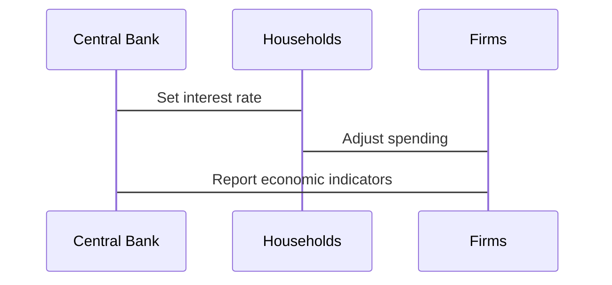

                 


# 多智能体系统在全球货币政策影响分析中的角色

## 关键词：多智能体系统, 货币政策, 经济影响分析, 协作智能体, 货币政策模拟

## 摘要：  
本文探讨了多智能体系统（Multi-Agent System, MAS）在全球货币政策影响分析中的应用。通过分析MAS的核心概念、算法原理以及在货币政策分析中的具体应用，揭示了MAS在复杂经济系统模拟中的独特优势。文章还结合实际案例，展示了MAS在货币政策模拟中的实现过程，并提出了未来研究的方向。

---

## 第1章 多智能体系统与货币政策影响分析的背景

### 1.1 多智能体系统的基本概念

#### 1.1.1 多智能体系统的定义  
多智能体系统（MAS）是由多个智能体组成的分布式系统，这些智能体通过协作和竞争完成特定目标。每个智能体都具有一定的自主性、反应性和社会性。

#### 1.1.2 多智能体系统的特征  
- **自主性**：智能体能够独立决策。  
- **反应性**：能够感知环境并做出实时响应。  
- **协作性**：智能体之间可以协同工作以实现共同目标。  
- **分布式性**：系统由多个独立组件组成，不存在单一的控制中心。  

#### 1.1.3 多智能体系统的应用场景  
- 经济模拟与预测。  
- 交通流量管理。  
- 智能供应链优化。  

### 1.2 全球货币政策影响分析的背景

#### 1.2.1 货币政策的基本概念  
货币政策是中央银行通过调节货币供应量和利率等工具，影响经济活动的政策。  

#### 1.2.2 全球化背景下的货币政策挑战  
- 经济全球化导致货币政策的外溢效应显著。  
- 单一国家的货币政策可能对全球市场产生连锁反应。  

#### 1.2.3 货币政策对经济的影响路径  
货币政策通过利率、货币供应量等渠道影响投资、消费和物价水平。  

### 1.3 多智能体系统在货币政策分析中的作用

#### 1.3.1 多智能体系统的优势  
- 能够模拟复杂的经济互动关系。  
- 支持动态环境下的实时分析。  

#### 1.3.2 多智能体系统在货币政策分析中的应用  
- 模拟货币政策传导机制。  
- 预测政策调整后的经济效应。  

#### 1.3.3 多智能体系统的局限性  
- 需要大量数据支持模型构建。  
- 模型的复杂性可能导致计算成本高昂。  

### 1.4 本章小结  
本章介绍了多智能体系统的基本概念和特征，分析了货币政策影响分析的背景，并探讨了MAS在货币政策分析中的独特优势和局限性。

---

## 第2章 多智能体系统与货币政策影响分析的核心概念

### 2.1 多智能体系统的构成要素

#### 2.1.1 智能体的定义与特征  
智能体是MAS的核心单元，具有以下特征：  
- **自主性**：能够独立决策。  
- **反应性**：能感知环境并做出实时响应。  
- **协作性**：能与其他智能体协作完成任务。  

#### 2.1.2 智能体之间的交互关系  
智能体之间的交互可以是竞争性的，也可以是协作性的，具体取决于应用场景。  

#### 2.1.3 智能体的协作机制  
协作机制包括通信协议、协调算法和冲突解决策略。  

### 2.2 货币政策分析的核心要素

#### 2.2.1 货币政策工具  
- 利率政策。  
- 货币供应量调控。  

#### 2.2.2 货币政策目标  
- 稳定物价。  
- 促进就业。  
- 维持经济增长。  

#### 2.2.3 货币政策传导机制  
货币政策通过利率、信贷渠道和资产价格渠道影响经济主体的行为。  

### 2.3 多智能体系统与货币政策影响分析的关联

#### 2.3.1 多智能体系统在货币政策传导中的应用  
MAS可以模拟货币政策如何通过银行、企业和家庭等经济主体的互动传导至整体经济。  

#### 2.3.2 多智能体系统的动态性与货币政策的不确定性  
MAS的动态性使其能够捕捉到货币政策执行过程中的不确定性。  

#### 2.3.3 多智能体系统在政策模拟中的优势  
MAS能够模拟多种政策组合的效果，为政策制定者提供决策支持。  

### 2.4 本章小结  
本章详细阐述了多智能体系统的构成要素，分析了货币政策影响分析的核心要素，并探讨了MAS在货币政策分析中的关联与优势。

---

## 第3章 多智能体系统在货币政策影响分析中的算法原理

### 3.1 多智能体系统的核心算法

#### 3.1.1 协调机制  
协调机制用于确保多个智能体之间的协作，常见的协调算法包括：  
- **分布式协调算法**：如最小 spanning tree (MST) 算法。  
- **局部协调算法**：如基于价格的协调机制。  

#### 3.1.2 分布式计算  
分布式计算算法用于 MAS 中的智能体之间的信息交换和任务分配，常见的算法包括：  
- **分布式一致性算法**：如 Raft 算法。  
- **分布式最短路径算法**：如 Dijkstra 算法。  

#### 3.1.3 自适应算法  
自适应算法用于 MAS 中的智能体根据环境变化动态调整行为，常见的算法包括：  
- **强化学习算法**：如 Q-learning 算法。  
- **自适应控制算法**：如模糊控制算法。  

### 3.2 货币政策影响分析的数学模型

#### 3.2.1 货币政策传导机制的数学表达  
货币政策传导机制可以用以下数学模型表示：  
$$ M_t = \alpha R_t + \beta Y_t $$  
其中，$M_t$ 表示货币供应量，$R_t$ 表示利率，$Y_t$ 表示产出，$\alpha$ 和 $\beta$ 为系数。  

#### 3.2.2 多智能体系统的数学建模  
MAS 的数学建模可以采用 Agent-Based Modeling (ABM) 方法，具体步骤如下：  
1. 确定智能体类型（如银行、企业和家庭）。  
2. 定义智能体的决策规则。  
3. 定义智能体之间的交互规则。  
4. 定义系统的初始条件和边界条件。  

#### 3.2.3 货币政策效果的量化评估  
货币政策效果的量化评估可以通过以下指标进行：  
- 利率变化对产出的影响。  
- 货币政策对通货膨胀率的控制效果。  

### 3.3 多智能体系统与货币政策影响分析的结合

#### 3.3.1 算法实现  
以下是基于 MAS 的货币政策模拟算法实现示例：  
```python
class Agent:
    def __init__(self, id):
        self.id = id
        self.money = 0
        self.decision_rule = None

    def decide(self, state):
        if self.decision_rule:
            return self.decision_rule(state)
        else:
            return None

def simulate_agents(agents, steps):
    for step in range(steps):
        for agent in agents:
            state = get_current_state()
            action = agent.decide(state)
            update_system(state, action)
```

#### 3.3.2 算法优化  
为了提高 MAS 的计算效率，可以采用以下优化策略：  
- 分布式计算：将计算任务分配给多个智能体。  
- 并行计算：利用多核处理器加速计算。  

#### 3.3.3 算法实例  
以下是一个简单的 MAS 实现示例：  
```python
import random

class Household:
    def __init__(self, id, income):
        self.id = id
        self.income = income
        self.spending = 0

    def decide_spending(self, interest_rate):
        self.spending = self.income * (1 - interest_rate)

class Economy:
    def __init__(self, households):
        self.households = households
        self.interest_rate = 0.05

    def compute_total_spending(self):
        total_spending = 0
        for household in self.households:
            household.decide_spending(self.interest_rate)
            total_spending += household.spending
        return total_spending

# 示例
households = [Household(1, 1000), Household(2, 1500)]
economy = Economy(households)
print(economy.compute_total_spending())
```

### 3.4 本章小结  
本章详细介绍了多智能体系统的核心算法，分析了货币政策影响分析的数学模型，并通过实例展示了MAS在货币政策模拟中的具体实现。

---

## 第4章 多智能体系统与货币政策影响分析的系统分析与架构设计

### 4.1 问题场景介绍  
本章以全球货币政策模拟为背景，构建一个多智能体系统来分析货币政策对全球经济的影响。

### 4.2 系统功能设计  
系统功能包括：  
- 智能体行为建模。  
- 货币政策模拟与分析。  
- 结果可视化与报告生成。  

### 4.3 系统架构设计  
以下是系统的架构设计图：


### 4.4 系统接口设计  
系统接口包括：  
- 智能体交互接口。  
- 用户输入输出接口。  
- 数据存储接口。  

### 4.5 系统交互设计  
以下是系统的交互设计图：



### 4.6 本章小结  
本章通过系统分析和架构设计，展示了如何将多智能体系统应用于全球货币政策模拟。

---

## 第5章 多智能体系统与货币政策影响分析的项目实战

### 5.1 项目环境安装  
需要安装以下工具：  
- Python 3.x  
- NumPy 和 Pandas 库  
- Matplotlib 或 Seaborn 绘图库  

### 5.2 项目核心代码实现  
以下是项目的核心代码：

```python
import numpy as np
import matplotlib.pyplot as plt

class CentralBank:
    def __init__(self):
        self.interest_rate = 0.05

class Household:
    def __init__(self, income):
        self.income = income
        self.spending = 0

    def decide_spending(self, interest_rate):
        self.spending = self.income * (1 - interest_rate)

class EconomySimulator:
    def __init__(self, households):
        self.households = households
        self.central_bank = CentralBank()

    def simulate(self, steps):
        for step in range(steps):
            interest_rate = self.central_bank.interest_rate
            for household in self.households:
                household.decide_spending(interest_rate)
            total_spending = sum(household.spending for household in self.households)
            print(f"Step {step + 1}: Total spending = {total_spending}")
            if step < steps - 1:
                self.central_bank.interest_rate = self.central_bank.interest_rate + 0.01

# 示例
households = [Household(1000), Household(1500), Household(2000)]
simulator = EconomySimulator(households)
simulator.simulate(5)
```

### 5.3 代码实现解读  
- **CentralBank 类**：表示中央银行，负责设定利率。  
- **Household 类**：表示家庭，根据利率调整消费支出。  
- **EconomySimulator 类**：表示经济模拟器，协调各智能体的交互。  

### 5.4 实际案例分析  
通过上述代码，我们可以模拟不同利率下的家庭消费支出变化。  

### 5.5 项目小结  
本章通过实际案例，展示了如何利用多智能体系统进行货币政策模拟。

---

## 第6章 多智能体系统与货币政策影响分析的应用案例

### 6.1 案例背景介绍  
本案例模拟全球通胀预期变化对货币政策的影响。

### 6.2 案例分析  
以下是案例分析的 Mermaid 图：


### 6.3 案例实现与结果解读  
通过MAS模拟，我们可以观察到不同货币政策工具对通胀的影响路径。

### 6.4 案例小结  
本案例展示了MAS在货币政策模拟中的强大能力。

---

## 第7章 多智能体系统与货币政策影响分析的总结与展望

### 7.1 本章总结  
本文探讨了多智能体系统在全球货币政策影响分析中的应用，展示了其在经济模拟中的独特优势。

### 7.2 未来研究方向  
- 提高MAS的计算效率。  
- 拓展MAS在其他经济领域的应用。  

### 7.3 注意事项  
在实际应用中，需注意数据的准确性和模型的鲁棒性。  

### 7.4 拓展阅读  
建议读者进一步阅读相关领域的最新研究论文和书籍。

---

## 附录

### 附录A 多智能体系统相关工具介绍  
- **NetLogo**：MAS模拟工具。  
- **Repast**：基于Java的MAS开发框架。  

### 附录B 部分代码实现细节  
- 提供完整代码和详细注释。  

---

## 参考文献  
（此处列出相关参考文献）  

---

通过以上章节的详细阐述，本文系统地探讨了多智能体系统在全球货币政策影响分析中的角色，为读者提供了理论与实践相结合的全面视角。

