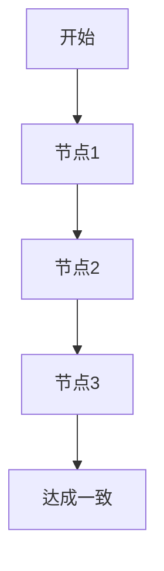
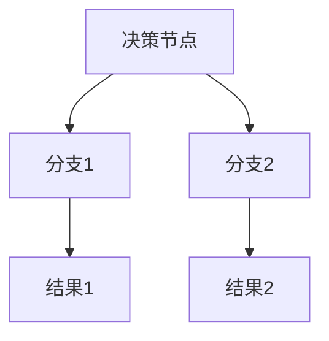
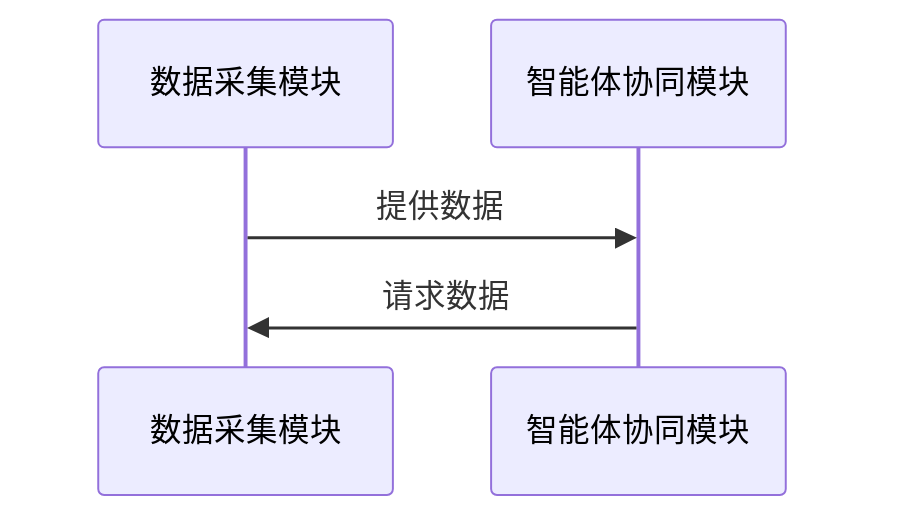
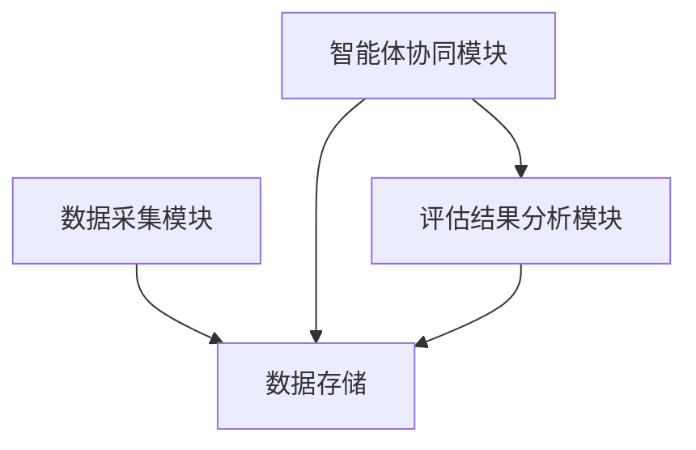
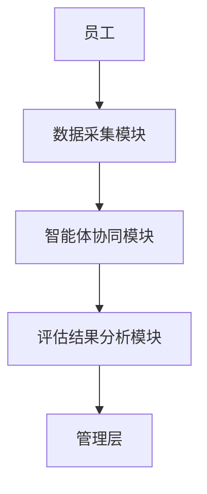

                 


# 多智能体系统在公司人力资本评估中的应用

> 关键词：多智能体系统，人力资本评估，分布式计算，博弈论，系统架构，算法原理

> 摘要：本文探讨了多智能体系统在公司人力资本评估中的应用，分析了多智能体系统的核心概念、算法原理、系统架构，并通过项目实战展示了其在人力资本评估中的具体应用。文章从背景介绍到系统设计，再到项目实施，层层递进，为读者提供了全面的视角。

---

# 第1章 多智能体系统的背景与概念

## 1.1 多智能体系统的定义与特点

### 1.1.1 多智能体系统的定义
多智能体系统（Multi-Agent System, MAS）是由多个智能体（Agent）组成的分布式计算系统，每个智能体能够自主决策、协调合作并适应环境变化。

### 1.1.2 多智能体系统的分类
- 分散式多智能体系统
- 集中式多智能体系统
- 混合式多智能体系统

### 1.1.3 多智能体系统的核心特征
- 分布式性：智能体分布在不同的节点，独立决策。
- 协作性：智能体之间通过通信和协调完成共同目标。
- 反应性：能够感知环境并实时调整行为。

## 1.2 多智能体系统的发展历程

### 1.2.1 多智能体系统的起源
20世纪60年代，分布式人工智能的概念出现，为多智能体系统奠定了基础。

### 1.2.2 多智能体系统的发展阶段
- 单智能体阶段
- 分布式计算阶段
- 协作智能阶段

### 1.2.3 多智能体系统的现状与趋势
随着AI技术的发展，多智能体系统在多个领域得到广泛应用，如自动驾驶、智能城市等。

## 1.3 多智能体系统的应用领域

### 1.3.1 多智能体系统在企业中的应用
- 资源分配
- 任务调度
- 协作决策

### 1.3.2 多智能体系统在人力资源管理中的潜力
- 员工绩效评估
- 能力匹配
- 跨部门协作优化

---

# 第2章 人力资本评估的核心概念

## 2.1 人力资本的定义与内涵

### 2.1.1 人力资本的基本概念
人力资本是指员工的知识、技能和经验的总和，是企业核心竞争力的重要组成部分。

### 2.1.2 人力资本的核心要素
- 员工技能
- 工作绩效
- 发展潜力

### 2.1.3 人力资本的评估指标
- KPI指标
- 技能评估
- 员工满意度

## 2.2 多智能体系统在人力资本评估中的应用背景

### 2.2.1 传统人力资本评估的局限性
- 数据分散，难以整合
- 评估标准不统一
- 缺乏动态反馈机制

### 2.2.2 多智能体系统的优势
- 分布式数据处理能力
- 高效的协作与协调
- 实时反馈与调整

### 2.2.3 多智能体系统与人力资本评估的结合
- 分散式数据采集
- 智能协同评估
- 实时反馈优化

---

# 第3章 多智能体系统的核心算法原理

## 3.1 分布式计算与协调算法

### 3.1.1 分布式计算的基本原理
通过分布式节点完成计算任务，避免单点故障。

### 3.1.2 多智能体系统的协调机制
- 一致性算法：如Raft、Paxos
- 任务分配算法：如负载均衡

### 3.1.3 典型算法介绍（如一致性算法）


### 3.1.4 分布式计算的数学模型
$$ \text{负载均衡} = \frac{\text{任务总数}}{\text{节点数}} $$

## 3.2 博弈论与决策模型

### 3.2.1 博弈论的基本概念
- 竞争与合作的模型
- Nash均衡

### 3.2.2 多智能体系统中的博弈模型
- 协作博弈
- 非协作博弈

### 3.2.3 决策树与效用函数的应用


### 3.2.4 博弈论的数学公式
$$ \text{效用函数} = u(a, b) = a \times b $$

## 3.3 融合算法的实现

### 3.3.1 算法融合的必要性
- 提高系统效率
- 增强决策能力

### 3.3.2 算法融合的实现步骤
1. 数据采集
2. 算法选择
3. 融合实现
4. 调优测试

### 3.3.3 典型融合算法案例分析
- 分布式一致性算法与博弈论结合
- 负载均衡与任务分配结合

---

# 第4章 多智能体系统在人力资本评估中的系统架构

## 4.1 系统功能模块设计

### 4.1.1 数据采集模块
- 数据来源：员工绩效、技能数据
- 数据类型：结构化数据和非结构化数据

### 4.1.2 智能体协同模块
- 协调机制：任务分配、协作决策
- 通信机制：消息传递、事件驱动

### 4.1.3 评估结果分析模块
- 数据分析：统计分析、预测分析
- 结果展示：可视化、报告生成

## 4.2 系统架构设计

### 4.2.1 分层架构设计
- 数据层：数据采集与存储
- 逻辑层：算法实现与业务逻辑
- 展示层：用户交互与结果展示

### 4.2.2 模块间交互

#### 数据采集模块与智能体协同模块的交互


### 4.2.3 系统架构图


## 4.3 系统接口设计

### 4.3.1 接口定义
- 数据接口：REST API
- 服务接口：WebSocket

### 4.3.2 接口实现
- 数据采集接口：`GET /data/{id}`
- 协同接口：`POST /协同/{action}`

## 4.4 系统交互

### 4.4.1 系统交互流程

#### 员工绩效评估流程


---

# 第5章 项目实战：多智能体系统在人力资本评估中的应用

## 5.1 项目背景

### 5.1.1 项目目标
- 实现员工绩效评估的智能化
- 提高评估的准确性和效率

### 5.1.2 项目需求
- 实时数据采集
- 智能协同评估
- 可视化报告

## 5.2 环境配置

### 5.2.1 开发环境
- 操作系统：Linux
- 开发工具：IntelliJ IDEA
- 依赖管理：Maven

### 5.2.2 运行环境
- 服务器：云服务器
- 数据库：MySQL
- 服务部署：Docker

## 5.3 核心代码实现

### 5.3.1 数据采集模块
```java
public class DataCollector {
    public void collectData(Employee employee) {
        // 数据采集逻辑
    }
}
```

### 5.3.2 智能体协同模块
```java
public class AgentCoordinator {
    public void coordinateAgents(List<Employee> employees) {
        // 协调逻辑
    }
}
```

### 5.3.3 评估结果分析模块
```java
public class AssessmentAnalyzer {
    public void analyzeResults(List<Assessment> assessments) {
        // 分析逻辑
    }
}
```

## 5.4 代码解读与分析

### 5.4.1 数据采集模块
- 采集员工的绩效数据
- 将数据存储到数据库中

### 5.4.2 智能体协同模块
- 调度智能体完成协同任务
- 实现任务分配和负载均衡

### 5.4.3 评估结果分析模块
- 分析评估结果
- 生成可视化报告

## 5.5 实际案例分析

### 5.5.1 案例背景
某公司希望通过多智能体系统优化员工绩效评估。

### 5.5.2 案例实施
1. 数据采集：收集员工的KPI数据
2. 协同评估：智能体协同完成评估
3. 结果分析：生成评估报告

### 5.5.3 案例结果
- 评估效率提升
- 结果更准确
- 员工满意度提高

---

# 第6章 总结与展望

## 6.1 总结

### 6.1.1 核心观点总结
- 多智能体系统在人力资本评估中具有巨大潜力
- 系统设计需要综合考虑分布式计算和协作机制

### 6.1.2 实践意义
- 提高评估效率
- 优化决策
- 增强企业竞争力

## 6.2 本章小结

## 6.3 注意事项

### 6.3.1 数据隐私保护
- 确保数据安全
- 遵守隐私保护法规

### 6.3.2 系统稳定性
- 高可用性设计
- 容错机制

## 6.4 拓展阅读

### 6.4.1 推荐书籍
- 《分布式系统：概念与设计》
- 《人工智能：一种现代的方法》

### 6.4.2 技术博客
- 多智能体系统研究博客
- 分布式计算技术博客

---

# 结论

多智能体系统在公司人力资本评估中的应用，不仅提高了评估的效率和准确性，还为企业的人力资源管理提供了新的思路。通过系统的分析和项目的实施，我们可以看到，多智能体系统在这一领域的应用前景广阔，值得进一步研究和推广。

