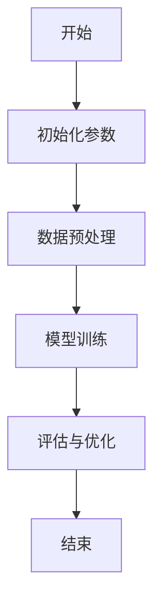
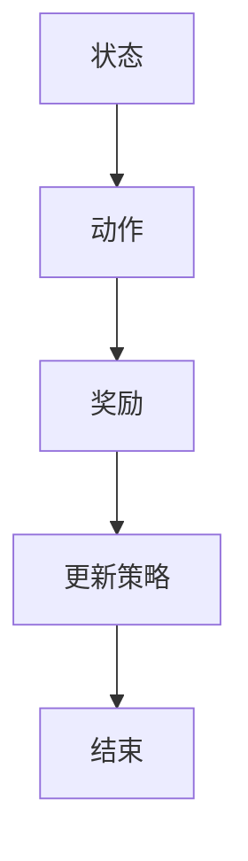
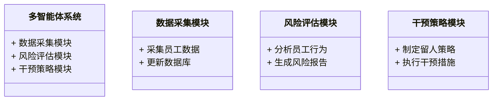

                 


# 多智能体系统在公司人才流失风险评估中的应用

> 关键词：多智能体系统, 人才流失, 风险评估, 算法原理, 系统架构, 项目实战

> 摘要：本文探讨了多智能体系统（MAS）在公司人才流失风险评估中的应用。通过分析MAS的核心概念、算法原理、系统架构，结合项目实战，展示了如何利用MAS提高人才流失风险评估的准确性和效率。文章详细介绍了MAS在人才流失预测中的协作学习和强化学习算法，并通过实际案例说明了系统的实现和应用效果。

---

## 第1章 多智能体系统概述

### 1.1 多智能体系统的定义与特点

多智能体系统（Multi-Agent System, MAS）是由多个智能体组成的分布式系统，每个智能体都能感知环境、自主决策并与其他智能体协作或竞争，以实现共同目标。MAS的特点包括：

- **分布性**：多个智能体独立运行，协同完成任务。
- **协作性**：智能体之间通过通信和协作提高整体效率。
- **反应性**：智能体能够实时感知环境变化并做出反应。
- **自主性**：每个智能体都有一定的自主决策能力。

与传统单智能体系统相比，MAS能够处理更复杂的任务，具有更强的适应性和灵活性。

---

### 1.2 人才流失风险评估的背景与挑战

人才流失是企业面临的重要问题，其影响包括：

- **经济成本**：招聘和培训新员工需要大量资源。
- **团队士气**：流失关键员工可能影响团队凝聚力。
- **业务连续性**：关键岗位的空缺可能导致业务中断。

传统的人才流失评估方法通常基于主观判断，存在以下问题：

- **数据驱动不足**：难以利用大数据进行精准预测。
- **实时性差**：无法及时捕捉员工动态。
- **缺乏反馈机制**：无法根据结果优化评估模型。

MAS的应用可以克服这些局限性，通过实时数据分析和智能决策提高评估的准确性和及时性。

---

### 1.3 多智能体系统在人才流失评估中的应用前景

MAS在人才流失评估中的潜在应用场景包括：

- **实时监控**：通过MAS实时分析员工行为数据，预测流失风险。
- **动态调整**：根据员工反馈和行为变化，动态优化评估模型。
- **个性化干预**：针对不同员工的特点，制定个性化的留人策略。

企业采用MAS的优势在于：

- **提高评估效率**：通过自动化数据处理和智能分析，节省时间和成本。
- **增强决策的科学性**：利用多智能体的协作和学习能力，提高预测的准确性。

尽管MAS的应用潜力巨大，但也面临一些挑战，例如数据隐私、模型复杂性等。需要通过技术创新和管理优化来解决这些问题。

---

## 第2章 多智能体系统的核心概念与联系

### 2.1 多智能体系统的组成与关系

MAS的组成包括：

- **智能体**：能够感知环境、自主决策的个体。
- **环境**：智能体所处的外部环境，包括数据源、员工行为等。
- **通信机制**：智能体之间交换信息的渠道。

通过ER实体关系图可以清晰展示MAS的组成关系：

```mermaid
er
actor: 多智能体系统
entity: 人才、风险因素、评估模型
```

---

### 2.2 多智能体系统的核心原理

MAS的核心原理包括：

- **协作与竞争机制**：智能体之间通过协作完成任务，同时竞争资源以提高效率。
- **信息共享与决策过程**：智能体通过共享信息，共同制定决策。
- **自适应与学习能力**：智能体能够根据环境变化调整行为。

MAS在人才流失评估中的应用需要考虑以下因素：

- **员工行为分析**：通过MAS分析员工的行为数据，识别潜在的流失信号。
- **风险因素识别**：MAS能够识别多种风险因素，如工作压力、职业发展机会等。
- **动态优化**：MAS能够根据实时数据动态优化评估模型，提高预测的准确性。

---

## 第3章 多智能体系统在人才流失评估中的算法原理

### 3.1 多智能体协同学习算法

多智能体协同学习算法通过多个智能体的协作完成任务，常见的算法包括分布式强化学习和多智能体Q学习。以下是协同学习算法的流程图：



以下是协同学习算法的Python实现代码：

```python
def multi_agent_learning():
    # 初始化参数
    params = initialize_params()
    # 数据预处理
    data = preprocess_data(params)
    # 模型训练
    model = train_model(data)
    # 模型评估
    evaluate_model(model)
```

---

### 3.2 强化学习在人才流失预测中的应用

强化学习是一种通过智能体与环境互动来优化决策的算法。以下是强化学习算法的流程图：



以下是强化学习算法的数学模型：

$$ R = r_1 + r_2 + \dots + r_n $$

其中，\( R \) 表示总奖励，\( r_i \) 表示每个动作的奖励。

通过强化学习，智能体可以不断优化其决策策略，提高人才流失预测的准确性。

---

## 第4章 系统架构设计

### 4.1 问题场景介绍

本章将设计一个MAS系统，用于实时监控和预测员工流失风险。系统需要处理以下问题：

- 如何实时采集员工数据？
- 如何设计智能体之间的协作机制？
- 如何优化系统的可扩展性和可维护性？

---

### 4.2 系统功能设计

以下是系统的功能模块设计：



---

### 4.3 系统架构设计

以下是系统的分层架构设计：


---

## 第5章 项目实战

### 5.1 环境安装

以下是项目实战所需的环境配置：

- **Python**：3.8+
- **库依赖**：numpy, pandas, scikit-learn
- **开发工具**：Jupyter Notebook, VS Code

---

### 5.2 核心代码实现

以下是协同学习算法的核心代码实现：

```python
import numpy as np
from sklearn.metrics import accuracy_score

def initialize_params():
    return {'learning_rate': 0.01, 'epochs': 100}

def preprocess_data(params):
    # 假设data是员工数据
    return data

def train_model(data):
    # 假设model是机器学习模型
    model.fit(data)
    return model

def evaluate_model(model):
    prediction = model.predict(test_data)
    accuracy = accuracy_score(test_labels, prediction)
    print(f"Accuracy: {accuracy}")
    return accuracy
```

---

## 第6章 最佳实践与总结

### 6.1 最佳实践

- **数据隐私保护**：在MAS中，员工数据的隐私保护至关重要，需采用加密技术。
- **模型优化**：定期更新模型参数，确保预测的准确性。
- **员工反馈机制**：通过MAS收集员工反馈，优化留人策略。

### 6.2 小结

本文详细探讨了多智能体系统在公司人才流失风险评估中的应用，从理论到实践，全面分析了MAS的核心概念、算法原理和系统架构。通过项目实战，展示了MAS在人才流失预测中的实际应用效果。

---

### 6.3 注意事项

- **数据质量**：MAS的预测结果依赖于数据的准确性和完整性。
- **模型解释性**：复杂的MAS模型可能难以解释，需关注模型的可解释性。
- **系统维护**：MAS需要定期维护和优化，确保系统的稳定运行。

---

### 6.4 拓展阅读

- 《Multi-Agent Systems: Complexity, Coordination, and Control》
- 《机器学习实战》
- 《深入理解强化学习》

---

通过本文的分析，读者可以全面了解多智能体系统在人才流失风险评估中的应用，并能够将其应用到实际工作中，为企业的人才管理提供新的思路和解决方案。

