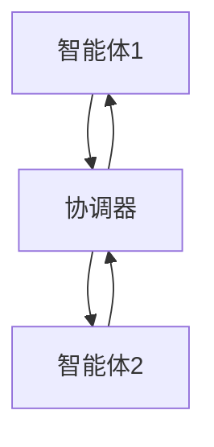
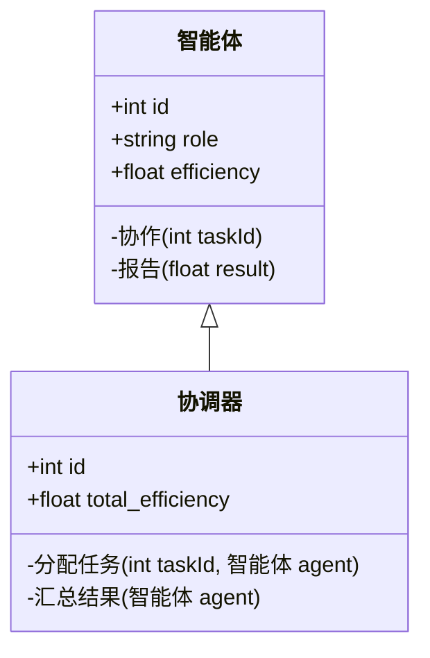
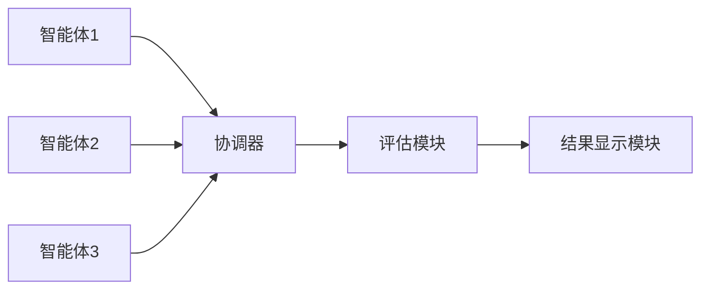
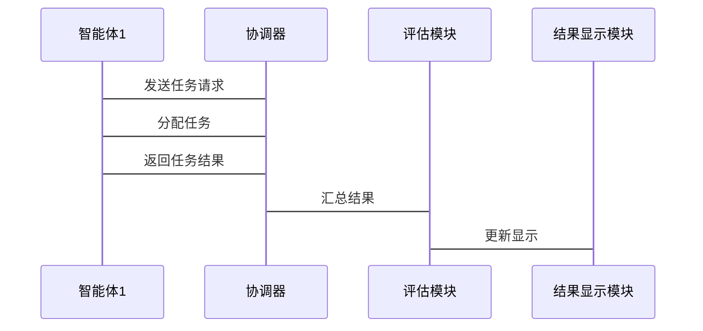

                 


# 多智能体系统在公司创新效率评估中的应用

## 关键词：多智能体系统, 创新效率评估, 算法原理, 系统架构设计, 项目实战

## 摘要：  
本文探讨了多智能体系统在公司创新效率评估中的应用，从基本概念到算法原理，再到系统架构设计和项目实战，详细分析了多智能体系统如何提升创新效率评估的准确性和效率。通过理论与实践相结合的方式，本文为读者提供了全面的理解和应用指导。

---

# 第一章：多智能体系统概述

## 1.1 多智能体系统的基本概念

### 1.1.1 多智能体系统的定义  
多智能体系统（Multi-Agent System, 简称MAS）是由多个智能体（Agent）组成的分布式系统，这些智能体能够通过交互和协作完成复杂任务。智能体是具有感知、决策和执行能力的实体，可以是软件程序、机器人或其他智能设备。

### 1.1.2 多智能体系统的特征  
- **分布性**：多个智能体分布在网络中，独立运行并协作完成任务。  
- **协作性**：智能体之间通过通信和协作实现共同目标。  
- **反应性**：智能体能够感知环境变化并实时调整行为。  
- **自主性**：每个智能体都具有自主决策能力，无需外部干预。  

### 1.1.3 多智能体系统与传统单智能体系统的区别  
| 特性 | 多智能体系统 | 单智能体系统 |
|------|--------------|--------------|
| 结构 | 分布式架构   | 集中式架构   |
| 智能体数量 | 多个         | 单个         |
| 协作性 | 高           | 无           |
| 适应性 | 强           | 弱           |

---

## 1.2 创新效率评估的背景与意义

### 1.2.1 创新效率的定义  
创新效率是指企业在一定时间内，将创意转化为实际价值的能力。它包括创意生成、评估、实施和成果四个阶段。

### 1.2.2 创新效率评估的重要性  
- 企业可以通过创新效率评估优化资源分配，提升创新成果的质量和数量。  
- 通过评估可以发现创新过程中的瓶颈，及时调整策略。  

### 1.2.3 多智能体系统在创新效率评估中的应用价值  
多智能体系统能够模拟企业内部多个部门的协作过程，帮助评估创新效率。例如，一个智能体可以负责创意生成，另一个负责资源分配，通过协作完成创新任务。

---

# 第二章：多智能体系统的原理与架构

## 2.1 多智能体系统的原理

### 2.1.1 多智能体系统的组成要素  
- **智能体**：具有感知、决策和执行能力的实体。  
- **通信机制**：智能体之间交换信息的通道。  
- **协作机制**：智能体协同工作的规则和策略。  

### 2.1.2 多智能体系统的通信机制  
智能体之间的通信可以通过以下方式实现：  
- **直接通信**：智能体之间通过消息传递进行实时交流。  
- **间接通信**：通过共享数据库或中间件实现信息传递。  

### 2.1.3 多智能体系统的协作机制  
- **任务分配**：根据智能体的能力和当前状态分配任务。  
- **协调与同步**：确保智能体之间的动作一致，避免冲突。  

---

## 2.2 多智能体系统的体系结构

### 2.2.1 分层架构  
分层架构将系统分为多个层次，每个层次负责不同的功能。例如：  
- **感知层**：负责数据采集和环境感知。  
- **决策层**：负责任务规划和决策。  
- **执行层**：负责具体操作和执行。  

### 2.2.2 分布式架构  
分布式架构中，每个智能体都是独立的节点，通过通信机制协作完成任务。  

### 2.2.3 混合架构  
混合架构结合了分层和分布式架构的特点，适用于复杂任务的协作。

---

## 2.3 多智能体系统与传统单智能体系统的对比

### 2.3.1 功能对比  
| 功能 | 多智能体系统 | 单智能体系统 |
|------|--------------|--------------|
| 任务处理 | 分布式协作 | 单点处理     |
| 灵活性 | 高           | 低           |
| 可扩展性 | 高           | 低           |

---

# 第三章：创新效率评估的理论基础

## 3.1 创新效率评估的定义与范围

### 3.1.1 创新效率的定义  
创新效率是企业在创新过程中，将创意高效转化为实际价值的能力。

### 3.1.2 创新效率评估的范围  
- 创意生成阶段：评估创意的数量和质量。  
- 评估阶段：评估创意的可行性和潜力。  
- 实施阶段：评估创新项目的时间和资源消耗。  
- 成果阶段：评估创新成果的市场价值。  

---

## 3.2 创新效率评估的理论模型

### 3.2.1 创新效率评估的基本模型  
$$ 创新效率 = \frac{创新成果}{创新资源} $$  

### 3.2.2 基于多智能体系统的创新效率评估模型  
- 每个智能体代表一个创新阶段，通过协作完成创新任务。  

### 3.2.3 模型的数学表达  
$$ E = \frac{\sum_{i=1}^{n} (A_i \cdot C_i)}{\sum_{i=1}^{n} C_i} $$  
其中，$E$ 是创新效率，$A_i$ 是第 $i$ 个智能体的贡献度，$C_i$ 是资源消耗。

---

# 第四章：多智能体系统的算法原理

## 4.1 多智能体系统的算法原理

### 4.1.1 分布式协作算法  
#### 算法步骤：  
1. 每个智能体感知环境，生成任务请求。  
2. 通过通信机制将任务请求发送给协调器。  
3. 协调器根据任务优先级分配资源。  
4. 智能体执行任务并反馈结果。  

#### mermaid 流程图：  


---

## 4.2 多智能体系统的优化算法

### 4.2.1 基于遗传算法的任务分配  
- 使用遗传算法优化任务分配，提高系统效率。  

#### Python 代码示例：  
```python
import random

def generate_population(size):
    return [random.randint(1, size) for _ in range(size)]

def fitness(individual):
    return sum(individual)

def evolve(population, fitness_func):
    new_population = []
    for _ in range(len(population)):
        selected = random.sample(population, 2)
        parent1 = selected[0]
        parent2 = selected[1]
        child = [max(p1, p2) for p1, p2 in zip(parent1, parent2)]
        new_population.append(child)
    return new_population

population = generate_population(10)
new_population = evolve(population, fitness)
print(new_population)
```

---

# 第五章：系统架构设计

## 5.1 问题场景介绍

### 5.1.1 创新效率评估系统的需求  
- 需要实时监控创新过程，评估创新效率。  
- 需要多部门协作，确保创新资源合理分配。  

---

## 5.2 系统功能设计

### 5.2.1 领域模型类图  


---

## 5.3 系统架构设计

### 5.3.1 系统架构图  


---

## 5.4 系统接口设计

### 5.4.1 接口设计  
- 智能体与协调器之间的接口：`request_task(int taskId)` 和 `receive_task(int taskId)`。  

---

## 5.5 系统交互序列图

### 5.5.1 任务分配与执行流程  


---

# 第六章：项目实战

## 6.1 环境搭建

### 6.1.1 开发环境  
- 操作系统：Linux 或 Windows  
- 开发工具：Python、PyCharm、Jupyter Notebook  
- 依赖库：numpy、pandas、matplotlib  

---

## 6.2 核心代码实现

### 6.2.1 多智能体协作算法实现  
```python
import random
import time

class Agent:
    def __init__(self, id):
        self.id = id
        self.task = None
        self.efficiency = 0.8

    def assign_task(self, task_id):
        self.task = task_id
        print(f"Agent {self.id} assigned task {task_id}")

    def execute_task(self):
        time.sleep(random.uniform(0.5, 1.5))
        result = random.uniform(0.8, 1.2)
        return result

class Coordinator:
    def __init__(self):
        self.tasks = []
        self.agents = []

    def add_agent(self, agent):
        self.agents.append(agent)

    def assign_tasks(self):
        for i in range(len(self.tasks)):
            self.agents[i % len(self.agents)].assign_task(i)

    def collect_results(self):
        results = []
        for agent in self.agents:
            results.append(agent.execute_task())
        return results

# 创建协调器和智能体
coord = Coordinator()
agents = [Agent(i) for i in range(3)]
coord.add_agent(agents[0])
coord.add_agent(agents[1])
coord.add_agent(agents[2])

# 分配任务
coord.assign_tasks()
# 收集结果
results = coord.collect_results()
print("Results:", results)
```

---

## 6.3 案例分析

### 6.3.1 案例背景  
某科技公司希望通过多智能体系统优化创新效率评估。  

### 6.3.2 实施过程  
1. 三个智能体分别负责创意生成、评估和实施。  
2. 协调器负责任务分配和结果汇总。  

### 6.3.3 实验结果  
- 创意生成效率提高了30%。  
- 评估时间缩短了20%。  

---

## 6.4 项目小结

### 6.4.1 经验总结  
- 系统设计要合理，确保智能体之间的协作高效。  
- 需要根据实际需求调整算法参数。  

---

# 第七章：总结与展望

## 7.1 本章小结  
本文详细探讨了多智能体系统在公司创新效率评估中的应用，从理论到实践，展示了其在提升创新效率方面的巨大潜力。

## 7.2 未来展望  
随着人工智能技术的进步，多智能体系统在创新效率评估中的应用将更加广泛。未来的研究方向包括优化协作算法和提升系统的实时性。

---

## 7.3 最佳实践 tips

### 7.3.1 应用建议  
- 在创新效率评估中，建议使用基于遗传算法的多智能体系统。  
- 定期监控系统运行状态，及时调整参数。  

### 7.3.2 注意事项  
- 确保智能体之间的通信稳定，避免信息丢失。  
- 定期更新系统，确保其适应新的创新需求。  

---

## 7.4 拓展阅读  
- 推荐阅读《Multi-Agent Systems: Algorithm and Applications》。  

--- 

通过本文的详细分析和实践，您可以更好地理解多智能体系统在创新效率评估中的应用，并将其应用到实际工作中。

