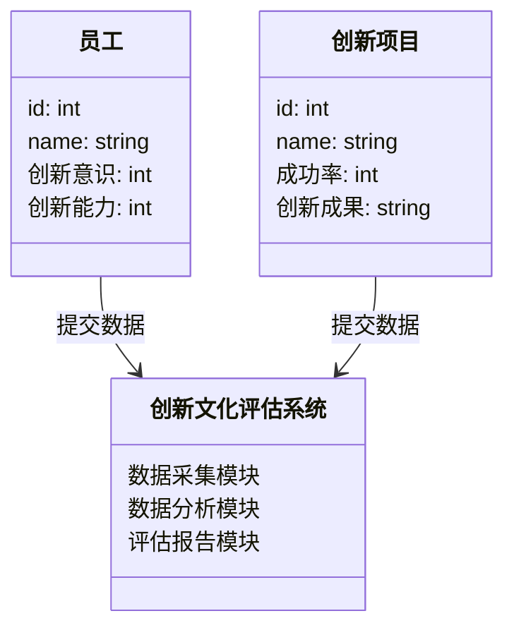
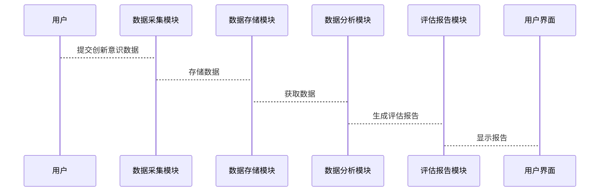

                 


# 多智能体系统在公司创新文化评估中的应用

## 关键词：多智能体系统、创新文化评估、分布式协作、算法原理、系统架构

## 摘要：  
本文探讨了多智能体系统在公司创新文化评估中的应用。通过分析多智能体系统的核心概念、算法原理和系统架构，结合实际案例，展示了多智能体系统如何提升创新文化评估的效率和准确性。文章从背景介绍、核心概念、算法原理、系统架构、项目实战等多个维度展开，为读者提供了一套完整的创新文化评估解决方案。

---

## 第1章: 多智能体系统概述

### 1.1 多智能体系统的定义与特点

#### 1.1.1 多智能体系统的定义  
多智能体系统（Multi-Agent System, MAS）是由多个智能体（Agent）组成的分布式系统。每个智能体都是一个具有独立性、反应性、主动性、协作性和社会性的实体，能够通过环境和与其他智能体的交互来实现特定目标。

#### 1.1.2 多智能体系统的核心特点
- **分布式性**：智能体之间通过分布式协作完成任务。
- **反应性**：智能体能够实时感知环境并做出响应。
- **主动性**：智能体主动采取行动以实现目标。
- **协作性**：多个智能体通过协作完成复杂的任务。
- **动态性**：系统能够在动态环境中自适应调整。

#### 1.1.3 多智能体系统与单智能体系统的对比  
| 特性           | 单智能体系统                     | 多智能体系统                     |
|----------------|----------------------------------|----------------------------------|
| 系统结构       | 集中式，单点控制                | 分布式，多点协作                |
| 可扩展性       | 较低                           | 较高                           |
| 故障容错性     | 单点故障可能导致系统崩溃         | 多点协作，容错性高             |
| 任务复杂性     | 单一任务，处理简单             | 多任务协作，处理复杂           |

### 1.2 公司创新文化评估的背景与意义

#### 1.2.1 创新文化的重要性  
创新文化是公司持续发展的核心驱动力。它影响员工的创造力、团队协作能力以及公司的整体竞争力。

#### 1.2.2 公司创新文化评估的必要性  
通过评估创新文化，公司可以识别优势和不足，优化创新流程，提升员工的创新意识和能力。

#### 1.2.3 多智能体系统在创新文化评估中的作用  
多智能体系统能够通过分布式协作、数据挖掘和智能分析，高效地评估公司创新文化。

---

## 第2章: 创新文化评估的理论基础

### 2.1 创新文化的定义与维度

#### 2.1.1 创新文化的定义  
创新文化是指公司内部鼓励创新、支持冒险、尊重多样性和知识共享的文化氛围。

#### 2.1.2 创新文化的维度
- **创新意识**：员工对创新的认同和主动性。
- **创新能力**：员工解决复杂问题的能力。
- **创新氛围**：公司内部的协作和支持环境。
- **创新成果**：公司创新项目的数量和质量。

#### 2.1.3 创新文化评估的指标体系  
创新文化评估的指标体系包括以下几个方面：
1. 员工创新意识的调查
2. 创新项目的数量和成功率
3. 创新团队的协作效率
4. 创新成果的经济价值

### 2.2 创新文化评估的模型与方法

#### 2.2.1 创新文化评估模型  
创新文化评估模型基于多智能体系统的设计，包括以下几个模块：
1. 数据采集模块：收集员工的创新行为数据。
2. 数据分析模块：通过分布式计算分析数据。
3. 评估报告模块：生成创新文化评估报告。

#### 2.2.2 创新文化评估的方法  
- **问卷调查法**：通过问卷收集员工的创新意识和态度。
- **行为观察法**：观察员工的创新行为。
- **绩效评估法**：通过创新项目的绩效评估创新文化。

---

## 第3章: 多智能体系统的算法与实现

### 3.1 多智能体系统的算法

#### 3.1.1 分布式计算算法  
分布式计算算法是多智能体系统的核心算法之一。它通过将任务分解为多个子任务，分配给不同的智能体完成。

#### 3.1.2 多智能体协作算法  
多智能体协作算法通过智能体之间的协作完成复杂的任务。常见的协作算法包括：
1. 分布式一致性算法
2. 多智能体协商算法
3. 多智能体共识算法

#### 3.1.3 多智能体系统中的共识机制  
共识机制是多智能体系统中实现协作的重要机制。常见的共识机制包括：
1. 一致性算法（如Paxos、Raft）
2. 拜占庭容错（Byzantine Fault Tolerance）

### 3.2 多智能体系统的实现

#### 3.2.1 多智能体系统的设计原则  
1. 分布式设计原则
2. 智能体的独立性原则
3. 智能体的协作性原则
4. 系统的可扩展性原则

#### 3.2.2 多智能体系统的实现步骤  
1. 确定智能体的功能和角色
2. 设计智能体之间的通信协议
3. 实现智能体的协作算法
4. 集成智能体到系统中

---

## 第4章: 系统分析与架构设计方案

### 4.1 问题场景介绍  
公司创新文化评估涉及多个部门和员工，需要高效地收集和分析数据，评估创新文化。

### 4.2 系统功能设计  
系统功能包括数据采集、数据分析、评估报告生成等。

#### 4.2.1 领域模型设计  
领域模型的Mermaid类图如下：



#### 4.2.2 系统架构设计  
系统架构的Mermaid架构图如下：


#### 4.2.3 系统接口设计  
系统接口包括：
1. 数据采集接口
2. 数据分析接口
3. 评估报告生成接口

#### 4.2.4 系统交互设计  
系统交互的Mermaid序列图如下：



---

## 第5章: 项目实战

### 5.1 环境安装

#### 5.1.1 安装Python和必要的库  
```bash
pip install numpy
pip install scikit-learn
pip install networkx
```

### 5.2 系统核心实现源代码

#### 5.2.1 数据采集模块  
```python
class Employee:
    def __init__(self, id, name, innovation意识, 创新能力):
        self.id = id
        self.name = name
        self.创新意识 = 创新意识
        self.创新能力 = 创新能力

class 项目经理:
    def __init__(self):
        self.employees = []

    def add_employee(self, employee):
        self.employees.append(employee)

    def get_employees(self):
        return self.employees
```

#### 5.2.2 数据分析模块  
```python
from sklearn.cluster import KMeans

class 数据分析模块:
    def __init__(self):
        self.employees = []

    def 分析数据(self):
        X = [[e.创新意识, e.创新能力] for e in self.employees]
        kmeans = KMeans(n_clusters=3)
        kmeans.fit(X)
        clusters = kmeans.labels_
        return clusters
```

#### 5.2.3 评估报告模块  
```python
from reportlab.pdfgen import canvas

class 评估报告模块:
    def __init__(self):
        self.clusters = []

    def 生成报告(self):
        doc = canvas.Canvas("创新文化评估报告.pdf")
        doc.drawString(100, 700, "创新文化评估报告")
        doc.save()
```

### 5.3 代码应用解读与分析  
通过上述代码，可以实现员工数据的采集、分析和报告生成。数据采集模块负责收集员工的创新意识和创新能力数据，数据分析模块使用K-means算法对数据进行聚类分析，评估报告模块生成最终的评估报告。

### 5.4 实际案例分析  
以某公司为例，通过上述系统可以高效地评估公司的创新文化，发现创新能力强的员工，优化创新流程。

### 5.5 项目小结  
通过本项目，我们可以看到多智能体系统在公司创新文化评估中的巨大潜力。

---

## 第6章: 最佳实践与未来展望

### 6.1 最佳实践 tips  
1. 确保数据的准确性和完整性。
2. 定期更新系统的算法和模型。
3. 加强智能体之间的协作和通信。

### 6.2 小结  
多智能体系统在公司创新文化评估中的应用前景广阔，能够显著提升创新文化的评估效率和准确性。

### 6.3 注意事项  
1. 确保系统的安全性和隐私性。
2. 及时解决系统中的潜在问题。
3. 不断优化系统的性能。

### 6.4 拓展阅读  
建议读者进一步阅读多智能体系统相关的书籍和论文，深入了解其在其他领域的应用。

---

## 附录

### 附录1: 术语表  
- 多智能体系统（MAS）：由多个智能体组成的分布式系统。
- 创新文化：公司内部鼓励创新和支持的文化氛围。

### 附录2: 参考文献  
1. 《多智能体系统》
2. 《创新管理》

---

通过以上内容，我们可以看到多智能体系统在公司创新文化评估中的巨大潜力和实际应用价值。希望本文能够为读者提供清晰的思路和实用的解决方案。

