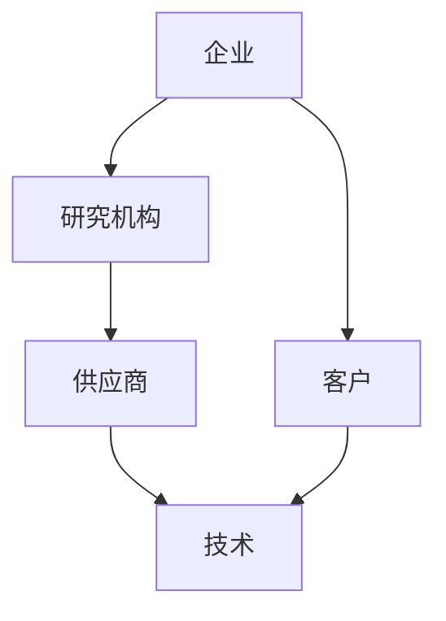
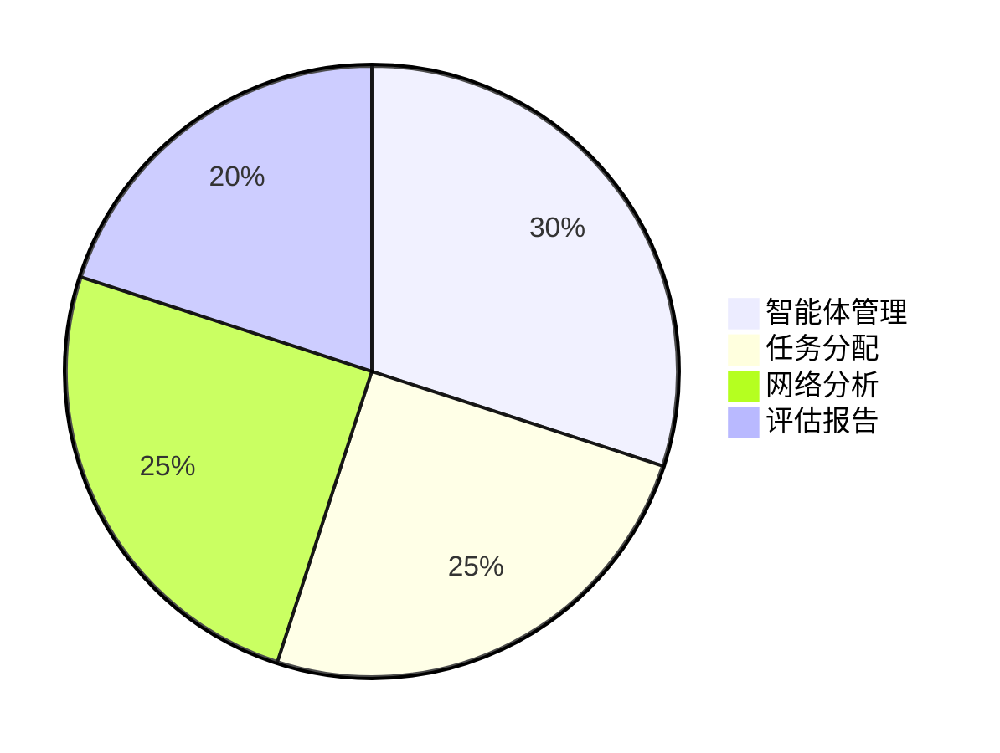
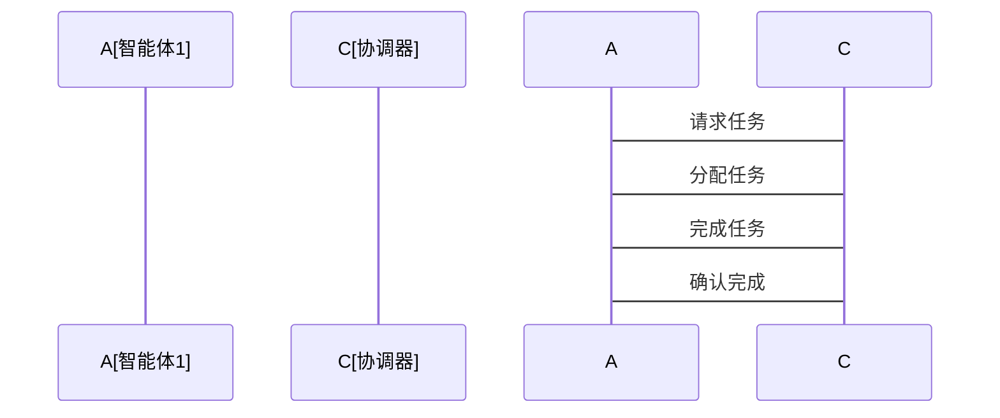

                 


```markdown
# 多智能体系统在公司创新网络评估中的应用

> 关键词：多智能体系统、创新网络、企业评估、协同优化、系统架构、算法原理

> 摘要：本文探讨了多智能体系统（MAS）在公司创新网络评估中的应用，分析了创新网络的结构、多智能体系统的原理及其在创新网络评估中的优势，通过实际案例展示了多智能体系统的实现与应用效果。

---

## 第1章：多智能体系统与创新网络评估的背景介绍

### 1.1 多智能体系统的基本概念
#### 1.1.1 多智能体系统的定义与特点
多智能体系统（Multi-Agent System，MAS）是由多个智能体组成的系统，这些智能体能够自主决策、协作和通信。其特点包括分布性、智能性、协作性、动态性和适应性。

#### 1.1.2 多智能体系统的分类与应用场景
多智能体系统可以分为基于规则的系统、基于模型的系统、基于市场的系统等。应用场景包括分布式计算、智能交通管理、经济模拟等。

#### 1.1.3 多智能体系统在企业创新中的作用
多智能体系统能够模拟企业内部和外部的创新活动，帮助评估创新网络的效率和潜力。

### 1.2 创新网络的定义与特点
#### 1.2.1 创新网络的概念与构成
创新网络是一个由企业、研究机构、供应商、客户等构成的网络，通过知识流动和协同创新实现价值创造。

#### 1.2.2 创新网络的类型与层次
创新网络可以分为内部网络和外部网络，层次包括知识层、协作层和价值层。

#### 1.2.3 创新网络在企业中的重要性
创新网络是企业获取外部知识和资源的重要途径，能够提升企业的创新能力。

### 1.3 问题背景与研究意义
#### 1.3.1 企业创新网络评估的挑战
传统评估方法难以捕捉创新网络的动态性和复杂性。

#### 1.3.2 多智能体系统在创新网络评估中的优势
多智能体系统能够模拟创新网络的动态行为，提供实时评估和优化建议。

#### 1.3.3 研究目标与意义
研究目标是构建一个多智能体系统来评估和优化公司创新网络，意义在于提升企业的创新能力。

---

## 第2章：多智能体系统与创新网络的核心概念与联系

### 2.1 多智能体系统的原理与机制
#### 2.1.1 智能体的行为与决策机制
智能体基于环境信息和目标进行自主决策，可能采用基于规则、基于模型或基于市场的决策方式。

#### 2.1.2 智能体之间的通信与协作
智能体通过通信协议交换信息，实现协作任务。协作机制包括分布式计算和分布式协调。

#### 2.1.3 多智能体系统的动态性与复杂性
多智能体系统的动态性和复杂性来源于智能体的自主性和环境的不确定性。

### 2.2 创新网络的结构与功能
#### 2.2.1 创新网络的节点与关系
节点包括企业、研究机构、供应商等，关系包括知识流动、技术合作等。

#### 2.2.2 创新网络的演化与优化
创新网络通过节点的动态加入和退出，以及关系的调整来优化网络结构。

#### 2.2.3 创新网络的评估指标与方法
评估指标包括网络密度、中心度、聚类系数等，评估方法包括网络分析、社会网络分析等。

### 2.3 多智能体系统与创新网络的结合
#### 2.3.1 多智能体系统在创新网络中的角色
智能体可以代表企业、研究机构等节点，模拟其行为和互动。

#### 2.3.2 创新网络对多智能体系统的支持
创新网络为多智能体系统提供了丰富的节点和关系，支持系统的建模和仿真。

#### 2.3.3 两者的协同作用与应用前景
多智能体系统与创新网络的结合能够实现创新网络的实时评估和优化，具有广泛的应用前景。

---

## 第3章：多智能体系统与创新网络的核心概念对比分析

### 3.1 多智能体系统与创新网络的对比
#### 3.1.1 概念对比
| 概念 | 多智能体系统 | 创新网络 |
|------|--------------|----------|
| 定义 | 多个智能体的系统 | 创新节点的网络 |

#### 3.1.2 属性对比
| 属性 | 多智能体系统 | 创新网络 |
|------|--------------|----------|
| 动态性 | 高 | 高 |
| 复杂性 | 高 | 高 |
| 可视性 | 低 | 高 |

### 3.2 创新网络的实体关系图


---

## 第4章：多智能体系统的算法原理与实现

### 4.1 算法原理
#### 4.1.1 分布式计算
多智能体系统中的智能体通过分布式计算实现任务协作。

#### 4.1.2 协调机制
智能体之间通过协调机制实现任务分配和资源分配。

#### 4.1.3 社会网络分析
基于社会网络分析的方法，评估创新网络的结构和关系。

### 4.2 算法实现
#### 4.2.1 代码实现
```python
# 多智能体系统中的协调算法
class Agent:
    def __init__(self, id):
        self.id = id
        self.state = 'idle'

    def get_task(self, task):
        self.state = 'busy'
        print(f"Agent {self.id} is working on {task}")

    def complete_task(self):
        self.state = 'idle'
        print(f"Agent {self.id} has completed the task")

# 协调机制
class Coordinator:
    def __init__(self, agents):
        self.agents = agents

    def assign_task(self, task):
        for agent in self.agents:
            if agent.state == 'idle':
                agent.get_task(task)
                return
        print("No available agent to assign task")

# 使用示例
agents = [Agent(1), Agent(2), Agent(3)]
coordinator = Coordinator(agents)
coordinator.assign_task("Project X")
```

#### 4.2.2 数学模型
多智能体系统中的任务分配可以通过以下数学模型表示：
$$
\text{Task Assignment} = \argmin_{i} (s_i, t_i)
$$
其中，\( s_i \) 表示智能体 \( i \) 的状态，\( t_i \) 表示智能体 \( i \) 的任务处理时间。

---

## 第5章：创新网络评估的系统架构与设计

### 5.1 系统架构设计
#### 5.1.1 系统功能模块
- 智能体管理模块
- 任务分配模块
- 网络分析模块
- 评估报告生成模块

#### 5.1.2 系统架构图


### 5.2 系统接口设计
#### 5.2.1 接口描述
- 智能体管理接口：用于管理智能体的状态和行为。
- 任务分配接口：用于分配和协调任务。
- 网络分析接口：用于分析创新网络的结构和关系。

#### 5.2.2 交互流程图


---

## 第6章：项目实战与案例分析

### 6.1 项目实战
#### 6.1.1 环境安装
安装Python和相关库（如networkx、matplotlib）。

#### 6.1.2 核心代码实现
```python
import networkx as nx
from matplotlib import pyplot as plt

# 创建创新网络图
G = nx.Graph()
G.add_nodes_from(["A", "B", "C", "D"])
G.add_edges_from([("A", "B"), ("B", "C"), ("C", "D"), ("A", "D")])

# 可视化网络图
nx.draw(G, with_labels=True)
plt.show()
```

#### 6.1.3 代码功能解读
上述代码创建了一个创新网络图，并使用networkx库进行可视化。

### 6.2 案例分析
#### 6.2.1 案例背景
某公司希望评估其创新网络的结构和关系。

#### 6.2.2 网络分析结果
通过多智能体系统的模拟，发现公司创新网络的密度较低，可以通过增加合作节点来优化网络结构。

#### 6.2.3 优化建议
建议公司加强与外部研究机构的合作，提升网络的协同创新能力。

---

## 第7章：最佳实践与总结

### 7.1 最佳实践
#### 7.1.1 数据质量的重要性
确保创新网络数据的准确性和完整性。

#### 7.1.2 模型选择的合理性
根据具体需求选择合适的多智能体模型和算法。

#### 7.1.3 系统维护的持续性
定期更新和优化系统，以适应创新网络的变化。

### 7.2 小结
本文通过分析多智能体系统与创新网络的结合，展示了其在公司创新网络评估中的应用价值。

### 7.3 注意事项
- 多智能体系统的实现需要考虑系统的可扩展性和可维护性。
- 创新网络的评估需要结合企业的实际情况。

### 7.4 拓展阅读
建议进一步研究多智能体系统在其他领域的应用，如经济模拟、智能交通等。

---

## 附录

### 附录A：相关术语解释
- 多智能体系统：由多个智能体组成的系统。
- 创新网络：企业与外部创新资源形成的网络。

### 附录B：参考文献
- 略

---

通过以上目录大纲和内容，您可以逐步完成整篇技术博客文章的撰写，确保文章结构清晰、内容详实且具有深度。
```

