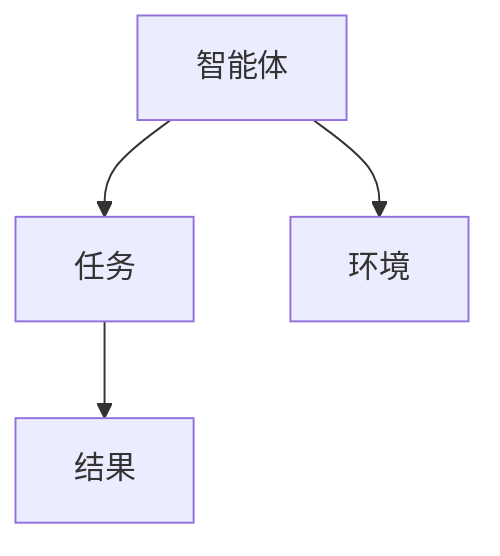
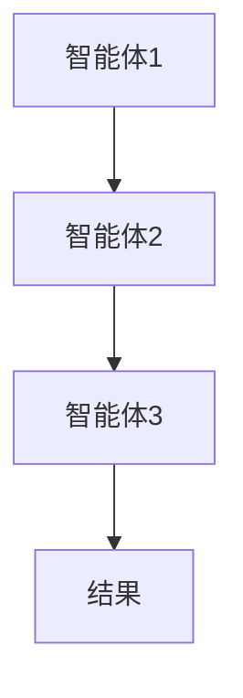
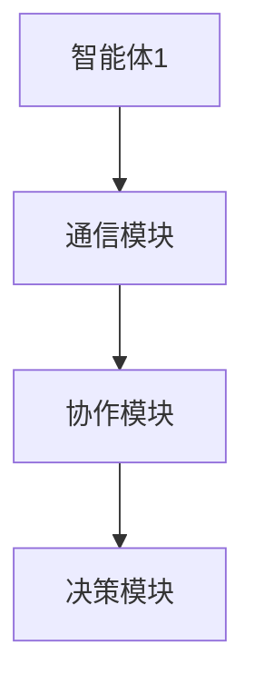

                 


# 多智能体系统在公司国际化战略评估中的应用

## 关键词：多智能体系统、国际化战略、战略评估、AI技术、企业决策

## 摘要：  
本文深入探讨了多智能体系统在公司国际化战略评估中的应用，从理论到实践，详细分析了多智能体系统的定义、原理、算法、系统架构以及实际案例。通过多智能体系统的协作与分布式计算能力，帮助企业更高效地评估和执行国际化战略，提升企业在全球市场中的竞争力。

---

# 第1章 多智能体系统概述

## 1.1 多智能体系统的基本概念

### 1.1.1 智能体的定义与特点
- **智能体**：智能体是指能够感知环境、自主决策并采取行动的实体。
- **特点**：智能体具有自主性、反应性、目标导向性和社会性。

### 1.1.2 多智能体系统的定义与分类
- **定义**：多智能体系统（MAS）是由多个智能体组成的协作系统，智能体之间通过通信和协作完成复杂任务。
- **分类**：按智能体类型可分为简单智能体和复杂智能体；按应用场景可分为分布式计算系统和协作系统。

### 1.1.3 多智能体系统的核心要素
- **通信机制**：智能体之间通过消息传递进行通信。
- **协作机制**：智能体之间通过协作完成共同目标。
- **决策机制**：智能体根据环境信息自主决策。

## 1.2 多智能体系统的应用场景

### 1.2.1 分布式问题求解
- **分布式计算**：多智能体系统通过分布式计算高效解决问题。
- **协作机制**：智能体之间协作完成任务。

### 1.2.2 协作与通信机制
- **通信机制**：智能体之间通过消息传递进行通信。
- **协作机制**：智能体之间通过协作完成共同目标。

### 1.2.3 多智能体系统的挑战与解决方案
- **挑战**：通信延迟、任务冲突、环境不确定性。
- **解决方案**：优化通信机制、任务分配算法、环境适应性。

## 1.3 多智能体系统与国际化战略的关系

### 1.3.1 国际化战略的复杂性与多智能体系统的契合点
- **契合点**：多智能体系统能够处理复杂、动态的国际化战略问题。

### 1.3.2 多智能体系统在战略评估中的优势
- **优势**：高效协作、灵活适应环境变化、快速决策。

### 1.3.3 多智能体系统的可扩展性与灵活性
- **可扩展性**：支持大规模智能体扩展。
- **灵活性**：适应不同场景和需求。

## 1.4 本章小结

---

# 第2章 多智能体系统的核心概念与联系

## 2.1 多智能体系统的原理

### 2.1.1 分布式计算原理
- **分布式计算**：多智能体系统通过分布式计算高效解决问题。

### 2.1.2 智能体之间的通信机制
- **通信机制**：智能体之间通过消息传递进行通信。

### 2.1.3 协作与决策过程
- **协作过程**：智能体之间协作完成共同目标。
- **决策过程**：智能体根据环境信息自主决策。

## 2.2 多智能体系统的属性对比

### 2.2.1 智能体的自主性与社会性对比
- **自主性**：智能体自主决策。
- **社会性**：智能体之间协作。

### 2.2.2 分布式与集中式系统对比
- **分布式系统**：多个智能体协作完成任务。
- **集中式系统**：单个中心节点决策。

### 2.2.3 动态环境与静态环境对比
- **动态环境**：环境变化快，需要智能体快速适应。
- **静态环境**：环境稳定，智能体可以预处理。

## 2.3 实体关系图与流程图

### 2.3.1 多智能体系统ER实体关系图


### 2.3.2 多智能体系统协作流程图


## 2.4 本章小结

---

# 第3章 多智能体系统的算法原理

## 3.1 分布式计算算法

### 3.1.1 分布式计算的基本原理
- **分布式计算**：多智能体系统通过分布式计算高效解决问题。

### 3.1.2 分布式计算的实现步骤
1. 任务分解
2. 任务分配
3. 任务执行
4. 结果汇总

### 3.1.3 分布式计算的优缺点
- **优点**：高效、灵活。
- **缺点**：复杂、需要通信。

## 3.2 协作与决策算法

### 3.2.1 协作算法的基本原理
- **协作算法**：智能体之间协作完成任务。

### 3.2.2 决策算法的实现步骤
1. 状态感知
2. 信息处理
3. 决策制定
4. 行动执行

### 3.2.3 协作与决策算法的优缺点
- **优点**：高效、灵活。
- **缺点**：复杂、需要通信。

## 3.3 多智能体系统算法的数学模型

### 3.3.1 分布式计算的数学模型
$$f(x) = \sum_{i=1}^{n} x_i$$

### 3.3.2 协作算法的数学模型
$$g(x) = \max_{i} x_i$$

### 3.3.3 决策算法的数学模型
$$h(x) = \frac{1}{1 + e^{-x}}$$

## 3.4 本章小结

---

# 第4章 多智能体系统的系统架构设计

## 4.1 系统功能设计

### 4.1.1 多智能体系统的功能模块划分
- **功能模块**：通信模块、协作模块、决策模块。

### 4.1.2 每个模块的功能描述
- **通信模块**：负责智能体之间的通信。
- **协作模块**：负责智能体之间的协作。
- **决策模块**：负责智能体的决策。

## 4.2 系统架构设计

### 4.2.1 多智能体系统的架构图


### 4.2.2 系统架构的优缺点
- **优点**：高效、灵活。
- **缺点**：复杂、需要通信。

## 4.3 接口设计与交互设计

### 4.3.1 接口设计
- **接口**：智能体之间的通信接口。

### 4.3.2 交互设计
- **交互**：智能体之间的协作交互。

## 4.4 本章小结

---

# 第5章 多智能体系统的项目实战

## 5.1 环境安装

### 5.1.1 环境要求
- **编程语言**：Python
- **框架**：Django
- **开发工具**：PyCharm

### 5.1.2 安装步骤
1. 安装Python
2. 安装Django
3. 安装其他依赖项

## 5.2 系统核心代码实现

### 5.2.1 核心代码
```python
class Agent:
    def __init__(self, id):
        self.id = id
        self.task = None

    def receive_message(self, message):
        # 处理消息
        pass

    def send_message(self, message):
        # 发送消息
        pass

class MultiAgentSystem:
    def __init__(self):
        self.agents = []

    def add_agent(self, agent):
        self.agents.append(agent)

    def remove_agent(self, agent):
        self.agents.remove(agent)

    def run(self):
        # 运行系统
        pass
```

### 5.2.2 代码解读
- **Agent类**：表示智能体。
- **MultiAgentSystem类**：表示多智能体系统。

## 5.3 代码应用解读与分析

### 5.3.1 代码应用场景
- **应用场景**：国际化战略评估。

### 5.3.2 代码实现细节
- **细节**：智能体之间通过消息传递进行通信。

## 5.4 实际案例分析

### 5.4.1 案例背景
- **案例**：公司国际化战略评估。

### 5.4.2 案例分析
- **分析**：通过多智能体系统的协作，公司可以更高效地评估国际化战略。

## 5.5 项目小结

---

# 第6章 最佳实践与小结

## 6.1 最佳实践 tips

### 6.1.1 通信机制的选择
- **建议**：选择高效的通信机制。

### 6.1.2 任务分配的策略
- **建议**：选择合理的任务分配策略。

### 6.1.3 环境适应性
- **建议**：增强系统的环境适应性。

## 6.2 小结

## 6.3 注意事项

## 6.4 拓展阅读

---

# 结语

通过本文的深入分析，读者可以全面了解多智能体系统在公司国际化战略评估中的应用，从理论到实践，全面掌握多智能体系统的定义、原理、算法、系统架构以及实际案例。希望本文能为读者在实际应用中提供有价值的参考和指导。

