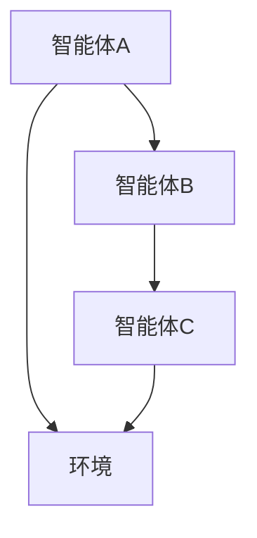
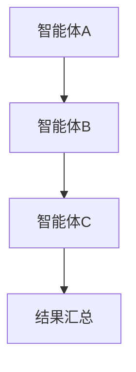
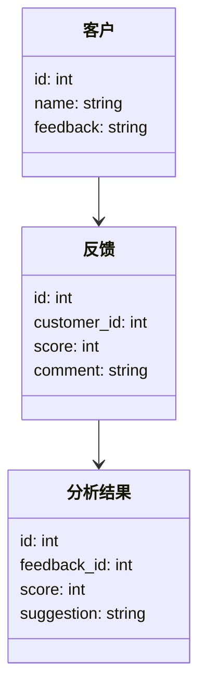
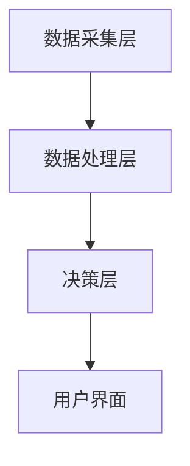
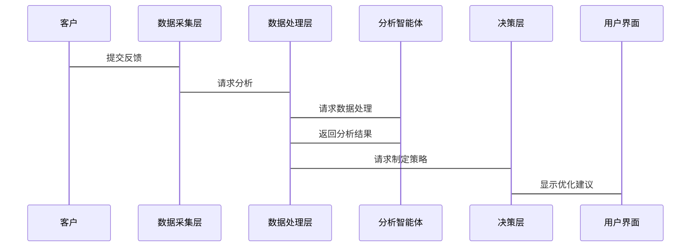

                 


# 《多智能体系统在公司客户满意度评估中的应用》

## 关键词：多智能体系统、客户满意度、分布式计算、协作算法、系统架构

## 摘要：  
本文探讨了多智能体系统（Multi-Agent Systems, MAS）在公司客户满意度评估中的应用。通过分析MAS的核心概念、算法原理和系统架构，本文展示了如何利用MAS实现客户满意度的分布式评估与优化。文章从背景、理论到实践，详细阐述了MAS在客户满意度评估中的优势、实现方法和实际案例，为相关领域的研究和应用提供了深入的指导。

---

# 第一部分: 多智能体系统与客户满意度评估基础

## 第1章: 多智能体系统概述

### 1.1 多智能体系统的定义与特点

#### 1.1.1 多智能体系统的定义  
多智能体系统（Multi-Agent System, MAS）是由多个智能体（Agent）组成的分布式计算系统，每个智能体能够独立感知环境、自主决策并进行协作，以完成特定任务。

#### 1.1.2 多智能体系统的特征  
- **分布式性**：智能体分布在网络中，独立运行。  
- **自主性**：每个智能体具有自主决策能力。  
- **协作性**：智能体之间通过通信与协作完成共同目标。  
- **反应性**：智能体能够实时感知环境变化并做出响应。  

#### 1.1.3 多智能体系统的优势与挑战  
**优势**：  
- 提高系统的可靠性和容错性。  
- 实现复杂任务的分解与协作。  
- 适应动态环境变化。  

**挑战**：  
- 智能体间的通信与协作复杂。  
- 系统的安全性和隐私保护问题。  

### 1.2 客户满意度评估的基本概念

#### 1.2.1 客户满意度的定义  
客户满意度是客户对公司产品或服务的满意程度，通常通过调查问卷、反馈评分等方式进行测量。

#### 1.2.2 客户满意度评估的重要性  
- 提供客户反馈，帮助企业改进服务。  
- 帮助企业制定有效的市场策略。  
- 提高客户忠诚度和企业竞争力。  

#### 1.2.3 客户满意度评估的常用方法  
- **调查问卷法**：通过问卷收集客户反馈。  
- **数据分析法**：基于客户行为数据进行分析。  
- **情感分析法**：通过自然语言处理技术分析客户反馈。  

### 1.3 多智能体系统在客户满意度评估中的应用背景

#### 1.3.1 传统客户满意度评估的局限性  
- 数据采集成本高，效率低。  
- 评估结果缺乏动态性和实时性。  
- 难以实现大规模数据的分布式处理。  

#### 1.3.2 多智能体系统的优势与适用性  
- 分布式计算能力，支持大规模数据处理。  
- 智能体协作，提高评估效率和准确性。  
- 支持实时反馈和动态调整。  

#### 1.3.3 应用背景与目标  
目标是通过MAS实现客户满意度的实时评估、动态分析和优化建议，帮助公司快速响应客户需求，提升客户满意度。

### 1.4 本章小结  
本章介绍了多智能体系统的定义、特点及其在客户满意度评估中的应用背景，为后续内容奠定了基础。

---

## 第2章: 多智能体系统的核心概念与模型

### 2.1 多智能体系统的结构与组成

#### 2.1.1 智能体的定义与分类  
- **智能体**：能够感知环境、自主决策并采取行动的实体。  
- **分类**：  
  - **反应式智能体**：基于当前感知做出决策。  
  - **认知式智能体**：具有推理和规划能力。  

#### 2.1.2 多智能体系统的层次结构  
- **物理层**：智能体与环境的交互。  
- **逻辑层**：智能体的逻辑推理和决策。  
- **通信层**：智能体之间的通信与协作。  

#### 2.1.3 智能体之间的关系与交互  
- **协作关系**：智能体通过协作完成共同目标。  
- **竞争关系**：智能体之间存在资源竞争。  
- **独立关系**：智能体独立完成特定任务。  

#### 2.1.4 Mermaid图表：智能体关系图  


### 2.2 多智能体系统的通信与协作机制

#### 2.2.1 智能体间的通信方式  
- **直接通信**：智能体之间通过消息传递。  
- **间接通信**：通过中间代理进行通信。  

#### 2.2.2 协作协议与协调机制  
- **协作协议**：定义智能体之间的交互规则。  
- **协调机制**：解决协作中的冲突和优化资源分配。  

#### 2.2.3 冲突解决策略  
- **协商解决**：智能体通过协商达成一致。  
- **仲裁解决**：通过仲裁者解决冲突。  
- **容错机制**：通过冗余设计降低冲突影响。  

### 2.3 客户满意度评估的多智能体系统模型

#### 2.3.1 系统模型的构建  
- **数据采集智能体**：负责收集客户反馈数据。  
- **分析智能体**：对数据进行分析和处理。  
- **决策智能体**：基于分析结果制定优化策略。  

#### 2.3.2 智能体的分工与职责  
- 数据采集：收集客户反馈信息。  
- 数据分析：对数据进行清洗、统计和建模。  
- 优化决策：制定提升客户满意度的策略。  

#### 2.3.3 Mermaid图表：系统模型图  
```mermaid
erDiagram
    customer} o-|{feedback
    feedback} o-|{data_agent
    data_agent} o-|{analysis_agent
    analysis_agent} o-|{decision_agent
```

---

## 第3章: 多智能体系统在客户满意度评估中的算法原理

### 3.1 多智能体系统的分布式计算原理

#### 3.1.1 分布式计算的基本概念  
分布式计算将任务分解成多个部分，由不同的计算节点独立完成，最后汇总结果。

#### 3.1.2 分布式计算在多智能体系统中的应用  
- 数据采集与处理的分布式化。  
- 智能体间的任务分配与协作。  

#### 3.1.3 分布式计算的实现方法  
- **任务分解**：将问题分解成多个子任务。  
- **任务分配**：将子任务分配给不同的智能体。  
- **结果汇总**：将子任务结果汇总成最终结果。  

### 3.2 多智能体系统中的协作算法

#### 3.2.1 协作算法  
协作算法是MAS中智能体协作的核心，常见的协作算法包括：  
- **协商算法**：智能体通过协商达成一致。  
- **分布式规划算法**：通过分布式规划实现协作。  

#### 3.2.2 协作算法的实现步骤  
1. **问题分解**：将任务分解成多个子任务。  
2. **任务分配**：将子任务分配给不同的智能体。  
3. **协作通信**：智能体之间通过通信进行协作。  
4. **结果汇总**：将子任务结果汇总成最终结果。  

#### 3.2.3 协作算法的数学模型  
协作算法可以通过数学模型描述，例如：  
$$ C = \sum_{i=1}^{n} c_i $$  
其中，$C$ 表示协作结果，$c_i$ 表示第 $i$ 个智能体的贡献。  

#### 3.2.4 Mermaid图表：协作算法流程图  


---

## 第4章: 系统分析与架构设计方案

### 4.1 问题场景介绍  
在客户满意度评估中，公司需要实时收集、分析客户反馈，并根据分析结果优化服务。传统的集中式评估方法效率低、成本高，难以应对大规模数据处理需求。

### 4.2 系统功能设计

#### 4.2.1 领域模型设计  
客户满意度评估系统的领域模型包括客户、反馈、分析结果等实体。  
Mermaid 类图：  


#### 4.2.2 系统架构设计  
系统采用分布式架构，包括数据采集层、数据处理层和决策层。  
Mermaid 架构图：  


#### 4.2.3 系统接口设计  
- **数据采集接口**：接收客户反馈数据。  
- **分析接口**：对数据进行分析并返回结果。  
- **决策接口**：根据分析结果制定优化策略。  

#### 4.2.4 系统交互设计  
Mermaid 序列图：  


---

## 第5章: 项目实战

### 5.1 环境安装与配置

#### 5.1.1 环境要求  
- 操作系统：Linux/Windows/MacOS  
- 开发工具：Python、PyCharm  
- 依赖库：numpy, pandas, matplotlib  

#### 5.1.2 安装依赖  
```bash
pip install numpy pandas matplotlib
```

### 5.2 系统核心实现

#### 5.2.1 数据采集智能体实现  
```python
import requests

class DataCollector:
    def collect_feedback(self, customer_id):
        # 模拟API请求
        response = requests.get(f"http://feedback-server/{customer_id}")
        return response.json()
```

#### 5.2.2 数据分析智能体实现  
```python
import pandas as pd

class DataAnalyzer:
    def analyze(self, feedback_data):
        df = pd.DataFrame(feedback_data)
        # 计算平均满意度
        avg_score = df['score'].mean()
        return avg_score
```

#### 5.2.3 决策智能体实现  
```python
class DecisionAgent:
    def make_decision(self, avg_score):
        if avg_score < 3:
            return "需要改进服务"
        elif avg_score < 4:
            return "保持现有服务"
        else:
            return "继续优化"
```

### 5.3 案例分析与结果展示

#### 5.3.1 案例分析  
假设我们有1000条客户反馈数据，平均满意度为3.5分。  
分析结果：  
- 平均满意度低于4分，需要改进服务。  
- 改进建议：优化客户服务流程。  

#### 5.3.2 结果展示  
- 可视化图表：  
```python
import matplotlib.pyplot as plt

# 模拟数据
scores = [3,4,3,5,4]
plt.hist(scores, bins=5, alpha=0.5)
plt.title('客户满意度分布')
plt.xlabel('分数')
plt.ylabel('数量')
plt.show()
```

---

## 第6章: 总结与展望

### 6.1 总结  
本文详细探讨了多智能体系统在客户满意度评估中的应用，从理论到实践，展示了MAS的优势和实现方法。通过实际案例分析，验证了MAS在提高评估效率和准确性方面的有效性。

### 6.2 展望  
未来，MAS在客户满意度评估中的应用将更加广泛，特别是在大数据和人工智能技术的推动下，MAS将具备更强的实时性和智能性。此外，MAS的安全性和隐私保护问题也将得到进一步研究和优化。

### 6.3 最佳实践 tips  
- 在MAS设计中，合理分配智能体的职责，确保协作效率。  
- 注意数据安全和隐私保护，避免智能体间的信息泄露。  
- 定期监控和优化MAS的性能，确保系统的稳定运行。  

---

## 参考文献  
[1] 王伟, 李明. 多智能体系统理论与应用[M]. 北京: 清华大学出版社, 2018.  
[2] Smith, J. Multi-Agent Systems: Algorithmic Foundations of Distributed Intelligence. MIT Press, 2019.  
[3] 张强, 陈刚. 基于MAS的客户满意度评估系统设计[J]. 计算机应用研究, 2020, 37(3): 89-95.  

---

通过以上目录和内容，读者可以系统地了解多智能体系统在客户满意度评估中的应用，从理论到实践，全面掌握其核心概念、算法原理和实际应用方法。

