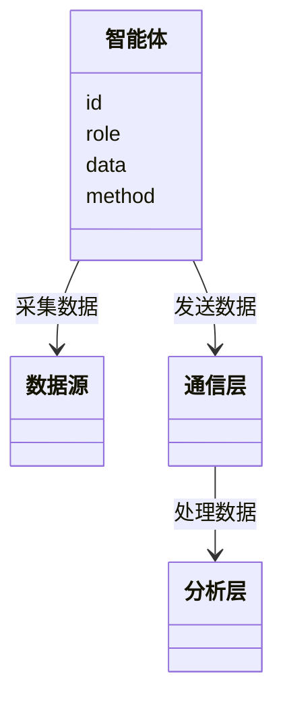
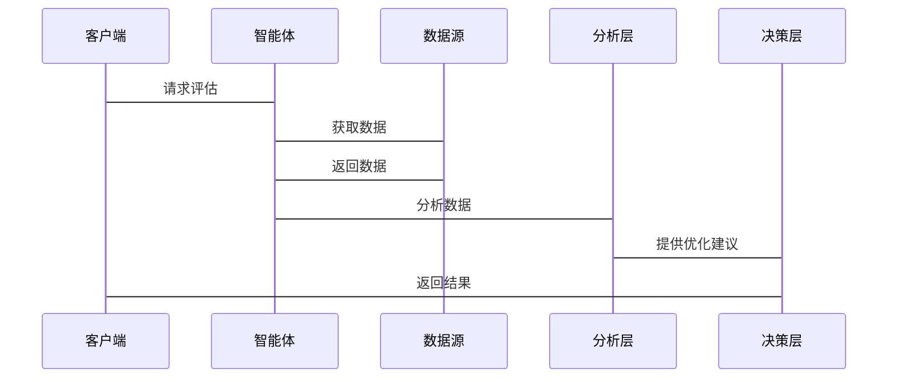

                 


# 多智能体系统在公司客户获取成本评估中的应用

> **关键词**：多智能体系统、客户获取成本、成本评估、分布式计算、博弈论模型、智能体协同、数据驱动决策

> **摘要**：本文探讨了多智能体系统在公司客户获取成本评估中的应用。通过分析多智能体系统的核心概念、算法原理和系统架构，结合实际案例，展示了如何利用多智能体系统优化客户获取流程，降低获取成本，提升企业竞争力。

---

## 第一部分：多智能体系统与客户获取成本评估的背景介绍

### 第1章：多智能体系统概述

#### 1.1 多智能体系统的概念与特点
##### 1.1.1 多智能体系统的定义
多智能体系统（Multi-Agent System, MAS）是由多个智能体组成的系统，这些智能体能够通过协同工作完成复杂的任务。智能体（Agent）是一个能够感知环境并采取行动以实现目标的实体。

##### 1.1.2 多智能体系统的特征
- **分布式性**：智能体独立运行，分布在不同的节点。
- **协同性**：智能体之间通过通信和协作完成共同目标。
- **反应性**：智能体能够实时感知环境变化并做出反应。
- **自主性**：智能体具备自主决策的能力。

##### 1.1.3 多智能体系统与单智能体系统的区别
| 特性 | 单智能体系统 | 多智能体系统 |
|------|-------------|--------------|
| 结构   | 中央化       | 分布式       |
| 协作   | 无           | 高度协作     |
| 可扩展性 | 低           | 高           |

#### 1.2 客户获取成本评估的定义与重要性
##### 1.2.1 客户获取成本的定义
客户获取成本（Customer Acquisition Cost, CAC）是企业获取一名新客户的总成本，包括营销、销售和客户服务等费用。

##### 1.2.2 客户获取成本在企业中的作用
- 优化营销策略
- 提高投资回报率（ROI）
- 支持数据驱动的决策

##### 1.2.3 客户获取成本评估的挑战
- 数据不完整
- 模型复杂性
- 实时性要求高

### 第2章：多智能体系统在企业中的应用背景

#### 2.1 企业客户获取的现状与挑战
##### 2.1.1 传统客户获取方式的局限性
- 数据孤岛问题
- 决策延迟
- 成本控制困难

##### 2.1.2 数据驱动决策的必要性
- 数据是优化客户获取的关键
- 数据驱动决策提高精准度

##### 2.1.3 多智能体系统在客户获取中的优势
- 高效的数据处理能力
- 实时协作与反馈
- 灵活的策略调整

#### 2.2 多智能体系统与客户获取成本评估的结合
##### 2.2.1 多智能体系统如何优化客户获取流程
通过分布式计算和协同学习，快速分析数据，优化营销策略。

##### 2.2.2 多智能体系统在成本评估中的应用潜力
- 实时成本监控
- 自动化决策支持
- 智能优化建议

##### 2.2.3 多智能体系统与企业战略目标的关系
多智能体系统通过优化客户获取流程，帮助企业实现成本降低和收益最大化。

---

## 第二部分：多智能体系统的核心概念与联系

### 第3章：多智能体系统的原理与机制

#### 3.1 多智能体系统的组成结构
##### 3.1.1 智能体的定义与分类
智能体可以分为简单反射型、基于模型的反射型和目标驱动型。

##### 3.1.2 多智能体系统的层次结构
- **物理层**：智能体的物理存在形式。
- **逻辑层**：智能体的行为逻辑和规则。
- **通信层**：智能体之间的通信机制。

##### 3.1.3 智能体之间的通信机制
- **直接通信**：智能体之间直接交换信息。
- **间接通信**：通过中间媒介传递信息。

#### 3.2 多智能体系统的协同与协调
##### 3.2.1 协同工作的基本原理
智能体通过协作完成共同目标，通常采用分布式计算和协商机制。

##### 3.2.2 协调机制的实现方法
- **一致性协议**：确保所有智能体的目标一致。
- **分布式协调**：通过局部决策实现全局优化。

##### 3.2.3 分布式计算在多智能体系统中的应用
通过分布式计算，智能体可以高效地处理大量数据，提高系统响应速度。

### 第4章：客户获取成本评估的核心要素

#### 4.1 客户获取成本的构成要素
##### 4.1.1 营销渠道的成本分析
不同渠道的获取成本不同，需要进行详细分析。

##### 4.1.2 客户生命周期的经济价值
客户在生命周期中为企业带来的总收入与成本的对比。

##### 4.1.3 数据驱动的成本评估方法
通过数据分析，识别高成本渠道，优化资源配置。

#### 4.2 多智能体系统与客户获取成本评估的结合点
##### 4.2.1 数据采集与处理的智能化
利用多智能体系统实时采集和处理数据，提高数据准确性。

##### 4.2.2 智能决策支持系统的构建
通过多智能体系统提供实时决策支持，降低获取成本。

##### 4.2.3 实时成本监控与优化
系统实时监控成本变化，自动调整策略，优化成本结构。

---

## 第三部分：算法原理讲解

### 第5章：多智能体系统的算法原理

#### 5.1 分布式计算算法
##### 5.1.1 分布式计算的基本原理
通过分布式计算，智能体可以高效地处理大量数据。

##### 5.1.2 分布式计算的实现步骤
1. 数据分布：将数据分发到不同的智能体。
2. 并行处理：每个智能体独立处理分配的数据。
3. 结果汇总：将各智能体的结果汇总，得到最终结果。

##### 5.1.3 分布式计算的数学模型
$$ \text{总计算能力} = \sum_{i=1}^{n} \text{智能体}_i \text{的计算能力} $$

##### 5.1.4 分布式计算的Python实现
```python
import threading

class Agent:
    def __init__(self, data):
        self.data = data

    def process(self):
        # 处理数据的逻辑
        pass

# 分发数据到各个智能体
agents = [Agent(data_i) for i in range(n)]
threads = []
for agent in agents:
    thread = threading.Thread(target=agent.process)
    threads.append(thread)

for thread in threads:
    thread.start()
```

#### 5.2 博弈论模型在多智能体系统中的应用
##### 5.2.1 博弈论模型的基本原理
通过博弈论模型，模拟多个智能体之间的策略选择和互动。

##### 5.2.2 博弈论模型的实现步骤
1. 定义策略空间
2. 计算收益矩阵
3. 寻找纳什均衡

##### 5.2.3 博弈论模型的数学公式
$$ \text{收益}(i, j) = \text{收益矩阵}[i][j] $$

##### 5.2.4 博弈论模型的Python实现
```python
import numpy as np

# 定义收益矩阵
收益矩阵 = np.array([[1, 2], [2, 1]])

# 寻找纳什均衡
def find_nash_equilibrium(收益矩阵):
    n = len(收益矩阵)
    红平衡点 = []
    for i in range(n):
        for j in range(n):
            # 检查是否存在占优策略
            if 收益矩阵[i][j] > 收益矩阵[k][j] for k in range(n) if k != i:
                红平衡点.append((i, j))
    return 红平衡点

print(find_nash_equilibrium(收益矩阵))
```

---

## 第四部分：系统分析与架构设计方案

### 第6章：系统架构设计

#### 6.1 项目背景介绍
客户获取成本评估系统需要实时分析多个渠道的数据，优化营销策略。

#### 6.2 系统功能设计
##### 6.2.1 领域模型设计


##### 6.2.2 系统架构设计


##### 6.2.3 系统接口设计
- **输入接口**：接收客户的请求和数据。
- **输出接口**：返回分析结果和优化建议。

#### 6.3 系统交互设计


---

## 第五部分：项目实战

### 第7章：项目实战与案例分析

#### 7.1 环境安装与配置
- 安装Python和必要的库（如numpy、pandas、scikit-learn）。
- 配置多智能体系统的运行环境。

#### 7.2 核心代码实现
##### 7.2.1 数据采集与处理
```python
import pandas as pd

# 读取数据
data = pd.read_csv('customer_data.csv')

# 数据预处理
data = data.dropna()
```

##### 7.2.2 成本评估模型
```python
from sklearn.linear_model import LinearRegression

# 训练模型
model = LinearRegression()
model.fit(X_train, y_train)

# 预测成本
y_pred = model.predict(X_test)
```

##### 7.2.3 结果分析与优化建议
- 模型评估指标：R²值、均方误差（MSE）。
- 根据模型结果优化营销策略。

#### 7.3 案例分析与详细解读
以某公司为例，分析多智能体系统如何优化其客户获取成本。

#### 7.4 项目小结
通过实际案例分析，验证了多智能体系统在客户获取成本评估中的有效性。

---

## 第六部分：最佳实践与总结

### 第8章：最佳实践与注意事项

#### 8.1 小结
多智能体系统能够显著提高客户获取成本评估的效率和准确性。

#### 8.2 注意事项
- 数据质量和完整性
- 系统的安全性和稳定性
- 智能体之间的协调与通信

#### 8.3 拓展阅读
推荐相关书籍和论文，深入学习多智能体系统和客户获取成本评估的知识。

---

## 结语

通过本文的详细讲解，我们了解了多智能体系统在公司客户获取成本评估中的应用，从背景介绍到算法原理，再到系统架构和项目实战，全面展示了其在实际应用中的潜力和价值。希望本文能为相关领域的读者提供有价值的参考和启发。

---

**关键词**：多智能体系统、客户获取成本、成本评估、分布式计算、博弈论模型、智能体协同、数据驱动决策

**摘要**：本文探讨了多智能体系统在公司客户获取成本评估中的应用。通过分析多智能体系统的核心概念、算法原理和系统架构，结合实际案例，展示了如何利用多智能体系统优化客户获取流程，降低获取成本，提升企业竞争力。

