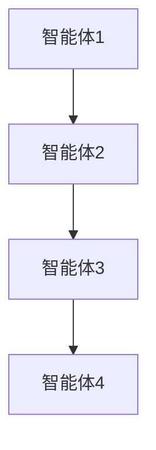
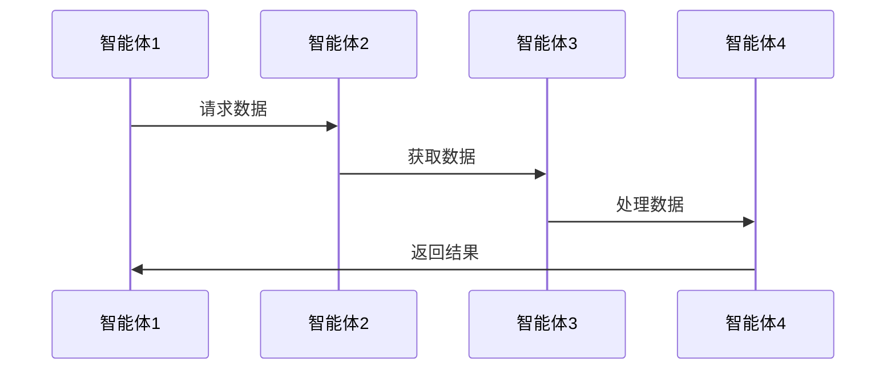

                 


# 多智能体系统在公司技术创新评估中的应用

## 关键词
- 多智能体系统 (Multi-Agent System)
- 技术创新评估
- 智能体协作
- 分布式计算
- 技术创新模型

## 摘要
多智能体系统（MAS）在技术创新评估中的应用，通过智能体的协作和分布式计算，提升了评估的效率和准确性。本文详细探讨了MAS的核心概念、技术创新评估的理论基础、MAS在评估中的具体应用，以及相关的算法原理和系统架构设计。通过实际案例分析，展示了MAS在技术创新评估中的优势，并提出了未来研究的方向。

---

# 第1章: 多智能体系统概述

## 1.1 多智能体系统的基本概念
### 1.1.1 多智能体系统的定义
多智能体系统（Multi-Agent System, MAS）是由多个智能体（Agent）组成的分布式系统，这些智能体通过协作完成特定任务。

### 1.1.2 多智能体系统的特征
| 特征 | 描述 |
|------|------|
| 分布性 | 智能体独立运行，协作完成任务 |
| 协作性 | 智能体之间通过通信和协商完成任务 |
| 自主性 | 智能体能够自主决策和行动 |

### 1.1.3 多智能体系统的分类
1. 基于智能体的结构：集中式、分布式、混合式
2. 基于智能体的类型：简单反应型、基于模型反应型、目标驱动型、效用驱动型

## 1.2 多智能体系统的组成与结构
### 1.2.1 智能体的基本组成
- 知识库：存储智能体的知识和经验
- 行为选择机制：根据当前状态选择最优行为
- 通信接口：与其他智能体或环境交互

### 1.2.2 多智能体系统的通信机制
- 通信协议：定义智能体间的信息交换格式
- 通信模型：发布-订阅模型、点对点模型

### 1.2.3 多智能体系统的协作机制
- 协作协议：定义协作规则和流程
- 协作任务分配：任务分解与分配

## 1.3 多智能体系统的应用领域
### 1.3.1 多智能体系统在企业管理中的应用
- 资源分配优化
- 项目管理协作

### 1.3.2 多智能体系统在技术创新评估中的应用
- 技术评估智能体构建
- 技术创新协作流程优化

### 1.3.3 其他典型应用领域
- 电子商务
- 智能交通系统

## 1.4 本章小结
多智能体系统通过智能体的协作和分布式计算，为技术创新评估提供了新的思路。下一章将探讨技术创新评估的基本理论。

---

# 第2章: 技术创新评估的基本理论

## 2.1 技术创新的定义与特征
### 2.1.1 技术创新的定义
技术创新是指通过引入新技术、新方法或新工艺，提高产品或服务的性能或效率。

### 2.1.2 技术创新的核心要素
- 技术可行性
- 市场需求性
- 经济效益

### 2.1.3 技术创新的驱动因素
- 市场需求
- 技术进步
- 竞争压力

## 2.2 技术创新评估的指标与方法
### 2.2.1 技术创新评估的指标体系
| 指标 | 描述 |
|------|------|
| 技术复杂度 | 技术实现的难度 |
| 创新性 | 技术的新颖程度 |
| 可行性 | 技术实现的可能性 |

### 2.2.2 技术创新评估的常用方法
1. 层次分析法（AHP）：用于权重计算
2. 模糊综合评价法：用于模糊评估

### 2.2.3 技术创新评估的挑战与难点
- 数据获取困难
- 评估指标的主观性
- 动态变化的环境

## 2.3 技术创新评估的模型构建
### 2.3.1 技术创新评估模型的基本框架
- 数据输入层：技术创新数据
- 指标计算层：计算各指标的权重和评分
- 结果输出层：生成评估结果

### 2.3.2 技术创新评估模型的构建步骤
1. 确定评估指标
2. 确定指标权重
3. 收集数据并计算评分
4. 综合评估结果

### 2.3.3 技术创新评估模型的验证与优化
- 通过实际案例验证模型的准确性
- 根据反馈优化模型参数

## 2.4 本章小结
技术创新评估需要综合考虑多个因素，下一章将探讨如何将多智能体系统应用于技术创新评估。

---

# 第3章: 多智能体系统在技术创新评估中的应用

## 3.1 多智能体系统与技术创新评估的结合
### 3.1.1 多智能体系统在技术创新评估中的优势
- 提高评估效率
- 增强评估准确性
- 适应动态变化

### 3.1.2 多智能体系统与技术创新评估的协同机制
- 智能体间的信息共享
- 协作任务分配

### 3.1.3 多智能体系统在技术创新评估中的应用场景
- 技术评估智能体构建
- 技术创新协作流程优化

## 3.2 多智能体系统在技术创新评估中的具体应用
### 3.2.1 技术创新评估的智能体构建
- 每个智能体负责特定指标的评估
- 智能体之间通过通信共享数据

### 3.2.2 技术创新评估的多智能体协作流程
1. 数据收集与预处理
2. 指标计算与评分
3. 结果汇总与输出

### 3.2.3 多智能体系统在技术创新评估中的实现
- 使用分布式计算技术
- 通过通信协议实现智能体间的协作

## 3.3 多智能体系统在技术创新评估中的优势分析
### 3.3.1 提高技术创新评估的效率
- 分布式计算减少计算时间
- 智能体协作提高数据处理能力

### 3.3.2 增强技术创新评估的准确性
- 多智能体协作减少人为误差
- 数据共享提高评估结果的全面性

### 3.3.3 促进技术创新评估的动态适应性
- 智能体自主学习适应环境变化
- 系统可以根据反馈实时调整评估策略

## 3.4 本章小结
多智能体系统通过协作和分布式计算，显著提升了技术创新评估的效率和准确性。下一章将详细讲解相关的算法原理。

---

# 第4章: 多智能体系统在技术创新评估中的算法原理

## 4.1 多智能体系统的核心算法
### 4.1.1 分布式计算算法
- 分布式任务分配算法
- 分布式数据处理算法

### 4.1.2 协作与通信算法
- 通信协议实现智能体间的信息交换
- 协作任务分配算法

### 4.1.3 学习与自适应算法
- 机器学习算法用于智能体的自主学习
- 自适应算法用于系统动态调整

## 4.2 技术创新评估的算法实现
### 4.2.1 层次分析法（AHP）的实现
- 通过智能体协作计算指标权重
- 使用分布式计算优化计算过程

### 4.2.2 模糊综合评价法的实现
- 智能体协作计算模糊评分
- 分布式计算优化模糊综合评价过程

## 4.3 数学公式
### 4.3.1 层次分析法（AHP）的公式
$$ A = \frac{a_{ij}}{a_{i1}} $$
其中，$a_{ij}$ 是比较矩阵中的元素，$a_{i1}$ 是第 $i$ 行的最大值。

### 4.3.2 模糊综合评价法的公式
$$ B = \sum_{j=1}^{n} w_j \cdot R_j $$
其中，$w_j$ 是第 $j$ 个指标的权重，$R_j$ 是第 $j$ 个指标的模糊评分。

## 4.4 本章小结
多智能体系统的算法原理为技术创新评估提供了理论基础。下一章将探讨系统的具体设计与实现。

---

# 第5章: 多智能体系统在技术创新评估中的系统设计

## 5.1 系统功能设计
### 5.1.1 系统功能模块
1. 数据输入模块：接收技术创新数据
2. 指标计算模块：计算各指标的评分
3. 评估结果输出模块：生成最终评估结果

### 5.1.2 系统功能流程
1. 数据预处理
2. 指标计算
3. 结果汇总

## 5.2 系统架构设计
### 5.2.1 系统架构图

### 5.2.2 系统交互流程


## 5.3 系统接口设计
### 5.3.1 系统接口定义
- 数据输入接口：接收技术创新数据
- 数据输出接口：输出评估结果

### 5.3.2 系统通信接口
- 使用RESTful API进行智能体间通信

## 5.4 本章小结
系统设计为多智能体系统在技术创新评估中的应用提供了具体的实现方案。下一章将通过实际案例展示系统的应用。

---

# 第6章: 项目实战

## 6.1 环境安装
### 6.1.1 系统环境要求
- 操作系统：Linux/Windows/MacOS
- 开发工具：Python/Java/Scala
- 依赖库：分布式计算框架（如Hadoop）、通信框架（如ZeroMQ）

### 6.1.2 环境配置步骤
1. 安装Python和必要的库
2. 配置分布式计算环境
3. 配置通信框架

## 6.2 系统核心实现
### 6.2.1 核心代码实现
```python
import zmq

context = zmq.Context()
socket = context.socket(zmq.PUBLISHER)
socket.bind("tcp://*:5555")

while True:
    data = input("Enter message: ")
    socket.send_string(data)
```

### 6.2.2 代码应用解读与分析
- 代码实现了一个简单的智能体通信模块
- 使用ZeroMQ作为通信框架

## 6.3 实际案例分析
### 6.3.1 案例背景
- 某公司需要评估一项新技术的创新性
- 使用多智能体系统进行评估

### 6.3.2 案例分析与详细讲解
1. 数据收集与预处理
2. 指标计算与评分
3. 结果汇总与输出

## 6.4 本章小结
通过实际案例展示了多智能体系统在技术创新评估中的具体应用。最后一章将总结全文并提出未来的研究方向。

---

# 第7章: 总结与展望

## 7.1 本章总结
多智能体系统通过协作和分布式计算，显著提升了技术创新评估的效率和准确性。

## 7.2 最佳实践 tips
1. 在实际应用中，合理选择智能体的数量和类型
2. 确保智能体之间的通信效率
3. 定期更新智能体的知识库和算法

## 7.3 小结
多智能体系统在技术创新评估中的应用前景广阔，未来可以进一步研究智能体的自主学习和自适应能力。

## 7.4 注意事项
- 确保系统的安全性和稳定性
- 定期维护和优化系统

## 7.5 拓展阅读
- 推荐阅读相关领域的书籍和论文
- 关注多智能体系统的最新研究进展

---

# 附录: 参考文献

## 附录 A: 关键术语解释
- 多智能体系统（MAS）：由多个智能体组成的分布式系统
- 技术创新评估：对新技术的创新性、可行性和经济效益进行评估

## 附录 B: 算法实现细节
- 详细描述层次分析法和模糊综合评价法的实现步骤

## 附录 C: 系统架构图
- 展示系统的详细架构图和交互流程图

---

# 结束语

通过本文的详细讲解，读者可以全面了解多智能体系统在公司技术创新评估中的应用。希望本文能为相关领域的研究和实践提供有价值的参考。

