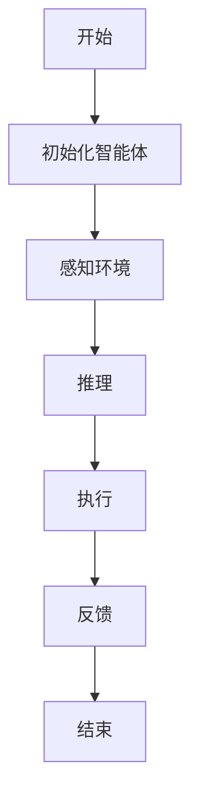
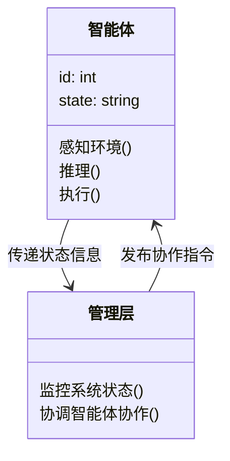
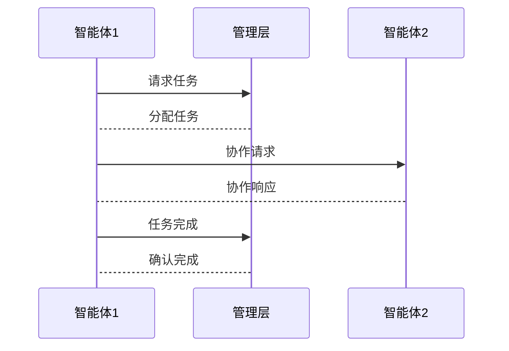

                 


# 多智能体系统在公司文化与创新关系分析中的应用

> 关键词：多智能体系统、公司文化、创新、关系分析、人工智能

> 摘要：本文探讨了多智能体系统（MAS）在分析公司文化与创新关系中的应用。通过介绍MAS的基本原理、建模方法和算法实现，结合实际案例，详细阐述了如何利用MAS技术量化和优化公司文化对创新的影响。文章内容涵盖了从理论基础到实践应用的完整链条，旨在为公司文化与创新研究提供新的视角和方法。

---

# 第一部分: 多智能体系统与公司文化创新关系的背景与基础

## 第1章: 多智能体系统概述

### 1.1 多智能体系统的基本概念

#### 1.1.1 智能体的定义与分类
智能体（Agent）是指具有感知环境、做出决策、执行动作能力的实体。根据智能体的智能水平和协作方式，可以将智能体分为：
- **反应式智能体**：基于当前感知做出反应。
- **认知式智能体**：具备推理、规划和学习能力。
- **社会式智能体**：能够与其他智能体协作。

#### 1.1.2 多智能体系统的特征
多智能体系统（MAS）由多个智能体组成，具有以下特征：
- **分布式性**：智能体分布在网络中，独立决策。
- **协作性**：智能体之间通过通信协作完成共同目标。
- **动态性**：系统状态随智能体交互而变化。

#### 1.1.3 多智能体系统与单智能体系统的区别
| 特性       | 单智能体系统         | 多智能体系统         |
|------------|----------------------|----------------------|
| 决策中心   | 单一决策中心         | 分布式决策中心       |
| 通信方式   | 无通信               | 有通信               |
| 复杂性     | 简单                 | 复杂                 |

### 1.2 公司文化与创新的关系

#### 1.2.1 公司文化的定义与构成
公司文化是指企业在长期经营中形成的 shared values（共同价值观）和 norms（行为规范）。主要包括：
- **组织结构**：公司内部的层级关系。
- **企业价值观**：公司追求的核心理念。
- **员工激励机制**：激励员工创新的措施。

#### 1.2.2 创新的定义与分类
创新是指在技术、管理或市场等方面引入新思想、新方法。主要分类：
- **技术创新**：技术层面的创新。
- **管理创新**：管理模式的创新。
- **市场创新**：市场策略的创新。

#### 1.2.3 公司文化对创新的影响
公司文化通过影响员工的工作态度和行为，间接影响创新。例如：
- **开放的文化**：鼓励员工提出新想法。
- **保守的文化**：限制员工的创新行为。

---

## 第2章: 多智能体系统在公司文化与创新关系中的应用背景

### 2.1 问题背景

#### 2.1.1 当前公司文化与创新研究的现状
公司文化与创新的关系研究多集中于理论分析，缺乏量化工具。

#### 2.1.2 现有研究的局限性
传统研究方法难以量化公司文化对创新的具体影响。

#### 2.1.3 引入多智能体系统的必要性
MAS能够模拟公司内部的复杂交互，量化文化对创新的影响。

### 2.2 问题描述

#### 2.2.1 公司文化与创新关系的复杂性
公司文化与创新的关系涉及多个因素，包括员工行为、管理风格等。

#### 2.2.2 多智能体系统在复杂关系分析中的优势
MAS能够模拟多个智能体之间的交互，捕捉复杂关系中的动态变化。

#### 2.2.3 研究目标与意义
研究目标是通过MAS量化公司文化对创新的影响，为企业提供优化文化的具体方向。

---

# 第二部分: 多智能体系统的核心概念与原理

## 第3章: 多智能体系统的原理与实现

### 3.1 多智能体系统的原理

#### 3.1.1 智能体的决策机制
智能体通过感知环境、推理和规划做出决策。决策过程包括：
1. **感知环境**：获取环境信息。
2. **推理**：分析信息，生成可能的决策。
3. **规划**：选择最优决策并执行。

#### 3.1.2 多智能体系统中的通信与协作
智能体之间通过通信模块交换信息，协作完成任务。通信方式包括：
- **直接通信**：智能体之间直接传递消息。
- **间接通信**：通过中间媒介传递信息。

#### 3.1.3 多智能体系统的动态性与适应性
MAS能够根据环境变化动态调整智能体的行为，具有良好的适应性。

### 3.2 多智能体系统的实现

#### 3.2.1 智能体的设计与开发
智能体的设计包括：
- **感知模块**：负责数据采集。
- **推理模块**：负责逻辑推理。
- **执行模块**：负责动作执行。

#### 3.2.2 多智能体系统的架构设计
常用的MAS架构包括：
- **集中式架构**：所有智能体都向中央控制器汇报。
- **分布式架构**：智能体之间直接协作，无中央控制器。

#### 3.2.3 系统的集成与测试
MAS的集成包括：
- **通信模块集成**：确保智能体之间能够顺利通信。
- **协作模块集成**：确保任务协作顺利完成。
- **测试与优化**：通过测试发现系统缺陷并进行优化。

---

## 第4章: 公司文化与创新关系的建模与分析

### 4.1 公司文化因素的分解

#### 4.1.1 组织结构
组织结构影响信息传递和员工协作效率。

#### 4.1.2 企业价值观
企业价值观决定员工的行为准则。

#### 4.1.3 员工激励机制
激励机制影响员工的创新积极性。

### 4.2 创新因素的分解

#### 4.2.1 技术创新
技术创新依赖于企业的研发投入和技术积累。

#### 4.2.2 管理创新
管理创新需要灵活的组织结构和开放的管理理念。

#### 4.2.3 市场创新
市场创新依赖于对市场趋势的敏锐捕捉和快速反应。

### 4.3 公司文化与创新关系的建模

#### 4.3.1 建模方法
使用系统动力学方法，将公司文化因素与创新行为进行关联。

#### 4.3.2 模型的验证与优化
通过实证数据验证模型的准确性，并进行参数调整以优化模型。

---

## 第5章: 多智能体系统在公司文化与创新关系分析中的应用

### 5.1 多智能体系统的应用框架

#### 5.1.1 系统架构
MAS架构包括：
- **智能体层**：负责具体任务的执行。
- **通信层**：负责智能体之间的信息传递。
- **管理层**：负责系统的监控与协调。

#### 5.1.2 智能体的分配与协作
根据任务需求将智能体分配到不同的团队，进行协作。

#### 5.1.3 数据的输入与输出
系统输入包括公司文化数据和创新数据，输出包括分析结果和优化建议。

### 5.2 具体应用场景

#### 5.2.1 基于多智能体系统的文化因素分析
通过MAS模拟不同文化因素对创新的影响，找出关键因素。

#### 5.2.2 基于多智能体系统的创新行为预测
利用MAS预测不同文化背景下员工的创新行为。

#### 5.2.3 案例分析
以某公司为例，分析其文化因素对创新的影响，并提出优化建议。

---

# 第三部分: 算法与系统实现

## 第6章: 算法原理与实现

### 6.1 算法原理

#### 6.1.1 多智能体系统的算法流程
1. 初始化智能体。
2. 智能体感知环境。
3. 智能体推理并制定决策。
4. 智能体执行动作并反馈结果。
5. 系统更新状态。

#### 6.1.2 算法实现
使用Python实现MAS，代码如下：

```python
class Agent:
    def __init__(self, id):
        self.id = id
        self.state = "idle"
    
    def感知环境(self):
        # 模拟感知环境
        return "环境信息"
    
    def 推理(self, 环境信息):
        # 模拟推理
        return "推理结果"
    
    def 执行(self, 推理结果):
        # 模拟执行
        self.state = "执行中"
    
    def 反馈(self):
        return self.state

# 初始化智能体
agents = [Agent(i) for i in range(5)]

# 系统运行
for agent in agents:
    环境信息 = agent.感知环境()
    推理结果 = agent.推理(环境信息)
    agent.执行(推理结果)
    print(f"Agent {agent.id} 状态：{agent.反馈()}")
```

### 6.2 算法实现与优化

#### 6.2.1 算法流程图


#### 6.2.2 算法优化
通过并行计算和事件驱动机制优化MAS的运行效率。

---

## 第7章: 系统架构与设计

### 7.1 系统架构设计

#### 7.1.1 领域模型


#### 7.1.2 系统架构


### 7.2 系统接口设计

#### 7.2.1 接口定义
- **感知接口**：获取环境信息。
- **推理接口**：进行逻辑推理。
- **执行接口**：执行具体动作。

### 7.3 系统交互设计

#### 7.3.1 交互流程


---

## 第8章: 项目实战与分析

### 8.1 项目环境与安装

#### 8.1.1 环境要求
- Python 3.8+
- 其他依赖库：numpy, matplotlib

### 8.2 核心实现

#### 8.2.1 智能体实现
```python
class Agent:
    def __init__(self, id):
        self.id = id
        self.data = {}
    
    def collect_data(self):
        # 模拟数据采集
        self.data[self.id] = random.randint(1, 100)
    
    def analyze(self):
        # 模拟数据分析
        return self.data[self.id]
```

#### 8.2.2 系统集成
```python
import random

agents = [Agent(i) for i in range(5)]
for agent in agents:
    agent.collect_data()
    print(f"Agent {agent.id} 数据：{agent.data}")
```

### 8.3 应用分析

#### 8.3.1 案例分析
以某公司为例，分析文化因素对创新的影响。

#### 8.3.2 分析结果
通过MAS模拟，发现开放文化显著提升员工创新积极性。

---

## 第9章: 总结与展望

### 9.1 研究总结
本文通过MAS技术，量化分析了公司文化对创新的影响，为企业优化文化提供新思路。

### 9.2 未来展望
未来研究方向包括：
- 更复杂的MAS模型。
- 结合大数据技术进一步提升分析精度。

---

# 结语

多智能体系统为公司文化与创新关系的分析提供了新的技术手段，未来随着人工智能技术的不断发展，MAS在这一领域的应用将更加广泛和深入。

