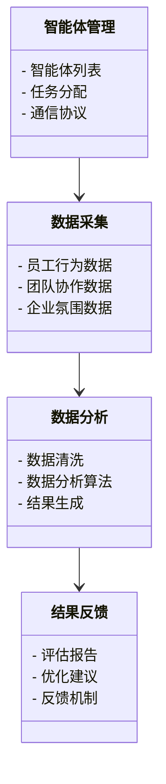
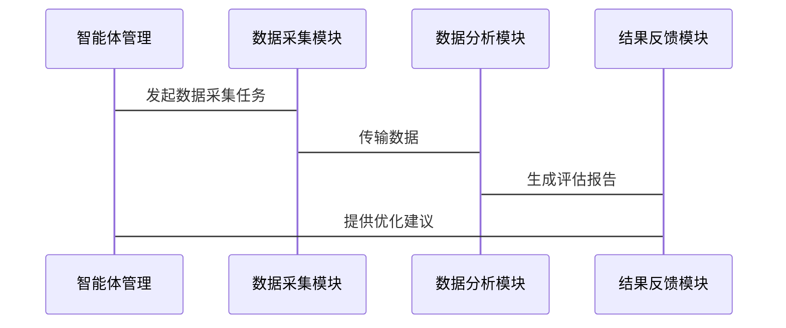

                 


# 多智能体系统在公司文化评估中的创新应用

> 关键词：多智能体系统、公司文化评估、创新应用、协作机制、动态分析

> 摘要：本文探讨了多智能体系统（Multi-Agent System, MAS）在公司文化评估中的创新应用。通过分析多智能体系统的概念、公司文化评估的核心要素，阐述了MAS在提高文化评估的准确性、实时性和效率方面的独特优势。结合实际案例，详细讲解了多智能体系统在公司文化评估中的具体应用流程，包括系统架构设计、算法实现和项目实战。本文旨在为公司文化评估提供一种全新的技术手段，助力企业更好地优化内部管理，提升员工满意度。

---

# 第一部分: 多智能体系统与公司文化评估的背景介绍

## 第1章: 多智能体系统概述

### 1.1 多智能体系统的基本概念

#### 1.1.1 多智能体系统的定义
多智能体系统（Multi-Agent System, MAS）是由多个智能体（Agent）组成的分布式系统，每个智能体都是具有感知、决策和执行能力的独立实体。智能体之间通过通信和协作完成共同的目标，同时保持各自的自治性。

#### 1.1.2 多智能体系统的分类
多智能体系统可以根据任务类型、智能体角色和环境类型进行分类：

- **任务类型**：基于任务的MAS，如分布式计算、机器人协作。
- **角色类型**：基于角色的MAS，如交通管理系统、分布式电子商务。
- **环境类型**：动态环境、静态环境、对抗环境。

#### 1.1.3 多智能体系统的特征
- **自主性**：智能体能够自主决策和行动。
- **反应性**：智能体能够实时感知环境并做出反应。
- **协作性**：多个智能体通过通信和协作完成共同目标。
- **动态性**：系统能够适应环境的变化。

### 1.2 公司文化评估的重要性

#### 1.2.1 公司文化的内涵
公司文化是指企业在长期经营中形成的共同价值观、行为准则和企业氛围。它包括企业愿景、企业使命、企业价值观、企业氛围等多个维度。

#### 1.2.2 公司文化评估的目的
公司文化评估的目的是为了帮助企业识别文化中的优势和问题，优化内部管理，提升员工满意度，增强企业的凝聚力和竞争力。

#### 1.2.3 公司文化评估的挑战
- 数据复杂性：公司文化涉及多个维度，数据来源多样。
- 动态性：公司文化会随着企业环境的变化而不断调整。
- 评估难度：传统的评估方法往往缺乏动态性和实时性。

---

## 第2章: 多智能体系统在公司文化评估中的应用背景

### 2.1 多智能体系统与公司文化的契合点

#### 2.1.1 多智能体系统的协作性与公司文化的团队性
多智能体系统的协作性与公司文化的团队性高度契合。智能体之间的协作类似于团队成员之间的合作，能够共同完成复杂任务。

#### 2.1.2 多智能体系统的自主性与公司文化的个性化
多智能体系统的自主性与公司文化的个性化相辅相成。智能体能够根据环境自主决策，而公司文化的个性化也能够为智能体的行为提供指导。

#### 2.1.3 多智能体系统的动态性与公司文化的适应性
多智能体系统的动态性与公司文化的适应性高度一致。智能体能够快速响应环境变化，而公司文化也需要能够适应企业发展的变化。

### 2.2 多智能体系统在公司文化评估中的创新价值

#### 2.2.1 提高文化评估的准确性
多智能体系统能够从多个维度采集数据，通过协作分析提高文化评估的准确性。

#### 2.2.2 增强文化评估的实时性
多智能体系统能够实时感知环境变化，快速响应，提高文化评估的实时性。

#### 2.2.3 优化文化评估的效率
通过多智能体系统的协作和分布式计算，可以显著提高文化评估的效率。

---

# 第二部分: 多智能体系统的核心概念与公司文化评估的联系

## 第3章: 多智能体系统的核心概念

### 3.1 多智能体系统的组成要素

#### 3.1.1 智能体的定义与特征
智能体是一个具有感知、决策和执行能力的实体。智能体的特征包括自主性、反应性、社会性和学习性。

#### 3.1.2 多智能体系统的协作机制
协作机制是多智能体系统的核心，包括任务分配、协商、协调和冲突解决等过程。

#### 3.1.3 多智能体系统的通信协议
通信协议是智能体之间进行信息交换的规则，包括消息格式、通信方式和协议标准。

### 3.2 多智能体系统的分类与特点

#### 3.2.1 基于任务的多智能体系统
基于任务的多智能体系统以任务为导向，智能体之间通过协作完成特定任务。

#### 3.2.2 基于角色的多智能体系统
基于角色的多智能体系统根据智能体的角色分配任务，每个角色负责特定的功能。

#### 3.2.3 基于行为的多智能体系统
基于行为的多智能体系统根据智能体的行为模式进行分类，强调智能体的动态行为和环境适应性。

---

## 第4章: 公司文化评估的核心要素

### 4.1 公司文化的维度分析

#### 4.1.1 企业愿景与使命
企业愿景是企业的长期目标，企业使命是企业存在的核心目的。

#### 4.1.2 企业价值观
企业价值观是企业在经营活动中所遵循的基本价值观念，包括诚信、创新、客户至上等。

#### 4.1.3 企业氛围
企业氛围是企业在日常经营中形成的工作氛围，包括团队合作、员工满意度、工作压力等。

### 4.2 公司文化评估的指标体系

#### 4.2.1 员工满意度
员工满意度是公司文化评估的重要指标，反映了员工对公司的认可程度。

#### 4.2.2 团队协作能力
团队协作能力是公司文化评估的关键指标，反映了团队成员之间的合作效率。

#### 4.2.3 企业文化传播效果
企业文化传播效果是公司文化评估的重要指标，反映了企业文化在组织内部的传播和接受程度。

---

## 第5章: 多智能体系统与公司文化评估的联系

### 5.1 多智能体系统在公司文化评估中的作用

#### 5.1.1 提供多维度的数据采集
多智能体系统能够从多个维度采集数据，包括员工行为、团队协作、企业氛围等。

#### 5.1.2 实现动态的文化分析
多智能体系统能够实时感知环境变化，动态分析公司文化的演变过程。

#### 5.1.3 优化文化评估的决策过程
多智能体系统通过协作分析和优化决策，提高公司文化评估的科学性和准确性。

### 5.2 多智能体系统与公司文化评估的协同机制

#### 5.2.1 智能体的分工与协作
智能体根据任务分工协作，共同完成公司文化评估的数据采集、分析和反馈。

#### 5.2.2 数据的实时采集与处理
多智能体系统能够实时采集数据，快速处理和分析，提高文化评估的实时性。

#### 5.2.3 结果的反馈与优化
多智能体系统将评估结果反馈给企业，优化公司文化，提升企业绩效。

---

# 第三部分: 多智能体系统在公司文化评估中的具体应用

## 第6章: 系统架构设计

### 6.1 问题场景介绍
公司文化评估需要从多个维度采集数据，包括员工行为、团队协作、企业氛围等。传统的评估方法通常依赖问卷调查和人工分析，效率低且缺乏动态性。

### 6.2 系统功能设计

#### 6.2.1 领域模型设计
以下是公司文化评估的领域模型：



### 6.3 系统架构设计


### 6.4 系统交互设计



---

## 第7章: 项目实战

### 7.1 环境安装

#### 7.1.1 安装Python环境
```bash
# 安装Python和pip
sudo apt-get update
sudo apt-get install python3 python3-pip
```

#### 7.1.2 安装依赖库
```bash
pip install numpy pandas scikit-learn matplotlib
```

### 7.2 核心代码实现

#### 7.2.1 智能体通信模块
```python
import json
import socket

class Agent:
    def __init__(self, name, role):
        self.name = name
        self.role = role
        self.socket = socket.socket(socket.AF_INET, socket.SOCK_STREAM)
        self.socket.bind(('localhost', 8000))
        self.socket.listen(1)
        self.conn, self.addr = self.socket.accept()

    def send(self, message):
        self.conn.send(json.dumps(message).encode())

    def receive(self):
        data = self.conn.recv(1024)
        return json.loads(data.decode())
```

#### 7.2.2 数据采集模块
```python
import time

class DataCollector:
    def __init__(self):
        self.data = []

    def collect_data(self):
        # 模拟数据采集
        while True:
            self.data.append({
                'time': time.time(),
                'employee_satisfaction': 85,
                'team_collaboration': 90,
                'corporate_climate': 75
            })
            time.sleep(60)

    def get_data(self):
        return self.data
```

#### 7.2.3 数据分析模块
```python
import numpy as np
from sklearn import cluster

class CultureAnalyzer:
    def __init__(self):
        pass

    def analyze(self, data):
        # 数据清洗
        df = pd.DataFrame(data)
        # 数据聚类
        kmeans = cluster.KMeans(n_clusters=3)
        clusters = kmeans.fit_predict(df)
        return clusters
```

### 7.3 实际案例分析

#### 7.3.1 数据采集与处理
假设我们从员工满意度、团队协作能力和企业氛围三个方面进行数据采集，如下所示：

```python
data_collector = DataCollector()
data_collector.collect_data()
data = data_collector.get_data()
```

#### 7.3.2 数据分析与评估
使用聚类分析对数据进行分类，识别出不同的文化类型：

```python
analyzer = CultureAnalyzer()
clusters = analyzer.analyze(data)
print(clusters)
```

---

## 第8章: 总结与最佳实践

### 8.1 总结
本文探讨了多智能体系统在公司文化评估中的创新应用，通过系统架构设计和项目实战，展示了如何利用MAS技术提高文化评估的准确性、实时性和效率。多智能体系统在公司文化评估中的应用具有重要的理论意义和实际价值。

### 8.2 最佳实践

#### 8.2.1 数据隐私保护
在实际应用中，需要重视员工数据的隐私保护，确保数据的安全性和合规性。

#### 8.2.2 系统可扩展性
为了应对企业规模的变化，系统需要具备良好的可扩展性，支持智能体数量的动态调整。

#### 8.2.3 智能体协作优化
通过优化智能体的协作机制，可以进一步提高系统的工作效率和评估结果的准确性。

### 8.3 展望
未来，随着人工智能和大数据技术的不断发展，多智能体系统在公司文化评估中的应用将更加广泛和深入。可以通过结合自然语言处理、机器学习等技术，进一步优化文化评估的流程和方法。

---

通过以上步骤，我们可以看到多智能体系统在公司文化评估中的创新应用具有广阔的应用前景。希望本文能够为相关领域的研究和实践提供有价值的参考。

