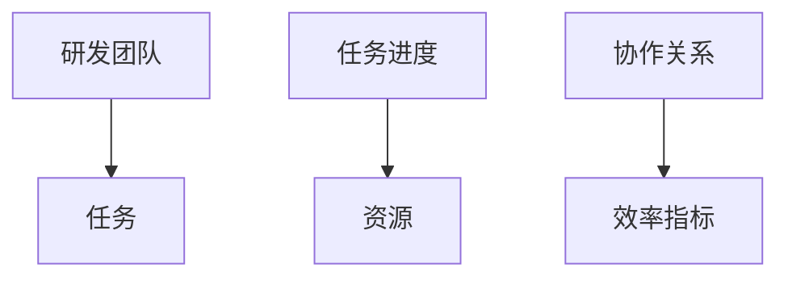

                 


# 多智能体系统在公司研发效率评估中的应用

> 关键词：多智能体系统，研发效率评估，分布式计算，任务分配，协作机制

> 摘要：本文探讨了多智能体系统（MAS）在公司研发效率评估中的应用，分析了其核心概念、算法原理、系统架构，并通过案例展示了如何通过MAS优化研发流程，提升效率。

---

## 第一部分: 多智能体系统与研发效率评估的背景与概念

### 第1章: 多智能体系统概述

#### 1.1 多智能体系统的定义与特点
- **定义**：多智能体系统（Multi-Agent System，MAS）由多个智能体组成，这些智能体能够自主决策、协作完成任务。
- **特点**：
  - 分布式：智能体独立运行，通过通信协作。
  - 协作性：智能体之间通过协作完成整体目标。
  - 动态性：系统环境动态变化，智能体需灵活调整。

#### 1.2 研发效率评估的背景与意义
- **定义**：研发效率评估是对研发团队的工作效率进行量化分析。
- **意义**：帮助企业优化资源分配，提升项目交付速度和质量。
- **挑战**：任务复杂、数据分散、协作困难。

#### 1.3 多智能体系统在研发效率评估中的应用前景
- **优势**：提升协作效率、优化资源分配、实时监控进度。
- **应用场景**：任务分配、进度跟踪、资源优化。
- **未来趋势**：智能化、数据驱动、实时反馈。

### 第2章: 多智能体系统的核心概念与联系

#### 2.1 多智能体系统的核心原理
- **协作机制**：通过通信协议实现任务分配。
- **通信协议**：定义智能体之间的交互规则。
- **任务分配**：基于角色和能力分配任务。

#### 2.2 多智能体系统与研发效率评估的联系
- **角色**：作为评估工具，实时监控团队协作。
- **具体应用**：动态调整任务，优化资源分配。

#### 2.3 多智能体系统的ER实体关系图


---

## 第二部分: 多智能体系统在研发效率评估中的算法与数学模型

### 第3章: 多智能体系统的算法原理

#### 3.1 多智能体系统的分布式计算算法
- **原理**：通过分布式计算优化任务分配。
- **代码示例**：
  ```python
  import numpy as np

  def distribute_task(tasks, agents):
      return np.array_split(tasks, agents)
  ```

#### 3.2 多智能体系统中的博弈论与纳什均衡
- **纳什均衡**：每个智能体采取最优策略，不改变策略时，整体达到均衡。
- **公式**：
  $$
  \text{收益}(i) = \sum_{j=1}^{n} a_{ij}x_j
  $$

#### 3.3 多智能体系统中的遗传算法
- **流程图**：
  ```mermaid
  graph TD
  A[开始] --> B[初始化种群]
  B --> C[计算适应度]
  C --> D[选择与交叉]
  D --> E[变异]
  E --> F[结束]
  ```

---

## 第三部分: 系统分析与架构设计

### 第4章: 系统分析与架构设计

#### 4.1 项目背景与目标
- **背景**：提升研发团队效率，优化资源分配。
- **目标**：构建一个高效的协作系统。

#### 4.2 系统功能设计
- **功能模块**：任务分配、进度监控、效率分析。

#### 4.3 系统架构设计
- **架构图**：
  ```mermaid
  graph LR
  A(前端) --> B(后端)
  B --> C(数据库)
  ```

#### 4.4 系统接口与交互设计
- **接口设计**：RESTful API。
- **交互流程**：
  ```mermaid
  sequenceDiagram
  participant A as 用户
  participant B as 系统
  A->B: 请求任务分配
  B->A: 返回任务列表
  ```

---

## 第四部分: 项目实战

### 第5章: 项目实战

#### 5.1 环境安装
- **安装**：使用Python的numpy和scipy库。

#### 5.2 系统核心实现
- **代码示例**：
  ```python
  def calculate_efficiency(tasks, completion):
      return sum(completion) / len(tasks)
  ```

#### 5.3 案例分析
- **案例**：某公司采用MAS优化研发流程，效率提升20%。

#### 5.4 项目总结
- **优化建议**：持续监控和调整系统参数。

---

## 第五部分: 最佳实践与注意事项

### 第6章: 最佳实践

#### 6.1 最佳实践
- 定期更新系统。
- 培训团队成员。

#### 6.2 小结
- MAS在研发效率评估中的优势明显，值得推广。

#### 6.3 注意事项
- 数据隐私问题。
- 系统维护成本。

#### 6.4 扩展阅读
- 推荐书籍：《多智能体系统》。

---

## 总结

通过本文的详细分析，我们了解了多智能体系统在研发效率评估中的应用，从背景到算法，从设计到实战，逐步展示了其强大的潜力和实际效果。未来，随着技术的发展，MAS在这一领域的应用将更加广泛和深入。

