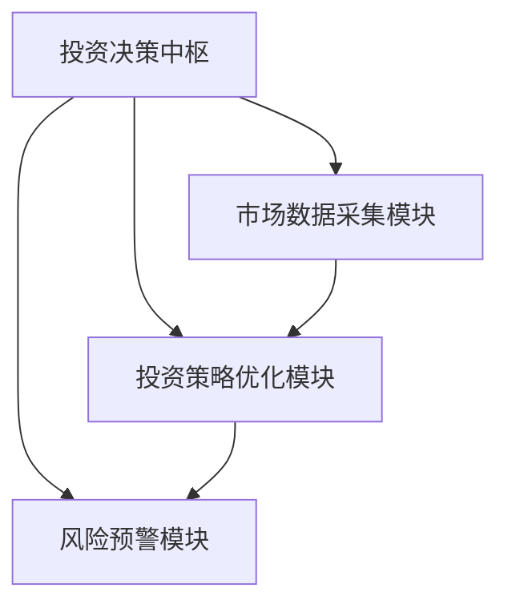
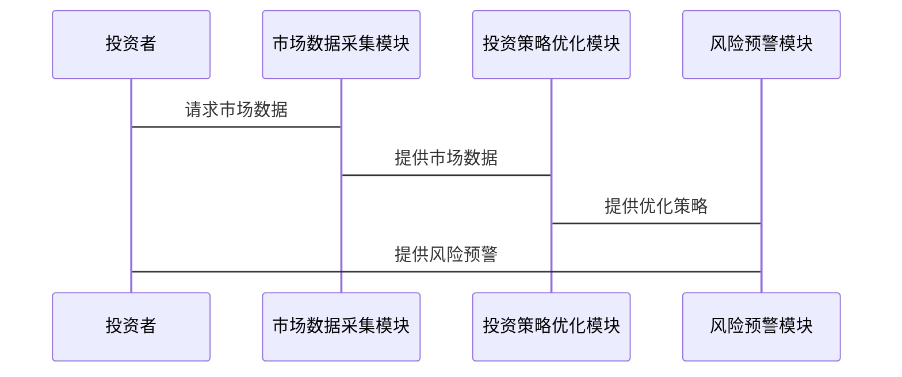

                 


# 多智能体系统在周期性行业投资中的应用

> **关键词**：多智能体系统，周期性行业，投资，分布式计算，博弈论，机器学习

> **摘要**：多智能体系统（Multi-Agent System, MAS）作为一种新兴的分布式计算范式，在金融投资领域展现出了巨大的潜力。本文重点探讨多智能体系统在周期性行业投资中的应用，从理论基础到算法实现，再到实际案例，系统性地分析其在投资决策中的优势与挑战。通过构建多智能体系统模型，结合周期性行业的特点，提出了一种基于分布式计算和博弈论的多智能体投资策略，为投资者提供了新的思路和解决方案。

---

## 第1章: 多智能体系统与周期性行业投资概述

### 1.1 多智能体系统的定义与特点
#### 1.1.1 多智能体系统的定义
多智能体系统（Multi-Agent System, MAS）是由多个智能体（Agent）组成的分布式系统，每个智能体能够独立感知环境、自主决策并与其他智能体协作完成目标。多智能体系统的智能体具有主动性、反应性和社会性特点。

#### 1.1.2 多智能体系统的核心特点
1. **分布式性**：智能体之间通过通信协作完成任务，没有中央控制节点。
2. **自主性**：每个智能体都能独立决策，无需外部干预。
3. **协作性**：智能体之间通过协作实现整体目标，而非单个智能体的简单叠加。
4. **动态性**：智能体能够根据环境变化自适应调整行为。

#### 1.1.3 多智能体系统与传统单智能体系统的区别
| 特性             | 多智能体系统（MAS）                 | 单智能体系统（SAS）                 |
|------------------|------------------------------------|------------------------------------|
| 决策机制         | 分布式决策，多个智能体协作         | 集中式决策，单个智能体执行         |
| 可扩展性         | 支持大规模扩展，增加智能体数量     | 扩展性有限，难以处理复杂任务       |
| 应用场景         | 适合复杂、动态的分布式任务         | 适合简单、静态的任务               |

### 1.2 周期性行业的特点与投资挑战
#### 1.2.1 周期性行业的定义与分类
周期性行业是指其需求与经济周期密切相关的行业，通常分为强周期性和弱周期性行业。强周期性行业（如能源、材料）受经济波动影响较大，而弱周期性行业（如医疗、公用事业）受经济波动影响较小。

#### 1.2.2 周期性行业的波动性与投资机会
1. **波动性**：周期性行业的市场需求波动较大，价格波动也较为剧烈。
2. **投资机会**：在经济周期的不同阶段，周期性行业可能会出现超额收益。

#### 1.2.3 周期性行业投资中的主要挑战
1. **市场波动性高**：周期性行业的价格波动较大，增加了投资决策的难度。
2. **信息不完全**：投资者难以准确预测市场波动，导致决策风险高。
3. **复杂性**：周期性行业的投资需要综合考虑宏观经济、行业趋势和公司基本面等多个因素。

### 1.3 多智能体系统在投资中的应用前景
#### 1.3.1 多智能体系统在金融投资中的优势
1. **分布式计算能力**：多智能体系统能够同时处理大量数据，提高计算效率。
2. **协作性**：智能体之间可以协作，共同完成复杂的投资任务。
3. **适应性**：智能体能够自适应市场变化，优化投资策略。

#### 1.3.2 多智能体系统在周期性行业投资中的潜在应用
1. **市场预测**：通过多个智能体协作，提高市场预测的准确性。
2. **投资组合优化**：利用多智能体系统的协作性，优化投资组合的收益与风险比。
3. **风险管理**：通过智能体实时监控市场变化，及时发现并应对风险。

#### 1.3.3 多智能体系统投资的未来发展趋势
1. **智能化**：多智能体系统将更加智能化，能够自主学习和优化。
2. **实时性**：多智能体系统将实现实时决策，提高投资效率。
3. **跨领域应用**：多智能体系统将应用于更多领域，如能源、医疗等。

## 1.4 本章小结
本章介绍了多智能体系统的基本概念和特点，分析了周期性行业的特点和投资挑战，最后探讨了多智能体系统在投资中的应用前景。通过本章的分析，我们可以看到，多智能体系统在周期性行业投资中具有重要的应用价值。

---

## 第2章: 多智能体系统的核心概念与联系

### 2.1 多智能体系统的组成与结构
#### 2.1.1 多智能体系统的组成要素
1. **智能体**：智能体是多智能体系统的最小单位，能够独立决策和行动。
2. **环境**：智能体所处的外部环境，包括市场、数据源等。
3. **通信机制**：智能体之间通信的规则和协议。
4. **协作协议**：智能体协作完成任务的规则和策略。

#### 2.1.2 多智能体系统的层次结构
- **物理层**：智能体与环境交互的物理载体。
- **逻辑层**：智能体的逻辑结构和算法实现。
- **应用层**：智能体协作完成的具体任务和应用。

#### 2.1.3 多智能体系统与传统单智能体系统的区别
- **智能体数量**：多智能体系统有多个智能体，而单智能体系统只有一个。
- **协作性**：多智能体系统强调协作，而单智能体系统强调独立性。
- **复杂性**：多智能体系统更复杂，需要考虑智能体之间的协作和通信。

### 2.2 多智能体系统与周期性行业投资的关系
#### 2.2.1 多智能体系统在投资决策中的作用
1. **数据处理**：多智能体系统能够快速处理大量数据，提供实时分析。
2. **决策支持**：通过协作，多智能体系统能够提供更准确的投资决策支持。
3. **风险管理**：多智能体系统能够实时监控市场变化，及时发现并应对风险。

#### 2.2.2 多智能体系统如何应对周期性行业的波动性
1. **动态调整**：智能体能够根据市场变化动态调整投资策略。
2. **协作优化**：通过协作，智能体能够优化投资组合，降低风险。
3. **信息共享**：智能体之间可以共享信息，提高决策的准确性。

#### 2.2.3 多智能体系统在投资组合优化中的应用
1. **分散投资**：通过多个智能体协作，分散投资风险。
2. **动态优化**：根据市场变化，动态优化投资组合。
3. **实时监控**：实时监控市场变化，及时调整投资策略。

### 2.3 多智能体系统的核心原理
#### 2.3.1 分布式计算与协作机制
- **分布式计算**：多智能体系统通过分布式计算实现任务的分解和协作。
- **协作机制**：智能体之间通过通信和协作完成任务。

#### 2.3.2 博弈论与多智能体决策
- **博弈论**：研究智能体之间的策略互动，帮助智能体做出最优决策。
- **纳什均衡**：多个智能体在博弈中达到的稳定状态，即每个智能体都无法通过单方面改变策略而受益。

#### 2.3.3 自适应与学习机制
- **自适应**：智能体能够根据环境变化自适应调整行为。
- **机器学习**：智能体通过机器学习算法，提高决策的准确性和效率。

### 2.4 本章小结
本章详细介绍了多智能体系统的核心概念和结构，分析了多智能体系统与周期性行业投资的关系，最后探讨了多智能体系统的核心原理。通过本章的分析，我们可以更好地理解多智能体系统在投资中的应用。

---

## 第3章: 多智能体系统的算法原理

### 3.1 多智能体系统的分布式计算算法
#### 3.1.1 分布式计算的基本原理
- **任务分解**：将整体任务分解为多个子任务，分配给不同的智能体。
- **通信与协作**：智能体之间通过通信协作完成任务。

#### 3.1.2 多智能体系统的通信协议
- **通信模型**：智能体之间的通信模型，如发布-订阅模型。
- **通信协议**：智能体之间通信的规则和协议。

#### 3.1.3 分布式算法的实现步骤
1. **任务分解**：将整体任务分解为多个子任务。
2. **智能体分配**：将子任务分配给不同的智能体。
3. **通信与协作**：智能体之间通过通信协作完成任务。
4. **结果汇总**：将各智能体的结果汇总，得到最终结果。

#### 3.1.4 分布式算法的优缺点
- **优点**：提高计算效率，增强系统的容错性和可扩展性。
- **缺点**：通信开销大，协调复杂。

### 3.2 多智能体系统的博弈论模型
#### 3.2.1 博弈论的基本概念
- **参与者**：博弈中的决策者，即智能体。
- **策略**：参与者为达到目标所采取的行动。
- **收益**：参与者采取策略后的收益。

#### 3.2.2 多智能体系统的博弈模型构建
- **博弈树**：表示博弈的流程图，包括所有可能的策略组合和结果。
- **纳什均衡**：博弈中所有参与者策略的稳定状态。

#### 3.2.3 博弈论在投资决策中的应用
- **市场预测**：通过博弈论模型预测市场的趋势。
- **投资策略优化**：通过博弈论模型优化投资策略。

### 3.3 多智能体系统的自适应学习算法
#### 3.3.1 机器学习在多智能体系统中的应用
- **监督学习**：通过训练数据，智能体学习投资策略。
- **无监督学习**：通过分析数据，智能体发现市场规律。

#### 3.3.2 增强学习与多智能体协作
- **增强学习**：智能体通过试错学习，优化投资策略。
- **多智能体协作**：多个智能体协作，共同优化投资策略。

#### 3.3.3 自适应算法的实现与优化
- **自适应算法**：智能体能够根据环境变化自适应调整策略。
- **优化方法**：如遗传算法、模拟退火等，用于优化智能体的决策。

### 3.4 本章小结
本章详细介绍了多智能体系统的算法原理，包括分布式计算算法、博弈论模型和自适应学习算法。通过本章的分析，我们可以更好地理解多智能体系统在投资中的实现方式。

---

## 第4章: 多智能体系统的数学模型与公式

### 4.1 多智能体系统的数学基础
#### 4.1.1 线性代数与矩阵运算
- **矩阵乘法**：用于数据处理和变换。
- **特征值分解**：用于降维和特征提取。

#### 4.1.2 概率论与统计分析
- **贝叶斯定理**：用于概率推理和决策。
- **回归分析**：用于预测和建模。

#### 4.1.3 微积分与优化算法
- **梯度下降**：用于优化问题。
- **拉格朗日乘数法**：用于约束优化问题。

### 4.2 多智能体系统的优化模型
#### 4.2.1 投资组合优化的数学模型
- **目标函数**：最大化收益，最小化风险。
- **约束条件**：如投资比例限制、风险限制等。

$$ \text{目标函数：} \max \mu^T w - \lambda w^T \Sigma w $$
$$ \text{约束条件：} \sum_{i=1}^n w_i = 1, \sum_{i=1}^n w_i^2 \leq k $$

#### 4.2.2 多智能体协作的优化
- **分布式优化**：通过分布式计算，优化投资组合。
- **协同优化**：智能体之间协作，优化整体投资策略。

$$ \text{协同优化：} \min_{w} \sum_{i=1}^n f_i(w) $$

### 4.3 本章小结
本章详细介绍了多智能体系统的数学基础和优化模型，包括线性代数、概率论、微积分等内容。通过本章的分析，我们可以更好地理解多智能体系统在投资中的数学实现。

---

## 第5章: 多智能体系统的系统分析与架构设计

### 5.1 系统分析
#### 5.1.1 问题场景介绍
- **投资目标**：在周期性行业中实现投资收益最大化。
- **市场环境**：周期性行业的市场波动较大，需要智能体实时监控和调整策略。

#### 5.1.2 系统需求分析
- **功能需求**：市场数据采集、投资策略优化、风险预警。
- **性能需求**：实时性、准确性、可扩展性。

### 5.2 系统架构设计
#### 5.2.1 系统功能设计
- **市场数据采集模块**：采集和处理市场数据。
- **投资策略优化模块**：优化投资组合。
- **风险预警模块**：实时监控市场风险。

#### 5.2.2 系统架构图


#### 5.2.3 系统接口设计
- **输入接口**：市场数据接口、用户输入接口。
- **输出接口**：投资策略输出、风险预警输出。

#### 5.2.4 系统交互流程图


### 5.3 本章小结
本章详细分析了多智能体系统的系统架构设计，包括功能设计、架构图和交互流程图。通过本章的分析，我们可以更好地理解多智能体系统在投资中的实现方式。

---

## 第6章: 多智能体系统的项目实战

### 6.1 项目背景与目标
#### 6.1.1 项目背景
- **行业背景**：周期性行业的市场波动较大，需要智能体实时监控和调整策略。
- **技术背景**：多智能体系统在金融领域的应用日益广泛。

#### 6.1.2 项目目标
- **目标1**：构建一个基于多智能体系统的投资决策平台。
- **目标2**：实现市场数据采集、投资策略优化和风险预警功能。

### 6.2 项目环境与工具
#### 6.2.1 开发环境
- **操作系统**：Linux/Windows/MacOS
- **编程语言**：Python/Java
- **开发工具**：PyCharm/IntelliJ IDEA

#### 6.2.2 第三方库与工具
- **数据采集**：Pandas/Numpy
- **机器学习**：Scikit-learn/TensorFlow
- **分布式计算**：Dask/Spark

### 6.3 核心代码实现
#### 6.3.1 市场数据采集模块
```python
import pandas as pd

def collect_data(ticker):
    # 采集市场数据
    data = pd.DataFrame(...)
    return data
```

#### 6.3.2 投资策略优化模块
```python
import numpy as np

def optimize_portfolio(weights):
    # 计算投资组合的收益和风险
    return np.dot(weights, mu) - lambda * np.dot(weights, Sigma)
```

#### 6.3.3 风险预警模块
```python
import warnings

def risk预警(strategy):
    try:
        # 实现风险预警逻辑
    except Exception as e:
        warnings.warn(str(e))
```

### 6.4 项目实现与测试
#### 6.4.1 系统实现
- **实现步骤**：数据采集、策略优化、风险预警。
- **实现结果**：通过测试用例验证系统的功能和性能。

#### 6.4.2 系统测试
- **单元测试**：测试各个模块的功能。
- **集成测试**：测试系统整体功能。
- **性能测试**：测试系统的响应时间和处理能力。

### 6.5 项目总结与优化
#### 6.5.1 项目总结
- **项目成果**：成功构建了一个基于多智能体系统的投资决策平台。
- **项目经验**：多智能体系统的实现需要考虑通信、协作和学习等多个方面。

#### 6.5.2 项目优化
- **性能优化**：优化分布式计算的效率。
- **功能优化**：增加更多的智能体协作功能。

### 6.6 本章小结
本章通过一个实际项目展示了多智能体系统的实现过程，包括项目背景、环境搭建、核心代码实现和系统测试。通过本章的分析，我们可以更好地理解多智能体系统在投资中的实际应用。

---

## 第7章: 总结与展望

### 7.1 本章总结
- **核心内容回顾**：多智能体系统在周期性行业投资中的应用，从理论到实践。
- **主要收获**：理解了多智能体系统的实现方式和投资应用价值。

### 7.2 未来展望
- **技术发展**：多智能体系统将更加智能化和实时化。
- **应用拓展**：多智能体系统将应用于更多领域，如能源、医疗等。

### 7.3 最佳实践 Tips
1. **数据质量**：确保数据的准确性和实时性。
2. **模型优化**：不断优化智能体的决策算法。
3. **系统维护**：定期维护和更新系统，确保其稳定性和可靠性。

### 7.4 本章小结
通过本章的总结与展望，我们可以更好地理解多智能体系统在投资中的应用价值和未来发展方向。

---

## 第8章: 注意事项与风险提示

### 8.1 多智能体系统投资的风险
1. **市场风险**：周期性行业的市场波动较大，可能导致投资损失。
2. **模型风险**：智能体的决策模型可能存在偏差，导致投资失误。
3. **技术风险**：多智能体系统的实现可能存在技术瓶颈，影响投资效果。

### 8.2 投资者注意事项
1. **数据来源**：确保数据的准确性和可靠性。
2. **模型选择**：选择合适的智能体算法，确保投资决策的准确性。
3. **风险管理**：建立完善的风险管理机制，降低投资风险。

### 8.3 未来研究方向
1. **算法优化**：研究更高效的智能体算法。
2. **跨领域应用**：探索多智能体系统在其他领域的应用。
3. **人机协作**：研究人机协作的投资模式。

### 8.4 本章小结
通过本章的注意事项与风险提示，投资者可以更好地理解多智能体系统在投资中的潜在风险，并采取相应的风险管理措施。

---

## 第9章: 拓展阅读与学习资源

### 9.1 相关书籍
1. 《Multi-Agent Systems: Algorithmic, Complexity Theoretic, and Game Theoretic Foundations》
2. 《Financial Modeling and Risk Management with Multivariate Machine Learning》

### 9.2 网络资源
1. **学术论文**：Google Scholar 搜索相关论文。
2. **技术博客**：阅读技术博客和文章，获取最新动态。

### 9.3 专业培训
1. **在线课程**：如 Coursera、edX 上的相关课程。
2. **专业认证**：如 CFA、FRM 等认证。

### 9.4 本章小结
通过本章的拓展阅读与学习资源，读者可以进一步深入学习多智能体系统在投资中的应用。

---

## 附录: 代码示例与数据集

### 附录A: 核心代码示例
#### 附录A.1 市场数据采集模块
```python
import pandas as pd
import requests

def collect_data(ticker):
    url = f"https://api.example.com/stock/{ticker}"
    response = requests.get(url)
    data = pd.DataFrame(response.json())
    return data
```

#### 附录A.2 投资策略优化模块
```python
import numpy as np

def optimize_portfolio(weights, mu, Sigma, lambda_=0.1):
    return np.dot(weights, mu) - lambda_ * np.dot(weights, Sigma)
```

#### 附录A.3 风险预警模块
```python
import warnings

def risk预警(strategy):
    try:
        if strategy.风险评估() > 0.8:
            warnings.warn("高风险预警")
    except Exception as e:
        warnings.warn(str(e))
```

### 附录B: 数据集说明
- **数据来源**：公开市场数据，如Yahoo Finance、Bloomberg。
- **数据格式**：CSV格式，包含股票价格、成交量等信息。
- **数据预处理**：数据清洗、特征提取等。

---

## 参考文献
1. 多智能体系统相关文献
2. 周期性行业投资相关文献
3. 机器学习与金融投资相关文献

---

## 作者简介
**作者**：[你的名字]，[你的职位]，[你的简介]

---

## 致谢
感谢读者的支持和关注！如果对文章内容有疑问或建议，请随时联系我。

---

**注**：本文是基于多智能体系统和周期性行业投资的理论与实践相结合的深度分析，旨在为投资者和研究者提供新的思路和解决方案。

