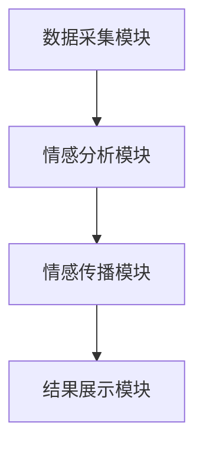
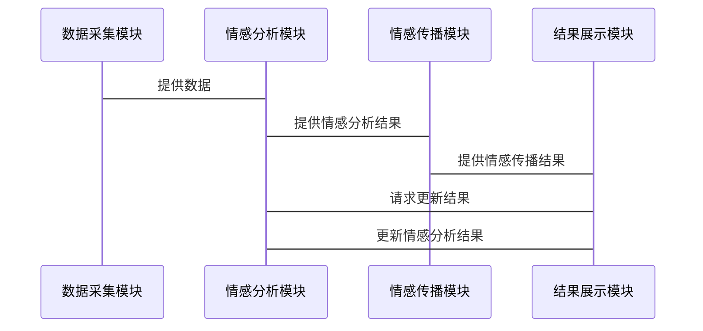

                 


# 多智能体系统在品牌情感联系评估中的应用：超越财务指标

> 关键词：多智能体系统、品牌情感、情感分析、分布式计算、协同学习

> 摘要：本文探讨了多智能体系统在品牌情感联系评估中的应用，超越传统的财务指标，通过分布式计算和协同学习，实现对品牌情感的深度分析。文章从核心概念、算法原理、系统架构到项目实战，全面解析了多智能体系统在品牌情感评估中的优势与实现路径。

---

# 第一部分: 多智能体系统与品牌情感联系评估的背景与基础

## 第1章: 多智能体系统概述

### 1.1 多智能体系统的定义与特点
#### 1.1.1 多智能体系统的定义
多智能体系统（Multi-Agent Systems, MAS）是由多个智能体（Agent）组成的分布式系统，每个智能体能够感知环境、自主决策并与其他智能体协同工作。智能体具有以下核心特征：
- **自主性**：智能体能够自主决策，无需外部干预。
- **反应性**：能够根据环境变化实时调整行为。
- **协作性**：多个智能体能够协同完成复杂任务。
- **社会性**：智能体之间通过通信和协商实现协作。

#### 1.1.2 多智能体系统的核心特点
- **分布式计算**：任务分解到多个智能体，避免单点故障。
- **并行性**：多个智能体同时执行任务，提高效率。
- **适应性**：智能体能够动态调整策略以应对环境变化。

#### 1.1.3 多智能体系统与传统单智能体系统的区别
| 特性          | 多智能体系统                | 单智能体系统                |
|---------------|-----------------------------|-----------------------------|
| 系统结构      | 分布式，多个智能体协作      | 集中式，单个智能体处理      |
| 效率          | 高，任务并行处理            | 较低，任务串行处理            |
| 灵活性        | 高，适应复杂环境变化        | 较低，适应性有限              |

### 1.2 品牌情感联系评估的定义与重要性
#### 1.2.1 品牌情感联系的定义
品牌情感联系是指消费者对品牌的情感态度和认知程度，直接影响品牌忠诚度和市场表现。

#### 1.2.2 品牌情感联系的重要性
- **影响消费者行为**：积极的情感联系提升品牌忠诚度和回购率。
- **品牌价值提升**：情感联系强的品牌更具市场竞争力。
- **精准营销策略**：基于情感数据优化市场推广。

#### 1.2.3 传统财务指标的局限性
| 指标          | 优点                        | 局限性                      |
|---------------|-----------------------------|-----------------------------|
| 销售额        | 易于量化，反映市场表现      | 忽略品牌认知和情感因素      |
| 利润率        | 反映盈利能力                | 难以衡量品牌长期价值        |

### 1.3 多智能体系统在品牌情感联系评估中的优势
#### 1.3.1 多智能体系统的分布式计算优势
- **数据并行处理**：多个智能体同时处理不同数据源，提升效率。
- **任务分解**：复杂任务分解为多个子任务，由不同智能体处理。

#### 1.3.2 多智能体系统的协同合作能力
- **信息共享**：智能体之间共享情感分析结果，提升整体准确性。
- **协同决策**：通过协商和协作，优化情感评估结果。

#### 1.3.3 多智能体系统在情感分析中的应用潜力
- **实时情感传播分析**：追踪情感在用户群体中的传播路径。
- **情感预测与干预**：预测情感变化趋势，及时调整品牌策略。

---

## 第2章: 品牌情感联系评估的核心概念

### 2.1 情感分析的基本原理
#### 2.1.1 情感分析的定义
情感分析是通过自然语言处理技术，判断文本中的情感倾向（正面、负面、中性）。

#### 2.1.2 情感分析的主要方法
| 方法          | 描述                        | 优缺点                      |
|---------------|-----------------------------|-----------------------------|
| 基于规则      | 使用预定义规则提取情感特征  | 实现简单，但准确率有限      |
| 机器学习      | 使用训练数据训练分类模型    | 准确率高，但需要大量数据    |
| 深度学习      | 使用神经网络模型进行分析    | 高准确率，但计算资源消耗大  |

#### 2.1.3 情感分析的挑战与解决方案
| 挑战          | 解决方案                      |
|---------------|-----------------------------|
| 数据稀疏性    | 使用数据增强技术             |
| 领域适应性    | 领域特定模型优化             |

### 2.2 多智能体系统在情感分析中的应用
#### 2.2.1 多智能体系统在文本分析中的优势
- **分布式计算**：多个智能体同时处理大规模数据。
- **协同学习**：智能体之间共享知识，提升整体性能。

#### 2.2.2 多智能体系统在情感传播中的应用
- **情感传播模型**：模拟情感在社交网络中的传播路径。
- **情感影响力分析**：识别关键意见领袖（KOL）对情感传播的影响。

#### 2.2.3 多智能体系统在情感预测中的作用
- **情感预测模型**：基于历史数据预测未来情感趋势。
- **实时情感预警**：及时发现负面情感，快速响应。

### 2.3 品牌情感联系评估的数学模型
#### 2.3.1 基于情感强度的评估模型
$$ \text{情感强度} = \sum_{i=1}^{n} w_i \cdot s_i $$
其中，\( w_i \) 为第 \( i \) 个情感特征的权重，\( s_i \) 为情感特征的值。

#### 2.3.2 基于情感传播的网络模型
- **情感传播网络**：构建情感传播的网络图，分析情感传播路径。
- **情感影响力计算**：通过节点重要性分析，识别关键节点。

#### 2.3.3 基于多智能体系统的综合评估模型
- **分布式计算模型**：多个智能体协同完成情感分析任务。
- **协同学习模型**：智能体之间共享知识，提升整体性能。

---

## 第3章: 多智能体系统的核心算法与实现

### 3.1 多智能体系统的基本算法
#### 3.1.1 分布式计算算法
- **任务分配算法**：将任务分解为多个子任务，分配给不同智能体。
- **负载均衡算法**：动态调整任务分配，确保系统高效运行。

#### 3.1.2 协作式算法
- **协商算法**：智能体之间通过协商决定任务分配和协作方式。
- **协同决策算法**：基于协商结果，做出最优决策。

#### 3.1.3 自适应算法
- **自适应任务分配算法**：根据系统负载动态调整任务分配。
- **自适应协作算法**：根据环境变化动态调整协作策略。

### 3.2 情感分析算法的实现
#### 3.2.1 基于规则的情感分析算法
```python
def sentiment_analysis_rule(text):
    positive_words = ["好", "优秀"]
    negative_words = ["差", "糟糕"]
    score = 0
    for word in text.split():
        if word in positive_words:
            score += 1
        elif word in negative_words:
            score -= 1
    return "正面" if score > 0 else "负面"
```

#### 3.2.2 基于机器学习的情感分析算法
```python
from sklearn.feature_extraction.text import TfidfVectorizer
from sklearn.svm import SVC

vectorizer = TfidfVectorizer()
model = SVC()

def train_model(train_texts, train_labels):
    X = vectorizer.fit_transform(train_texts)
    model.fit(X, train_labels)

def predict(text):
    X = vectorizer.transform([text])
    return model.predict(X)[0]
```

#### 3.2.3 基于深度学习的情感分析算法
```python
import tensorflow as tf
from tensorflow.keras import layers

model = tf.keras.Sequential([
    layers.Embedding(input_dim=10000, output_dim=16),
    layers.GlobalAveragePooling1D(),
    layers.Dense(1, activation='sigmoid')
])

model.compile(optimizer='adam', loss='binary_crossentropy', metrics=['accuracy'])
```

### 3.3 多智能体系统的情感分析流程
#### 3.3.1 数据采集与预处理
- **数据来源**：社交媒体评论、用户评价等。
- **数据清洗**：去除噪音数据，如特殊符号、停用词。

#### 3.3.2 情感特征提取
- **特征选择**：提取文本中的情感关键词。
- **特征工程**：构建特征向量，用于情感分析。

#### 3.3.3 情感传播与协同分析
- **情感传播模型**：模拟情感在社交网络中的传播。
- **协同分析**：多个智能体协同完成情感分析任务。

---

## 第4章: 品牌情感联系评估的系统架构设计

### 4.1 系统功能模块划分
| 模块          | 功能描述                      |
|---------------|-----------------------------|
| 数据采集模块  | 采集品牌相关数据              |
| 情感分析模块  | 对数据进行情感分析            |
| 情感传播模块  | 分析情感传播路径              |
| 结果展示模块  | 展示情感分析结果              |

### 4.2 系统架构设计
#### 4.2.1 分层架构设计
- **数据层**：负责数据的存储和管理。
- **计算层**：负责情感分析和传播计算。
- **展示层**：负责结果的可视化展示。

#### 4.2.2 模块化设计
- **数据采集模块**：负责数据的采集和预处理。
- **情感分析模块**：负责文本的情感分析。
- **情感传播模块**：负责情感传播路径的分析。
- **结果展示模块**：负责分析结果的可视化。

### 4.3 系统架构图（Mermaid）


### 4.4 系统接口设计
- **数据接口**：提供API，供外部系统调用数据。
- **计算接口**：提供API，供外部系统调用计算结果。

### 4.5 系统交互图（Mermaid）


---

## 第5章: 项目实战与案例分析

### 5.1 项目背景与目标
#### 项目背景
随着社交媒体的普及，品牌情感联系对企业的重要性日益增加。

#### 项目目标
实现一个基于多智能体系统的品牌情感联系评估系统。

### 5.2 项目核心实现
#### 5.2.1 环境配置
- **编程语言**：Python 3.8+
- **框架**：TensorFlow 2.0+, Scikit-learn
- **工具**：Jupyter Notebook, Git

#### 5.2.2 核心代码实现
```python
import os
import json
from sklearn.feature_extraction.text import TfidfVectorizer
from sklearn.svm import SVC
import tensorflow as tf

# 数据采集模块
def collect_data():
    data = []
    for file in os.listdir("data"):
        with open(os.path.join("data", file), 'r', encoding='utf-8') as f:
            data.append(json.load(f))
    return data

# 情感分析模块
def train_model(train_texts, train_labels):
    vectorizer = TfidfVectorizer()
    X = vectorizer.fit_transform(train_texts)
    model = SVC()
    model.fit(X, train_labels)
    return model, vectorizer

# 情感传播模块
def spread_emotion(network, model):
    for node in network.nodes():
        emotion = model.predict(node.text)
        network.set_node_emotion(node, emotion)
    return network

# 结果展示模块
def display_results(network):
    for node in network.nodes():
        print(f"节点 {node.id}: 情感倾向：{node.emotion}")
```

#### 5.2.3 代码解读与分析
- **数据采集模块**：从指定目录中读取数据文件，返回数据列表。
- **情感分析模块**：使用TF-IDF和SVM训练情感分析模型。
- **情感传播模块**：在社交网络中传播情感，更新每个节点的情感倾向。
- **结果展示模块**：展示每个节点的情感倾向。

### 5.3 实际案例分析
#### 案例背景
某品牌在社交媒体上的评论数据。

#### 数据预处理
- **清洗数据**：去除噪音数据。
- **分词处理**：对文本进行分词处理。

#### 情感分析与传播
- **训练模型**：使用训练数据训练情感分析模型。
- **情感传播**：在社交网络中传播情感，分析情感传播路径。

#### 结果分析
- **情感强度分布**：统计不同情感强度的用户比例。
- **情感传播路径**：分析情感传播的主要路径。

### 5.4 项目小结
通过项目实战，验证了多智能体系统在品牌情感联系评估中的有效性，展示了其在实际应用中的潜力。

---

## 第6章: 最佳实践与注意事项

### 6.1 最佳实践
#### 6.1.1 系统设计
- **模块化设计**：确保系统模块化，便于扩展和维护。
- **分布式计算**：充分利用多智能体系统的分布式计算优势。

#### 6.1.2 算法优化
- **数据增强**：通过数据增强技术提升模型的准确率。
- **模型调优**：通过网格搜索等方法优化模型参数。

### 6.2 小结
多智能体系统在品牌情感联系评估中的应用具有广阔的前景，通过合理设计和优化，可以实现高效的情感分析和传播。

### 6.3 注意事项
- **数据隐私**：确保数据采集和处理过程中的隐私保护。
- **系统安全性**：防止系统受到网络攻击，确保系统安全。

### 6.4 拓展阅读
- **推荐书籍**：《多智能体系统与分布式计算》
- **推荐论文**：《Multi-Agent Systems for Sentiment Analysis in Social Networks》

---

## 第7章: 结论与展望

### 7.1 结论
本文详细探讨了多智能体系统在品牌情感联系评估中的应用，展示了其在情感分析和传播中的优势，为品牌价值的提升提供了新的思路。

### 7.2 未来展望
未来，随着人工智能技术的发展，多智能体系统在品牌情感联系评估中的应用将更加广泛，可能出现以下趋势：
- **更复杂的情感分析模型**：基于深度学习的多智能体系统。
- **更高效的协同算法**：优化多智能体系统的协作效率。
- **更广泛的应用场景**：多智能体系统应用于更多领域。

---

通过本文的系统阐述，读者可以深入了解多智能体系统在品牌情感联系评估中的应用，掌握其核心算法和系统设计方法，并通过实际案例分析，提升对多智能体系统在情感分析中的理解。希望本文能够为相关领域的研究和实践提供有价值的参考。

