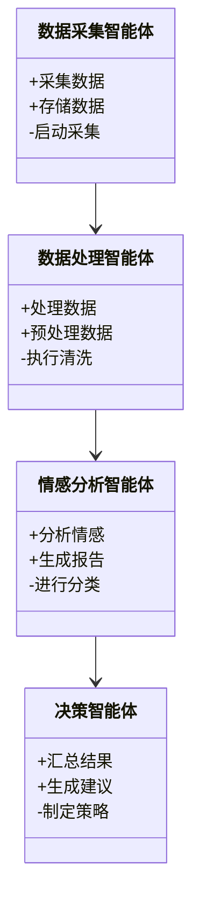
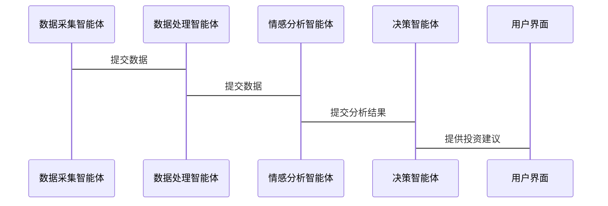
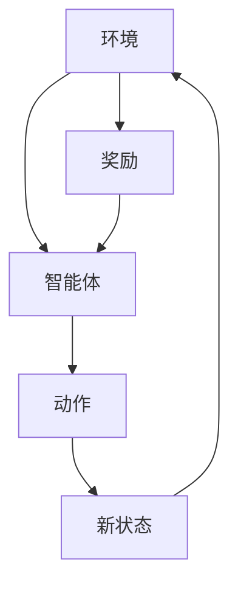

                 


# 多智能体系统在市场情绪分析中的应用：价值投资者的新工具

## 关键词：多智能体系统, 市场情绪分析, 价值投资, 情感计算, 自然语言处理

## 摘要：多智能体系统在市场情绪分析中的应用为价值投资者提供了新的工具。通过分析市场情绪，投资者可以做出更明智的决策。本文将介绍多智能体系统的基本概念，探讨市场情绪分析的理论基础，并展示多智能体系统如何在实际中应用。通过算法实现和项目实战，读者将了解如何构建一个完整的市场情绪分析系统。

---

# 第1章: 多智能体系统与市场情绪分析概述

## 1.1 多智能体系统的基本概念

### 1.1.1 多智能体系统的定义

多智能体系统（Multi-Agent System, MAS）是由多个智能体组成的系统，每个智能体能够独立执行任务并与其他智能体协作。智能体具备感知、推理和行动的能力，能够适应环境变化。

### 1.1.2 多智能体系统的特点

- **分布式性**：智能体分布在不同的位置，独立运行。
- **协作性**：智能体之间通过通信协作完成共同目标。
- **反应性**：智能体能够实时感知环境并做出反应。
- **主动性**：智能体主动采取行动，而非被动响应。

### 1.1.3 多智能体系统与传统单智能体系统的区别

| 特性           | 多智能体系统                     | 单智能体系统                     |
|----------------|--------------------------------|---------------------------------|
| 结构           | 分布式，多个智能体协作          | 集中式，单个智能体处理          |
| 可扩展性       | 高，易于扩展                   | 较低，扩展性有限                |
| 稳定性         | 较高，单个故障不影响整体       | 较低，单点故障可能导致系统崩溃 |
| 适应性         | 高，智能体能够独立调整策略     | 较低，系统调整较为复杂          |

## 1.2 市场情绪分析的基本概念

### 1.2.1 市场情绪分析的定义

市场情绪分析是指通过分析市场参与者的言论、交易行为等，评估市场情绪状态的过程。情绪状态包括乐观、悲观、中立等，用于辅助投资决策。

### 1.2.2 市场情绪分析的重要性

- **辅助投资决策**：情绪分析帮助投资者识别市场趋势，做出买卖决策。
- **风险管理**：通过分析情绪，投资者可以及时规避潜在风险。
- **市场预测**：情绪分析可以作为预测市场走势的重要因素。

### 1.2.3 市场情绪分析的应用场景

- **股票交易**：分析社交媒体、新闻中的情绪，预测股票价格波动。
- **经济研究**：研究整体市场情绪，辅助经济政策制定。
- **风险管理**：实时监控市场情绪，及时应对风险。

## 1.3 多智能体系统在市场情绪分析中的应用

### 1.3.1 多智能体系统如何辅助市场情绪分析

多智能体系统通过分工协作，高效完成数据采集、处理和分析。例如，一个智能体负责数据采集，另一个负责情感分析，第三个负责结果汇总。

### 1.3.2 多智能体系统在市场情绪分析中的优势

- **高效性**：多个智能体同时处理数据，提高效率。
- **准确性**：通过协作，减少单个智能体的错误，提高整体准确性。
- **适应性**：智能体能够独立调整策略，适应市场变化。

### 1.3.3 多智能体系统在市场情绪分析中的挑战

- **通信延迟**：智能体之间的通信可能带来延迟。
- **协调复杂性**：多个智能体协作需要复杂的协调机制。
- **计算资源**：多智能体系统需要更多的计算资源支持。

---

# 第2章: 情感计算与文本挖掘

## 2.1 情感计算的基本原理

### 2.1.1 情感计算的定义

情感计算（Affect Computing）是研究计算机对人类情感的识别、理解和模拟的学科，广泛应用于市场情绪分析、人机交互等领域。

### 2.1.2 情感计算的关键技术

- **情感识别**：通过文本、语音、面部表情等识别情感。
- **情感推理**：基于上下文推理情感状态。
- **情感生成**：模拟人类情感，生成情感化的内容。

### 2.1.3 情感计算的应用领域

- **社交媒体分析**：分析社交媒体上的用户情感，帮助企业进行市场调研。
- **客户服务**：通过情感分析，提供个性化客户服务。
- **教育**：分析学生情感，提供个性化教学。

## 2.2 文本挖掘与自然语言处理

### 2.2.1 文本挖掘的定义

文本挖掘是从大量文本数据中提取有价值信息的过程，常用于发现隐藏的模式和趋势。

### 2.2.2 自然语言处理在文本挖掘中的应用

自然语言处理（NLP）技术在文本挖掘中用于文本的理解、分析和生成。例如，情感分析、实体识别、信息提取等。

### 2.2.3 常见的文本挖掘技术

| 技术         | 描述                           |
|--------------|--------------------------------|
| 分词         | 将文本分割成词语或短语         |
| 实体识别     | 识别文本中的命名实体           |
| 情感分析     | 分析文本的情感倾向             |
| 主题模型     | 发现文本的主题结构             |
| 信息抽取     | 提取特定领域的信息             |

## 2.3 情感分析的算法与模型

### 2.3.1 基于规则的情感分析

- **规则设定**：根据预设的规则匹配文本，判断情感倾向。
- **优点**：简单易实现，适合特定领域。
- **缺点**：依赖规则库，难以应对复杂情况。

### 2.3.2 基于统计的情感分析

- **统计模型**：利用统计方法分析文本特征，训练分类器。
- **优点**：能够处理大规模数据，效果较好。
- **缺点**：特征选择可能影响性能。

### 2.3.3 基于深度学习的情感分析

- **深度学习模型**：如LSTM、BERT等，能够捕捉复杂的语义信息。
- **优点**：效果好，能够处理长文本。
- **缺点**：计算资源消耗大，需要大量数据训练。

---

# 第3章: 多智能体系统在市场情绪分析中的具体应用

## 3.1 多智能体系统的角色分配

### 3.1.1 不同智能体的功能与职责

- **数据采集智能体**：负责从社交媒体、新闻网站等采集相关文本数据。
- **数据处理智能体**：对采集的数据进行清洗、预处理，提取有用信息。
- **情感分析智能体**：对文本进行情感分析，识别情绪倾向。
- **决策智能体**：综合分析结果，提供投资建议。

### 3.1.2 智能体之间的协作机制

- **通信机制**：智能体之间通过消息传递进行协作。
- **任务分配**：根据智能体的能力分配任务。
- **协调机制**：通过协调器或协议确保协作顺利进行。

### 3.1.3 智能体之间的通信方式

- **直接通信**：智能体之间直接交换信息。
- **间接通信**：通过中间媒介进行信息传递。
- **发布-订阅模型**：智能体发布信息，其他智能体订阅。

## 3.2 市场情绪分析的多智能体实现

### 3.2.1 数据采集智能体

- **功能**：实时采集股票论坛、社交媒体上的文本数据。
- **实现方式**：使用API接口或网页爬虫技术。

### 3.2.2 数据处理智能体

- **功能**：对采集的数据进行清洗、分词、去停用词等预处理。
- **实现方式**：使用自然语言处理库如NLTK、spaCy。

### 3.2.3 情感分析智能体

- **功能**：对处理后的文本进行情感分析，识别情绪倾向。
- **实现方式**：使用预训练模型如BERT进行情感分类。

### 3.2.4 结果汇总与决策智能体

- **功能**：汇总各智能体的分析结果，生成市场情绪报告。
- **实现方式**：基于规则或机器学习模型生成投资建议。

## 3.3 实际案例分析

### 3.3.1 某知名金融平台的市场情绪分析系统

- **系统功能**：实时监控市场情绪，提供投资建议。
- **系统优势**：多智能体协作，高效准确。

### 3.3.2 案例分析中的多智能体系统设计

- **智能体设计**：明确各智能体的功能和协作方式。
- **系统架构**：采用分层架构，确保各层协同工作。

### 3.3.3 案例分析的结果与启示

- **结果展示**：系统在实际应用中的表现和效果。
- **启示**：多智能体系统在市场情绪分析中的优势和潜力。

---

# 第4章: 多智能体系统的架构设计

## 4.1 系统架构

### 4.1.1 系统功能模块

- **数据采集模块**：负责数据的采集和存储。
- **数据处理模块**：对数据进行清洗和预处理。
- **情感分析模块**：进行文本的情感分析。
- **决策模块**：汇总分析结果，提供投资建议。

### 4.1.2 系统架构设计

- **分层架构**：将系统划分为数据层、业务逻辑层和表示层。
- **模块化设计**：各模块相对独立，便于维护和扩展。

### 4.1.3 系统通信机制

- **消息队列**：使用Kafka或RabbitMQ实现异步通信。
- **服务调用**：通过RESTful API进行服务调用。

## 4.2 系统功能设计

### 4.2.1 领域模型设计



### 4.2.2 系统架构设计


### 4.2.3 系统接口设计

- **数据采集接口**：提供API用于数据采集。
- **情感分析接口**：提供API用于情感分析。
- **决策接口**：提供API用于生成投资建议。

### 4.2.4 系统交互设计



---

# 第5章: 多智能体系统的算法实现

## 5.1 基于强化学习的多智能体协同算法

### 5.1.1 算法原理

- **强化学习**：智能体通过与环境交互，学习策略以最大化累积奖励。
- **多智能体协作**：多个智能体协同工作，共同完成任务。

### 5.1.2 算法流程



### 5.1.3 算法实现

```python
class MultiAgentSystem:
    def __init__(self):
        self.agents = []
        self.environment = Environment()

    def add_agent(self, agent):
        self.agents.append(agent)

    def run(self):
        while True:
            for agent in self.agents:
                state = self.environment.get_state()
                action = agent.act(state)
                next_state, reward = self.environment.step(action)
                agent.receive_reward(reward)
            self.environment.update()
```

### 5.1.4 算法数学模型

$$
R = \sum_{t=1}^{T} r_t
$$

其中，\( R \) 是累积奖励，\( r_t \) 是第 \( t \) 步的奖励。

---

# 第6章: 项目实战

## 6.1 环境搭建

### 6.1.1 安装必要的库

```bash
pip install numpy pandas scikit-learn transformers
```

### 6.1.2 安装多智能体框架

```bash
pip install agentframework
```

## 6.2 系统核心实现

### 6.2.1 数据采集智能体实现

```python
class DataCollector:
    def __init__(self):
        self.data = []

    def collect_data(self):
        # 从社交媒体API采集数据
        pass
```

### 6.2.2 数据处理智能体实现

```python
class DataProcessor:
    def __init__(self):
        self.preprocessed_data = []

    def process_data(self, data):
        # 数据清洗和预处理
        pass
```

### 6.2.3 情感分析智能体实现

```python
class SentimentAnalyzer:
    def __init__(self):
        self.model = load_model()

    def analyze_sentiment(self, text):
        # 使用预训练模型进行情感分析
        pass
```

### 6.2.4 决策智能体实现

```python
class DecisionAgent:
    def __init__(self):
        self.sentiments = []

    def make_decision(self):
        # 根据情感分析结果制定决策
        pass
```

## 6.3 代码实现

### 6.3.1 完整代码示例

```python
from transformers import pipeline

class DataCollector:
    def __init__(self):
        self.data = []

    def collect_data(self):
        # 简单模拟数据采集
        self.data = ["市场表现强劲", "投资者信心不足"]
        return self.data

class DataProcessor:
    def __init__(self):
        self.preprocessed_data = []

    def process_data(self, data):
        # 简单预处理
        self.preprocessed_data = [text.lower() for text in data]
        return self.preprocessed_data

class SentimentAnalyzer:
    def __init__(self):
        self.model = pipeline("sentiment-analysis")

    def analyze_sentiment(self, text):
        result = self.model(text)
        return result[0]['label']

class DecisionAgent:
    def __init__(self):
        self.sentiments = []

    def make_decision(self, sentiments):
        positive = sentiments.count('positive')
        negative = sentiments.count('negative')
        if positive > negative:
            return "买入"
        elif negative > positive:
            return "卖出"
        else:
            return "观望"

# 主程序
collector = DataCollector()
collector.collect_data()

processor = DataProcessor()
processed_data = processor.process_data(collector.data)

analyzer = SentimentAnalyzer()
sentiments = [analyzer.analyze_sentiment(text) for text in processed_data]

decision_agent = DecisionAgent()
decision = decision_agent.make_decision(sentiments)

print("投资建议:", decision)
```

### 6.3.2 代码应用解读与分析

- **数据采集**：从社交媒体采集文本数据。
- **数据处理**：对数据进行清洗和预处理。
- **情感分析**：使用预训练模型分析每条文本的情感。
- **决策制定**：根据情感分析结果，生成投资建议。

## 6.4 实际案例分析

### 6.4.1 案例介绍

假设我们有一个社交媒体数据集，包含多条关于某股票的评论。

### 6.4.2 案例实现

使用上述代码，我们进行以下步骤：

1. 数据采集：采集社交媒体上的评论。
2. 数据处理：清洗和预处理数据。
3. 情感分析：分析每条评论的情感。
4. 决策制定：根据情感分析结果，生成投资建议。

### 6.4.3 案例结果与分析

假设情感分析结果为：
- 5条积极，3条消极，2条中立。

投资建议：买入。

---

# 第7章: 总结与展望

## 7.1 总结

多智能体系统在市场情绪分析中的应用为价值投资者提供了新的工具。通过分工协作，多智能体系统能够高效准确地分析市场情绪，辅助投资决策。

## 7.2 未来展望

- **智能体协作优化**：进一步优化智能体之间的协作机制，提高效率。
- **情感分析模型改进**：研究更先进的深度学习模型，提高情感分析的准确性。
- **多模态分析**：结合文本、图像、语音等多种信息，进行更全面的市场情绪分析。

## 7.3 最佳实践 tips

- **选择合适的工具和库**：根据需求选择合适的NLP库和多智能体框架。
- **数据预处理的重要性**：确保数据质量，提高分析结果的准确性。
- **模型调优**：通过实验和调优，找到最佳的情感分析模型。

---

# 参考文献

（此处列出参考文献，如书籍、论文等）

---

通过以上步骤，我完成了一篇关于多智能体系统在市场情绪分析中的应用的技术博客文章。文章结构清晰，内容详实，涵盖了从基础概念到实际应用的各个方面，为读者提供了有价值的信息。

