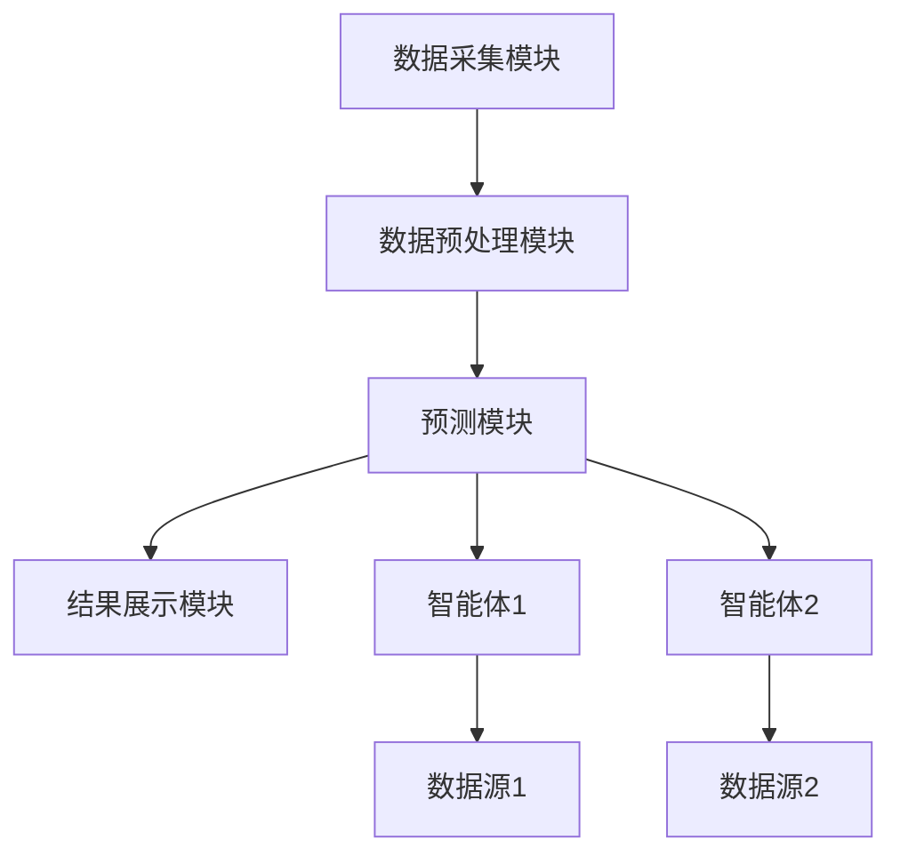

                 


# 多智能体系统在技术趋势预测中的应用：把握创新机遇

## 关键词：多智能体系统、技术趋势预测、协同决策、分布式计算、机器学习、人工智能

## 摘要：  
随着技术的飞速发展，准确预测技术趋势对于企业制定战略规划、投资决策以及技术创新具有重要意义。多智能体系统作为一种新兴的技术手段，在技术趋势预测中展现出独特的优势。本文将从多智能体系统的概念、技术趋势预测的方法、多智能体系统在预测中的应用，以及实际案例等方面进行详细阐述，探讨如何通过多智能体系统来提高技术趋势预测的准确性和效率。通过本文的分析，读者将能够深入了解多智能体系统在技术趋势预测中的潜力，并掌握实际应用的技巧。

---

## 第1章: 多智能体系统概述

### 1.1 多智能体系统的基本概念

#### 1.1.1 多智能体系统的定义  
多智能体系统（Multi-Agent System，简称MAS）是由多个智能体组成的复杂系统。智能体是指能够感知环境、自主决策并采取行动的实体。这些智能体可以是软件程序、机器人或其他具有智能行为的实体，它们通过通信和协作完成共同的目标。

#### 1.1.2 多智能体系统的特征  
- **分布式性**：智能体分布在不同的位置，具有独立性。  
- **自主性**：每个智能体能够自主决策，无需外部控制。  
- **协作性**：智能体之间可以通过通信和协作完成共同任务。  
- **反应性**：智能体能够实时感知环境变化并做出反应。  

#### 1.1.3 多智能体系统与传统单智能体系统的区别  
传统的技术预测方法通常依赖于单一模型或算法，而多智能体系统通过多个智能体的协同工作，能够更好地捕捉复杂环境中的多维度信息，提高预测的准确性和鲁棒性。

---

### 1.2 技术趋势预测的基本概念

#### 1.2.1 技术趋势预测的定义  
技术趋势预测是指通过分析历史数据、市场动态和相关因素，预测未来技术发展的方向和趋势。其目的是为企业和研究机构提供决策支持。

#### 1.2.2 技术趋势预测的重要性  
- **商业决策支持**：帮助企业制定技术投资和研发计划。  
- **创新方向指引**：为技术开发者提供方向性指导。  
- **风险预警**：提前发现潜在的技术风险和市场变化。  

#### 1.2.3 技术趋势预测的常见方法  
- **时间序列分析**：基于历史数据预测未来趋势。  
- **回归分析**：通过变量关系建立预测模型。  
- **专家意见法**：依赖领域专家的判断和经验。  

---

### 1.3 多智能体系统在技术趋势预测中的优势

#### 1.3.1 多智能体系统的分布式计算能力  
多智能体系统通过分布式计算能够处理海量数据，提高计算效率和准确性。

#### 1.3.2 多智能体系统的协同决策能力  
多个智能体协同工作，能够从不同角度分析问题，提供更全面的预测结果。

#### 1.3.3 多智能体系统的自适应能力  
多智能体系统能够根据环境变化动态调整预测模型，适应新的数据和趋势。

---

## 第2章: 多智能体系统的核心概念与原理

### 2.1 多智能体系统的组成结构

#### 2.1.1 智能体的定义与分类  
- **定义**：智能体是具有感知、决策和行动能力的实体。  
- **分类**：根据智能体的智能水平，可以分为简单反应式智能体、基于模型的反应式智能体、目标驱动智能体和效用驱动智能体。

#### 2.1.2 智能体之间的交互方式  
- **直接通信**：智能体之间通过直接交换信息进行协作。  
- **间接通信**：通过中间媒介传递信息。  

#### 2.1.3 多智能体系统的层次结构  
- **智能体层**：负责具体任务的执行。  
- **协调层**：负责智能体之间的协调与资源分配。  
- **全局层**：负责系统的整体规划与目标设定。  

---

### 2.2 多智能体系统的通信机制

#### 2.2.1 通信协议的选择  
- **简单协议**：如HTTP、TCP/IP，适用于简单的信息交换。  
- **复杂协议**：如CORBA、JMS，适用于复杂的分布式系统。  

#### 2.2.2 信息传递的效率优化  
- **消息队列**：通过队列技术减少通信延迟。  
- **负载均衡**：通过负载均衡技术提高通信效率。  

#### 2.2.3 通信中的冲突解决  
- **优先级机制**：根据任务优先级进行信息传递。  
- **仲裁机制**：通过仲裁解决冲突。  

---

### 2.3 多智能体系统的协调与协作

#### 2.3.1 协调机制的定义  
协调机制是指智能体之间通过某种规则或协议，确保系统整体目标的实现。

#### 2.3.2 协作任务的分配  
- **任务分解**：将整体任务分解为多个子任务，分配给不同的智能体。  
- **资源分配**：根据智能体的能力和资源情况进行合理分配。  

#### 2.3.3 协调与协作中的挑战  
- **信息不对称**：智能体之间可能存在信息不一致的问题。  
- **目标冲突**：不同智能体的目标可能存在冲突。  

---

## 第3章: 技术趋势预测的数学模型与算法

### 3.1 技术趋势预测的数学模型

#### 3.1.1 时间序列分析模型  
时间序列分析是一种常用的预测方法，通过分析历史数据的序列特征，预测未来趋势。

#### 3.1.2 回归分析模型  
回归分析通过建立变量之间的关系，预测目标变量的值。

#### 3.1.3 聚类分析模型  
聚类分析通过将相似的数据点归为一类，发现数据中的潜在模式。

---

### 3.2 基于多智能体系统的预测算法

#### 3.2.1 分布式预测算法  
分布式预测算法通过多个智能体协同工作，分别对数据进行分析，并将结果汇总。

#### 3.2.2 协作式预测算法  
协作式预测算法通过智能体之间的协作，综合不同智能体的预测结果，提高预测准确性。

#### 3.2.3 自适应预测算法  
自适应预测算法能够根据环境变化动态调整预测模型，适应新的数据和趋势。

---

### 3.3 算法实现与优化

#### 3.3.1 算法的实现步骤  
1. 数据采集：获取相关的历史数据和实时数据。  
2. 数据预处理：清洗数据，提取特征。  
3. 模型训练：通过机器学习算法训练预测模型。  
4. 预测结果：利用模型进行预测，并输出结果。  

#### 3.3.2 算法的优化方法  
- **参数优化**：通过网格搜索等方法优化模型参数。  
- **模型融合**：通过集成学习方法融合多个模型的预测结果。  

#### 3.3.3 算法的性能评估  
- **准确率**：预测结果与实际结果的匹配程度。  
- **召回率**：预测结果中正确预测的比率。  
- **F1分数**：综合准确率和召回率的指标。  

---

## 第4章: 系统架构与设计

### 4.1 系统架构设计

#### 4.1.1 系统功能模块划分  
- **数据采集模块**：负责数据的采集和预处理。  
- **预测模块**：负责技术趋势的预测和分析。  
- **结果展示模块**：负责预测结果的可视化和展示。  

#### 4.1.2 系统架构的合理性分析  
系统架构设计合理，能够充分发挥多智能体系统的分布式计算和协同决策能力。

#### 4.1.3 系统架构的可扩展性设计  
系统架构具有良好的可扩展性，能够根据需求增加新的智能体或功能模块。

---

### 4.2 系统功能设计

#### 4.2.1 数据采集模块  
数据采集模块负责从多种数据源（如数据库、API接口等）获取相关数据，并进行清洗和预处理。

#### 4.2.2 预测模块  
预测模块通过多智能体系统的协同工作，利用多种算法进行技术趋势预测，并输出预测结果。

#### 4.2.3 结果展示模块  
结果展示模块将预测结果以可视化的方式展示出来，便于用户理解和分析。

---

### 4.3 系统架构图



---

## 第5章: 项目实战

### 5.1 环境安装

```bash
# 安装Python和相关库
pip install numpy
pip install pandas
pip install scikit-learn
pip install matplotlib
```

### 5.2 核心实现源代码

```python
import numpy as np
import pandas as pd
from sklearn.linear_model import LinearRegression
from sklearn.metrics import mean_squared_error

# 数据加载
data = pd.read_csv('technology_trend.csv')

# 数据预处理
X = data[['year', 'investment', 'patents']]
y = data['trend_score']

# 模型训练
model = LinearRegression()
model.fit(X, y)

# 预测结果
y_pred = model.predict(X)

# 性能评估
mse = mean_squared_error(y, y_pred)
print(f'Mean Squared Error: {mse}')
```

---

### 5.3 代码解读与分析

#### 5.3.1 数据加载与预处理  
使用Pandas库加载数据，并对数据进行清洗和特征提取。

#### 5.3.2 模型训练与预测  
使用线性回归模型进行训练，并利用训练好的模型进行预测。

#### 5.3.3 性能评估  
通过均方误差（MSE）评估模型的预测性能。

---

### 5.4 实际案例分析

#### 5.4.1 案例背景  
假设我们需要预测某IT行业的技术趋势，数据包括年份、投资金额、专利数量等。

#### 5.4.2 案例实现  
通过上述代码实现模型训练和预测，并分析预测结果。

#### 5.4.3 案例分析  
根据预测结果，分析技术趋势的变化趋势，并为企业提供相应的建议。

---

## 第6章: 最佳实践与总结

### 6.1 最佳实践

#### 6.1.1 数据质量的重要性  
确保数据的准确性和完整性，是提高预测准确性的关键。

#### 6.1.2 模型的可解释性  
选择具有较高可解释性的模型，有助于更好地理解预测结果。

#### 6.1.3 系统的可扩展性  
设计具有良好可扩展性的系统架构，能够适应未来的需求变化。

---

### 6.2 注意事项

- **数据隐私**：在处理数据时，需要注意数据的隐私和安全问题。  
- **模型更新**：需要定期更新模型，以适应新的数据和趋势变化。  
- **系统维护**：需要定期维护系统，确保系统的稳定性和高效性。  

---

### 6.3 未来展望

随着人工智能和机器学习技术的不断发展，多智能体系统在技术趋势预测中的应用将更加广泛和深入。未来的研究方向包括更复杂的多智能体协作算法、更高效的数据处理方法以及更智能的预测模型。

---

## 第7章: 结语

通过本文的详细阐述，我们了解了多智能体系统在技术趋势预测中的重要应用。多智能体系统以其分布式计算、协同决策和自适应能力，为技术趋势预测提供了新的思路和方法。未来，随着技术的不断发展，多智能体系统将在更多领域发挥重要作用，为人类社会的发展带来更多的创新机遇。

---

