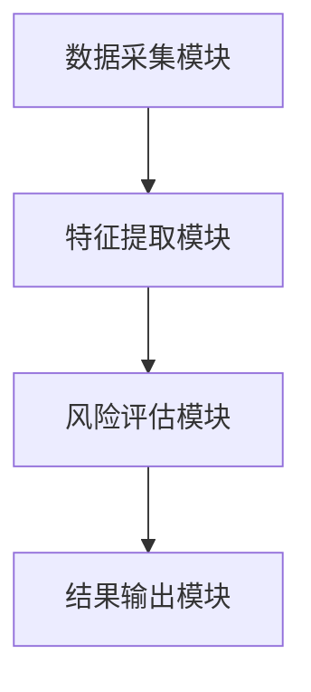

                 


# 多智能体系统在技术颠覆风险评估中的应用

> 关键词：多智能体系统，技术颠覆，风险评估，贝叶斯网络，协同决策

> 摘要：  
随着技术的飞速发展，技术颠覆的风险日益增加。本文探讨多智能体系统（MAS）在技术颠覆风险评估中的应用，分析其优势与挑战。通过结合MAS的协作性和智能性，提出一种基于MAS的风险评估模型，并通过实际案例展示其应用效果。

---

## 第一部分：多智能体系统概述

### 第1章：多智能体系统的基本概念

#### 1.1 多智能体系统（MAS）的定义

- **智能体的基本概念**  
  智能体（Agent）是一个能够感知环境并采取行动以实现目标的实体。它可以是一个软件程序、机器人或其他具有自主决策能力的系统。

- **多智能体系统的定义**  
  多智能体系统（MAS）是由多个智能体组成的分布式系统，这些智能体通过协作完成复杂的任务。

- **MAS与单智能体系统的区别**  
  单智能体系统依赖中心化的决策机制，而MAS通过分布式协作实现目标。

#### 1.2 多智能体系统的特点

- **分布式智能**  
  每个智能体独立决策，通过通信和协作完成任务。

- **协作性**  
  智能体之间通过通信和协商实现协作。

- **自适应性**  
  系统能够根据环境变化动态调整策略。

#### 1.3 多智能体系统的应用领域

- **分布式计算**  
  大规模数据处理和分布式任务分配。

- **机器人协作**  
  工厂自动化、物流配送中的机器人协作。

- **金融科技**  
  算法交易、风险管理中的多智能体应用。

---

## 第二部分：技术颠覆风险评估的基本理论

### 第2章：技术颠覆风险的定义与特征

#### 2.1 技术颠覆的定义

- **技术颠覆的内涵**  
  技术颠覆是指新技术的出现导致原有技术或商业模式迅速失效。

- **技术颠覆的表现形式**  
  替代性、破坏性、颠覆性。

#### 2.2 技术颠覆风险的特征

- **不确定性**  
  风险来源难以预测。

- **突发性**  
  技术颠覆可能在短时间内发生。

- **影响范围广**  
  可能影响整个行业或经济体系。

---

## 第三部分：多智能体系统在技术颠覆风险评估中的应用

### 第3章：基于MAS的风险评估模型

#### 3.1 风险评估模型的设计

- **模型概述**  
  结合MAS的协作性和智能性，构建一个多智能体协同的风险评估框架。

- **模型输入**  
  包括技术特征、市场数据、竞争环境等。

- **模型输出**  
  生成风险评估结果和应对策略。

#### 3.2 模型实现

- **贝叶斯网络的应用**  
  使用贝叶斯网络对技术颠覆风险进行概率建模。

- **算法实现**  
  使用Python实现贝叶斯网络的计算。

  ```python
  import networkx as nx
  from pgmpy.models import BayesianNetwork
  from pgmpy.inference import VariableElimination

  # 定义贝叶斯网络结构
  model = BayesianNetwork()
  model.add_nodes(['T', 'M', 'R'])
  model.add_edges([('T', 'R'), ('M', 'R')])
  
  # 定义概率分布
  from pgmpy.distributions import Categorical
  model.set_node_probability('T', Categorical(['High', 'Low'], [0.3, 0.7]))
  model.set_node_probability('M', Categorical(['High', 'Low'], [0.4, 0.6]))
  
  # 推理
  inference = VariableElimination(model)
  result = inference.predict('R', evidence={'T': 'High', 'M': 'High'})
  print(result)
  ```

---

## 第四部分：系统架构与实现

### 第4章：系统架构设计

#### 4.1 系统架构概述

- **整体架构**  
  包括数据采集模块、智能体协作模块、风险评估模块。

- **模块划分**  
  数据采集、特征提取、风险评估、结果输出。

#### 4.2 系统架构图



---

## 第五部分：项目实战

### 第5章：智能交通系统中的技术颠覆风险评估

#### 5.1 项目背景

- **项目目标**  
  评估新技术对智能交通系统的影响。

- **项目需求**  
  使用MAS模拟交通系统的运行，评估技术颠覆风险。

#### 5.2 系统实现

- **环境搭建**  
  使用Python和相关库（如networkx、pgmpy）搭建系统环境。

- **代码实现**  
  使用Python实现MAS协作和风险评估。

  ```python
  import networkx as nx
  from pgmpy.models import BayesianNetwork
  from pgmpy.inference import VariableElimination

  # 定义贝叶斯网络结构
  model = BayesianNetwork()
  model.add_nodes(['T', 'M', 'R'])
  model.add_edges([('T', 'R'), ('M', 'R')])
  
  # 定义概率分布
  from pgmpy.distributions import Categorical
  model.set_node_probability('T', Categorical(['High', 'Low'], [0.3, 0.7]))
  model.set_node_probability('M', Categorical(['High', 'Low'], [0.4, 0.6]))
  
  # 推理
  inference = VariableElimination(model)
  result = inference.predict('R', evidence={'T': 'High', 'M': 'High'})
  print(result)
  ```

---

## 第六部分：扩展与展望

### 第6章：MAS在风险评估中的未来发展方向

#### 6.1 结合边缘计算和区块链技术

- **边缘计算的优势**  
  提高数据处理的实时性和安全性。

- **区块链的应用**  
  增强系统的信任机制和数据安全性。

#### 6.2 技术挑战

- **数据隐私问题**  
  如何在MAS中保护数据隐私。

- **算法优化问题**  
  如何提高MAS的计算效率和准确性。

---

## 总结

多智能体系统在技术颠覆风险评估中的应用具有广阔的前景。通过MAS的协作性和智能性，可以更有效地评估和应对技术颠覆风险。未来，随着技术的进步，MAS在风险评估中的应用将更加广泛和深入。

