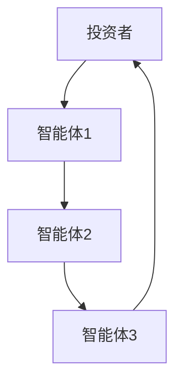
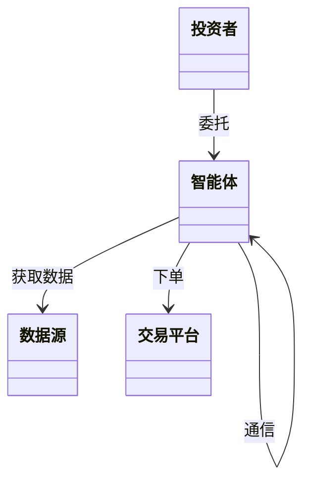
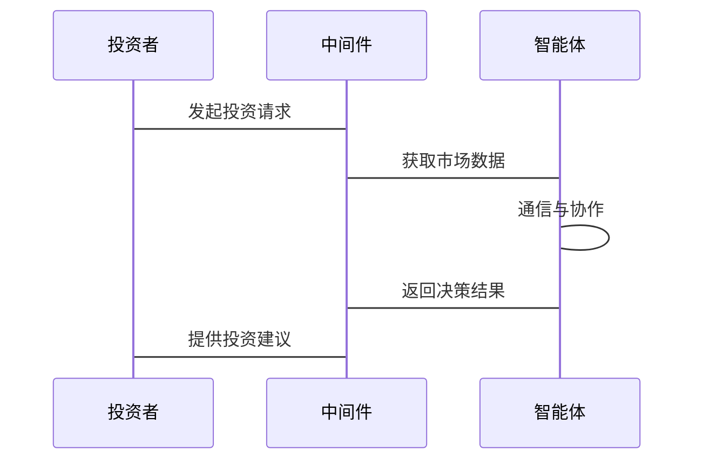

                 


```markdown
# 多智能体系统在新兴市场价值投资中的应用

> 关键词：多智能体系统，新兴市场，价值投资，算法原理，系统架构

> 摘要：本文探讨了多智能体系统在新兴市场价值投资中的应用，分析了多智能体系统的基本概念、核心原理、算法设计以及系统架构。通过实际案例分析，展示了多智能体系统如何在新兴市场中实现价值投资，并对未来的发展方向进行了展望。

---

## 第一部分: 多智能体系统与新兴市场价值投资的背景介绍

### 第1章: 多智能体系统的基本概念

#### 1.1 多智能体系统的定义与特点
##### 1.1.1 多智能体系统的定义
多智能体系统（Multi-Agent System, 简称MAS）是由多个智能体组成的系统，这些智能体能够通过协作完成复杂任务。每个智能体都有一定的自主性、反应性和社会性，能够与其他智能体或环境进行交互。

##### 1.1.2 多智能体系统的核心特点
- **自主性**：每个智能体能够独立决策。
- **反应性**：智能体能够感知环境并做出实时反应。
- **协作性**：多个智能体通过协作完成复杂任务。
- **分布性**：智能体之间分布式计算，无集中控制点。

##### 1.1.3 多智能体系统与传统投资方法的对比
| 特性 | 多智能体系统 | 传统投资方法 |
|------|--------------|---------------|
| 决策方式 | 分布式协作 | 集中式决策 |
| 反应速度 | 实时响应 | 周期性调整 |
| 处理复杂性 | 高效处理复杂任务 | 依赖人工经验 |

#### 1.2 新兴市场价值投资的特点
##### 1.2.1 新兴市场的定义与特征
新兴市场是指那些经济快速发展、资本市场逐渐成熟的国家或地区的市场。其特点是市场波动大、信息不透明、机会与风险并存。

##### 1.2.2 价值投资的基本原理
价值投资是一种投资策略，旨在通过发现市场价格低于内在价值的资产进行投资。核心在于寻找被市场低估的优质资产。

##### 1.2.3 新兴市场价值投资的独特性
- 市场波动剧烈，机会多。
- 信息不对称严重，需要多维度分析。
- 需要快速响应市场变化。

### 第2章: 多智能体系统在投资中的应用背景

#### 2.1 问题背景与问题描述
##### 2.1.1 投资市场的复杂性
投资市场受多种因素影响，如宏观经济、行业趋势、公司基本面等，单一智能体难以全面应对。

##### 2.1.2 传统投资方法的局限性
传统投资方法依赖人工经验，存在主观性强、反应速度慢、难以处理复杂任务等问题。

##### 2.1.3 多智能体系统的优势
多智能体系统能够通过分布式计算和协作，高效处理复杂任务，适应市场快速变化。

#### 2.2 问题解决与边界分析
##### 2.2.1 多智能体系统如何解决投资问题
通过分布式协作，多智能体系统能够快速分析市场数据，识别投资机会，降低风险。

##### 2.2.2 多智能体系统的边界与外延
- 系统边界：智能体之间的协作范围和数据共享范围。
- 外延：与外部数据源、交易平台的接口设计。

##### 2.2.3 多智能体系统的可行性分析
通过技术可行性、经济可行性和操作可行性分析，证明多智能体系统在投资中的可行性。

### 第3章: 多智能体系统的核心概念与联系

#### 3.1 多智能体系统的原理
##### 3.1.1 多智能体系统的组成
- **智能体**：独立决策的个体。
- **环境**：智能体所处的市场环境。
- **交互机制**：智能体之间的通信与协作方式。

##### 3.1.2 智能体之间的协同机制
- **通信机制**：智能体之间通过消息传递进行通信。
- **协作机制**：通过任务分配和协调实现协作。

##### 3.1.3 多智能体系统的决策过程
- **信息收集**：感知环境并收集数据。
- **信息处理**：分析数据并制定决策。
- **决策执行**：根据决策采取行动。

#### 3.2 核心概念对比分析
##### 3.2.1 多智能体系统与传统投资方法的对比
- 多智能体系统能够快速响应市场变化，而传统方法依赖人工经验。
- 多智能体系统通过协作实现复杂任务，而传统方法依赖集中式决策。

##### 3.2.2 多智能体系统与单一智能体的对比
- **决策方式**：多智能体系统是分布式协作，单一智能体是集中式决策。
- **处理复杂性**：多智能体系统更高效，单一智能体受限于计算能力。

##### 3.2.3 多智能体系统的优缺点分析
- **优点**：高效协作、快速响应、适应性强。
- **缺点**：系统复杂性高、通信开销大、协作协调难度大。

#### 3.3 ER实体关系图
```mermaid
erDiagram
    投资者 [investor] {
        id: int
        风险偏好: string
        投资目标: string
    }
    智能体 [agent] {
        id: int
        知识库: string
        行为策略: string
    }
    交易环境 [market] {
        时间戳: datetime
        价格数据: float
        市场情绪: string
    }
    投资者 --> 智能体: 委托
    智能体 --> 交易环境: 感知
    智能体 --> 智能体: 通信
```

---

## 第二部分: 多智能体系统的算法原理与数学模型

### 第4章: 算法原理

#### 4.1 多智能体系统的核心算法
##### 4.1.1 分布式计算与协作算法


##### 4.1.2 强化学习算法
```python
def reinforcement_learning():
    state = get_market_state()
    action = choose_action(state)
    reward = evaluate_action(action)
    update_policy(reward)
```

##### 4.1.3 分布式任务分配算法
```python
def distribute_tasks():
    tasks = get_tasks()
    agents = get_agents()
    assign_task_to_agent(tasks, agents)
```

#### 4.2 算法实现与代码示例
##### 4.2.1 多智能体协作的代码实现
```python
class Agent:
    def __init__(self, id):
        self.id = id
        self.knowledge = {}
    
    def perceive(self, environment):
        self.knowledge = environment.get_data()
    
    def decide(self):
        return self.knowledge['best_action']
    
    def communicate(self, other_agent):
        self.knowledge.update(other_agent.knowledge)
```

##### 4.2.2 任务分配的代码实现
```python
def assign_task(tasks, agents):
    for task in tasks:
        agent = agents[task % len(agents)]
        agent.knowledge = task
```

#### 4.3 算法的数学模型
##### 4.3.1 状态空间表示
$$
S = \{s_1, s_2, ..., s_n\}
$$
其中，$s_i$ 表示智能体的状态。

##### 4.3.2 动作空间表示
$$
A = \{a_1, a_2, ..., a_m\}
$$
其中，$a_j$ 表示智能体的动作。

##### 4.3.3 奖励函数
$$
R(s, a) = r
$$
其中，$r$ 表示执行动作 $a$ 在状态 $s$ 下的奖励。

---

## 第三部分: 系统分析与架构设计

### 第5章: 系统分析与架构设计

#### 5.1 投资场景介绍
##### 5.1.1 投资目标
通过多智能体系统实现新兴市场的价值投资。

##### 5.1.2 投资策略
基于多智能体系统的协作，发现市场中的低估资产。

#### 5.2 系统功能设计
##### 5.2.1 领域模型设计


##### 5.2.2 系统架构设计


#### 5.3 接口设计与交互流程
##### 5.3.1 系统接口设计
```plaintext
投资者 <-> 中间件: 委托请求
智能体 <-> 中间件: 数据获取与通信
```

##### 5.3.2 系统交互流程


---

## 第四部分: 项目实战

### 第6章: 项目实战

#### 6.1 环境搭建与安装
##### 6.1.1 系统环境
- 操作系统：Linux/Windows/MacOS
- 开发工具：Python、Jupyter Notebook
- 依赖库：numpy、pandas、matplotlib

#### 6.2 系统核心实现
##### 6.2.1 多智能体系统的代码实现
```python
class MultiAgentSystem:
    def __init__(self, num_agents):
        self.agents = [Agent(i) for i in range(num_agents)]
    
    def run(self):
        for agent in self.agents:
            agent.perceive(environment)
            agent.decide()
            agent.communicate()
```

##### 6.2.2 交易环境的模拟实现
```python
class MarketEnvironment:
    def __init__(self):
        self.data = {}
    
    def get_data(self):
        return self.data
```

#### 6.3 案例分析与结果解读
##### 6.3.1 案例介绍
以创业板为例，模拟新兴市场价值投资。

##### 6.3.2 数据分析与结果展示
```plaintext
市场数据 -> 系统处理 -> 投资建议
```

#### 6.4 项目小结
通过实际案例，验证了多智能体系统在新兴市场价值投资中的有效性。

---

## 第五部分: 总结与展望

### 第7章: 总结与展望

#### 7.1 最佳实践
- 系统设计要注重模块化与可扩展性。
- 数据来源要多样化，提高系统的抗风险能力。

#### 7.2 小结
通过本文的分析与实践，展示了多智能体系统在新兴市场价值投资中的巨大潜力。

#### 7.3 注意事项
- 系统的安全性与稳定性需要高度重视。
- 智能体的协作机制要合理设计，避免通信开销过大。

#### 7.4 拓展阅读
推荐阅读相关领域的书籍与论文，深入学习多智能体系统与投资策略的结合。

---

通过以上内容，我们详细探讨了多智能体系统在新兴市场价值投资中的应用，从理论到实践，为读者提供了全面的分析与指导。希望本文能够为相关领域的研究与实践提供有价值的参考。
```

