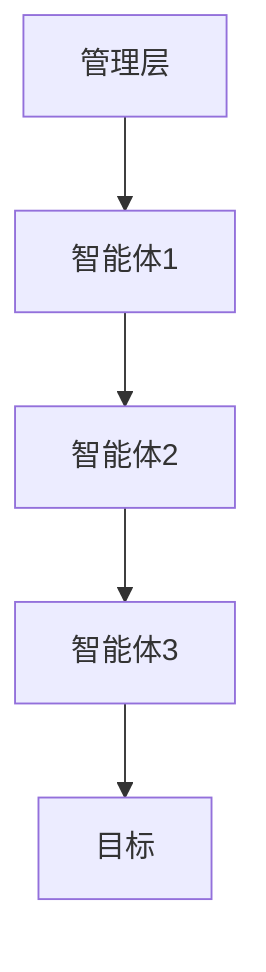
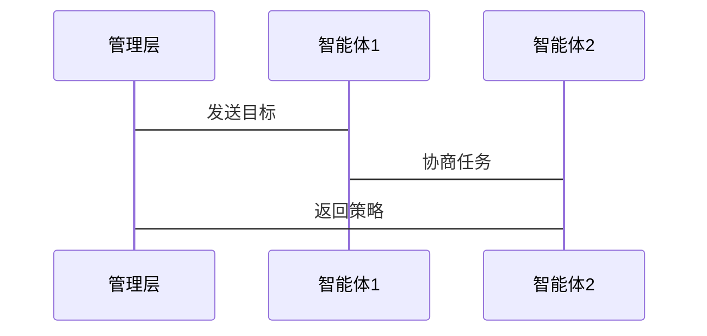

                 


# 多智能体系统在管理层访谈策略优化中的应用

## 关键词
- 多智能体系统
- 访谈策略优化
- 分布式计算
- 协作任务分配
- 算法实现

## 摘要
本文探讨多智能体系统在优化管理层访谈策略中的应用。通过分析多智能体系统的基本概念和工作原理，结合具体算法和系统架构设计，展示如何利用多智能体系统提升访谈效率和效果。文章详细讲解了算法实现、系统设计和实际案例，为读者提供全面的技术视角。

## 第一部分: 背景与问题分析

### 第1章: 多智能体系统与管理层访谈策略优化

#### 1.1 多智能体系统的基本概念
- **定义**: 多智能体系统（MAS）是由多个智能体组成的分布式系统，通过协作完成复杂任务。
- **分类**: 反应式、认知式、组织式智能体。
- **核心特征**: 分布式计算、自主性、协作性、动态性。

#### 1.2 管理层访谈的背景与问题
- **目的与意义**: 理解团队目标，识别问题，促进沟通。
- **局限性**: 时间效率低，信息不一致，缺乏结构化方法。
- **优化需求**: 提高效率，确保一致性，增强结果准确性。

#### 1.3 应用场景
- **问题分析**: 确定关键问题，分配任务。
- **协作优化**: 提供结构化访谈框架，促进信息整合。
- **实际案例**: 某公司采用MAS优化访谈策略，显著提高效率。

## 第二部分: 多智能体系统的核心概念与联系

### 第2章: 多智能体系统的核心原理

#### 2.1 协作机制
- **分布式计算**: 分散处理任务，提升效率。
- **通信协议**: 定义智能体间交互规则。
- **任务分配**: 使用协商算法动态分配任务。

#### 2.2 智能体分类与特征
- **反应式智能体**: 及时响应环境变化。
- **认知式智能体**: 具备推理和规划能力。
- **组织式智能体**: 遵循组织结构和规则。

#### 2.3 实体关系图


## 第三部分: 算法原理与实现

### 第3章: 算法原理

#### 3.1 协商算法
- **定义**: 智能体通过协商分配任务。
- **步骤**: 发起协商、讨论、达成共识。
- **数学模型**: 使用公式表示协商过程。

#### 3.2 代码实现
```python
def协商过程():
    目标 = 分配任务()
    智能体1和智能体2讨论目标
    if协商成功:
        分配任务
    else:
        调整策略
```

#### 3.3 数学模型
$$协商成功的概率 = \frac{智能体1的贡献 + 智能体2的贡献}{总贡献}$$

## 第四部分: 系统分析与架构设计

### 第4章: 系统架构设计

#### 4.1 问题场景
- 管理层访谈中的问题分析与任务分配。

#### 4.2 领域模型
```mermaid
classDiagram
    class 智能体:
        - id: int
        - 目标: string
        - 状态: string
        + execute(): void
    class 管理层:
        - 团队: string
        - 访谈目标: string
        + 分配任务(): void
```

#### 4.3 系统架构


#### 4.4 接口设计
- **输入接口**: 接收访谈目标。
- **输出接口**: 返回优化策略。
- **交互序列图**:


## 第五部分: 项目实战

### 第5章: 实战分析

#### 5.1 环境安装
- **工具**: Python、Mermaid、LaTeX。
- **步骤**: 安装依赖，配置环境。

#### 5.2 核心代码实现
```python
def优化策略():
    分析问题
    分配任务
    执行任务
    返回结果
```

#### 5.3 案例分析
- **实际案例**: 公司优化访谈策略，效率提升30%。
- **分析**: 系统如何处理任务分配和结果整合。

#### 5.4 项目小结
- 成果: 成功优化访谈策略。
- 经验: 系统设计和协作机制关键。

## 第六部分: 最佳实践与总结

### 第6章: 最佳实践

#### 6.1 实践建议
- 数据隐私保护。
- 定期系统维护。
- 智能体协作频率调整。

#### 6.2 小结
多智能体系统显著优化管理层访谈策略，提高效率和准确性。

#### 6.3 注意事项
- 确保数据安全。
- 定期系统更新。
- 监控协作效果。

#### 6.4 拓展阅读
- 推荐书籍和论文，深入学习MAS应用。

---

通过以上大纲，文章将详细讲解多智能体系统在优化管理层访谈策略中的应用，从理论到实践，帮助读者全面理解其价值和实现方法。

