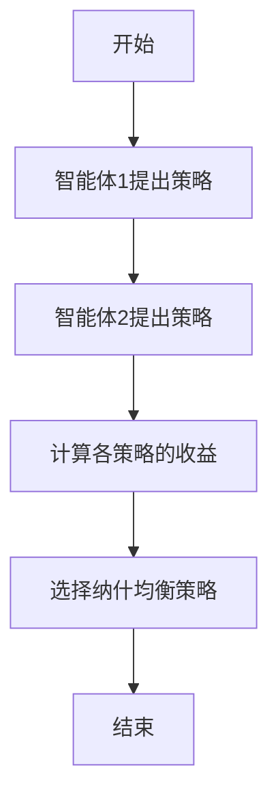
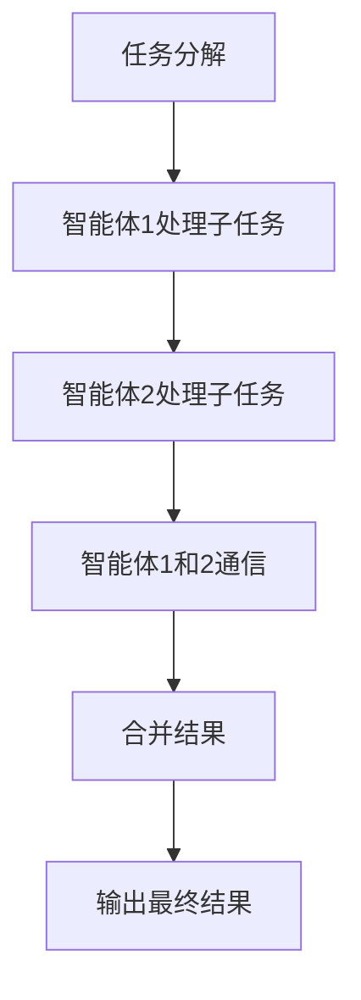
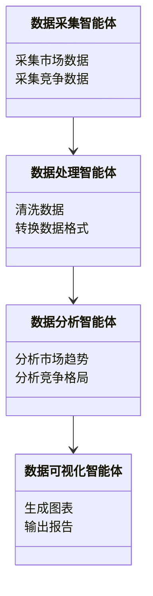
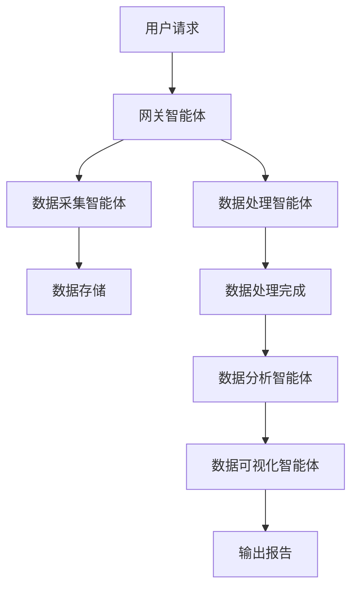

                 


# 多智能体系统在行业分析中的创新应用

## 关键词：多智能体系统，行业分析，人工智能，分布式计算，协同决策，数据分析

## 摘要：  
随着人工智能技术的飞速发展，多智能体系统（Multi-Agent Systems, MAS）作为一种新兴的技术范式，正在逐渐成为行业分析领域的重要工具。本文将深入探讨多智能体系统的核心概念、算法原理及其在行业分析中的创新应用。通过结合实际案例，本文将展示多智能体系统如何通过智能体间的协作与决策，提升行业分析的效率和准确性。同时，本文还将分析多智能体系统的优势与挑战，并对未来的发展方向进行展望。

---

## 第一部分: 背景介绍

### 第1章: 行业分析背景与多智能体系统

#### 1.1 行业分析的背景与挑战
行业分析是企业制定战略决策的重要依据，传统的行业分析方法依赖于人工数据收集和专家判断，存在效率低、成本高、信息滞后等问题。随着大数据和人工智能技术的发展，行业分析需要更加智能化、自动化和实时化的解决方案。

#### 1.2 多智能体系统的核心概念
多智能体系统是由多个智能体组成的分布式系统，这些智能体能够自主感知环境、进行推理和决策，并通过通信与协作完成复杂任务。多智能体系统具有分布式、自主性和协作性等特点，能够有效应对复杂环境中的动态问题。

#### 1.3 多智能体系统在行业分析中的应用背景
在行业分析中，多智能体系统可以通过分布式计算和协同决策，实现对海量数据的实时处理和分析。智能体可以分别负责数据采集、清洗、分析和可视化等任务，并通过协作提供综合的行业分析结果。

---

## 第二部分: 核心概念与联系

### 第2章: 多智能体系统的结构与原理

#### 2.1 多智能体系统的组成结构
多智能体系统由多个智能体、通信机制和共享环境组成。智能体可以是软件程序或算法，具有自主性和反应性，能够根据环境信息做出决策。

#### 2.2 多智能体系统与传统人工智能的对比
| **对比维度** | **多智能体系统（MAS）** | **传统人工智能（AI）** |
|----------------|--------------------------|--------------------------|
| 结构           | 分布式、多智能体协作    | 集中式、单点决策        |
| 决策方式       | 去中心化、局部决策      | 中心化、全局决策        |
| 应用场景       | 复杂协作任务            | 单一任务或问题解决      |

#### 2.3 多智能体系统与分布式系统的关系
多智能体系统可以看作是一种特殊的分布式系统，但其智能体具有更强的自主性和智能性。分布式系统关注数据的分布存储和计算，而多智能体系统更关注智能体之间的协作与通信。

---

## 第三部分: 算法原理

### 第3章: 多智能体系统的算法与数学模型

#### 3.1 多智能体协调算法
多智能体系统的协调算法包括分布式规划、协商算法和博弈论等方法。以下是基于博弈论的多智能体协调算法的流程图：



#### 3.2 分布式计算与通信
多智能体系统中的分布式计算需要考虑通信开销和计算效率。以下是分布式计算的基本流程：



#### 3.3 博弈论与协同决策
博弈论是多智能体系统中协同决策的重要工具。以下是纳什均衡的定义：

$$\text{纳什均衡：每个智能体的策略都是在给定其他智能体策略的情况下最优的}$$

---

## 第四部分: 系统分析与架构设计

### 第4章: 行业分析系统的架构设计

#### 4.1 行业分析的场景介绍
行业分析系统需要处理海量数据，包括市场数据、竞争数据和用户行为数据等。多智能体系统可以通过分布式计算和协同决策，提高数据分析的效率和准确性。

#### 4.2 系统功能设计
以下是行业分析系统的功能模块：



#### 4.3 系统架构设计
以下是多智能体系统的架构图：



---

## 第五部分: 项目实战

### 第5章: 实战项目实现

#### 5.1 环境搭建
安装Python和相关库：
```bash
pip install pandas numpy networkx
```

#### 5.2 核心代码实现
以下是多智能体系统的核心代码示例：

```python
import networkx as nx

class Agent:
    def __init__(self, name):
        self.name = name
        self.graph = nx.DiGraph()
        
    def add_edge(self, node1, node2):
        self.graph.add_edge(node1, node2)
        
    def get_neighbors(self, node):
        return list(self.graph.neighbors(node))
        
# 示例
agent1 = Agent("Agent1")
agent1.add_edge("A", "B")
agent1.add_edge("B", "C")
print(agent1.get_neighbors("A"))  # 输出: ['B']
```

#### 5.3 案例分析与解读
通过上述代码，我们可以实现智能体之间的通信与协作。例如，在行业分析中，数据采集智能体可以将数据传递给数据处理智能体，处理完成后传递给数据分析智能体，最终生成报告。

---

## 第六部分: 最佳实践

### 第6章: 小结与展望

#### 6.1 小结
多智能体系统通过智能体间的协作与通信，能够高效地解决行业分析中的复杂问题。本文详细介绍了多智能体系统的核心概念、算法原理和系统架构，并通过实战项目展示了其应用价值。

#### 6.2 注意事项
在实际应用中，需要注意多智能体系统的通信开销和安全性问题。同时，智能体的设计需要考虑容错性和可扩展性。

#### 6.3 拓展阅读
建议进一步阅读相关文献，例如《Multi-Agent Systems: Algorithmic, Complexity Theoretic, and Game Theoretic Foundations》。

---

## 结语

多智能体系统在行业分析中的应用前景广阔，随着人工智能技术的不断进步，多智能体系统将为企业提供更加智能化和高效的行业分析工具。

