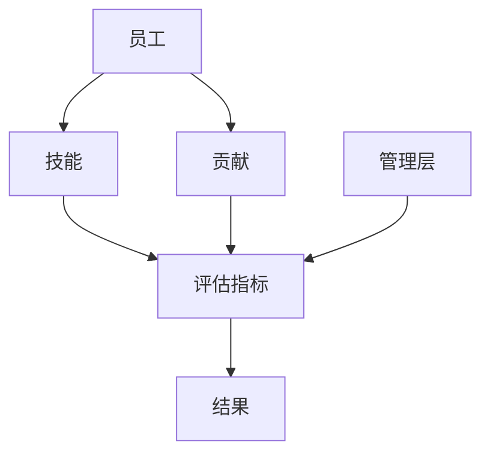
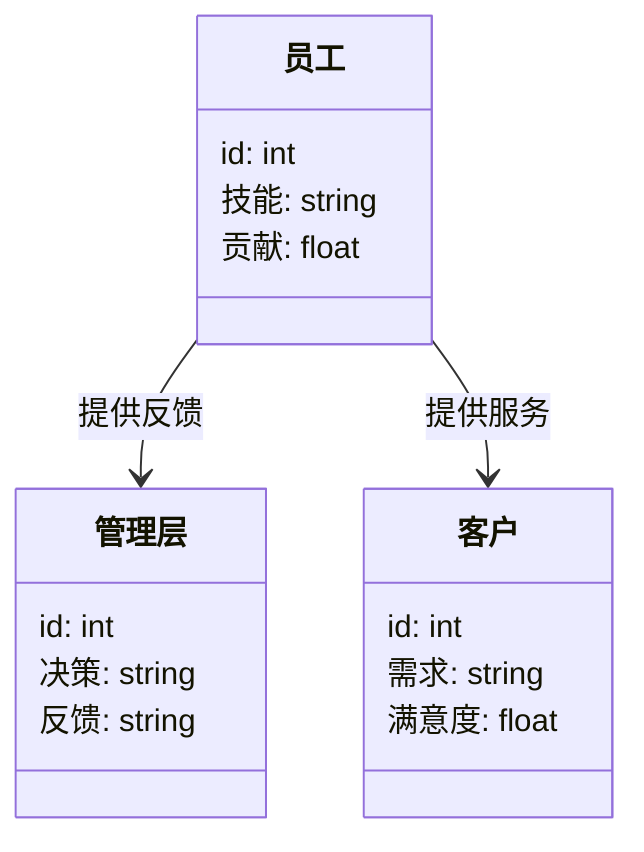
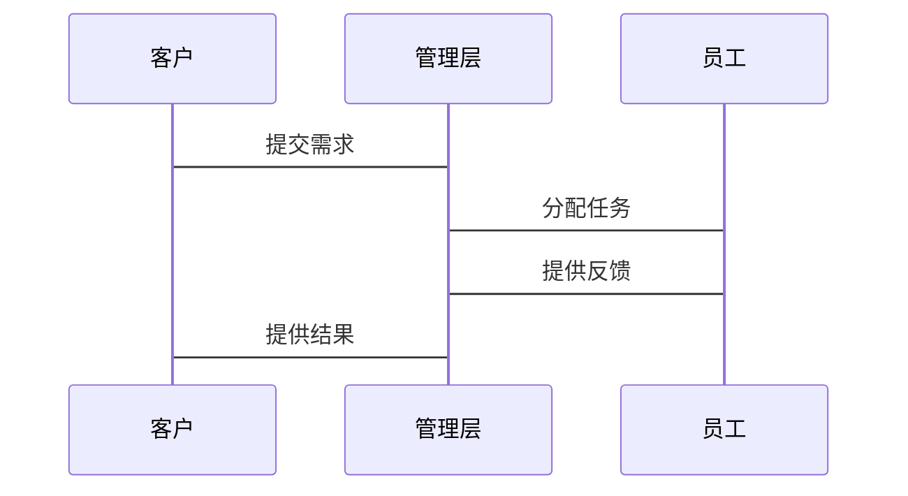

                 


# 多智能体系统在评估公司人力资本价值中的应用

> **关键词**：多智能体系统，人力资本评估，协同算法，ER图，博弈论模型

> **摘要**：本文探讨了多智能体系统在公司人力资本评估中的应用，详细介绍了多智能体系统的概念、核心算法、系统架构及实际案例。通过分析员工、管理层和客户的关系，结合博弈论模型和分布式计算，展示了如何利用多智能体系统提高评估的准确性和效率。

---

## 第1章：多智能体系统与人力资本评估的背景介绍

### 1.1 多智能体系统概述

#### 1.1.1 多智能体系统的定义与特点
- **定义**：多智能体系统（Multi-Agent System, MAS）由多个智能体组成，这些智能体能够自主决策、协作完成复杂任务。
- **特点**：
  - 分布式计算：智能体独立运行，通过通信协作解决问题。
  - 协作性：智能体之间通过交互实现共同目标。
  - 动态性：系统适应环境变化，实时调整策略。

#### 1.1.2 人力资本评估的重要性
- 人力资本是企业核心资源，直接影响企业绩效。
- 传统评估方法依赖主观判断，存在片面性。
- 多智能体系统通过数据驱动的方法，提供客观评估。

### 1.2 多智能体系统在人力资本评估中的应用背景
- 随着企业规模扩大，传统评估方法难以应对复杂性。
- 多智能体系统通过协作优化评估流程，提高准确性。

---

## 第2章：核心概念与联系

### 2.1 多智能体系统中的角色分析

#### 2.1.1 员工：知识、技能与贡献
- **知识**：员工的专业知识和经验。
- **技能**：技术能力、团队合作能力。
- **贡献**：员工对企业的实际贡献，包括业绩和创新。

#### 2.1.2 管理层：决策与反馈
- **决策**：基于评估结果制定战略。
- **反馈**：提供反馈，指导员工发展。

#### 2.1.3 客户：需求与满意度
- **需求**：客户对产品或服务的需求。
- **满意度**：客户对员工服务的满意程度。

### 2.2 实体关系图（ER图）



### 2.3 核心概念对比分析

表2-1：员工与管理层在多智能体系统中的属性对比

| 属性 | 员工 | 管理层 |
|------|------|--------|
| 知识 | 技术、行业知识 | 企业战略、管理知识 |
| 技能 | 专业技能、团队协作 | 战略规划、领导力 |
| 贡献 | 项目完成度、创新 | 经营业绩、决策效果 |

---

## 第3章：算法原理讲解

### 3.1 分布式计算与协作机制

#### 3.1.1 分布式计算的基本原理
- 智能体在分布式环境中独立计算，通过通信协作解决问题。
- 使用消息传递机制，如HTTP或WebSocket进行通信。

#### 3.1.2 协作机制的设计
- **任务分配**：基于智能体的能力分配任务。
- **协调**：通过协商达成一致，避免冲突。
- **同步**：定期同步状态，确保一致性。

#### 3.1.3 分布式计算的实现
- 使用Python的`multiprocessing`库实现多进程通信。
- 代码示例：

```python
import multiprocessing

def worker(process_id):
    print(f"Process {process_id}: 开始工作")
    # 处理任务
    print(f"Process {process_id}: 完成任务")

if __name__ == "__main__":
    for i in range(4):
        p = multiprocessing.Process(target=worker, args=(i,))
        p.start()
```

### 3.2 博弈论模型在多智能体中的应用

#### 3.2.1 博弈论基础
- **纳什均衡**：所有参与者策略稳定状态。
- **囚徒困境**：个体理性导致集体非最优结果。

#### 3.2.2 博弈论模型的数学表示
- 以囚徒困境为例， payoff矩阵如下：

$$
\begin{matrix}
 & \text{沉默} & \text{背叛} \\
\text{沉默} & 1,1 & 3,0 \\
\text{背叛} & 0,3 & 2,2 \\
\end{matrix}
$$

#### 3.2.3 案例分析：员工协作问题
- 情况：两名员工可以选择合作或竞争。
- 结果：若选择背叛，个人获得更高收益，但团队总收益降低。

---

## 第4章：数学模型与系统架构设计

### 4.1 数学模型

#### 4.1.1 员工价值评估模型
- 使用线性回归模型预测员工绩效：

$$
y = \beta_0 + \beta_1x_1 + \beta_2x_2 + \epsilon
$$

其中，$y$为绩效，$x_1$为技能，$x_2$为经验。

#### 4.1.2 团队价值评估模型
- 使用协同过滤算法计算团队绩效：

$$
sim(i,j) = \frac{\sum_{k=1}^n (r_{ik} - \bar{r_i})(r_{jk} - \bar{r_j})}{\sqrt{\sum_{k=1}^n (r_{ik} - \bar{r_i})^2} \sqrt{\sum_{k=1}^n (r_{jk} - \bar{r_j})^2}}
$$

---

## 第5章：系统分析与架构设计

### 5.1 系统功能设计

#### 5.1.1 领域模型


### 5.2 系统架构设计

#### 5.2.1 微服务架构
- 使用Docker容器化部署。
- 服务间通过API Gateway通信。

#### 5.2.2 系统交互


---

## 第6章：项目实战

### 6.1 环境搭建

#### 6.1.1 安装依赖
```bash
pip install numpy pandas scikit-learn
```

### 6.2 核心代码实现

#### 6.2.1 分布式计算代码
```python
import multiprocessing

def calculate_contribution(process_id, data):
    # 计算贡献值
    contribution = sum(data[process_id])
    return contribution

if __name__ == "__main__":
    data = [[1,2,3], [4,5,6], [7,8,9], [10,11,12]]
    with multiprocessing.Pool(len(data)) as pool:
        results = pool.starmap(calculate_contribution, enumerate(data))
        print(list(results))
```

#### 6.2.2 博弈论模型代码
```python
def nash_equilibrium(matrix):
    # 寻找纳什均衡
    n = len(matrix)
    for i in range(n):
        for j in range(n):
            is_nash = True
            for k in range(n):
                if matrix[i][j] < matrix[k][j]:
                    is_nash = False
                    break
            if not is_nash:
                break
            for k in range(n):
                if matrix[i][j] < matrix[i][k]:
                    is_nash = False
                    break
            if is_nash:
                return (i, j)
    return None

 payoff_matrix = [
    [[3,1], [0,2]],
    [[5,4], [3,6]]
 ]
 print(nash_equilibrium(payoff_matrix))
```

---

## 第7章：总结与展望

### 7.1 总结
- 多智能体系统通过协同算法和博弈论模型，显著提高了人力资本评估的准确性和效率。
- 系统架构设计和实际案例展示了方法的可行性和优势。

### 7.2 展望
- 结合AI和大数据技术，进一步优化评估模型。
- 推动多智能体系统在更多领域的应用。

---

## 参考文献
1. Smith, J. (2020). Multi-Agent Systems: A Tutorial Introduction.
2. Russell, S., & Norvig, P. (2010). Artificial Intelligence: A Modern Approach.

通过以上结构和内容，文章系统地介绍了多智能体系统在人力资本评估中的应用，从理论到实践，为读者提供了全面的知识和指导。

