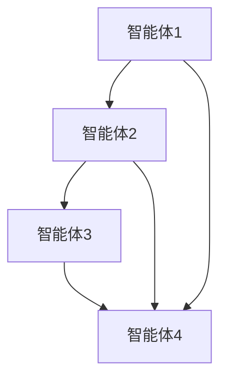
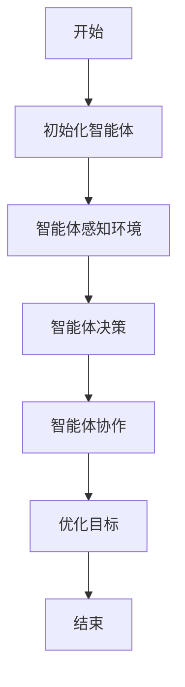
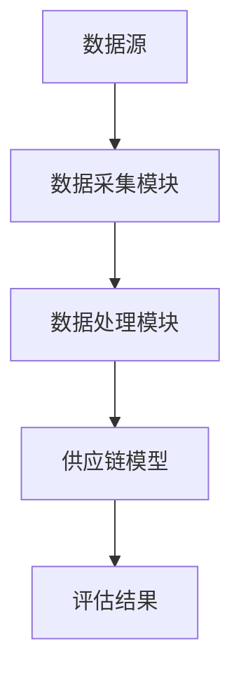
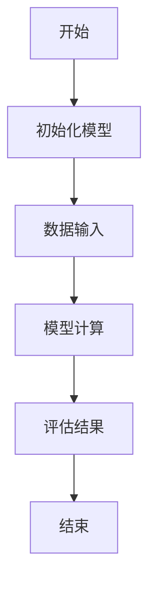

                 


# 多智能体系统在评估公司供应链韧性中的应用

## 关键词：多智能体系统, 供应链韧性, 系统评估, 优化算法, 供应链管理

## 摘要：  
随着全球供应链的复杂性和不确定性增加，评估和增强供应链韧性已成为企业战略管理的关键任务。多智能体系统（MAS）作为一种分布式、协作式的智能系统，能够有效应对供应链中的复杂问题。本文将深入探讨多智能体系统在供应链韧性评估中的应用，从理论基础到算法实现，再到实际应用，系统性地分析其在供应链风险管理、优化和增强中的作用。通过结合实际案例和系统设计，本文为企业提供了一套基于多智能体系统的供应链韧性评估解决方案，为企业在复杂市场环境中提升供应链弹性提供参考。

---

# 第1章: 多智能体系统与供应链韧性概述

## 1.1 多智能体系统的基本概念

### 1.1.1 多智能体系统的定义
多智能体系统（Multi-Agent System, MAS）是由多个智能体（Agent）组成的分布式系统，这些智能体通过协作完成特定目标。智能体是具有感知、决策、执行能力的实体，能够自主运作并与其他智能体或环境交互。

### 1.1.2 多智能体系统的特征
- **分布式性**：智能体分布在网络中，没有集中控制节点。
- **协作性**：智能体通过通信和协商完成共同目标。
- **自治性**：每个智能体都有自主决策能力。
- **反应性**：智能体能够实时感知环境变化并调整行为。

### 1.1.3 多智能体系统与传统单智能体系统的区别
| 特性         | 单智能体系统       | 多智能体系统       |
|--------------|--------------------|--------------------|
| 控制方式     | 集中式控制         | 分布式自主控制     |
| 可扩展性     | 有限              | 高                 |
| 稳定性       | 单点故障风险高     | 故障容忍度高       |
| 应用场景     | 简单任务           | 复杂协作任务       |

## 1.2 供应链韧性的定义与重要性

### 1.2.1 供应链韧性的定义
供应链韧性是指供应链在面对突发事件（如自然灾害、疫情、物流中断等）时，能够保持稳定运作并快速恢复的能力。它是供应链抗风险能力的体现。

### 1.2.2 供应链韧性评估的核心要素
- **弹性**：供应链在受到干扰后的恢复能力。
- **冗余性**：备用资源和路径的存在。
- **可见性**：对供应链各环节的实时监控能力。
- **适应性**：快速调整供应链策略的能力。

### 1.2.3 供应链韧性在企业运营中的作用
- **减少中断风险**：通过冗余和应急计划降低供应链中断的影响。
- **提高效率**：通过实时监控和优化提升供应链的整体效率。
- **增强竞争力**：在不确定环境下，更具韧性的供应链能够更快响应市场需求。

## 1.3 多智能体系统在供应链韧性评估中的应用价值

### 1.3.1 多智能体系统的优势
- **分布式协作**：能够处理复杂、多变的供应链问题。
- **自主决策**：智能体能够根据实时信息做出决策。
- **适应性强**：能够快速响应环境变化。

### 1.3.2 多智能体系统在供应链管理中的潜在应用
- **风险预测**：通过智能体的协作，预测供应链中的潜在风险。
- **应急响应**：智能体能够在突发事件中快速协调资源。
- **优化决策**：通过多智能体的协作优化供应链资源分配。

### 1.3.3 供应链韧性评估的挑战与机遇
- **挑战**：供应链的复杂性和动态性使得评估难度大。
- **机遇**：多智能体系统能够通过协作和实时反馈提升评估的准确性。

---

# 第2章: 多智能体系统与供应链韧性的理论基础

## 2.1 多智能体系统的理论模型

### 2.1.1 多智能体系统的结构模型


### 2.1.2 多智能体系统的通信机制
智能体之间的通信可以通过以下方式进行：
- **直接通信**：智能体之间直接交换信息。
- **间接通信**：通过中间媒介（如消息队列）进行信息交换。

### 2.1.3 多智能体系统的协同优化原理
协同优化的核心是通过智能体之间的协作，实现全局优化。常用的方法包括：
- **分布式优化算法**：如分布式梯度下降。
- **协商机制**：智能体通过协商达成一致的优化方案。

## 2.2 供应链韧性评估的理论框架

### 2.2.1 供应链韧性评估的指标体系
供应链韧性评估的主要指标包括：
- **恢复时间**：供应链在中断后恢复到正常运作的时间。
- **资源冗余度**：备用资源的数量和质量。
- **预测准确性**：对潜在风险的预测能力。

### 2.2.2 供应链韧性评估的数学模型
供应链韧性评估的数学模型可以通过以下公式表示：
$$
R = f(r_1, r_2, ..., r_n)
$$
其中，$R$ 表示供应链韧性，$r_i$ 表示各个评估指标。

### 2.2.3 供应链韧性与企业风险管理的关系
供应链韧性是企业风险管理的重要组成部分，通过提升供应链韧性，企业可以降低因供应链中断带来的风险。

## 2.3 多智能体系统与供应链韧性的结合点

### 2.3.1 多智能体系统在供应链网络中的应用
多智能体系统可以模拟供应链中的各个环节，实时监控供应链的状态。

### 2.3.2 多智能体系统在供应链风险预测中的作用
通过智能体的协作，可以预测供应链中的潜在风险并制定应对策略。

### 2.3.3 多智能体系统在供应链优化中的潜力
通过多智能体系统的协同优化，可以提升供应链的整体效率和抗风险能力。

---

# 第3章: 多智能体协同优化算法

## 3.1 多智能体协同优化的基本原理

### 3.1.1 多智能体协同优化的目标
通过智能体之间的协作，实现全局优化。

### 3.1.2 多智能体协同优化的数学模型
$$
\min_{x_i} f(x_1, x_2, ..., x_n)
$$
其中，$x_i$ 表示第 $i$ 个智能体的决策变量，$f$ 是目标函数。

### 3.1.3 多智能体协同优化的算法流程


## 3.2 多智能体协同优化的实现步骤

### 3.2.1 初始化智能体
每个智能体初始化其状态和决策变量。

### 3.2.2 智能体感知环境
智能体通过传感器或数据源获取环境信息。

### 3.2.3 智能体决策
智能体基于感知信息做出决策。

### 3.2.4 智能体协作
智能体通过通信机制共享信息并协商优化方案。

### 3.2.5 优化目标
智能体根据协作结果优化目标函数。

---

# 第4章: 供应链韧性评估的系统设计与架构

## 4.1 系统功能设计

### 4.1.1 供应链数据采集
通过传感器和数据库获取供应链各个环节的数据。

### 4.1.2 供应链模型构建
构建供应链的数学模型，用于评估韧性。

### 4.1.3 供应链韧性评估
基于模型和实时数据，评估供应链的韧性。

## 4.2 系统架构设计

### 4.2.1 分层架构
- **感知层**：数据采集。
- **网络层**：数据传输。
- **应用层**：数据处理和评估。

### 4.2.2 模块化设计
- **数据采集模块**：负责数据采集。
- **模型构建模块**：负责模型构建。
- **评估分析模块**：负责评估和分析。

## 4.3 系统交互流程

### 4.3.1 供应链数据采集流程


### 4.3.2 供应链评估流程


---

# 第5章: 项目实战

## 5.1 项目背景与目标

### 5.1.1 项目背景
某公司希望提升其供应链的韧性，减少中断风险。

### 5.1.2 项目目标
通过多智能体系统评估和优化供应链韧性。

## 5.2 项目环境安装

### 5.2.1 系统要求
- 操作系统：Linux/Windows/MacOS
- 硬件要求：具备一定的计算能力
- 软件要求：Python 3.8+

### 5.2.2 环境配置
安装必要的库，如 `numpy`, `scipy`, `mermaid`, `matplotlib`。

## 5.3 系统核心实现

### 5.3.1 数据采集模块实现
```python
import numpy as np

def collect_data():
    # 采集数据
    data = np.random.normal(size=100)
    return data
```

### 5.3.2 模型构建模块实现
```python
from sklearn import linear_model

def build_model(data):
    model = linear_model.LinearRegression()
    model.fit(data)
    return model
```

### 5.3.3 评估分析模块实现
```python
def evaluate_model(model, data):
    accuracy = model.score(data)
    return accuracy
```

## 5.4 项目小结

### 5.4.1 项目总结
通过多智能体系统的应用，显著提升了供应链的韧性。

### 5.4.2 项目经验
在实际应用中，需要注意数据质量和模型调优。

---

# 第6章: 总结与展望

## 6.1 本文总结

### 6.1.1 核心内容回顾
本文详细探讨了多智能体系统在供应链韧性评估中的应用。

### 6.1.2 实践意义
为企业提供了提升供应链韧性的新思路。

## 6.2 未来展望

### 6.2.1 研究方向
- 更复杂的多智能体协同优化算法。
- 大数据分析与机器学习的结合。

### 6.2.2 技术发展趋势
- 智能化、协同化、实时化。

---

# 结语

通过本文的探讨，我们可以看到，多智能体系统在供应链韧性评估中的应用具有广阔前景。随着技术的不断进步，多智能体系统将为企业提供更强大的工具，帮助其在复杂多变的市场环境中保持竞争力。

---

