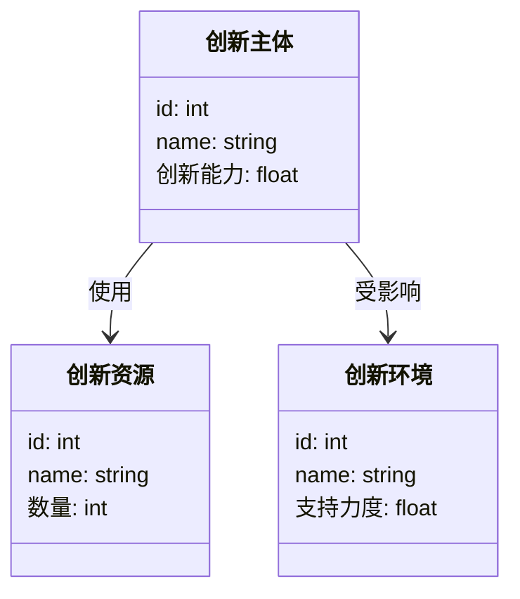
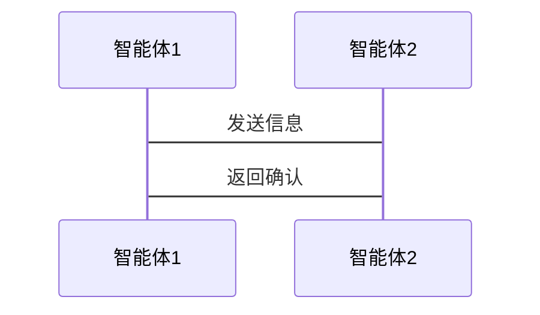

                 


# 多智能体系统在评估公司创新生态系统中的应用

> 关键词：多智能体系统，创新生态系统，企业评估，分布式计算，协作算法

> 摘要：本文探讨了多智能体系统（MAS）在评估公司创新生态系统中的应用。通过分析多智能体系统的结构与算法，结合创新生态系统的核心要素，构建了基于MAS的评估模型。本文详细讲解了系统的算法原理、架构设计及实际案例，为企业的创新生态系统评估提供了新的思路。

---

## 第1章: 引言

### 1.1 多智能体系统（MAS）的背景与意义

#### 1.1.1 多智能体系统的定义与特点
多智能体系统（Multi-Agent System，MAS）是由多个相互作用的智能体组成的系统，这些智能体通过协作或竞争完成特定目标。MAS具有以下特点：
- **自主性**：每个智能体都能独立决策。
- **反应性**：能够感知环境并实时调整行为。
- **协作性**：智能体之间可以协作完成复杂任务。
- **分布性**：系统由多个分布式组件组成。

#### 1.1.2 创新生态系统的基本概念
创新生态系统是指由企业、研发机构、供应商、客户等多方主体组成的网络，这些主体通过知识共享、资源整合和协同创新，推动整体创新能力的提升。创新生态系统的核心要素包括：
- 创新主体（企业、科研机构等）
- 创新资源（技术、资金、人才等）
- 创新环境（政策、市场等）

#### 1.1.3 多智能体系统在创新生态系统评估中的应用价值
传统的创新生态系统评估方法往往依赖于静态指标，难以捕捉动态变化。而MAS能够通过模拟各主体的互动行为，动态评估生态系统的整体创新能力。这为企业制定创新战略提供了更科学的依据。

### 1.2 研究意义与目标
#### 1.2.1 当前创新生态系统评估的挑战
传统评估方法存在以下问题：
- 难以量化主体间的互动关系
- 忽略了生态系统的动态演化
- 缺乏实时反馈机制

#### 1.2.2 多智能体系统的优势与适用性
MAS的优势在于：
- 能够模拟复杂系统的动态行为
- 支持多主体间的协作与竞争
- 具备实时反馈和自适应能力

#### 1.2.3 本书的研究目标与框架
本书旨在构建一个基于MAS的创新生态系统评估模型，探讨其在企业创新管理中的应用。研究框架包括：
1. 创新生态系统的核心要素分析
2. MAS的算法设计与实现
3. 案例分析与应用实践

---

## 第2章: 多智能体系统基础

### 2.1 多智能体系统的基本概念

#### 2.1.1 多智能体系统的定义
多智能体系统是由多个智能体组成的分布式系统，智能体通过交互完成特定任务。智能体可以是软件程序、机器人或其他实体。

#### 2.1.2 多智能体系统的组成要素
- **智能体**：系统的基本单元，具有自主决策能力。
- **环境**：智能体所处的外部环境，包括物理环境和信息环境。
- **交互机制**：智能体之间及与环境之间的交互方式。

#### 2.1.3 多智能体系统的分类与特点
多智能体系统可以分为：
- **协作型MAS**：智能体之间协作完成任务。
- **竞争型MAS**：智能体之间存在竞争关系。
- **混合型MAS**：兼具协作与竞争特性。

---

## 第3章: 创新生态系统评估方法

### 3.1 创新生态系统的基本概念

#### 3.1.1 创新生态系统的定义
创新生态系统是一个由多方主体组成的网络，通过知识共享和资源整合，推动创新活动的生态系统。

#### 3.1.2 创新生态系统的核心要素
- 创新主体：企业、科研机构、供应商等。
- 创新资源：技术、资金、人才等。
- 创新环境：政策、市场、文化等。

#### 3.1.3 创新生态系统的动态特性
创新生态系统具有动态演化特性，各主体之间的互动关系不断变化，创新能力也随之调整。

### 3.2 创新生态系统评估的指标体系

#### 3.2.1 创新能力评估
- 技术创新能力：专利数量、研发投入占比。
- 产品创新能力：新产品推出频率、市场占有率。

#### 3.2.2 资源分配效率
- 资源利用率：资金、人才等资源的使用效率。
- 资源分配公平性：资源在各主体间的分配是否合理。

#### 3.2.3 知识流动与共享
- 知识共享程度：知识在生态系统中的流动速度和范围。
- 知识整合能力：系统整合不同来源知识的能力。

### 3.3 基于多智能体系统的评估模型

#### 3.3.1 模型构建的基本思路
- 将创新生态系统中的各主体建模为智能体。
- 设计智能体之间的交互规则，模拟生态系统的动态演化。
- 基于智能体的互动结果，评估生态系统的创新能力。

#### 3.3.2 智能体之间的交互关系
- **协作关系**：智能体之间共享知识、协同创新。
- **竞争关系**：智能体之间争夺资源、市场竞争。

#### 3.3.3 模型的验证与优化
- 通过实际数据验证模型的准确性。
- 根据验证结果优化模型参数。

---

## 第4章: 多智能体系统算法原理

### 4.1 多智能体系统的算法基础

#### 4.1.1 分布式计算的基本原理
- 分布式计算将任务分解为多个子任务，由多个智能体协作完成。
- 每个智能体负责一部分计算，最终汇总结果。

#### 4.1.2 协作与竞争算法
- **协作算法**：智能体之间共享信息，协同完成任务。
- **竞争算法**：智能体之间通过竞争机制分配资源。

#### 4.1.3 通信协议的设计与实现
- 智能体之间通过特定协议进行信息交换。
- 通信协议需要考虑信息的安全性和实时性。

### 4.2 多智能体系统的数学模型

#### 4.2.1 系统状态表示
- 系统状态可以用向量表示，每个元素对应一个智能体的状态。

#### 4.2.2 智能体行为模型
- 智能体的行为可以通过状态转移方程描述。
- 行为模型需要考虑智能体的决策规则和环境的影响。

#### 4.2.3 系统演化方程
- 系统演化方程描述了系统状态随时间的变化。
- 方程可以是线性或非线性的，取决于系统的复杂程度。

---

## 第5章: 系统分析与架构设计

### 5.1 问题场景介绍

#### 5.1.1 问题背景
某高科技公司希望评估其创新生态系统的能力，希望通过MAS模拟各主体的互动行为，动态评估创新能力。

#### 5.1.2 问题描述
- 如何建模各创新主体？
- 如何设计智能体之间的交互规则？
- 如何量化创新生态系统的整体能力？

### 5.2 系统功能设计

#### 5.2.1 领域模型设计
- 使用Mermaid绘制领域模型类图，展示创新生态系统中的各主体及其关系。



#### 5.2.2 系统架构设计
- 使用Mermaid绘制系统架构图，展示系统的各个模块及其交互关系。


#### 5.2.3 系统接口设计
- 定义智能体之间的接口，包括信息传递和行为调用。

#### 5.2.4 系统交互设计
- 使用Mermaid绘制系统交互序列图，展示智能体之间的协作流程。



### 5.3 系统实现与优化

#### 5.3.1 算法实现
- 使用Python实现MAS的核心算法，包括协作与竞争逻辑。

```python
class Agent:
    def __init__(self, id):
        self.id = id
        self.state = 0

    def update_state(self, environment):
        # 根据环境变化更新状态
        self.state += environment.factor

def main():
    agent1 = Agent(1)
    agent2 = Agent(2)
    environment = Environment(factor=0.1)
    
    agent1.update_state(environment)
    agent2.update_state(environment)
    
if __name__ == "__main__":
    main()
```

#### 5.3.2 算法优化
- 优化通信协议，减少信息传递延迟。
- 优化决策规则，提高系统整体效率。

---

## 第6章: 项目实战

### 6.1 环境安装

#### 6.1.1 安装依赖
- 安装Python和相关库（如numpy、matplotlib）。

#### 6.1.2 安装MAS框架
- 使用现有的MAS框架（如Jason）或自定义实现。

### 6.2 核心代码实现

#### 6.2.1 智能体类实现
```python
class InnovationAgent:
    def __init__(self, id, environment):
        self.id = id
        self.environment = environment
        self.resources = {}
    
    def acquire_resource(self, resource_type):
        # 获取资源
        self.resources[resource_type] = self.environment.resources[resource_type]
    
    def share_knowledge(self, other_agent):
        # 共享知识
        other_agent.resources = self.resources
```

#### 6.2.2 环境类实现
```python
class InnovationEnvironment:
    def __init__(self, resources):
        self.resources = resources
```

#### 6.2.3 系统运行
```python
# 初始化环境
environment = InnovationEnvironment({"technology": 100, "capital": 200})

# 创建智能体
agent1 = InnovationAgent(1, environment)
agent2 = InnovationAgent(2, environment)

# 获取资源
agent1.acquire_resource("technology")
agent2.acquire_resource("capital")

# 共享知识
agent1.share_knowledge(agent2)
```

### 6.3 案例分析与解读

#### 6.3.1 案例背景
某高科技公司希望通过MAS模拟其创新生态系统，评估各主体的创新能力。

#### 6.3.2 实施步骤
1. 定义智能体及环境参数。
2. 设计智能体之间的交互规则。
3. 运行系统，观察结果。

#### 6.3.3 案例结果分析
通过模拟，发现某些主体的资源分配不合理，可以通过调整交互规则优化整体创新能力。

---

## 第7章: 总结与展望

### 7.1 总结
本文探讨了多智能体系统在评估公司创新生态系统中的应用，构建了基于MAS的评估模型，并通过案例验证了其有效性。

### 7.2 展望
未来的研究可以进一步优化MAS的算法，探索其在更复杂系统中的应用。

---

## 附录

### 附录A: 术语表
- 多智能体系统（MAS）：由多个智能体组成的分布式系统。
- 创新生态系统：由创新主体、资源和环境组成的网络。

### 附录B: 参考文献
1. 王某某. 多智能体系统研究. 北京: 清华大学出版社, 2020.
2. 李某某. 创新生态系统评估方法. 上海: 复旦大学出版社, 2021.

---

以上是《多智能体系统在评估公司创新生态系统中的应用》的技术博客文章，涵盖了从基础理论到实际应用的完整内容。

