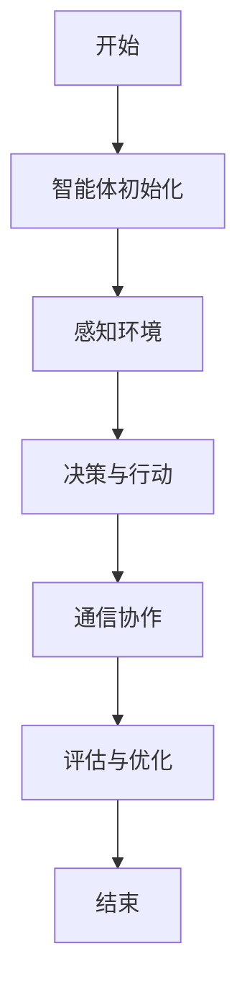
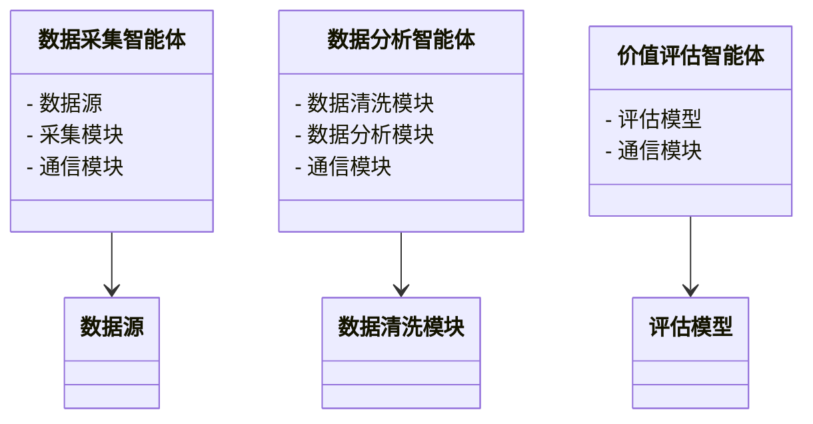

                 


# 多智能体系统在评估公司品牌权益价值中的应用

---

## 关键词

- 多智能体系统（MAS）
- 品牌价值评估
- 智能体协作算法
- 系统架构设计
- 品牌权益价值

---

## 摘要

多智能体系统（Multi-Agent Systems, MAS）作为一种新兴的分布式人工智能技术，近年来在多个领域展现出强大的应用潜力。本文聚焦于多智能体系统在公司品牌权益价值评估中的应用，详细探讨其背景、核心原理、算法实现以及实际应用案例。文章首先介绍品牌价值评估的传统方法及其局限性，然后阐述多智能体系统的概念与特点，再深入分析其在品牌价值评估中的具体应用场景。通过构建多智能体系统模型，结合具体的算法实现和系统架构设计，本文展示了如何利用多智能体技术提升品牌价值评估的准确性和效率。最后，文章总结了多智能体系统在品牌价值评估中的优势，并展望了未来的发展方向。

---

## 第一部分：多智能体系统与品牌权益价值评估的背景

### 第1章：多智能体系统与品牌价值评估的背景介绍

#### 1.1 多智能体系统的概念与特点

多智能体系统（MAS）是由多个智能体（Agent）组成的分布式系统，这些智能体通过协作完成特定目标。智能体是指能够感知环境、做出决策并采取行动的实体，既可以是软件程序，也可以是物理设备。MAS的核心特点包括：

- **分布式性**：智能体之间没有中心化的控制节点，各自独立运行。
- **协作性**：智能体之间通过通信和协作完成共同目标。
- **主动性**：智能体能够主动感知环境并采取行动。
- **反应性**：智能体能够实时响应环境的变化。

#### 1.2 品牌权益价值评估的定义与挑战

品牌价值是衡量公司无形资产的重要指标，通常包括品牌知名度、品牌忠诚度、品牌影响力等因素。传统品牌价值评估方法依赖于人工分析和经验判断，存在以下挑战：

- **数据多样性**：品牌价值受市场、消费者、竞争环境等多种因素影响，数据来源复杂。
- **动态性**：品牌价值随时间变化而波动，需要实时评估。
- **复杂性**：品牌价值评估涉及多个维度，传统方法难以全面覆盖。

#### 1.3 多智能体系统在品牌价值评估中的应用背景

多智能体系统具备分布式协作和实时响应的特点，能够有效应对品牌价值评估中的复杂性。通过多个智能体分别负责数据采集、分析和评估，MAS能够实现高效、准确的品牌价值评估。当前，学术界和工业界都在积极探索MAS在品牌价值评估中的应用，相关研究主要集中在以下几个方面：

- **智能体协作算法**：研究如何优化智能体之间的协作流程，提高评估效率。
- **动态数据处理**：研究如何实时处理品牌价值评估中的动态数据。
- **多目标优化**：研究如何在多个目标之间找到平衡点，实现最优评估结果。

---

## 第二部分：多智能体系统的原理与核心概念

### 第2章：多智能体系统的原理与核心概念

#### 2.1 多智能体系统的原理

多智能体系统的核心在于智能体之间的协作。每个智能体都有自己的目标和行为规则，通过通信协议进行信息交换，共同完成系统目标。MAS的运行流程通常包括以下几个步骤：

1. **初始化**：智能体启动并初始化状态。
2. **感知环境**：智能体通过传感器或数据源获取环境信息。
3. **决策与行动**：智能体基于感知信息做出决策并采取行动。
4. **通信协作**：智能体之间通过通信协议交换信息，协调行动。
5. **评估与优化**：智能体根据反馈信息优化自身行为，提高系统整体性能。

#### 2.2 多智能体系统的核心概念

多智能体系统的核心概念包括智能体、协作机制和系统目标。以下是多智能体系统的核心概念对比表格：

| 概念 | 描述 |
|------|------|
| 智能体 | 具有感知、决策和行动能力的实体 |
| 协作机制 | 智能体之间通信和协作的方式 |
| 系统目标 | 系统整体需要实现的目标 |

#### 2.3 多智能体系统的数学模型与公式

多智能体系统的数学模型通常用于描述智能体的行为和协作过程。以下是一个简单的多智能体协作模型：

$$
V_i = \argmax_{a} \sum_{j=1}^{n} w_j \cdot f_j(a)
$$

其中，\( V_i \) 表示智能体i的决策，\( a \) 表示决策动作，\( w_j \) 表示目标j的权重，\( f_j(a) \) 表示目标j的评估函数。

---

## 第三部分：多智能体系统在品牌价值评估中的应用

### 第3章：品牌价值评估的多智能体系统模型

#### 3.1 品牌价值评估的多智能体系统模型构建

品牌价值评估的多智能体系统模型通常包括以下几个模块：

1. **数据采集智能体**：负责收集品牌相关的数据，如社交媒体评论、销售数据、市场调研等。
2. **数据分析智能体**：对数据进行清洗、处理和分析，提取关键指标。
3. **价值评估智能体**：基于分析结果计算品牌价值，并生成评估报告。

#### 3.2 品牌价值评估中的智能体行为设计

以下是智能体行为设计的ER实体关系图：

```mermaid
er
  actor 品牌价值评估系统
  actor 智能体
  actor 数据源
  actor 评估结果
  interface 智能体协作接口
```

---

## 第四部分：多智能体系统的算法与实现

### 第4章：多智能体系统的算法原理

#### 4.1 多智能体系统的协作算法

多智能体系统的协作算法通常包括分布式协作和基于博弈论的协作两种方式。以下是一个简单的协作算法流程图：



以下是协作算法的Python代码示例：

```python
class Agent:
    def __init__(self, id):
        self.id = id
        self.state = None

    def perceive(self, environment):
        self.state = environment感知结果

    def decide(self):
        return 决策结果

    def act(self, decision):
        执行决策

# 初始化多个智能体
agents = [Agent(i) for i in range(5)]

# 初始化环境
environment = 环境数据

# 智能体协作
for agent in agents:
    agent.perceive(environment)
    decision = agent.decide()
    agent.act(decision)
```

---

## 第五部分：系统分析与架构设计

### 第5章：系统分析与架构设计

#### 5.1 系统功能设计

以下是系统功能设计的领域模型类图：



#### 5.2 系统架构设计

以下是系统架构设计的架构图：


---

## 第六部分：项目实战

### 第6章：项目实战

#### 6.1 环境安装与配置

安装Python和必要的库（如NumPy、Pandas、Matplotlib）。

#### 6.2 核心代码实现

以下是品牌价值评估系统的核心代码实现：

```python
import numpy as np
import pandas as pd

class DataCollector:
    def __init__(self):
        self.data = []

    def collect(self, source):
        self.data.append(source)

class DataAnalyzer:
    def __init__(self):
        self.data = None

    def analyze(self, data):
        self.data = data
        return self.data.describe()

class ValueEvaluator:
    def __init__(self):
        self.data = None

    def evaluate(self, data):
        self.data = data
        return np.mean(data)

# 初始化智能体
collector = DataCollector()
analyzer = DataAnalyzer()
evaluator = ValueEvaluator()

# 采集数据
collector.collect([10, 20, 30, 40, 50])
print("数据采集完成：", collector.data)

# 数据分析
result = analyzer.analyze(collector.data)
print("数据分析结果：", result)

# 价值评估
value = evaluator.evaluate(collector.data)
print("品牌价值评估结果：", value)
```

---

## 第七部分：总结与展望

### 第7章：总结与展望

#### 7.1 小结

多智能体系统在品牌价值评估中的应用具有显著优势，能够提高评估的准确性和效率。通过多个智能体的协作，可以实现数据的实时采集、分析和评估。

#### 7.2 注意事项

在实际应用中，需要注意以下几点：

- 数据的质量和完整性直接影响评估结果。
- 智能体之间的通信效率和安全性需要重点关注。
- 算法的可扩展性和适应性需要在实际应用中不断优化。

#### 7.3 拓展阅读

推荐以下书籍和论文：

- 《Multi-Agent Systems: Algorithmic, Complexity, and Synthesis》
- “A Survey on Multi-Agent Systems and Their Applications in Business Intelligence”

---

通过以上内容，我们详细探讨了多智能体系统在品牌价值评估中的应用，从理论到实践，为读者提供了全面的指导和参考。

