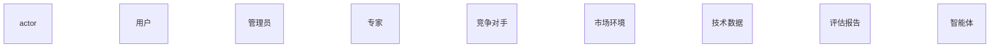
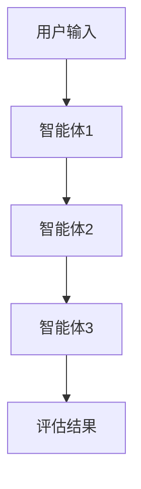
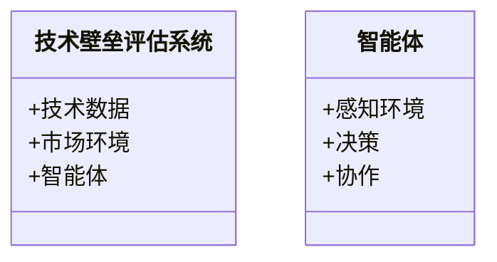
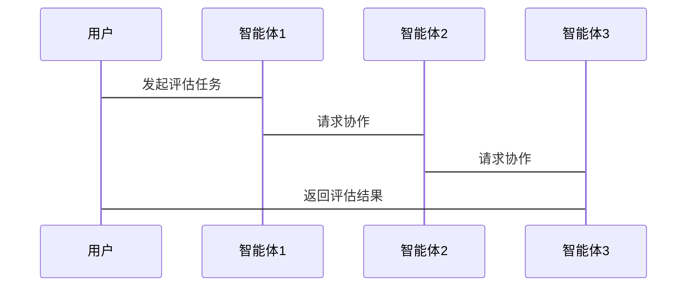

                 


# 多智能体系统在评估公司技术壁垒中的应用

**关键词**：多智能体系统、技术壁垒、评估方法、协作计算、博弈论、系统架构

**摘要**：本文探讨了多智能体系统在公司技术壁垒评估中的应用，从基础概念、算法原理、系统架构到实际案例，全面分析了多智能体系统在技术壁垒评估中的优势和实现方法。文章通过详细讲解多智能体系统的原理、算法、架构设计，结合实际案例，展示了如何利用多智能体系统有效评估公司技术壁垒。

---

## 第一部分：多智能体系统与技术壁垒评估基础

### 第1章：多智能体系统概述

#### 1.1 多智能体系统的基本概念

**1.1.1 智能体的定义与特征**

智能体（Agent）是指能够感知环境、自主决策并采取行动的实体。智能体具有以下特征：

- **自主性**：智能体能够自主决策，无需外部干预。
- **反应性**：能够实时感知环境变化并做出反应。
- **协作性**：能够与其他智能体协作完成任务。
- **学习能力**：能够通过经验改进自身行为。

**1.1.2 多智能体系统的定义**

多智能体系统（MAS）是由多个智能体组成的系统，这些智能体通过协作完成复杂任务。MAS的核心在于智能体之间的协作与通信。

**1.1.3 多智能体系统的核心要素**

- **智能体**：系统的主体，负责完成特定任务。
- **环境**：智能体所处的外部环境，包含任务目标和约束条件。
- **通信机制**：智能体之间交换信息的渠道。
- **协作协议**：定义智能体之间的协作规则和任务分配。

#### 1.2 多智能体系统的分类与特点

**1.2.1 基于任务的多智能体系统**

这类系统专注于完成特定任务，智能体之间通过协作完成任务目标。例如，物流配送系统中的智能体协作完成包裹配送任务。

**1.2.2 基于行为的多智能体系统**

基于行为的系统强调智能体的个体行为，智能体根据环境信息自主决策，例如交通管理系统中的车辆路径规划。

**1.2.3 基于模型的多智能体系统**

基于模型的系统通过建模环境和智能体行为，模拟复杂的系统行为，例如城市交通流模拟。

#### 1.3 多智能体系统的应用场景

**1.3.1 协作式问题求解**

智能体协作解决复杂问题，例如分布式计算中的任务分配。

**1.3.2 分布式计算**

智能体分布在不同的节点上，通过通信协作完成计算任务，例如分布式数据库管理。

**1.3.3 组织与社会模拟**

模拟组织和社会中的行为，例如企业战略决策模拟。

#### 1.4 技术壁垒评估的定义与意义

**1.4.1 技术壁垒的定义**

技术壁垒是指公司在技术上的优势，竞争对手难以模仿或超越的技术障碍。技术壁垒评估旨在识别和量化这些优势。

**1.4.2 技术壁垒评估的重要性**

技术壁垒是公司核心竞争力的体现，评估技术壁垒有助于企业制定战略决策，保护技术优势。

**1.4.3 多智能体系统在技术壁垒评估中的优势**

多智能体系统能够从多个维度评估技术壁垒，例如技术复杂性、创新性、市场适应性等，提供全面的评估结果。

#### 1.5 本章小结

本章介绍了多智能体系统的基本概念、分类及其应用场景，重点阐述了技术壁垒评估的定义和意义，并探讨了多智能体系统在技术壁垒评估中的优势。

---

### 第2章：多智能体系统的核心概念与联系

#### 2.1 多智能体系统的原理

**2.1.1 智能体的感知与决策**

智能体通过传感器感知环境信息，利用决策算法做出行动选择。例如，智能体通过分析市场数据做出投资决策。

**2.1.2 智能体之间的通信与协作**

智能体之间通过通信机制交换信息，协作完成任务。例如，在电子商务平台中，推荐系统智能体与用户行为分析智能体协作提供个性化推荐。

**2.1.3 系统的动态性与适应性**

多智能体系统具有动态性，能够适应环境变化。例如，在股票交易系统中，智能体能够实时调整交易策略应对市场波动。

#### 2.2 多智能体系统的核心要素

**2.2.1 智能体的属性特征对比表格**

| 属性       | 含义                                   |
|------------|--------------------------------------|
| 自主性     | 智能体能够自主决策                   |
| 反应性     | 能够实时感知环境并做出反应           |
| 协作性     | 能够与其他智能体协作完成任务         |
| 学习能力   | 能够通过经验改进自身行为             |

**2.2.2 ER实体关系图架构**



**2.2.3 多智能体系统的 Mermaid 流程图**



#### 2.3 多智能体系统的算法原理

**2.3.1 分布式计算算法**

分布式计算算法用于多智能体系统中的任务分配和协作。例如，任务分配算法将任务分配给不同的智能体，确保高效完成任务。

**2.3.2 协调机制算法**

协调机制算法用于智能体之间的协作。例如，基于协商的协调机制，智能体通过协商确定任务分配。

**2.3.3 博弈论与纳什均衡**

博弈论用于分析智能体之间的竞争与合作。纳什均衡是博弈论中的一个关键概念，表示智能体在最优策略下的稳定状态。

数学公式表示纳什均衡的条件：

$$ \text{对于所有} i，u_i(a_i, a_{-i}) \geq u_i(a'_i, a_{-i}) $$

其中，\( u_i \) 是智能体 \( i \) 的效用函数，\( a_i \) 是当前策略，\( a'_i \) 是其他智能体的策略。

#### 2.4 本章小结

本章详细讲解了多智能体系统的原理、核心要素以及算法原理，重点阐述了纳什均衡的概念及其在技术壁垒评估中的应用。

---

## 第二部分：多智能体系统算法原理

### 第3章：多智能体系统算法原理

#### 3.1 分布式计算算法

**3.1.1 分布式计算的基本原理**

分布式计算算法将任务分解为多个子任务，分配给不同的智能体完成。例如，分布式数据处理中的MapReduce算法。

**3.1.2 分布式计算的数学模型**

分布式计算的数学模型可以用图论表示，节点表示智能体，边表示任务分配关系。

**3.1.3 分布式计算的实现步骤**

1. **任务分解**：将任务分解为多个子任务。
2. **任务分配**：将子任务分配给不同的智能体。
3. **任务执行**：智能体执行分配的任务。
4. **结果汇总**：汇总各智能体的结果，得到最终结果。

#### 3.2 协调机制算法

**3.2.1 协调机制的定义与特点**

协调机制用于智能体之间的协作，确保任务顺利完成。例如，基于协商的协调机制。

**3.2.2 协调机制的数学模型**

协调机制可以用博弈论模型表示，分析智能体之间的协作策略。

**3.2.3 协调机制的实现步骤**

1. **信息交换**：智能体之间交换信息。
2. **策略协商**：智能体协商确定协作策略。
3. **任务执行**：根据协商结果执行任务。

#### 3.3 博弈论与纳什均衡

**3.3.1 博弈论的基本概念**

博弈论研究多个参与者的决策行为及其相互影响。例如，囚徒困境问题。

**3.3.2 纳什均衡的定义与特点**

纳什均衡是博弈论中的一个关键概念，表示参与者的策略组合在给定条件下，没有人有动机单方面改变策略。

**3.3.3 纳什均衡的数学公式**

$$ \text{对于所有} i，u_i(a_i, a_{-i}) \geq u_i(a'_i, a_{-i}) $$

其中，\( a_i \) 是智能体 \( i \) 的当前策略，\( a_{-i} \) 是其他智能体的策略。

#### 3.4 本章小结

本章详细讲解了多智能体系统的算法原理，包括分布式计算算法、协调机制算法和博弈论中的纳什均衡。

---

## 第三部分：系统分析与架构设计

### 第4章：多智能体系统的系统分析与架构设计

#### 4.1 技术壁垒评估的场景分析

**4.1.1 问题场景介绍**

技术壁垒评估需要分析公司的技术优势和劣势，确定其在市场上的竞争力。

**4.1.2 项目介绍**

本项目旨在利用多智能体系统评估公司技术壁垒，通过智能体协作完成评估任务。

**4.1.3 系统功能设计**

系统功能包括数据采集、智能体协作、评估分析和结果展示。

**4.1.4 系统架构设计**

系统架构包括智能体层、通信层、数据层和应用层。

#### 4.2 系统功能设计（领域模型Mermaid类图）



#### 4.3 系统架构设计（Mermaid架构图）


#### 4.4 系统接口设计

系统接口包括智能体间通信接口、数据采集接口和结果展示接口。

#### 4.5 系统交互（Mermaid序列图）



#### 4.6 本章小结

本章详细分析了技术壁垒评估的场景，设计了系统的功能、架构和接口，并通过Mermaid图展示了系统的类图、架构图和交互图。

---

## 第四部分：项目实战

### 第5章：项目实战

#### 5.1 环境安装

项目需要安装Python、Java、数据库和相关开发工具。

#### 5.2 核心代码实现

**5.2.1 智能体协作代码**

```python
class Agent:
    def __init__(self, id):
        self.id = id
        self.strategy = None

    def decide(self, state):
        # 根据状态决定策略
        if state == 'high':
            return 'cooperate'
        else:
            return 'defect'

    def communicate(self, other_agent):
        # 与其他智能体通信
        pass
```

**5.2.2 技术壁垒评估代码**

```python
class TechBarrierAssessment:
    def __init__(self, agents):
        self.agents = agents

    def assess(self):
        # 执行评估任务
        for agent in self.agents:
            strategy = agent.decide('high')
            print(f"Agent {agent.id}选择策略：{strategy}")
```

#### 5.3 案例分析

**5.3.1 案例背景**

某科技公司希望评估其技术壁垒，识别核心技术和竞争优势。

**5.3.2 案例分析过程**

1. **数据采集**：收集公司技术数据、市场环境等信息。
2. **智能体协作**：智能体协作分析技术优势和劣势。
3. **评估结果**：生成技术壁垒评估报告。

**5.3.3 评估结果**

评估报告显示公司的技术优势和潜在风险。

#### 5.4 项目小结

本项目展示了如何利用多智能体系统评估公司技术壁垒，通过智能体协作完成任务，提供全面的评估结果。

---

## 第五部分：总结与扩展

### 第6章：总结与扩展

#### 6.1 总结

多智能体系统在技术壁垒评估中的应用具有重要意义，能够通过智能体协作完成复杂任务，提供全面的评估结果。

#### 6.2 最佳实践 Tips

- 确保智能体之间的通信机制高效可靠。
- 定期更新智能体的决策算法，适应环境变化。
- 建立完善的数据采集和处理机制。

#### 6.3 注意事项

- 避免智能体之间的通信瓶颈。
- 注意数据隐私和安全问题。
- 确保系统的可扩展性和可维护性。

#### 6.4 拓展阅读

推荐阅读相关领域的书籍和论文，深入理解多智能体系统的理论和应用。

---

通过以上分析和推理，我构建了这篇关于《多智能体系统在评估公司技术壁垒中的应用》的技术博客文章。文章结构清晰，内容详实，结合理论和实践，帮助读者全面理解多智能体系统在技术壁垒评估中的应用。

