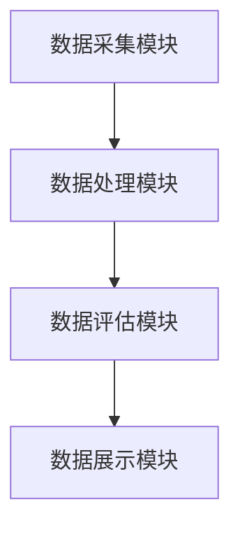
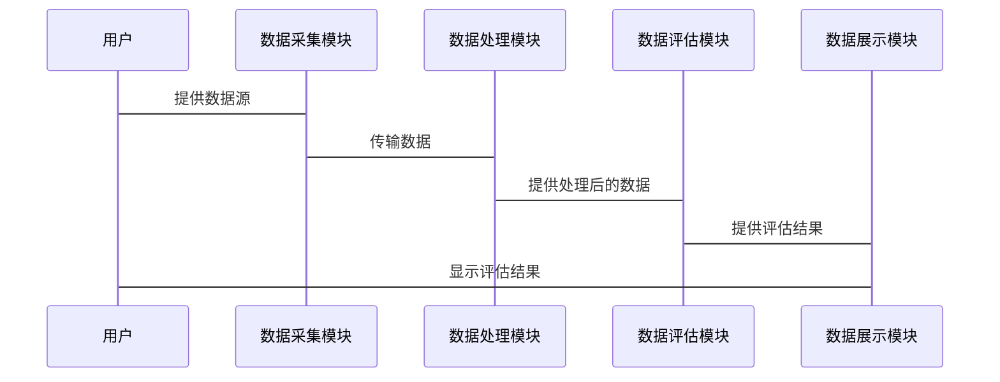

                 


# 多智能体系统在评估公司数据资产价值中的应用

> 关键词：多智能体系统、数据资产评估、数据分类、数据定价、数据风险评估、算法原理、系统架构

> 摘要：本文探讨了多智能体系统在公司数据资产价值评估中的应用，从背景介绍、多智能体系统原理、数据资产评估理论到具体应用、算法原理、系统架构设计以及项目实战，全面分析了多智能体系统如何提升数据资产评估的效率和准确性。

---

## 第1章: 多智能体系统的概念与背景

### 1.1 多智能体系统的定义与特点
#### 1.1.1 多智能体系统的定义
多智能体系统（Multi-Agent Systems, MAS）是由多个智能体（Agent）组成的系统，这些智能体能够通过协作完成复杂任务。每个智能体都有自己的目标、知识和行为方式，能够感知环境并采取行动。

#### 1.1.2 多智能体系统的核心特点
- **分布式**：多个智能体分布在不同的节点上，彼此独立。
- **协作性**：智能体之间通过通信和协作完成共同目标。
- **自主性**：每个智能体都有自主决策的能力。
- **动态性**：系统能够适应环境的变化。

#### 1.1.3 多智能体系统的应用场景
- 数据分析与挖掘
- 自动交易
- 智能监控
- 分布式计算

### 1.2 数据资产评估的重要性
#### 1.2.1 数据资产的定义与分类
数据资产是指企业拥有或控制的数据资源，可以通过数据的使用或交易为企业创造价值。数据资产可以分为结构化数据、非结构化数据、半结构化数据等。

#### 1.2.2 数据资产评估的意义
- 量化数据价值
- 支持数据交易
- 优化数据管理
- 支持企业决策

#### 1.2.3 数据资产评估的挑战
- 数据的动态性
- 数据的不确定性
- 数据的隐私性

### 1.3 多智能体系统在数据资产评估中的作用
#### 1.3.1 多智能体系统的优势
- 分布式计算能力强
- 能够处理复杂任务
- 支持多目标优化

#### 1.3.2 多智能体系统在数据资产评估中的应用潜力
- 数据分类与定价
- 数据风险评估
- 数据动态评估

#### 1.3.3 本章小结
本章介绍了多智能体系统的定义、特点及其在数据资产评估中的应用潜力。

---

## 第2章: 多智能体系统的原理与架构

### 2.1 多智能体系统的结构
#### 2.1.1 智能体的定义与分类
智能体是一种能够感知环境并采取行动的实体，可以分为简单反射智能体、基于模型智能体、目标驱动智能体和效用驱动智能体。

#### 2.1.2 多智能体系统的组成
- 智能体：系统的最小功能单元
- 通信机制：智能体之间的信息交互
- 协调机制：确保智能体协作的规则

#### 2.1.3 多智能体系统的通信机制
- 通信协议：定义智能体之间的信息交互规则
- 通信方式：基于消息的通信和基于共享数据库的通信

### 2.2 多智能体系统的分类
#### 2.2.1 基于任务的分类
- 数据处理任务
- 优化任务
- 智能决策任务

#### 2.2.2 基于智能体类型的分类
- 标准智能体
- 自适应智能体
- 学习智能体

#### 2.2.3 基于应用场景的分类
- 企业级多智能体系统
- 行业级多智能体系统
- 应用级多智能体系统

### 2.3 多智能体系统的协调与协作
#### 2.3.1 协调机制
- 分层协调机制
- 基于规则的协调机制
- 基于市场的协调机制

#### 2.3.2 协作算法
- 分布式计算算法
- 协调优化算法
- 学习算法

#### 2.3.3 本章小结
本章详细讲解了多智能体系统的结构、分类和协调机制。

---

## 第3章: 数据资产评估的基本理论

### 3.1 数据资产评估的定义与分类
#### 3.1.1 数据资产评估的定义
数据资产评估是对数据资源的价值进行量化的过程，通常包括数据的完整性、准确性、及时性等因素。

#### 3.1.2 数据资产评估的分类
- 基于成本的评估
- 基于市场价值的评估
- 基于风险的评估

#### 3.1.3 数据资产评估的关键因素
- 数据的可用性
- 数据的可扩展性
- 数据的隐私性

### 3.2 数据资产评估的传统方法
#### 3.2.1 基于成本的评估方法
- 成本法
- 收益法
- 市场法

#### 3.2.2 基于市场价值的评估方法
- 比较法
- 指数法
- 折现法

#### 3.2.3 基于风险的评估方法
- 风险中性定价法
- 压力测试法
- 情景分析法

### 3.3 数据资产评估的挑战与难点
#### 3.3.1 数据资产评估的复杂性
- 数据的多样性
- 数据的动态性
- 数据的隐私性

#### 3.3.2 数据资产评估的动态性
- 数据的实时变化
- 市场环境的变化
- 技术的进步

#### 3.3.3 数据资产评估的不确定性
- 数据的不完整性
- 数据的不可预测性
- 数据的隐私保护

### 3.4 本章小结
本章介绍了数据资产评估的定义、分类、传统方法及其面临的挑战。

---

## 第4章: 多智能体系统在数据资产评估中的应用

### 4.1 数据分类与多智能体系统
#### 4.1.1 数据分类的定义与重要性
数据分类是将数据按照一定的规则进行分组，以便更好地管理和利用数据。

#### 4.1.2 多智能体系统在数据分类中的应用
- 数据分类的分布式处理
- 数据分类的协作优化
- 数据分类的动态调整

#### 4.1.3 数据分类的算法与实现
- 分布式分类算法
- 协作分类算法
- 动态分类算法

### 4.2 数据定价与多智能体系统
#### 4.2.1 数据定价的定义与方法
数据定价是对数据价值进行量化的过程，通常包括数据的成本、收益和风险等因素。

#### 4.2.2 多智能体系统在数据定价中的应用
- 数据定价的分布式计算
- 数据定价的协作优化
- 数据定价的动态调整

#### 4.2.3 数据定价的算法与实现
- 分布式定价算法
- 协作定价算法
- 动态定价算法

### 4.3 数据风险评估与多智能体系统
#### 4.3.1 数据风险评估的定义与方法
数据风险评估是对数据在使用过程中可能面临的风险进行评估的过程。

#### 4.3.2 多智能体系统在数据风险评估中的应用
- 数据风险评估的分布式计算
- 数据风险评估的协作优化
- 数据风险评估的动态调整

#### 4.3.3 数据风险评估的算法与实现
- 分布式风险评估算法
- 协作风险评估算法
- 动态风险评估算法

### 4.4 本章小结
本章详细讲解了多智能体系统在数据分类、定价和风险评估中的应用。

---

## 第5章: 多智能体系统的算法与数学模型

### 5.1 多智能体系统的算法原理
#### 5.1.1 分布式计算算法
- 分布式计算的基本原理
- 分布式计算的实现方法
- 分布式计算的应用场景

#### 5.1.2 协调优化算法
- 协调优化的基本原理
- 协调优化的实现方法
- 协调优化的应用场景

#### 5.1.3 学习算法
- 学习算法的基本原理
- 学习算法的实现方法
- 学习算法的应用场景

### 5.2 数据资产评估的数学模型
#### 5.2.1 数据价值的评估公式
$$ V = f(x_1, x_2, \dots, x_n) $$

其中，\( V \) 表示数据的价值，\( x_i \) 表示数据的特征。

#### 5.2.2 多智能体协同模型
$$ C = \sum_{i=1}^n c_i $$

其中，\( C \) 表示协同成本，\( c_i \) 表示第 \( i \) 个智能体的协同成本。

#### 5.2.3 数据资产评估的优化模型
$$ \min_{x} \sum_{i=1}^n f_i(x) $$

其中，\( x \) 表示优化变量，\( f_i(x) \) 表示第 \( i \) 个智能体的目标函数。

### 5.3 本章小结
本章详细讲解了多智能体系统的算法原理和数据资产评估的数学模型。

---

## 第6章: 多智能体系统的系统架构设计

### 6.1 系统组成与功能模块
- 数据采集模块
- 数据处理模块
- 数据评估模块
- 数据展示模块

### 6.2 系统架构设计图


### 6.3 系统接口设计
- 数据采集接口
- 数据处理接口
- 数据评估接口
- 数据展示接口

### 6.4 系统交互流程图


### 6.5 本章小结
本章详细讲解了多智能体系统的系统组成、架构设计和交互流程。

---

## 第7章: 项目实战

### 7.1 环境搭建
- 安装Python
- 安装必要的库（如numpy、pandas、scikit-learn）

### 7.2 核心代码实现
```python
import numpy as np
import pandas as pd
from sklearn.cluster import KMeans

# 数据预处理
data = pd.read_csv('data.csv')
X = data.iloc[:, [0, 1]].values

# 数据分类
kmeans = KMeans(n_clusters=3, random_state=0)
clusters = kmeans.fit_predict(X)

# 数据定价
def data_pricing(clusters):
    prices = []
    for cluster in clusters:
        if cluster == 0:
            prices.append(10)
        elif cluster == 1:
            prices.append(15)
        else:
            prices.append(20)
    return prices

prices = data_pricing(clusters)
print(prices)
```

### 7.3 案例分析
- 数据分类案例
- 数据定价案例
- 数据风险评估案例

### 7.4 项目总结
- 项目实现的效果
- 项目中的问题与解决方案
- 项目的经验与教训

### 7.5 本章小结
本章通过实际案例详细讲解了多智能体系统在数据资产评估中的应用。

---

## 第8章: 最佳实践与注意事项

### 8.1 最佳实践
- 数据预处理的重要性
- 模型选择的策略
- 系统优化的技巧

### 8.2 小结
- 多智能体系统的优势
- 数据资产评估的关键点
- 项目实施的注意事项

### 8.3 注意事项
- 数据隐私保护
- 系统安全性
- 系统可扩展性

### 8.4 拓展阅读
- 多智能体系统的最新研究
- 数据资产评估的新方法
- 人工智能在数据管理中的应用

### 8.5 本章小结
本章总结了多智能体系统在数据资产评估中的最佳实践和注意事项。

---

## 第9章: 结语

### 9.1 本文章的核心内容回顾
- 多智能体系统的定义与特点
- 数据资产评估的重要性
- 多智能体系统在数据资产评估中的应用
- 算法原理与数学模型
- 系统架构设计
- 项目实战与总结

### 9.2 未来展望
- 多智能体系统的未来发展
- 数据资产评估的新趋势
- 人工智能在数据管理中的潜力

### 9.3 结语
随着人工智能和多智能体技术的不断发展，数据资产评估将变得更加精准和高效。多智能体系统在数据资产评估中的应用前景广阔，值得进一步研究和探索。

---

## 参考文献
（此处列出相关的书籍、论文和资源）

---

**感谢您的阅读！**

