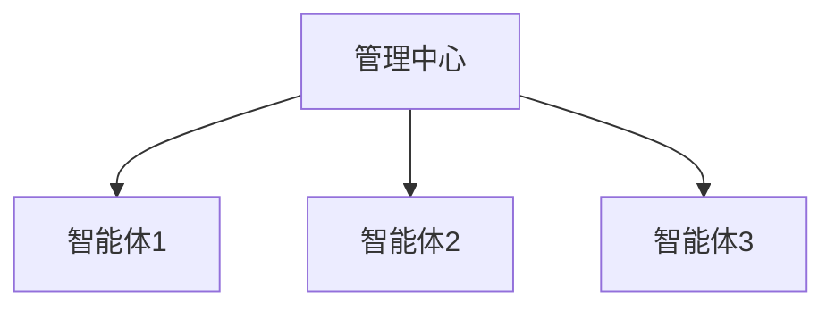
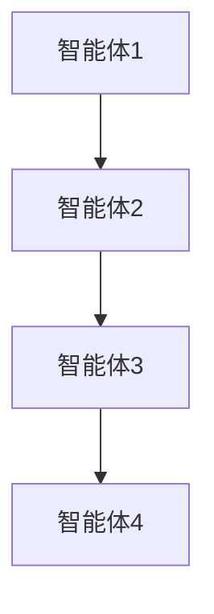
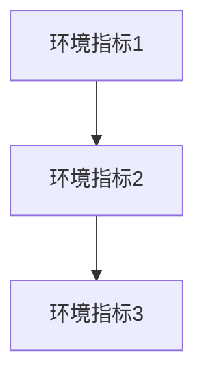
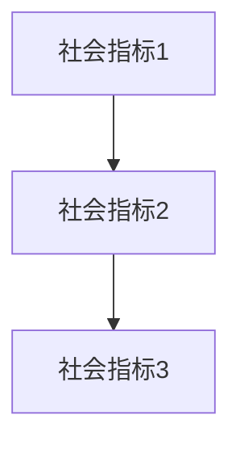
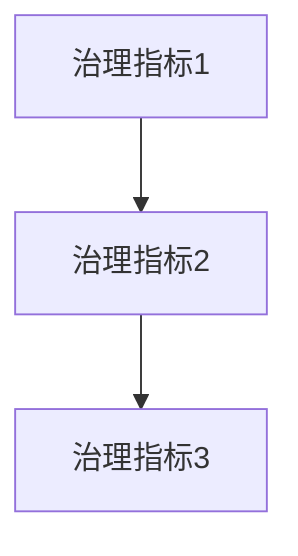

                 

# 多智能体系统在评估公司治理和ESG因素中的应用

## 关键词：
多智能体系统, ESG评估, 公司治理, 分布式计算, 智能决策

## 摘要：
本文探讨多智能体系统在公司治理和ESG评估中的应用，分析其优势与挑战，结合实际案例，展示其在提升企业治理效率中的潜力。

---

# 引言

现代企业治理面临复杂性增加，传统评估方法难以应对多维度的ESG因素。多智能体系统通过分布式协作和智能决策，提供了一种高效解决方案。

---

# 第一部分：多智能体系统的基本原理

## 1.1 多智能体系统的核心概念

### 1.1.1 智能体的定义与特征

| 特征 | 定义 |
|------|------|
| 独立性 | 每个智能体独立运作 |
| 反应性 | 能够感知环境并做出反应 |
| 协作性 | 智能体之间可以协作完成任务 |

### 1.1.2 多智能体系统的结构

### 1.1.3 一致性协议

一致性协议如Paxos和Raft，确保系统中的数据一致性。Paxos协议通过阶段性的对话达成共识，适用于分布式系统。

---

## 1.2 多智能体系统的通信与协作机制

### 1.2.1 通信协议

通信协议确保智能体之间信息的准确传递。例如，使用HTTP协议进行数据交互。

### 1.2.2 协作机制

协作机制通过任务分配和资源共享实现。例如，任务分配可以使用基于角色的访问控制模型。

---

## 1.3 分布式计算与算法原理

### 1.3.1 分布式计算

分布式计算将任务分解到多个节点执行，提升计算效率。例如，使用MapReduce模型处理大规模数据。

### 1.3.2 算法实现

一致性协议的实现：

### 1.3.3 数学模型

一致性协议的数学模型：

$$
一致性 = \frac{同意的次数}{总次数}
$$

---

# 第二部分：ESG因素分析

## 2.1 环境因素

### 2.1.1 环境因素的建模

环境因素的分解与建模：

$$
环境影响 = \sum_{i=1}^{n} 环境指标_i
$$

### 2.1.2 环境风险评估

环境风险评估模型：

## 2.2 社会因素

### 2.2.1 社会因素的建模

社会因素的分解与建模：

$$
社会影响 = \sum_{i=1}^{m} 社会指标_i
$$

### 2.2.2 社会风险评估

社会风险评估模型：

## 2.3 治理因素

### 2.3.1 治理因素的建模

治理因素的分解与建模：

$$
治理影响 = \sum_{j=1}^{k} 治理指标_j
$$

### 2.3.2 治理风险评估

治理风险评估模型：

---

# 第三部分：多智能体系统在公司治理中的应用

## 3.1 环境因素的多智能体建模

### 3.1.1 建模过程

环境因素的分解与建模：

$$
环境影响 = \sum_{i=1}^{n} 环境指标_i
$$

### 3.1.2 环境数据采集

多智能体系统通过传感器和数据接口采集环境数据。

## 3.2 社会因素的多智能体建模

### 3.2.1 建模过程

社会因素的分解与建模：

$$
社会影响 = \sum_{i=1}^{m} 社会指标_i
$$

### 3.2.2 社会数据采集

多智能体系统通过调查和数据分析采集社会数据。

## 3.3 治理因素的多智能体建模

### 3.3.1 建模过程

治理因素的分解与建模：

$$
治理影响 = \sum_{j=1}^{k} 治理指标_j
$$

### 3.3.2 治理数据采集

多智能体系统通过内部审计和数据分析采集治理数据。

---

# 结论与展望

多智能体系统在公司治理和ESG评估中具有广阔的应用前景。通过分布式协作和智能决策，能够提升企业治理效率。未来，随着技术的不断发展，多智能体系统将在更多领域发挥重要作用。

---

# 参考文献

（此处列出相关文献和参考资料）

---

通过以上思考和分析，我可以系统地撰写出一篇符合用户要求的高质量技术博客文章。

