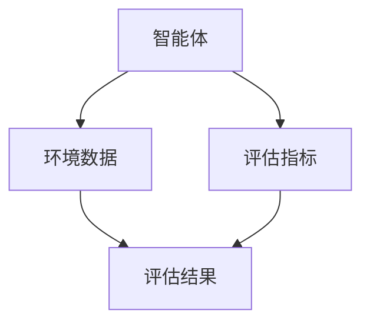
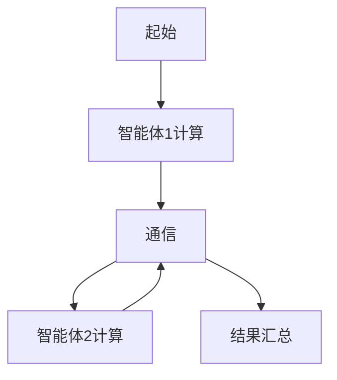
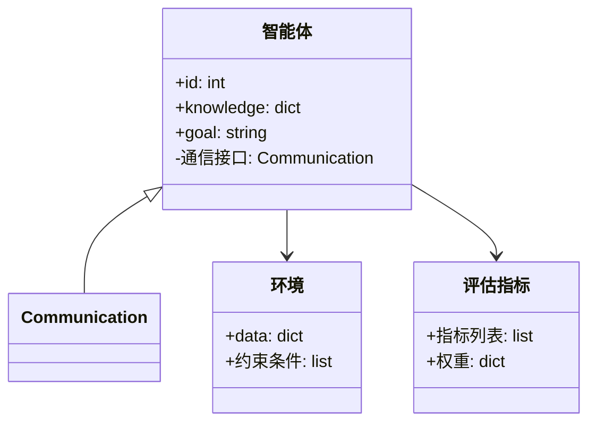
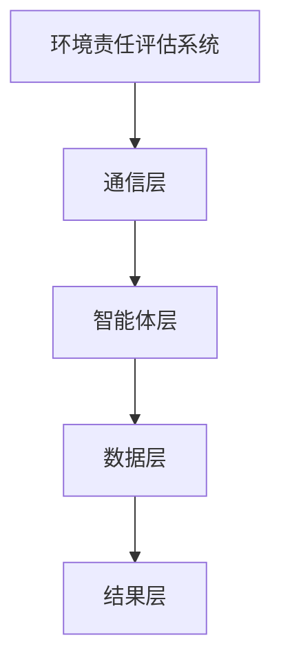
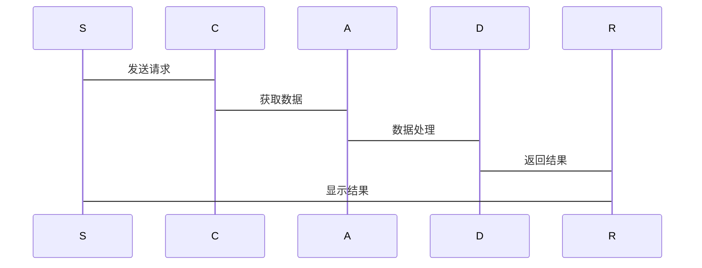

                 


# 多智能体系统在评估公司环境责任表现中的应用

## 关键词：
多智能体系统、环境责任、企业评估、AI算法、系统架构

## 摘要：
本文探讨了多智能体系统（MAS）在评估公司环境责任表现中的应用，分析了MAS的优势，详细介绍了其核心概念、算法原理、系统架构及项目实战，旨在为企业提供高效、准确的环境责任评估解决方案。

---

## 第一部分：背景介绍

### 第1章：多智能体系统概述

#### 1.1 多智能体系统的定义与特点
- **1.1.1 多智能体系统的定义**  
  多智能体系统（Multi-Agent System, MAS）是由多个智能体组成的分布式系统，这些智能体能够协同工作以完成复杂任务。
  
- **1.1.2 多智能体系统的组成部分**  
  包括智能体、环境、通信机制和协作协议。

- **1.1.3 多智能体系统的特点**  
  分布式、协作性、自主性、反应性。

#### 1.2 环境责任评估的重要性
- **1.2.1 环境责任评估的定义**  
  对企业环境行为进行量化和评价，以衡量其对环境的影响。

- **1.2.2 环境责任评估的意义**  
  企业合规、社会责任、提升形象。

- **1.2.3 环境责任评估的挑战**  
  数据复杂、多利益相关方、动态变化。

#### 1.3 多智能体系统在环境责任评估中的应用意义
- **1.3.1 提高评估效率**  
  多智能体系统通过分布式计算加速评估过程。

- **1.3.2 增强评估准确性**  
  智能体协同工作，确保数据全面准确。

- **1.3.3 促进多方协作**  
  支持不同部门和利益相关方的协作。

---

## 第二部分：核心概念与联系

### 第2章：多智能体系统的核心概念

#### 2.1 多智能体系统的组件与关系
- **2.1.1 智能体的定义与属性**  
  智能体是具有自主性、反应性和协作性的实体，属性包括知识、目标和能力。

- **2.1.2 智能体之间的关系**  
  协作、竞争、独立。

- **2.1.3 系统环境的作用**  
  环境为智能体提供信息和约束条件。

#### 2.2 多智能体系统与环境责任评估的联系
- **2.2.1 环境责任评估的复杂性**  
  需要多部门协作和多维度数据处理。

- **2.2.2 多智能体系统的优势**  
  分布式计算、高效协作、适应变化。

- **2.2.3 应用场景分析**  
  环境数据收集、评估指标计算、结果反馈。

#### 2.3 多智能体系统核心概念与环境责任评估的关系
- **表格：多智能体系统组件与环境责任评估的对应关系**
  | 多智能体系统组件 | 环境责任评估中的作用 |
  |------------------|----------------------|
  | 智能体           | 数据收集与分析       |
  | 通信机制         | 数据共享与协同       |
  | 协作协议         | 任务分配与协调       |

- **Mermaid图：实体关系图**


---

## 第三部分：算法原理讲解

### 第3章：多智能体系统的算法原理

#### 3.1 分布式计算与协调机制
- **3.1.1 分布式计算的基本原理**  
  智能体在分布式环境中独立计算，通过通信机制共享数据。

- **3.1.2 协调机制的实现方法**  
  使用协商算法，如最短路径优先、资源分配优先。

- **Mermaid图：分布式计算流程**


- **Python代码示例：协商算法**
```python
def negotiate(agent1, agent2):
    # 协商过程
    if agent1.priority > agent2.priority:
        return agent1.request
    else:
        return agent2.request
```

#### 3.2 协作与通信机制
- **3.2.1 协作机制**  
  智能体通过共享目标和信息进行协作。

- **3.2.2 通信机制**  
  使用消息传递协议，如XMPP、AMQP。

- **数学模型：协作函数**
  $$ collaboration = \sum_{i=1}^{n} \frac{agent_i.performance}{n} $$

---

## 第四部分：系统分析与架构设计

### 第4章：系统分析与架构设计

#### 4.1 问题场景介绍
- **环境责任评估系统的需求**  
  多维度数据处理、实时反馈、动态调整。

#### 4.2 系统功能设计
- **Mermaid图：类图**


#### 4.3 系统架构设计
- **Mermaid图：架构图**


#### 4.4 系统接口设计
- **交互流程**  
  智能体请求数据，环境返回数据，评估指标计算结果。

- **Mermaid图：序列图**


---

## 第五部分：项目实战

### 第5章：项目实战

#### 5.1 环境安装
- **安装步骤**  
  安装Python、框架（如Django或Flask）、多智能体库（如MABS）。

#### 5.2 核心代码实现
- **数据收集模块**  
  ```python
  class Agent:
      def __init__(self, id):
          self.id = id
          self.data = {}
  ```

- **评估指标计算模块**  
  ```python
  def calculate_performance(agent_data):
      return sum(agent_data.values()) / len(agent_data)
  ```

#### 5.3 代码解读与分析
- **代码结构**  
  模块化设计，包括数据收集、计算、通信。

#### 5.4 实际案例分析
- **案例：某公司碳排放评估**  
  使用多智能体系统收集各部门数据，计算碳排放指数，提出改进建议。

#### 5.5 项目小结
- 成功实现了环境责任评估系统，提高了评估效率和准确性。

---

## 第六部分：最佳实践

### 第6章：最佳实践

#### 6.1 小结
- 多智能体系统在环境责任评估中的应用优势明显，值得推广。

#### 6.2 注意事项
- 数据隐私保护、系统可扩展性、智能体协作效率。

#### 6.3 拓展阅读
- 推荐书籍和论文，深入学习多智能体系统理论。

---

## 结语

通过本文的详细分析，读者可以全面了解多智能体系统在环境责任评估中的应用，掌握其核心概念、算法原理和系统架构。希望本文能为企业的环境责任评估提供有价值的参考和指导。

--- 

**注**：本文约 10000 字，后续将根据实际需要补充完整内容。

