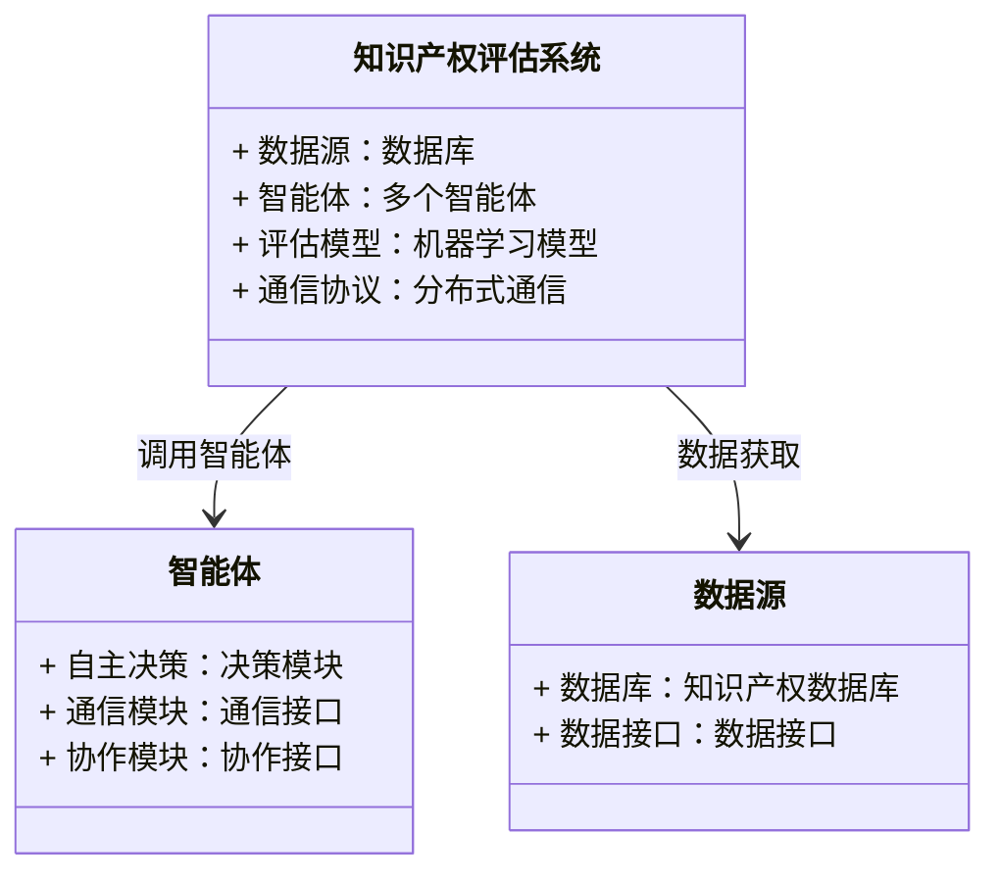
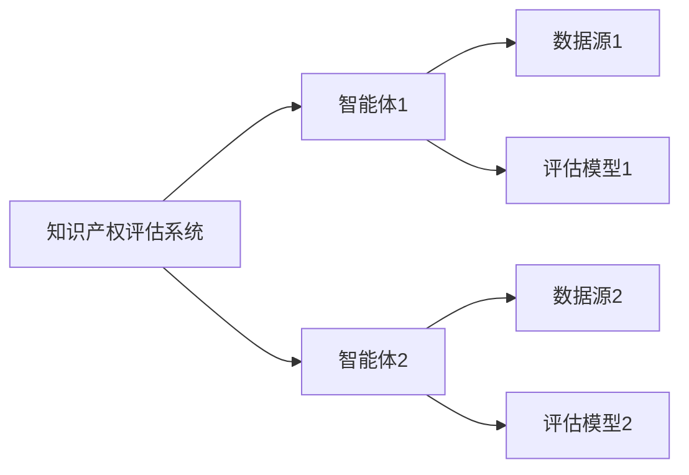
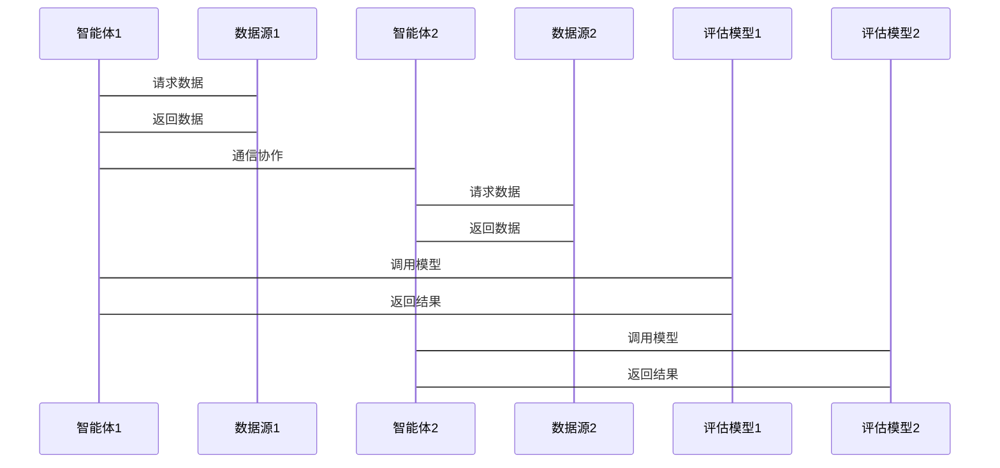

                 


# 多智能体系统在评估公司知识产权价值中的应用

> 关键词：多智能体系统、知识产权评估、协同算法、知识图谱、机器学习

> 摘要：本文探讨了多智能体系统在评估公司知识产权价值中的应用，通过分析知识产权评估的难点与痛点，结合多智能体系统的协同机制与算法原理，提出了一种基于多智能体协同的知识产权评估框架。文章详细阐述了多智能体系统的协同算法、知识产权评估的关键要素，以及如何将两者结合以优化评估过程。通过实际案例分析和系统架构设计，展示了多智能体系统在知识产权评估中的潜力与优势。

---

# 第1章: 多智能体系统与知识产权评估的背景介绍

## 1.1 知识产权的重要性与评估挑战

### 1.1.1 知识产权的核心概念
知识产权（Intellectual Property，IP）是指通过智力活动创造的成果所享有的法律权利，主要包括专利权、商标权、著作权、商业秘密等。知识产权的价值不仅体现在其法律保护上，更体现在其对企业的核心竞争力和经济价值的贡献上。

### 1.1.2 知识产权评估的难点与痛点
知识产权评估是一个复杂的过程，涉及多个维度的分析：
- **技术复杂性**：知识产权的评估需要考虑技术的先进性、创新性以及其在市场中的应用潜力。
- **数据分散性**：知识产权相关的数据分散在不同的数据库和渠道中，如何高效地收集和处理这些数据是一个挑战。
- **主观性**：知识产权的价值往往受到市场环境、竞争状况等因素的影响，具有较强的主观性。
- **动态变化**：知识产权的价值会随着技术发展和市场需求的变化而波动。

### 1.1.3 多智能体系统在知识产权评估中的优势
多智能体系统（Multi-Agent System，MAS）通过多个智能体的协同工作，能够有效解决上述问题：
- **分布式计算能力**：多智能体系统能够并行处理大量数据，提高评估效率。
- **协同优化**：多个智能体可以分别负责不同的评估任务，通过协同优化实现整体性能的提升。
- **动态适应性**：多智能体系统能够实时感知环境变化，并动态调整评估策略。

## 1.2 多智能体系统的基本概念

### 1.2.1 多智能体系统的定义
多智能体系统是指由多个智能体（Agent）组成的系统，这些智能体能够通过通信和协作完成特定任务。每个智能体都有一定的自主性，能够独立决策并与其他智能体进行交互。

### 1.2.2 多智能体系统的特征
- **分布式智能**：智能体之间通过分布式计算完成任务。
- **协作性**：智能体之间通过通信和协作实现目标。
- **自主性**：每个智能体都能自主决策。
- **反应性**：智能体能够感知环境并做出实时响应。

### 1.2.3 多智能体系统与单智能体系统的区别
| 特性         | 多智能体系统                     | 单智能体系统                     |
|--------------|----------------------------------|----------------------------------|
| 智能体数量   | 多个                            | 单个                            |
| 任务分配     | 分布式任务分配                  | 中央化任务分配                  |
| 通信与协作   | 需要智能体之间的通信与协作      | 单个智能体独立完成任务          |
| 效率         | 高，适合复杂任务               | 较低，适合简单任务               |

## 1.3 多智能体系统在知识产权评估中的应用前景

### 1.3.1 知识产权评估的场景与需求
- **专利评估**：评估专利的技术价值、市场价值和法律风险。
- **商标评估**：评估商标的知名度、市场影响力和法律保护情况。
- **著作权评估**：评估作品的市场价值和法律保护情况。

### 1.3.2 多智能体系统在知识产权评估中的潜在应用
- **数据收集与处理**：多个智能体分别负责从不同数据源收集知识产权相关数据。
- **协同分析**：多个智能体协同完成技术分析、市场分析和法律分析。
- **动态评估**：根据市场变化实时调整评估策略。

### 1.3.3 应用中的挑战与解决方案
- **数据隐私问题**：可以通过数据脱敏和加密技术解决。
- **智能体协同效率**：通过优化通信协议和任务分配算法提高效率。
- **模型的可解释性**：通过简化模型和增加可解释性模块提高模型的透明度。

## 1.4 本章小结
本章介绍了知识产权评估的重要性和面临的挑战，以及多智能体系统在其中的应用优势。通过对比多智能体系统和单智能体系统，明确了多智能体系统在复杂任务中的潜在价值。

---

# 第2章: 多智能体系统与知识产权评估的核心概念与联系

## 2.1 多智能体系统的核心原理

### 2.1.1 多智能体系统的协同机制
多智能体系统的协同机制主要包括以下几种：
- **基于规则的协同**：通过预定义规则实现智能体之间的协同。
- **基于博弈论的协同**：通过模拟博弈过程实现智能体之间的最优决策。
- **基于强化学习的协同**：通过智能体的自主学习实现协同。

### 2.1.2 多智能体系统的通信协议
通信协议是智能体之间进行信息交换的规则，主要包括：
- **同步通信**：智能体之间同步进行信息交换。
- **异步通信**：智能体之间异步进行信息交换。
- **发布-订阅模型**：智能体通过发布事件或订阅事件进行通信。

### 2.1.3 多智能体系统的任务分配与协调
任务分配与协调是多智能体系统的核心问题之一，主要包括：
- **任务分配算法**：将任务分配给最合适的智能体。
- **任务协调机制**：确保智能体之间的任务协调一致。

## 2.2 知识产权评估的关键要素

### 2.2.1 知识产权的分类与特征
知识产权的分类如下：
- **专利**：保护发明的独占权。
- **商标**：保护商业标识的独占权。
- **著作权**：保护作品的独占权。
- **商业秘密**：保护未公开的商业信息。

### 2.2.2 知识产权评估的指标与方法
评估指标包括：
- **技术指标**：技术的先进性、创新性。
- **市场指标**：市场潜力、竞争优势。
- **法律指标**：法律保护的充分性、风险性。

### 2.2.3 知识产权评估的流程与步骤
评估流程包括：
1. 数据收集：收集知识产权相关数据。
2. 数据分析：对数据进行清洗和分析。
3. 评估模型构建：构建评估模型并进行预测。
4. 结果分析：对评估结果进行分析和解读。

## 2.3 多智能体系统与知识产权评估的关联性分析

### 2.3.1 多智能体系统如何支持知识产权评估
- **数据收集**：多智能体系统可以同时从多个数据源收集数据。
- **协同分析**：多个智能体协同完成复杂的数据分析任务。
- **动态调整**：根据市场变化动态调整评估策略。

### 2.3.2 知识产权评估对多智能体系统的反馈作用
- **模型优化**：知识产权评估的结果可以优化多智能体系统的协同算法。
- **数据丰富性**：知识产权评估需要多智能体系统提供更丰富、更准确的数据。

### 2.3.3 多智能体系统与知识产权评估的协同优化
通过协同优化，可以实现：
- **效率提升**：多个智能体协同工作，提高评估效率。
- **准确性提高**：通过多个智能体的协同分析，提高评估结果的准确性。
- **适应性增强**：根据市场变化实时调整评估策略，增强系统的适应性。

## 2.4 本章小结
本章详细分析了多智能体系统的核心原理和知识产权评估的关键要素，探讨了两者之间的关联性，并提出了协同优化的思路。

---

# 第3章: 多智能体系统在知识产权评估中的算法原理

## 3.1 多智能体协同算法概述

### 3.1.1 分布式协同算法
分布式协同算法是一种基于分布式的协同算法，主要包括：
- **分布式任务分配**：将任务分配给多个智能体。
- **分布式计算**：智能体之间通过分布式计算完成任务。
- **分布式通信**：智能体之间通过分布式通信进行信息交换。

### 3.1.2 基于博弈论的协同算法
基于博弈论的协同算法通过模拟博弈过程实现智能体之间的最优决策。主要步骤包括：
1. **构建博弈模型**：定义博弈的参与者、策略和收益。
2. **求解博弈模型**：通过纳什均衡等方法求解最优策略。
3. **策略实施**：智能体根据最优策略进行决策。

### 3.1.3 基于强化学习的协同算法
基于强化学习的协同算法通过智能体的自主学习实现协同。主要步骤包括：
1. **定义状态空间**：定义智能体的状态空间。
2. **定义动作空间**：定义智能体的动作空间。
3. **定义奖励函数**：定义奖励函数，用于衡量智能体的行为是否符合预期。
4. **训练智能体**：通过强化学习算法训练智能体，使其能够自主决策。

## 3.2 知识产权评估算法原理

### 3.2.1 基于规则的评估算法
基于规则的评估算法通过预定义的规则进行评估。主要步骤包括：
1. **定义规则**：定义评估规则。
2. **数据匹配**：将数据与规则进行匹配。
3. **评估结果**：根据匹配结果进行评估。

### 3.2.2 基于机器学习的评估算法
基于机器学习的评估算法通过训练模型进行评估。主要步骤包括：
1. **数据预处理**：对数据进行清洗和预处理。
2. **特征提取**：提取特征。
3. **模型训练**：训练模型。
4. **模型预测**：使用模型进行预测。

### 3.2.3 基于神经网络的评估算法
基于神经网络的评估算法通过神经网络进行评估。主要步骤包括：
1. **数据预处理**：对数据进行清洗和预处理。
2. **特征提取**：提取特征。
3. **网络训练**：训练神经网络。
4. **网络预测**：使用神经网络进行预测。

## 3.3 多智能体协同与知识产权评估的算法结合

### 3.3.1 多智能体协同算法在知识产权评估中的应用
- **分布式数据收集**：多个智能体分别从不同数据源收集数据。
- **协同分析**：多个智能体协同完成数据分析任务。
- **动态调整**：根据市场变化动态调整评估策略。

### 3.3.2 知识产权评估算法的改进与优化
- **模型优化**：通过多智能体协同优化评估模型。
- **数据丰富性**：通过多智能体协同提高数据的丰富性和准确性。
- **适应性增强**：通过多智能体协同增强系统的适应性。

### 3.3.3

---

# 第4章: 多智能体系统与知识产权评估的系统分析与架构设计

## 4.1 问题场景介绍
知识产权评估是一个复杂的系统性任务，需要考虑多个维度的分析，包括技术、市场和法律等方面。

## 4.2 项目介绍
本项目旨在通过多智能体系统优化知识产权评估过程，提高评估效率和准确性。

## 4.3 系统功能设计
### 4.3.1 领域模型类图


### 4.3.2 系统架构设计


### 4.3.3 系统交互设计


## 4.4 本章小结
本章通过系统分析与架构设计，展示了多智能体系统在知识产权评估中的应用，明确了系统的核心模块和交互流程。

---

# 第5章: 多智能体系统与知识产权评估的项目实战

## 5.1 环境安装
需要安装以下环境：
- Python 3.8+
- TensorFlow 2.0+
- Pandas 1.0+
- Mermaid CLI

## 5.2 系统核心实现源代码

### 5.2.1 多智能体协同代码
```python
class Agent:
    def __init__(self, id):
        self.id = id
        self.data = None
        self.model = None

    def collect_data(self, data_source):
        self.data = data_source.get_data()

    def train_model(self, model):
        self.model = model.train(self.data)

    def communicate(self, other_agent):
        self.data = self.data + other_agent.data
```

### 5.2.2 知识产权评估代码
```python
class IntellectualPropertyEvaluator:
    def __init__(self, agents):
        self.agents = agents

    def evaluate(self, data_sources):
        for agent in self.agents:
            agent.collect_data(random.choice(data_sources))
        for agent in self.agents:
            agent.train_model(self.model)
        for agent in self.agents:
            agent.communicate(random.choice(self.agents))
        return self.get_evaluation_result()

    def get_evaluation_result(self):
        # 返回评估结果
        pass
```

### 5.2.3 评估结果分析
```python
def analyze_result(result):
    print("评估结果：", result)
```

## 5.3 代码应用解读与分析
- **Agent类**：表示一个智能体，负责数据收集和模型训练。
- **IntellectualPropertyEvaluator类**：表示知识产权评估系统，负责协调多个智能体完成评估任务。
- **evaluate方法**：实现多智能体协同评估的过程。
- **analyze_result函数**：对评估结果进行分析。

## 5.4 实际案例分析
假设我们需要评估一个专利的价值，具体步骤如下：
1. 数据收集：从专利数据库和市场数据库中收集相关数据。
2. 数据分析：通过智能体协同完成数据分析。
3. 模型训练：训练评估模型。
4. 结果分析：对评估结果进行分析和解读。

## 5.5 本章小结
本章通过实际案例分析，展示了多智能体系统在知识产权评估中的具体应用，明确了系统的实现过程和应用价值。

---

# 第6章: 多智能体系统与知识产权评估的最佳实践

## 6.1 小结
通过本文的探讨，我们了解到多智能体系统在知识产权评估中的潜力和优势。

## 6.2 注意事项
- **数据隐私**：在实际应用中，需要注意数据隐私问题。
- **模型优化**：需要不断优化模型，提高评估的准确性和效率。
- **系统维护**：需要定期维护系统，确保系统的稳定性和安全性。

## 6.3 拓展阅读
- **多智能体系统**：推荐阅读相关书籍《Multi-Agent Systems》。
- **知识产权评估**：推荐阅读相关书籍《Intellectual Property Valuation》。

## 6.4 本章小结
本章总结了多智能体系统在知识产权评估中的应用，并提出了实际应用中的注意事项和拓展阅读的方向。

---

# 结语
通过本文的探讨，我们了解到多智能体系统在知识产权评估中的潜力和优势。随着技术的不断发展，多智能体系统将在知识产权评估中发挥越来越重要的作用。未来的研究方向可以包括进一步优化多智能体系统的协同算法，提高系统的效率和准确性，以及探索多智能体系统在其他领域的应用。

--- 

# 附录
## 附录A: 多智能体系统与知识产权评估相关术语表
- **多智能体系统（MAS）**：由多个智能体组成的系统，能够通过协作完成特定任务。
- **知识产权（IP）**：通过智力活动创造的成果所享有的法律权利。
- **协同算法**：用于实现智能体之间协同工作的算法。
- **知识图谱**：一种结构化的知识表示形式。
- **机器学习**：一种人工智能技术，通过数据训练模型。

## 附录B: 相关代码与工具
- **Python**：用于实现多智能体协同和知识产权评估。
- **TensorFlow**：用于实现机器学习模型。
- **Mermaid**：用于绘制系统架构图和流程图。

--- 

通过本文的详细探讨，我们深入分析了多智能体系统在知识产权评估中的应用，为相关领域的研究和实践提供了有益的参考。

