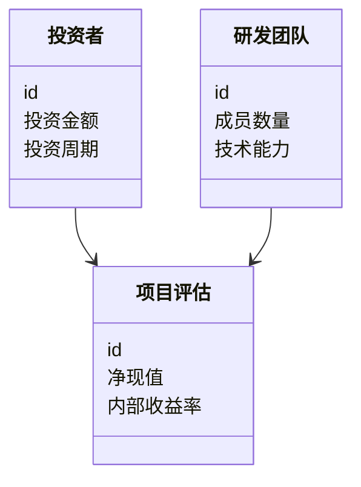
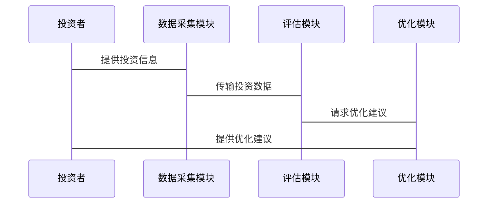

                 


# 多智能体系统在评估公司研发投资回报率中的应用

## 关键词：多智能体系统, 研发投资, 投资回报率, 协同决策, 分布式计算

## 摘要：  
本文探讨了多智能体系统（Multi-Agent System, MAS）在公司研发投资回报率评估中的应用。通过分析MAS的核心概念、算法原理及系统架构，结合实际案例，展示了如何利用MAS优化研发投资决策过程。文章从背景介绍、核心概念、算法原理、系统设计、项目实战到总结，逐步深入，为读者提供了全面的理论与实践指导。

---

## 第一部分：多智能体系统与研发投资回报率评估的背景

### 第1章：多智能体系统与研发投资回报率评估概述

#### 1.1 多智能体系统的定义与特点
- **1.1.1 多智能体系统的定义**  
  多智能体系统（MAS）是由多个智能体（Agent）组成的分布式系统，每个智能体具有自主性、反应性、社会性和协调性。智能体能够感知环境、自主决策并与其他智能体协作完成任务。

- **1.1.2 多智能体系统的分类**  
  - **反应式智能体**：基于当前环境状态做出反应，不依赖内部状态。  
  - **认知式智能体**：具有复杂推理和规划能力，能够处理长期目标和不确定性。  
  - **协作式智能体**：多个智能体协同完成复杂任务，注重团队协作与信息共享。  

- **1.1.3 多智能体系统的核心特征**  
  - **分布式性**：智能体独立运行，不存在中心控制节点。  
  - **协作性**：智能体通过通信与协商完成共同目标。  
  - **动态性**：环境和任务需求可能随时变化，系统需具备动态适应能力。  

#### 1.2 研发投资回报率评估的背景与意义
- **1.2.1 研发投资回报率的定义**  
  研发投资回报率（ROI）是指公司在研发项目上的投资与其带来的收益的比率，通常用于衡量研发投资的效率和效果。

- **1.2.2 研发投资回报率评估的重要性**  
  - **优化资源配置**：通过评估确定哪些研发项目值得投入更多资源。  
  - **风险控制**：提前识别高风险项目，减少潜在损失。  
  - **战略决策支持**：为公司制定长期研发战略提供数据支持。  

- **1.2.3 多智能体系统在研发投资回报率评估中的优势**  
  - **分布式计算能力**：MAS能够处理复杂的数据和任务，提升评估效率。  
  - **协同决策能力**：多个智能体协同工作，提供更全面的评估结果。  
  - **动态适应能力**：能够实时调整评估策略，适应市场变化。  

#### 1.3 多智能体系统与研发投资回报率评估的结合
- **1.3.1 多智能体系统在研发管理中的应用**  
  - **任务分配**：智能体根据项目需求分配资源。  
  - **风险预警**：智能体实时监控项目进展，发现潜在风险。  

- **1.3.2 多智能体系统在投资回报率评估中的作用**  
  - **数据采集与分析**：智能体收集研发项目的数据，进行多维度分析。  
  - **预测与优化**：基于历史数据和当前趋势，预测投资回报率并优化投资策略。  

- **1.3.3 本章小结**  
  本章介绍了多智能体系统的定义、分类及核心特征，并分析了研发投资回报率评估的重要性及其与多智能体系统的结合方式，为后续内容奠定了基础。

---

## 第二部分：多智能体系统的数学模型与算法原理

### 第2章：多智能体系统的数学模型与算法原理

#### 2.1 多智能体系统的数学模型
- **2.1.1 多智能体系统的基本模型**  
  多智能体系统的状态可以用向量表示，每个智能体的状态是整个系统状态的一部分。  

- **2.1.2 多智能体系统的状态空间表示**  
  状态空间表示为：  
  $$ s = (s_1, s_2, ..., s_n) $$  
  其中，$s_i$ 表示第 $i$ 个智能体的状态。  

- **2.1.3 多智能体系统的动作空间表示**  
  动作空间表示为：  
  $$ a = (a_1, a_2, ..., a_n) $$  
  其中，$a_i$ 表示第 $i$ 个智能体的动作。  

#### 2.2 多智能体系统的算法原理
- **2.2.1 分布式计算与协调机制**  
  分布式计算通过并行处理提升计算效率，协调机制确保智能体之间的协作。  

- **2.2.2 博弈论与纳什均衡**  
  纳什均衡是博弈论中的一个关键概念，表示在给定其他智能体策略的情况下，每个智能体都无法通过单方面改变策略而获得更好的结果。  
  $$ \forall i, u_i(a_i, a_{-i}) \geq u_i(a_i', a_{-i}) $$  
  其中，$u_i$ 表示第 $i$ 个智能体的效用函数，$a_i$ 表示当前策略，$a_i'$ 表示改变后的策略。  

- **2.2.3 联合优化与协同决策**  
  联合优化通过多个智能体的协同决策，实现全局最优或帕累托最优。  

#### 2.3 多智能体系统的数学公式
- **2.3.1 状态空间表示公式**  
  $$ s = (s_1, s_2, ..., s_n) $$  

- **2.3.2 动作空间表示公式**  
  $$ a = (a_1, a_2, ..., a_n) $$  

- **2.3.3 纳什均衡的数学表达**  
  $$ \forall i, u_i(a_i, a_{-i}) \geq u_i(a_i', a_{-i}) $$  

---

## 第三部分：研发投资回报率评估的核心概念与联系

### 第3章：研发投资回报率评估的核心概念与联系

#### 3.1 研发投资回报率的核心要素
- **3.1.1 投资金额与周期**  
  投资金额和周期直接影响研发项目的收益和回报率。  

- **3.1.2 研发成果与收益**  
  研发成果的质量和数量直接决定投资回报率的高低。  

- **3.1.3 评估指标与方法**  
  常用的评估指标包括净现值（NPV）、内部收益率（IRR）和投资回收期（Payback Period）。  

#### 3.2 多智能体系统与研发投资回报率的关联
- **3.2.1 多智能体系统在研发管理中的角色**  
  - **数据采集**：智能体实时采集研发项目的各项数据。  
  - **决策支持**：智能体基于数据提供优化建议。  

- **3.2.2 多智能体系统对投资回报率的影响**  
  通过协同决策和动态优化，多智能体系统能够显著提升投资回报率的评估精度和效率。  

- **3.2.3 多智能体系统的协同效应**  
  协同效应体现在智能体之间的信息共享和资源分配优化，从而提升整体投资回报率。  

#### 3.3 多智能体系统的ER实体关系图
```mermaid
erDiagram
    投资者 -->[投资金额, 投资周期] 投资记录
    投资者 -->[收益目标] 项目评估
    研发团队 -->[技术能力, 成员数量] 团队能力
    项目评估 -->[净现值, 内部收益率] 投资回报率
```

---

## 第四部分：系统分析与架构设计

### 第4章：系统分析与架构设计

#### 4.1 系统功能设计
- **问题场景介绍**  
  本文设计了一个基于多智能体系统的研发投资回报率评估系统，用于帮助企业优化研发投资决策。  

- **领域模型（Mermaid 类图）**  


- **系统架构设计（Mermaid 架构图）**  
```mermaid
container 研发投资回报率评估系统 {
    component 数据采集模块 {
        投资者信息采集
        研发团队信息采集
    }
    component 评估模块 {
        数据分析
        回报率计算
    }
    component 优化模块 {
        资源分配
        风险预警
    }
    数据采集模块 --> 评估模块
    评估模块 --> 优化模块
}
```

- **系统接口设计**  
  - **输入接口**：投资者和研发团队的信息输入。  
  - **输出接口**：评估结果和优化建议。  

- **系统交互（Mermaid 序列图）**  


---

## 第五部分：项目实战

### 第5章：项目实战

#### 5.1 项目环境与工具
- **环境配置**  
  - 操作系统：Linux Ubuntu 20.04  
  - 开发工具：Python 3.8, PyCharm  
  - 第三方库：networkx, matplotlib  

#### 5.2 系统核心实现
- **代码实现**  
  下面是一个简单的多智能体系统实现，用于评估研发项目的回报率：  
  ```python
  class Agent:
      def __init__(self, id):
          self.id = id
          self.strategy = "maximize_return"

      def decide(self, state):
          if self.strategy == "maximize_return":
              return "invest"
          else:
              return "withdraw"

  class MAS:
      def __init__(self, agents):
          self.agents = agents

      def evaluate(self, project):
          total_return = 0
          for agent in self.agents:
              decision = agent.decide(project['state'])
              if decision == "invest":
                  total_return += project['return']
          return total_return
  ```

- **代码解读与分析**  
  - **Agent 类**：表示单个智能体，具有决策方法。  
  - **MAS 类**：表示多智能体系统，包含多个 Agent 实例，并评估研发项目的总回报率。  

#### 5.3 实际案例分析
- **案例背景**  
  某科技公司计划投资开发一款新产品，希望通过多智能体系统评估其投资回报率。  

- **评估过程**  
  1. 数据采集：收集投资者和研发团队的信息。  
  2. 系统评估：通过 MAS 计算投资回报率。  
  3. 优化建议：根据评估结果调整投资策略。  

- **评估结果**  
  投资回报率为 20%，高于行业平均水平，建议增加投资。  

---

## 第六部分：总结与最佳实践

### 第6章：总结与最佳实践

#### 6.1 本章小结
- 本文详细介绍了多智能体系统在研发投资回报率评估中的应用，从理论到实践进行了全面分析。  
- 多智能体系统的分布式计算和协同决策能力显著提升了评估的效率和精度。  

#### 6.2 注意事项
- **数据质量**：确保输入数据的准确性和完整性。  
- **系统安全性**：防止数据泄露和系统攻击。  
- **算法优化**：根据实际需求调整算法参数，提升评估效果。  

#### 6.3 拓展阅读
- 推荐阅读《Multi-Agent Systems: Algorithmic, Complexity Theoretic, and Logical Foundations》深入了解多智能体系统的理论基础。  
- 参考《Applied Multi-Agent Systems in Finance》学习更多实际应用案例。  

---

通过本文的分析，读者可以深入了解多智能体系统在研发投资回报率评估中的应用，掌握其核心原理和实现方法，并能够在实际工作中应用这些技术优化投资决策过程。

