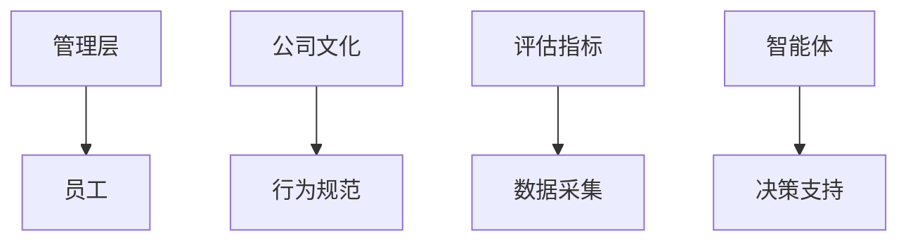
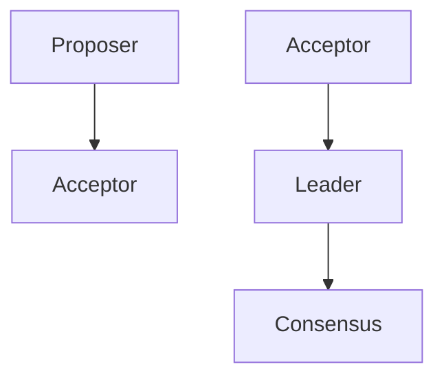
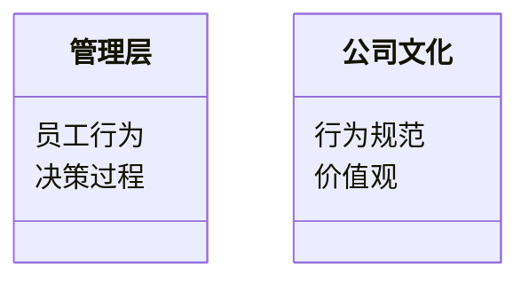
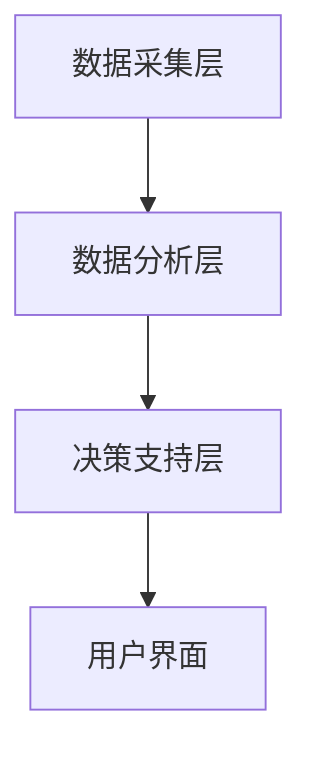
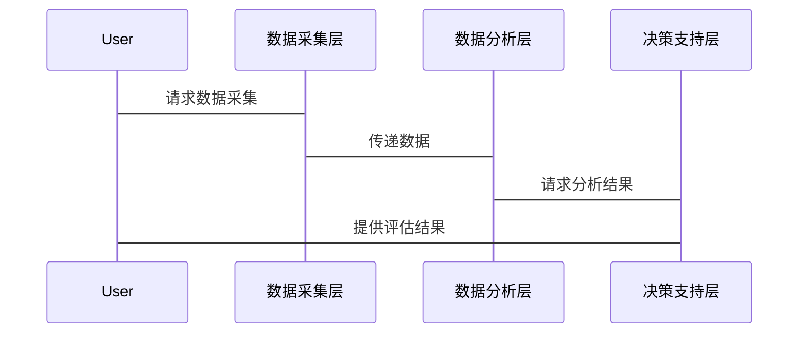

                 


# 多智能体系统在评估管理层质量和公司文化中的应用

> 关键词：多智能体系统, 管理层质量, 公司文化, 算法原理, 系统架构, 项目实战

> 摘要：本文探讨了多智能体系统（MAS）在评估管理层质量和公司文化中的应用。通过分析MAS的原理、算法和系统架构，结合实际案例，展示了MAS在管理评估中的优势和实现方法。

---

# 第一部分: 多智能体系统在管理评估中的背景与基础

# 第1章: 多智能体系统概述

## 1.1 多智能体系统的基本概念
### 1.1.1 多智能体系统的定义
多智能体系统（Multi-Agent System, MAS）是由多个智能体组成的分布式系统，这些智能体能够自主决策、协作和通信，共同完成复杂任务。

### 1.1.2 多智能体系统的特征
- **自主性**：每个智能体都有独立的决策能力。
- **反应性**：能够实时感知环境并做出响应。
- **协作性**：智能体之间通过通信协作完成目标。
- **分布式性**：系统由多个分散的智能体组成。

### 1.1.3 多智能体系统与传统单智能体系统的区别
| 特性 | 多智能体系统 | 单智能体系统 |
|------|--------------|---------------|
| 决策 | 分布式决策 | 中央决策 |
| 通信 | 智能体之间通信 | 无通信 |
| 协作 | 高度协作 | 无协作 |

## 1.2 多智能体系统在管理评估中的应用背景
### 1.2.1 管理层质量评估的传统方法
- 依赖主观评价，如问卷调查和面谈。
- 难以全面捕捉管理层的行为和决策过程。

### 1.2.2 公司文化评估的传统方法
- 依赖企业文化文档和员工反馈。
- 难以量化和动态评估。

### 1.2.3 多智能体系统在管理评估中的优势
- **实时性**：能够实时采集和分析数据。
- **动态性**：能够动态调整评估指标。
- **客观性**：通过数据驱动的方法提高评估的客观性。

## 1.3 问题背景与问题描述
### 1.3.1 管理层质量评估的难点
- 管理层行为复杂，难以量化。
- 传统方法主观性强，缺乏动态评估。

### 1.3.2 公司文化评估的复杂性
- 文化是多维度的，难以全面衡量。
- 员工行为受多种因素影响，难以捕捉。

### 1.3.3 多智能体系统如何解决这些问题
- 通过智能体实时采集和分析数据，提供动态评估。
- 利用协作机制，整合多源信息，提高评估的全面性。

## 1.4 问题解决与边界定义
### 1.4.1 多智能体系统在管理评估中的解决方案
- 使用智能体采集管理层和员工的行为数据。
- 通过协作算法对数据进行分析和评估。

### 1.4.2 系统的边界与外延
- 系统边界：仅限于管理层和公司文化的评估。
- 外延：可以扩展到其他管理领域，如战略规划和绩效管理。

### 1.4.3 核心要素与组成结构
- 核心要素：智能体、通信机制、协作算法。
- 组成结构：数据采集层、分析层、评估层。

## 1.5 本章小结
### 1.5.1 多智能体系统的基本概念
- MAS是由多个智能体组成的分布式系统，具有自主性、反应性和协作性。

### 1.5.2 管理评估中的问题与解决方案
- 传统方法主观性强，MAS通过实时数据采集和协作算法提供动态、客观的评估。

---

# 第2章: 多智能体系统的核心概念与联系

## 2.1 多智能体系统的原理
### 2.1.1 分布式计算与协作机制
- 分布式计算：智能体在不同节点上独立计算。
- 协作机制：通过通信协议实现智能体之间的协作。

### 2.1.2 智能体之间的通信与协调
- 通信：智能体通过消息传递进行信息交换。
- 协调：通过协商机制达成一致。

### 2.1.3 多智能体系统的数学模型
- 数学模型：描述智能体之间的关系和协作过程。
- 示例：$A_i$ 和 $A_j$ 通过通信模块交换信息。

## 2.2 核心概念的属性对比
| 概念 | 分布式系统 | 多智能体系统 | 群体智能 |
|------|------------|--------------|----------|
| 结构 | 分散计算 | 多智能体协作 | 群体行为 |
| 目标 | 提高计算效率 | 实现复杂任务 | 模拟自然群体 |

## 2.3 ER实体关系图


## 2.4 本章小结
### 2.4.1 多智能体系统的原理
- MAS通过分布式计算和协作机制实现复杂任务。

### 2.4.2 核心概念的属性对比
- MAS与分布式系统和群体智能的区别和联系。

### 2.4.3 实体关系图的构建
- 通过ER图展示系统中各实体之间的关系。

---

# 第3章: 多智能体系统的算法原理

## 3.1 算法原理概述
### 3.1.1 多智能体系统的算法特点
- 分布式算法：适用于MAS的协作和通信。
- 自适应算法：能够根据环境变化调整行为。

### 3.1.2 常见算法介绍
- 一致性算法：如Paxos和Raft，用于多智能体之间达成一致。
- 分布式优化算法：如分布式梯度下降，用于协作学习。

## 3.2 分布式一致性算法
### 3.2.1 基于Paxos的一致性算法
- Paxos算法用于在分布式系统中达成一致。
- 示例：智能体通过Paxos算法达成一致决策。

### 3.2.2 Raft算法的实现
- Raft算法用于选举 leader 和同步数据。
- 示例：智能体通过Raft算法选举 leader。

## 3.3 分布式优化算法
### 3.3.1 分布式梯度下降算法
- 智能体通过分布式梯度下降算法协作优化目标函数。
- 示例：$$f(x) = \sum_{i=1}^{n} (x_i - x)^2$$，智能体协作优化$f(x)$。

### 3.3.2 分布式协同算法
- 示例：智能体通过协同算法实现任务分配和协作。

## 3.4 算法实现与代码示例
### 3.4.1 基于Paxos算法的实现
```python
class Paxos:
    def __init__(self):
        self.proposer = None
        self.acceptor = None
    def propose(self, value):
        # 提案者提出提案
        pass
    def accept(self, value):
        # 接受者接受提案
        pass
```

### 3.4.2 分布式优化算法实现
```python
import numpy as np

class DistributedGD:
    def __init__(self, agents):
        self.agents = agents
    def optimize(self, f, x0):
        # 分布式优化
        pass
```

## 3.5 算法流程图


## 3.6 本章小结
### 3.6.1 算法原理
- 多智能体系统通过一致性算法和分布式优化算法实现协作。

### 3.6.2 算法实现
- 通过Paxos和分布式梯度下降算法实现MAS的协作。

### 3.6.3 算法流程图
- 使用Mermaid图展示算法的流程。

---

# 第4章: 系统分析与架构设计

## 4.1 问题场景介绍
### 4.1.1 公司管理评估系统
- 系统目标：评估管理层质量和公司文化。
- 系统范围：公司内部的管理评估。

## 4.2 系统功能设计
### 4.2.1 功能模块
- 数据采集模块：采集管理层和员工的行为数据。
- 数据分析模块：分析数据并生成评估结果。
- 决策支持模块：提供改进建议。

### 4.2.2 领域模型图


## 4.3 系统架构设计
### 4.3.1 分层架构
- 数据层：采集和存储数据。
- 逻辑层：分析和评估数据。
- 应用层：展示结果并提供决策支持。

### 4.3.2 系统架构图


## 4.4 系统接口设计
### 4.4.1 接口定义
- 数据采集接口：`collect_data()`
- 数据分析接口：`analyze_data()`
- 决策支持接口：`generate_recommendation()`

### 4.4.2 交互流程图


## 4.5 本章小结
### 4.5.1 系统分析
- 管理评估系统的需求分析和功能设计。

### 4.5.2 系统架构
- 分层架构的设计和接口设计。

### 4.5.3 系统交互
- 通过流程图展示系统的交互过程。

---

# 第5章: 项目实战

## 5.1 环境安装与配置
### 5.1.1 安装Python
```bash
python --version
pip install --upgrade pip
```

### 5.1.2 安装相关库
```bash
pip install numpy matplotlib
```

## 5.2 系统核心实现
### 5.2.1 数据采集模块
```python
def collect_data():
    # 数据采集逻辑
    pass
```

### 5.2.2 数据分析模块
```python
def analyze_data(data):
    # 数据分析逻辑
    pass
```

### 5.2.3 决策支持模块
```python
def generate_recommendation(data):
    # 决策支持逻辑
    pass
```

## 5.3 代码实现与解读
### 5.3.1 数据采集模块实现
```python
import pandas as pd

def collect_data():
    data = pd.read_csv('data.csv')
    return data
```

### 5.3.2 数据分析模块实现
```python
def analyze_data(data):
    # 数据分析逻辑
    return result
```

### 5.3.3 决策支持模块实现
```python
def generate_recommendation(result):
    # 决策支持逻辑
    return recommendation
```

## 5.4 实际案例分析
### 5.4.1 案例背景
- 某公司管理层评估案例。

### 5.4.2 数据分析过程
- 通过MAS分析管理层和员工的行为数据。

### 5.4.3 结果解读
- 分析结果展示管理层和公司文化的优缺点。

## 5.5 本章小结
### 5.5.1 环境安装与配置
- 安装Python和相关库。

### 5.5.2 系统实现
- 数据采集、分析和决策支持模块的实现。

### 5.5.3 案例分析
- 通过实际案例展示MAS在管理评估中的应用。

---

# 第6章: 总结与展望

## 6.1 本章总结
### 6.1.1 核心内容回顾
- 多智能体系统的原理和算法。
- 系统架构设计和项目实现。

### 6.1.2 关键点总结
- MAS在管理评估中的优势和应用。

## 6.2 注意事项与最佳实践
### 6.2.1 系统设计注意事项
- 确保系统的可扩展性和可维护性。
- 注意数据隐私和安全问题。

### 6.2.2 项目实施的最佳实践
- 分阶段实施，逐步优化。
- 确保团队协作和沟通。

## 6.3 未来研究方向
### 6.3.1 算法优化
- 研究更高效的分布式算法。
- 探索新的协作机制。

### 6.3.2 应用场景扩展
- 将MAS应用于更多管理领域。
- 探索与其他技术（如AI和大数据）的结合。

## 6.4 拓展阅读
### 6.4.1 推荐书籍
- 《Multi-Agent Systems》
- 《Distributed Computing》

### 6.4.2 推荐论文
- "Distributed Consensus Algorithms"
- "Multi-Agent Collaboration in Management"

## 6.5 本章小结
### 6.5.1 总结
- 本文详细探讨了MAS在管理评估中的应用。

### 6.5.2 展望
- 未来的研究方向和拓展阅读推荐。

---

# 结语

通过本文的探讨，我们深入分析了多智能体系统在评估管理层质量和公司文化中的应用。从理论到实践，从算法到系统设计，我们展示了MAS在管理评估中的优势和实现方法。希望本文能够为相关领域的研究和实践提供有价值的参考。

