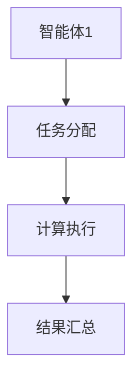
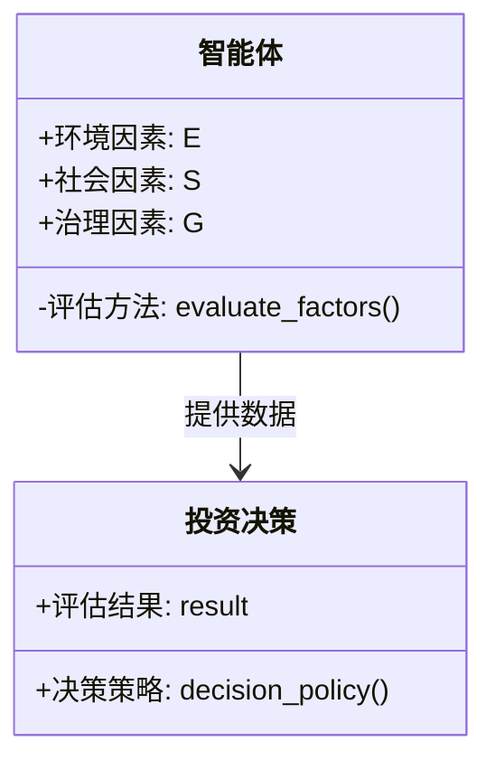
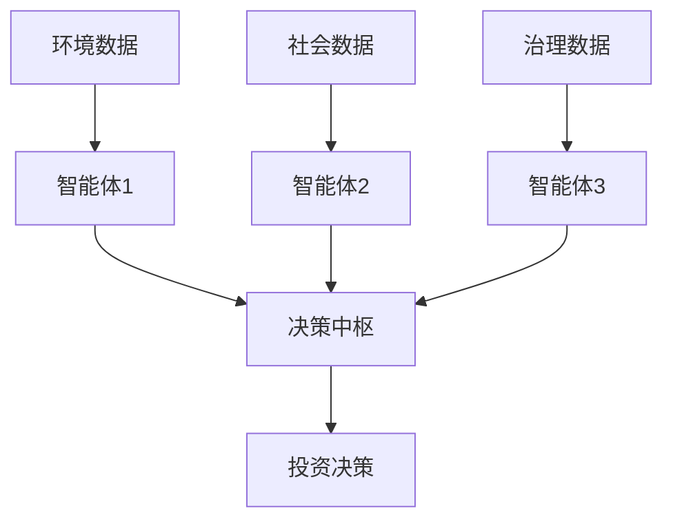
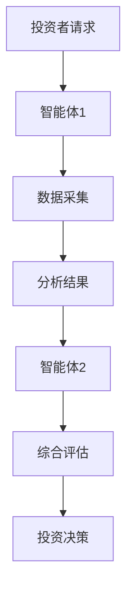

                 


```markdown
# 多智能体系统在识别和评估社会责任投资机会中的作用

> 关键词：多智能体系统、社会责任投资、人工智能、投资决策、系统架构

> 摘要：本文探讨了多智能体系统在社会责任投资中的应用，分析了其核心概念、算法原理、系统架构，并通过实际案例展示了其在识别和评估投资机会中的作用。

---

# 第一章: 多智能体系统与社会责任投资的背景介绍

## 1.1 问题背景
### 1.1.1 多智能体系统的概念与特点
多智能体系统（Multi-Agent Systems, MAS）是由多个智能体组成的分布式系统，每个智能体能够独立感知环境、自主决策，并通过协作完成复杂任务。其特点包括分布性、协作性、反应性和适应性。

### 1.1.2 社会责任投资的定义与目标
社会责任投资（Socially Responsible Investment, SRI）是指在投资决策中考虑环境、社会和治理（ESG）因素的投资策略。其目标是在实现财务回报的同时，促进社会可持续发展。

### 1.1.3 问题的提出与研究意义
传统的投资决策主要依赖于单一智能体的分析，难以应对复杂多变的市场环境。引入多智能体系统可以提高决策的准确性和效率，同时更好地满足社会责任投资的目标。

## 1.2 问题描述
### 1.2.1 多智能体系统在投资决策中的作用
多智能体系统能够通过协作和分工，从多个角度分析投资机会，提供更全面的决策支持。

### 1.2.2 社会责任投资机会的识别挑战
社会责任投资需要考虑的因素复杂多样，传统方法难以高效处理。多智能体系统可以通过分布式计算和协作，有效应对这一挑战。

### 1.2.3 问题的边界与外延
本文的研究边界主要集中在多智能体系统在社会责任投资机会识别中的应用，外延则涉及其在投资决策支持中的潜在扩展。

## 1.3 核心概念与联系
### 1.3.1 多智能体系统的核心要素
- 智能体：能够感知环境、自主决策的个体。
- 通信机制：智能体之间交换信息的渠道。
- 协作协议：智能体之间协作的规则和策略。

### 1.3.2 社会责任投资的关键属性
- 环境因素（E）：如碳排放、能源使用。
- 社会因素（S）：如员工权益、社会责任。
- 治理因素（G）：如公司治理结构、高管薪酬。

### 1.3.3 多智能体系统与社会责任投资的实体关系图
```mermaid
graph TD
    A[智能体1] --> B[环境因素]
    C[智能体2] --> D[社会因素]
    E[智能体3] --> F[治理因素]
    G[投资决策] <-- [协作机制]
```

## 1.4 本章小结
本章介绍了多智能体系统和社会责任投资的基本概念，分析了它们在投资机会识别中的作用，并通过实体关系图展示了两者之间的联系。

---

# 第二章: 多智能体系统的核心概念与算法原理

## 2.1 多智能体系统的核心原理
### 2.1.1 分布式计算与协作算法
多智能体系统通过分布式计算实现任务分解和协作，典型算法包括一致性算法和分布式任务分配算法。

### 2.1.2 智能体之间的通信与协调
智能体之间通过消息传递进行通信，协调一致完成任务。通信协议的设计直接影响系统的协作效率。

### 2.1.3 多智能体系统的数学模型
一致性算法是多智能体系统中的关键算法，用于确保各智能体之间的数据一致性。
$$一致性算法：\sum_{i=1}^{n} x_i = x_{\text{total}}$$

## 2.2 智能体与社会责任投资的关系
### 2.2.1 智能体在投资决策中的角色
智能体可以承担数据采集、风险评估、策略制定等不同角色，通过协作完成投资决策。

### 2.2.2 社会责任投资的多智能体协作模型
构建一个多智能体协作模型，各智能体分别负责不同的社会责任维度（E、S、G）的评估和分析。

### 2.2.3 智能体与人类投资者的协同作用
智能体可以辅助人类投资者进行决策，同时也可以独立完成部分投资任务。

## 2.3 算法原理与流程图
### 2.3.1 分布式计算流程


### 2.3.2 协作算法实现
```python
def distribute_task():
    for agent in agents:
        agent.receive_task()
        agent.execute_task()
        agent.send_result()
```

---

# 第三章: 系统分析与架构设计

## 3.1 问题场景介绍
社会责任投资机会识别需要考虑多个维度，传统的单一智能体方法难以高效处理。

## 3.2 系统功能设计
### 3.2.1 领域模型


### 3.2.2 系统架构


## 3.3 系统接口设计
定义智能体之间的通信接口，确保数据传递和协作顺利进行。

## 3.4 系统交互流程
### 3.4.1 交互流程图


---

# 第四章: 项目实战

## 4.1 环境安装
### 4.1.1 安装Python
```bash
pip install python3
```

### 4.1.2 安装相关库
```bash
pip install numpy pandas scikit-learn
```

## 4.2 核心代码实现
### 4.2.1 数据预处理
```python
import pandas as pd

def preprocess_data(data):
    # 数据清洗和特征提取
    return processed_data
```

### 4.2.2 模型训练
```python
from sklearn.model_selection import train_test_split
from sklearn.ensemble import RandomForestClassifier

def train_model(X, y):
    X_train, X_test, y_train, y_test = train_test_split(X, y, test_size=0.2)
    model = RandomForestClassifier().fit(X_train, y_train)
    return model
```

## 4.3 案例分析与代码解读
### 4.3.1 实际案例
分析一家公司的ESG指标，评估其投资价值。

### 4.3.2 代码解读
```python
processed_data = preprocess_data(raw_data)
model = train_model(processed_data)
```

## 4.4 项目总结
总结项目实现的关键步骤和成果，分析系统的优缺点。

---

# 第五章: 系统优化与部署

## 5.1 系统优化
### 5.1.1 算法优化
改进一致性算法，提高计算效率。

### 5.1.2 并行计算
利用多线程或分布式计算技术，加速数据处理。

## 5.2 部署与监控
### 5.2.1 系统部署
将多智能体系统部署到云平台，提供服务接口。

### 5.2.2 性能监控
监控系统的运行状态，及时发现和解决问题。

## 5.3 性能测试与分析
对系统进行压力测试，分析其在高负载下的表现。

---

# 第六章: 最佳实践与总结

## 6.1 最佳实践
### 6.1.1 设计建议
在设计多智能体系统时，应充分考虑智能体之间的协作和通信机制。

### 6.1.2 实施建议
从数据采集、模型训练到系统部署，每个环节都需精心设计。

## 6.2 小结
总结全文，强调多智能体系统在社会责任投资中的重要性。

## 6.3 注意事项
在实际应用中，需注意数据隐私和系统安全问题。

## 6.4 拓展阅读
推荐阅读相关领域的书籍和论文，深入学习多智能体系统和人工智能的知识。

---

# 第七章: 附录

## 7.1 参考文献
列出本文参考的相关文献和资料。

## 7.2 工具与资源
推荐使用的工具和资源，如Python库、开发框架等。

## 7.3 索引
关键词索引，方便读者查找相关内容。

---

# 结语
通过本文的探讨，我们深入分析了多智能体系统在社会责任投资中的应用，从理论到实践，为未来的相关研究提供了参考。
```

