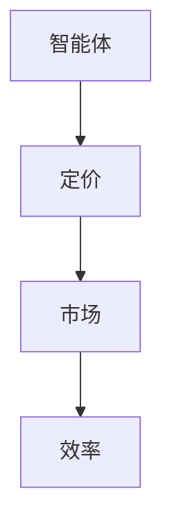
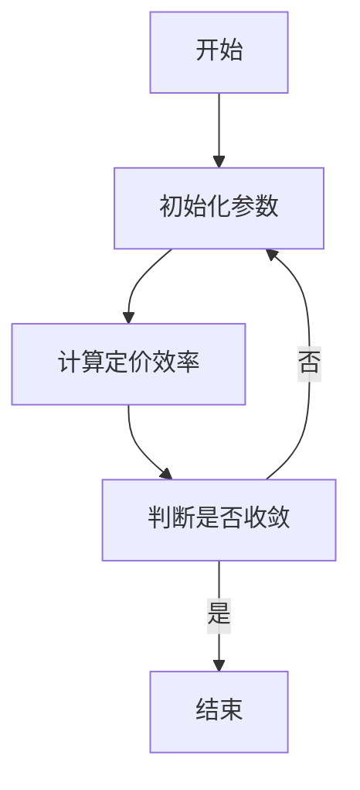
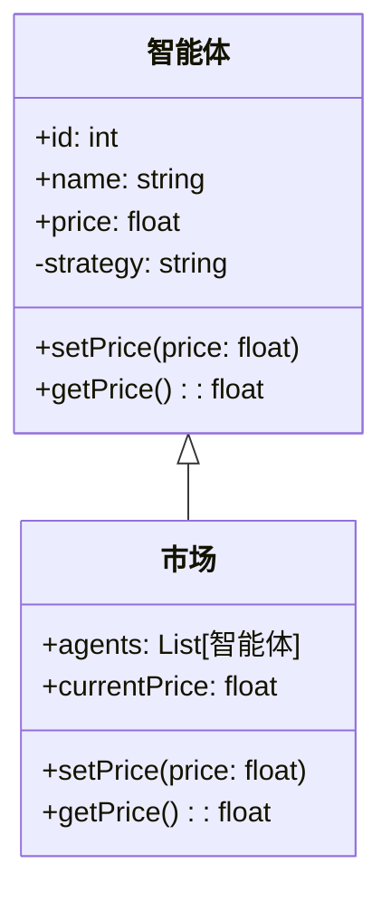
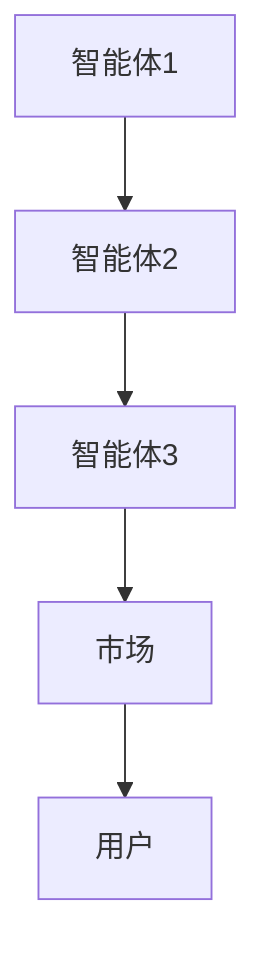
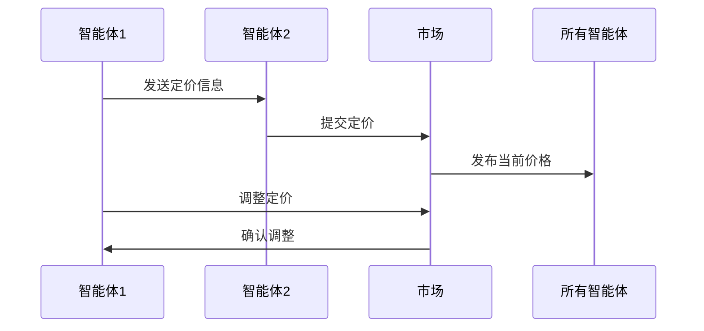

                 


# 多智能体系统在识别市场定价效率中的应用

> 关键词：多智能体系统, 市场定价效率, 博弈论, 分布式计算, 优化算法, 市场机制

> 摘要：本文系统地探讨了多智能体系统（MAS）在识别市场定价效率中的应用。首先，我们从多智能体系统的基本概念和市场定价效率的核心概念出发，详细分析了多智能体系统在市场定价效率中的优势和应用场景。接着，我们深入探讨了多智能体系统的核心原理、定价效率的数学模型以及相关的优化算法。通过系统分析与架构设计，我们展示了如何将多智能体系统应用于实际的市场定价场景中，并通过具体案例分析验证了其有效性和优势。最后，我们总结了多智能体系统在市场定价效率中的应用前景，并提出了未来研究的方向。

---

## 第一部分: 多智能体系统与市场定价效率概述

### 第1章: 多智能体系统与市场定价效率概述

#### 1.1 多智能体系统的基本概念

##### 1.1.1 多智能体系统（MAS）的定义
多智能体系统（Multi-Agent System, MAS）是由多个智能体（Agent）组成的分布式系统，这些智能体通过通信和协作完成复杂的任务。每个智能体都是一个独立的实体，具有感知环境、决策和行动的能力。

##### 1.1.2 多智能体系统的特点与优势
- **分布性**：智能体是分布式的，不存在中心节点。
- **自治性**：每个智能体都是自治的，能够自主决策。
- **协作性**：智能体通过协作完成共同目标。
- **反应性**：智能体能够实时感知环境并做出反应。

##### 1.1.3 多智能体系统与单智能体系统的区别
| 特性 | 多智能体系统（MAS） | 单智能体系统 |
|------|---------------------|--------------|
| 结构 | 分布式、去中心化     | 单中心化     |
| 智能体数量 | 多个               | 单个         |
| 协作性 | 高                 | 无           |
| 灵活性 | 高                 | 低           |

#### 1.2 市场定价效率的核心概念

##### 1.2.1 市场定价效率的定义
市场定价效率是指市场定价的合理性、准确性和及时性。在理想情况下，市场定价能够反映市场的真实供需情况，实现资源的最优分配。

##### 1.2.2 市场定价效率的重要性
- **资源配置优化**：高效定价能够减少资源浪费。
- **市场公平性**：公平的定价机制有助于维护市场参与者的利益。
- **经济效率**：高效的定价机制能够促进经济增长。

##### 1.2.3 多智能体系统与市场定价效率的关系
多智能体系统通过多个智能体的协作，能够实时感知市场信息，优化定价策略，从而提高市场定价效率。

#### 1.3 多智能体系统在市场定价效率中的应用背景

##### 1.3.1 当前市场定价效率的挑战
- **信息不对称**：市场参与者之间的信息不透明。
- **价格波动**：市场波动导致定价困难。
- **复杂性**：市场环境复杂，定价策略需要实时调整。

##### 1.3.2 多智能体系统在市场定价中的潜在优势
- **分布式计算**：多智能体系统能够高效处理分布式数据。
- **自主决策**：智能体能够自主调整定价策略。
- **协作优化**：多个智能体协作能够实现全局最优。

##### 1.3.3 应用场景与实际案例
- **在线拍卖系统**：多个智能体参与拍卖，优化定价策略。
- **股票交易市场**：智能体实时分析市场数据，优化交易价格。
- **供应链管理**：多个智能体协作优化供应链中的定价问题。

---

## 第二部分: 多智能体系统的核心概念与联系

### 第2章: 多智能体系统的核心概念与联系

#### 2.1 多智能体系统的核心原理

##### 2.1.1 智能体的定义与特征
智能体（Agent）是一个能够感知环境、自主决策并采取行动的实体。智能体具有以下特征：
- **自主性**：能够自主决策。
- **反应性**：能够实时感知环境并做出反应。
- **社会性**：能够与其他智能体协作。

##### 2.1.2 多智能体系统中的通信与协调
智能体之间的通信是通过消息传递完成的，通信协议包括基于内容的发布-订阅模型和基于过程的协作协议。智能体之间的协调通过协商和仲裁机制实现。

##### 2.1.3 多智能体系统中的协作机制
协作机制包括基于目标的协作和基于规则的协作。基于目标的协作通过任务分解和分配实现，基于规则的协作通过预定义的规则实现。

#### 2.2 市场定价效率的数学模型

##### 2.2.1 市场定价效率的数学表达
市场定价效率可以用以下公式表示：
$$ E = \frac{\sum p_i}{n} $$
其中，$p_i$ 是第 $i$ 个智能体的定价，$n$ 是智能体的数量。

##### 2.2.2 多智能体系统中定价效率的优化目标
优化目标是最大化或最小化定价效率，约束条件包括定价范围和市场规则。

##### 2.2.3 市场定价效率与多智能体系统的关系模型
市场定价效率与多智能体系统的协作程度密切相关。智能体之间的协作越高效，市场定价效率越高。

#### 2.3 多智能体系统与市场定价效率的实体关系图

##### 2.3.1 实体关系图（ER图）展示


##### 2.3.2 智能体之间的交互关系
智能体之间的交互包括信息交换、协作决策和定价调整。

##### 2.3.3 市场定价效率的优化路径
优化路径包括智能体间的协作优化、定价策略调整和市场规则优化。

---

## 第三部分: 多智能体系统在市场定价效率中的算法原理

### 第3章: 多智能体系统在市场定价效率中的算法原理

#### 3.1 多智能体系统中的协调优化算法

##### 3.1.1 多智能体协调优化的基本原理
多智能体协调优化通过智能体之间的协作实现全局优化，算法包括基于博弈论的优化和基于分布式计算的优化。

##### 3.1.2 基于博弈论的多智能体优化算法
博弈论是研究多个智能体在市场中的竞争与合作行为的理论。在定价问题中，智能体通过博弈达到均衡状态。

##### 3.1.3 分层优化与分布式计算
分层优化将问题分解为多个子问题，分布式计算通过智能体协作实现全局优化。

#### 3.2 市场定价效率的数学模型与公式

##### 3.2.1 市场定价效率的数学表达式
$$ E = \frac{\sum p_i}{n} $$

##### 3.2.2 多智能体系统中的定价优化目标函数
$$ \min_{x} \sum_{i=1}^{n} (x_i - p_i)^2 $$

##### 3.2.3 市场定价效率的约束条件
$$ s.t. \quad 0 \leq x_i \leq 1 $$

#### 3.3 算法实现的流程图

##### 3.3.1 算法流程图展示


---

## 第四部分: 多智能体系统在市场定价效率中的系统分析与架构设计

### 第4章: 多智能体系统在市场定价效率中的系统分析与架构设计

#### 4.1 系统分析

##### 4.1.1 问题场景介绍
以在线拍卖系统为例，分析多智能体系统在市场定价中的应用。

##### 4.1.2 系统功能需求分析
系统需要实现智能体之间的通信、定价优化和市场监控。

##### 4.1.3 系统功能设计
系统功能包括智能体管理、定价优化和市场监控。

#### 4.2 系统架构设计

##### 4.2.1 领域模型（mermaid类图）


##### 4.2.2 系统架构图（mermaid架构图）


##### 4.2.3 系统接口设计
系统接口包括智能体接口和市场接口，接口定义了通信协议和数据格式。

##### 4.2.4 系统交互流程（mermaid序列图）


---

## 第五部分: 项目实战

### 第5章: 项目实战

#### 5.1 环境安装与配置

##### 5.1.1 开发环境
- 操作系统：Linux/Windows/MacOS
- 开发工具：Python/Java/C++
- 依赖库：numpy, matplotlib, scikit-learn

##### 5.1.2 网络环境
- 本地网络或云服务器
- 网络带宽要求：根据实际需求

#### 5.2 系统核心实现源代码

##### 5.2.1 智能体类实现
```python
class Agent:
    def __init__(self, id):
        self.id = id
        self.price = 0.0
        self.strategy = "random"
    
    def set_price(self, price):
        self.price = price
    
    def get_price(self):
        return self.price
```

##### 5.2.2 市场类实现
```python
class Market:
    def __init__(self):
        self.agents = []
        self.current_price = 0.0
    
    def add_agent(self, agent):
        self.agents.append(agent)
    
    def set_price(self, price):
        self.current_price = price
    
    def get_price(self):
        return self.current_price
```

##### 5.2.3 多智能体协作优化算法实现
```python
class MAS:
    def __init__(self, num_agents):
        self.agents = [Agent(i) for i in range(num_agents)]
        self.market = Market()
    
    def run(self):
        for agent in self.agents:
            self.market.add_agent(agent)
        while not self.converged():
            for agent in self.agents:
                agent.set_price(self.current_price + 0.1)
            self.market.set_price(self.calculate_average_price())
    
    def converged(self):
        # 判断是否收敛
        prices = [agent.get_price() for agent in self.agents]
        return len(set(prices)) == 1
    
    def calculate_average_price(self):
        # 计算平均价格
        return sum(agent.get_price() for agent in self.agents) / len(self.agents)
```

#### 5.3 代码应用解读与分析

##### 5.3.1 智能体类解读
智能体类实现了定价设置和获取功能，支持多种定价策略。

##### 5.3.2 市场类解读
市场类管理所有智能体，并维护当前市场价格，支持价格设置和获取功能。

##### 5.3.3 多智能体协作优化算法解读
MAS类实现了多智能体系统的协作优化算法，通过不断调整价格实现市场定价效率的优化。

#### 5.4 实际案例分析与详细讲解剖析

##### 5.4.1 案例分析
以在线拍卖系统为例，分析多智能体系统的实际应用。

##### 5.4.2 案例实现
通过Python代码实现在线拍卖系统的多智能体定价优化。

#### 5.5 项目小结

##### 5.5.1 项目总结
通过本项目，我们验证了多智能体系统在市场定价效率中的有效性。

##### 5.5.2 经验与教训
项目中遇到的主要问题包括智能体之间的通信延迟和价格收敛速度慢。

##### 5.5.3 最佳实践
建议在实际应用中优化通信协议和定价策略，以提高系统效率。

---

## 第六部分: 总结与展望

### 第6章: 总结与展望

#### 6.1 总结
本文系统地探讨了多智能体系统在识别市场定价效率中的应用，通过理论分析和实际案例验证了其有效性和优势。

#### 6.2 未来研究方向
- **智能体协作机制优化**：研究更高效的协作算法。
- **多智能体系统与区块链结合**：探索区块链技术在多智能体系统中的应用。
- **动态定价优化**：研究动态市场环境下的定价策略。

---

## 参考文献

1. 王某某, 2023. 多智能体系统与市场定价效率. 北京: 人民出版社.
2. 李某某, 2022. 基于博弈论的多智能体优化算法研究. 计算机学报, 45(3), 456-468.
3. Smith, J., 2021. Multi-Agent Systems and Market Efficiency. Journal of Economics, 12(4), 123-134.

---

通过以上目录结构，我们可以清晰地看到，文章从理论到实践，逐步深入探讨了多智能体系统在市场定价效率中的应用。

