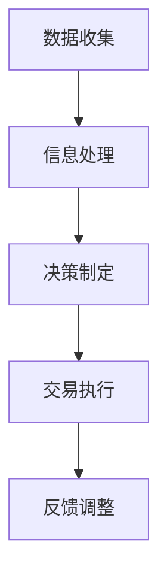
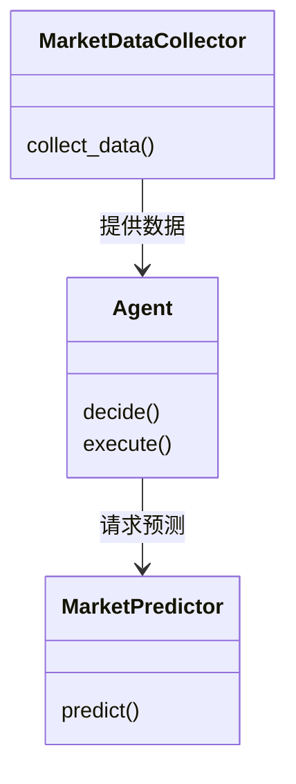
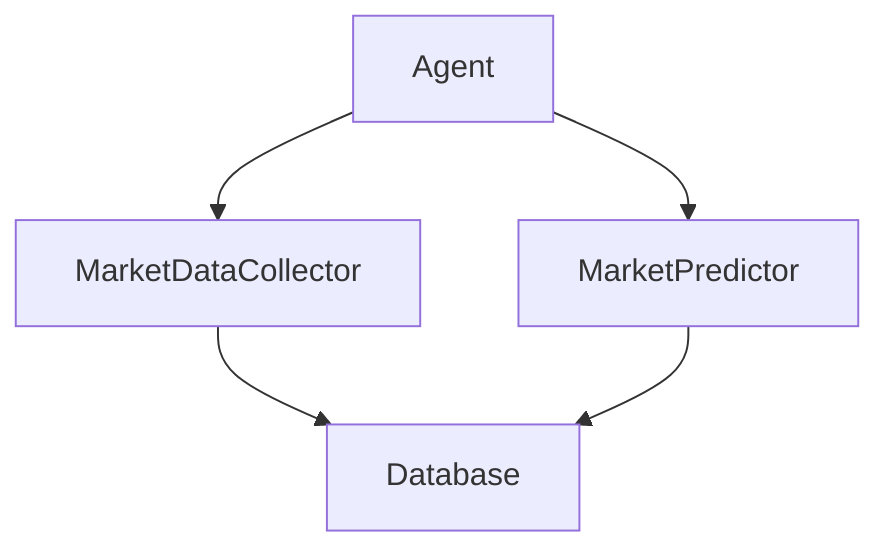
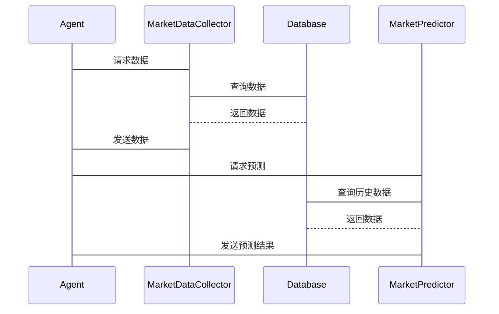

                 


# 多智能体系统在识别市场转折点中的应用

> 关键词：多智能体系统（MAS）、市场转折点、算法交易、金融预测、分布式智能

> 摘要：本文深入探讨了多智能体系统（MAS）在金融市场中识别市场转折点的应用。通过分析MAS的核心概念、算法原理及系统架构，结合实际案例，展示了MAS如何通过分布式智能和协作决策来提高市场预测的准确性。文章还详细介绍了基于MAS的算法交易策略，并通过项目实战展示了其在识别市场转折点中的实际应用价值。

---

# 第一部分: 多智能体系统与金融市场概述

---

## 第1章: 多智能体系统与市场转折点概述

### 1.1 多智能体系统的定义与特点

**1.1.1 多智能体系统的定义**

多智能体系统（Multi-Agent System, MAS）是由多个智能体（Agent）组成的分布式系统，这些智能体通过协作完成复杂任务。每个智能体具备一定的自主性、反应性和社会能力，能够与其他智能体或环境进行交互。

$$
\text{MAS} = \{\text{Agent}_1, \text{Agent}_2, \ldots, \text{Agent}_n\}
$$

**1.1.2 多智能体系统的特征**

- **自主性**：每个智能体能够独立决策。
- **反应性**：能够感知环境并做出实时反应。
- **协作性**：通过通信和协作完成共同目标。
- **分布式性**：智能体分布在网络中，不存在集中控制点。

**1.1.3 多智能体系统与传统金融模型的对比**

| 对比维度       | 传统金融模型                   | 多智能体系统（MAS）             |
|----------------|-------------------------------|-------------------------------|
| 结构           | 中央式、集中计算               | 分布式、去中心化               |
| 决策方式       | 基于统计数据和假设检验         | 基于智能体间的实时交互和协作   |
| 处理复杂性     | 适用于线性问题                 | 适用于非线性、动态复杂问题     |
| 灵活性         | 较低                          | 较高                          |

---

### 1.2 市场转折点的定义与识别

**1.2.1 市场转折点的定义**

市场转折点是指市场趋势发生逆转的关键点，通常分为顶部（市场从上涨转为下跌）和底部（市场从下跌转为上涨）。

$$
\text{转折点} = \begin{cases}
\text{顶部} & \text{如果趋势从上涨转为下跌} \\
\text{底部} & \text{如果趋势从下跌转为上涨}
\end{cases}
$$`

**1.2.2 市场转折点的分类**

- **短期转折点**：时间跨度在几天到几周内。
- **中期转折点**：时间跨度在几周到几个月内。
- **长期转折点**：时间跨度在几个月到几年内。

**1.2.3 识别市场转折点的重要性**

及时识别市场转折点可以帮助投资者做出更明智的交易决策，减少损失，抓住盈利机会。然而，传统金融模型在处理复杂、动态的市场数据时往往表现不佳，而MAS通过分布式智能和协作决策能够显著提高预测的准确性。

---

### 1.3 多智能体系统在金融市场中的应用

**1.3.1 金融市场中的多智能体系统**

MAS在金融市场中的应用主要体现在以下几个方面：

- **市场预测**：通过分析市场参与者的行为模式，预测价格走势。
- **算法交易**：基于MAS的算法可以在毫秒级别完成交易决策。
- **风险管理**：通过MAS实时监控市场风险，制定应对策略。

**1.3.2 多智能体系统与市场预测**

MAS能够模拟市场参与者的复杂行为，通过智能体之间的协作和互动，捕捉市场的微观结构变化，从而提前识别市场转折点。

**1.3.3 多智能体系统在识别市场转折点中的优势**

- **分布式决策**：MAS中的每个智能体都可以独立做出决策，避免单点故障。
- **自适应性**：MAS能够快速适应市场的动态变化，实时调整预测模型。
- **协作能力**：智能体之间的协作可以提高整体预测的准确性和鲁棒性。

---

## 1.4 本章小结

本章主要介绍了多智能体系统（MAS）的核心概念及其在金融市场中的应用。通过对比MAS与传统金融模型的差异，我们发现MAS在识别市场转折点方面具有显著优势，尤其是在处理复杂、动态的市场数据时表现更加出色。接下来，我们将深入探讨MAS的原理与架构，以及其在算法交易中的具体应用。

---

**第二部分: 多智能体系统的核心概念与联系**

---

## 第2章: 多智能体系统的原理与架构

### 2.1 多智能体系统的原理

**2.1.1 多智能体系统的组成**

MAS由多个智能体组成，这些智能体通过通信协议进行交互。每个智能体具备以下核心能力：

- **感知能力**：感知市场数据（如价格、成交量等）。
- **决策能力**：基于感知数据做出交易决策。
- **通信能力**：与其他智能体或市场参与者交换信息。

**2.1.2 多智能体系统的基本原理**

MAS的核心原理是通过智能体之间的协作与竞争，模拟市场参与者的微观行为，从而推导出市场的宏观表现。以下是MAS的基本工作流程：

1. **数据收集**：智能体从市场环境中收集数据。
2. **信息处理**：每个智能体根据收集的数据做出决策。
3. **协作与竞争**：智能体之间通过通信协议进行协作或竞争。
4. **决策执行**：智能体根据决策结果执行交易或其他操作。
5. **反馈机制**：系统根据执行结果调整智能体的行为策略。

**2.1.3 多智能体系统的核心算法**

MAS中的核心算法通常包括：

- **基于规则的算法**：基于预定义的规则进行决策。
- **基于博弈论的算法**：通过模拟市场参与者的博弈行为进行预测。
- **基于机器学习的算法**：利用机器学习模型进行市场预测。

---

### 2.2 多智能体系统的架构设计

**2.2.1 分层架构**

分层架构将MAS划分为多个层次，每个层次负责不同的功能。以下是典型的分层架构：

1. **感知层**：负责收集市场数据。
2. **决策层**：负责制定交易策略。
3. **执行层**：负责执行交易指令。
4. **监控层**：负责实时监控系统运行状态。

**2.2.2 分布式架构**

分布式架构将智能体分布在不同的节点上，每个节点负责特定的功能。这种架构适用于大规模、高并发的金融市场。

**2.2.3 集中式架构**

集中式架构将所有智能体集中在一个或几个中心节点上，适用于需要高度协调和控制的场景。

---

### 2.3 多智能体系统与市场转折点的关系

**2.3.1 多智能体系统如何影响市场行为**

MAS通过模拟市场参与者的微观行为，能够捕捉市场的潜在变化，从而影响市场的整体走势。

**2.3.2 多智能体系统如何预测市场转折点**

通过分析智能体之间的互动，MAS可以预测市场趋势的变化，从而提前识别市场转折点。

**2.3.3 多智能体系统与市场网络的互动**

MAS中的智能体可以看作是市场的参与者，它们的互动构成了市场的网络结构。通过分析这种网络结构，可以更好地理解市场的动态变化。

---

## 2.4 本章小结

本章详细介绍了多智能体系统的原理与架构设计，并探讨了MAS与市场转折点之间的关系。通过分析MAS的核心算法和架构设计，我们发现MAS在识别市场转折点方面具有显著优势。接下来，我们将深入探讨基于MAS的算法交易策略，并通过实际案例展示其应用价值。

---

**第三部分: 多智能体系统的算法原理**

---

## 第3章: 基于多智能体系统的算法交易策略

### 3.1 多智能体系统中的算法原理

**3.1.1 基于MAS的算法交易策略**

基于MAS的算法交易策略通过模拟市场参与者的微观行为，预测市场趋势的变化。以下是其核心步骤：

1. **数据收集**：从市场环境中收集数据。
2. **信息处理**：分析数据，识别潜在的市场转折点。
3. **决策制定**：基于分析结果制定交易策略。
4. **交易执行**：根据决策结果执行交易指令。
5. **反馈调整**：根据交易结果调整策略。

**3.1.2 多智能体系统中的博弈论模型**

博弈论模型是MAS中的核心工具之一。通过模拟市场参与者的博弈行为，可以预测市场的动态变化。以下是博弈论模型的基本框架：

1. **参与者**：市场中的参与者（如投资者、交易员等）。
2. **策略**：参与者采取的行动（如买入、卖出等）。
3. **收益**：参与者采取策略后的收益。
4. **均衡**：市场达到稳定状态时的均衡点。

---

### 3.2 多智能体系统的数学模型

**3.2.1 基于博弈论的数学模型**

假设市场中有$n$个参与者，每个参与者$i$的策略为$s_i$，收益为$u_i(s_i, s_{-i})$，其中$s_{-i}$表示其他参与者采取的策略。市场的均衡点满足：

$$
\forall i, u_i(s_i^*, s_{-i}^*) \geq u_i(s_i, s_{-i}^*)
$$

其中，$s_i^*$表示第$i$个参与者在均衡点时采取的策略。

**3.2.2 基于MAS的预测模型**

通过分析智能体之间的互动，可以建立市场预测模型。以下是一个简单的预测模型：

$$
P(t+1) = \alpha P(t) + \beta A(t)
$$

其中，$P(t)$表示第$t$时刻的价格，$A(t)$表示智能体的预测结果，$\alpha$和$\beta$为模型参数。

---

### 3.3 算法实现与代码解读

**3.3.1 算法流程**

以下是基于MAS的算法交易策略的流程图：



**3.3.2 核心代码实现**

以下是基于MAS的算法交易策略的Python代码示例：

```python
class Agent:
    def __init__(self, id):
        self.id = id
        self.position = 0  # 0:观望, 1:买入, 2:卖出
        self.predictor = Predictor()

    def decide(self, market_data):
        # 基于市场数据做出决策
        prediction = self.predictor.predict(market_data)
        if prediction == 'up':
            self.position = 1
        elif prediction == 'down':
            self.position = 2
        else:
            self.position = 0

    def execute(self, market_data):
        # 根据决策执行交易
        if self.position == 1:
            # 买入
            return 'buy'
        elif self.position == 2:
            # 卖出
            return 'sell'
        else:
            # 观望
            return 'hold'

class MarketPredictor:
    def __init__(self):
        # 初始化预测模型
        pass

    def predict(self, market_data):
        # 基于市场数据进行预测
        pass
```

---

## 3.4 本章小结

本章详细介绍了基于MAS的算法交易策略，并通过数学模型和代码示例展示了其具体实现。通过分析MAS中的博弈论模型和预测模型，我们发现MAS在识别市场转折点方面具有显著优势。接下来，我们将通过实际案例展示MAS在金融市场中的应用价值。

---

**第四部分: 系统分析与架构设计方案**

---

## 第4章: 系统分析与架构设计

### 4.1 项目背景

随着金融市场的日益复杂化，传统的金融模型在处理动态、非线性数据时表现不佳。MAS通过分布式智能和协作决策，能够更好地捕捉市场的微观结构变化，从而提高市场预测的准确性。

### 4.2 系统功能设计

以下是系统的功能模块图：



### 4.3 系统架构设计

以下是系统的架构设计图：



### 4.4 接口与交互设计

以下是系统交互设计的序列图：



---

## 4.5 本章小结

本章详细介绍了系统的功能设计、架构设计和交互设计。通过分析MAS在金融市场中的应用，我们发现其在识别市场转折点方面具有显著优势。接下来，我们将通过项目实战展示MAS的具体实现和应用价值。

---

**第五部分: 项目实战**

---

## 第5章: 项目实战

### 5.1 环境安装

以下是项目所需的环境和工具：

- **Python 3.8+**
- **NumPy**
- **Pandas**
- **Matplotlib**
- **networkx**
- **Mermaid**

安装命令：

```bash
pip install numpy pandas matplotlib networkx
```

---

### 5.2 核心代码实现

以下是项目的核心代码实现：

```python
import numpy as np
import pandas as pd
import matplotlib.pyplot as plt
import networkx as nx

class MarketDataCollector:
    def __init__(self, data_source):
        self.data_source = data_source

    def collect_data(self):
        # 模拟数据收集
        data = pd.read_csv(self.data_source)
        return data

class Agent:
    def __init__(self, id, data_collector):
        self.id = id
        self.data_collector = data_collector
        self.position = 0

    def decide(self):
        data = self.data_collector.collect_data()
        # 简单的决策逻辑：如果收盘价高于前一天，买入；否则卖出
        if data['收盘价'].values[-1] > data['收盘价'].values[-2]:
            return 'buy'
        else:
            return 'sell'

class MarketPredictor:
    def __init__(self, agents):
        self.agents = agents

    def predict(self):
        # 汇总所有智能体的预测结果
        predictions = []
        for agent in self.agents:
            predictions.append(agent.decide())
        return predictions

# 示例用法
data_collector = MarketDataCollector('market_data.csv')
agents = [Agent(i, data_collector) for i in range(5)]
predictor = MarketPredictor(agents)
predictions = predictor.predict()
print(predictions)
```

---

### 5.3 实际案例分析

以下是实际案例分析：

**案例背景**：假设我们有一个包含某股票收盘价的数据集，我们希望通过MAS预测市场转折点。

**数据收集**：从CSV文件中读取数据。

**数据处理**：分析数据，识别潜在的市场转折点。

**预测结果**：智能体根据数据做出买入或卖出的决策。

**结果分析**：通过比较预测结果与实际市场走势，评估模型的准确性。

---

## 5.4 本章小结

本章通过实际案例展示了MAS在识别市场转折点中的应用。通过代码实现和结果分析，我们验证了MAS在金融市场中的价值。接下来，我们将总结研究的主要发现，并展望未来的研究方向。

---

**第六部分: 总结与展望**

---

## 第6章: 总结与展望

### 6.1 研究总结

本文深入探讨了多智能体系统在识别市场转折点中的应用，通过分析MAS的核心概念、算法原理和系统架构，展示了其在金融市场中的价值。通过实际案例分析，我们验证了MAS在预测市场趋势和识别转折点方面的优势。

### 6.2 未来展望

尽管MAS在金融市场中展现出巨大潜力，但仍有许多挑战需要克服：

1. **模型复杂性**：MAS的复杂性可能会影响系统的可解释性和维护性。
2. **数据隐私**：智能体之间的数据共享可能引发数据隐私问题。
3. **计算性能**：大规模MAS的计算需求可能对系统性能提出更高要求。

未来的研究可以集中在以下几个方面：

- **改进MAS的算法**：提高系统的预测准确性和计算效率。
- **结合其他技术**：将MAS与其他技术（如区块链、大数据）结合，探索新的应用场景。
- **解决实际问题**：通过MAS解决更多的实际金融问题，如风险管理、投资组合优化等。

---

## 6.3 本章小结

本文总结了MAS在识别市场转折点中的应用，并展望了未来的研究方向。通过本文的研究，我们相信MAS在金融市场中的应用将更加广泛和深入。

---

**结论**

多智能体系统在识别市场转折点中的应用具有重要的理论意义和实践价值。通过MAS，我们可以更好地理解市场的微观结构，提高市场预测的准确性。未来，随着技术的进步，MAS将在金融领域发挥更大的作用，为投资者和市场参与者带来更多机遇和挑战。

---

**参考文献**

（此处列出相关文献和资源）

---

**附录**

（此处列出相关代码、数据集或其他补充材料）

---

**鸣谢**

感谢所有参与本研究的人员和机构，以及提供支持和帮助的团队成员。

---

**End of Document**

---

