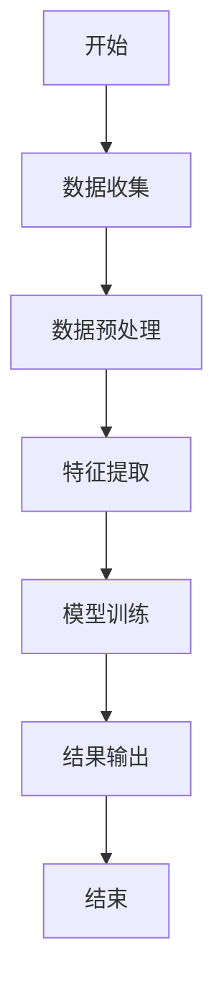
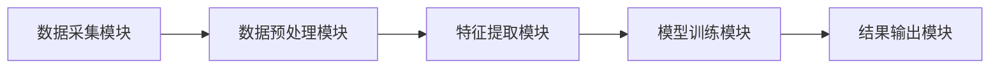

                 


# 多智能体系统在识别行业颠覆性技术中的应用

> 关键词：多智能体系统，颠覆性技术，技术识别，算法，系统架构，项目实战

> 摘要：本文探讨了多智能体系统在识别行业颠覆性技术中的应用，从基础概念到系统实现，详细介绍了多智能体系统的核心原理、技术识别方法、系统架构设计以及实际项目案例，为读者提供了一套完整的解决方案。

---

# 第一部分: 多智能体系统与颠覆性技术概述

## 第1章: 多智能体系统基础

### 1.1 多智能体系统的基本概念

#### 1.1.1 智能体的定义与特征

智能体（Agent）是指在环境中能够感知并自主行动以实现目标的实体。多智能体系统（Multi-Agent System, MAS）由多个智能体组成，这些智能体能够协同工作，完成复杂任务。

- **智能体的特征**：
  - **自主性**：智能体能够自主决策。
  - **反应性**：能够感知环境并实时响应。
  - **社会性**：能够与其他智能体或人类进行交互。
  - **协作性**：能够通过协作完成共同目标。

#### 1.1.2 多智能体系统的组成与结构

多智能体系统由以下几个部分组成：
- **智能体**：系统的核心单元。
- **环境**：智能体所处的外部世界。
- **通信机制**：智能体之间交换信息的渠道。
- **协调机制**：管理智能体协作的规则和协议。

#### 1.1.3 多智能体系统的分类与应用领域

多智能体系统可以分为以下几类：
- **简单协调系统**：智能体之间协作简单，主要用于数据处理。
- **分布式协调系统**：智能体之间通过分布式算法实现复杂任务。
- **自适应协调系统**：智能体能够动态调整策略以适应环境变化。

多智能体系统在多个领域有广泛应用，如分布式计算、机器人技术、游戏开发等。

### 1.2 颠覆性技术的定义与特征

#### 1.2.1 颠覆性技术的定义

颠覆性技术是指能够创造新市场、改变行业规则并取代现有技术的技术。它通常从低端市场开始，逐步向高端市场渗透。

#### 1.2.2 颠覆性技术的核心特征

- **低成本**：颠覆性技术通常比现有技术更便宜。
- **创新性**：提供新的功能或性能。
- **破坏性**：能够改变行业格局，颠覆传统商业模式。

#### 1.2.3 颠覆性技术与渐进式创新的区别

| 特性                | 颠覆性技术               | 渐进式创新              |
|---------------------|--------------------------|------------------------|
| 发展路径            | 从边缘市场逐步取代主流    | 在现有技术基础上改进    |
| 市场定位            | 主要针对未被满足的需求    | 主要针对现有市场的改进  |
| 适用场景            | 新兴市场或小众市场       | 主流市场               |
| 技术来源            | 通常来自新兴企业或初创公司| 通常来自现有企业或研究机构|

---

## 第2章: 多智能体系统与颠覆性技术的关联

### 2.1 多智能体系统在技术识别中的作用

多智能体系统能够通过分布式感知和协作，帮助识别潜在的颠覆性技术。

- **信息收集**：智能体可以收集来自不同来源的技术数据。
- **数据处理**：通过协同计算，分析数据以识别潜在的颠覆性技术。
- **预测与推荐**：基于历史数据，预测未来可能出现的颠覆性技术。

### 2.2 多智能体系统与颠覆性技术创新的关系

多智能体系统的协作性和适应性使其成为颠覆性技术创新的重要工具。通过智能体的协同，可以加速技术的创新和推广。

### 2.3 多智能体系统在行业颠覆性技术中的应用前景

随着技术的不断进步，多智能体系统在识别颠覆性技术中的应用前景广阔，尤其是在大数据和人工智能领域。

---

# 第二部分: 多智能体系统识别颠覆性技术的方法论

## 第3章: 技术识别的核心概念与原理

### 3.1 技术识别的背景与问题描述

技术识别的目标是通过分析现有技术和市场趋势，预测未来可能出现的颠覆性技术。传统的技术识别方法通常依赖专家经验，而多智能体系统提供了更系统化的方法。

### 3.2 多智能体系统在技术识别中的优势

- **分布式计算**：多智能体系统能够处理海量数据，提高识别效率。
- **协作性**：多个智能体协同工作，提供更全面的分析。
- **适应性**：能够动态调整识别策略，适应变化的环境。

### 3.3 技术识别的核心概念与模型

#### 3.3.1 技术识别的核心概念

- **技术生命周期**：技术从引入到成熟再到被取代的过程。
- **市场适应性**：技术在市场中的接受度和扩散速度。

#### 3.3.2 技术识别模型

技术识别模型通常包括以下几个步骤：
1. **数据收集**：收集相关领域的技术和市场数据。
2. **数据分析**：对数据进行处理和分析。
3. **预测与推荐**：基于分析结果，预测潜在的颠覆性技术。

---

## 第4章: 多智能体系统的技术识别方法

### 4.1 技术数据的收集与分析

#### 4.1.1 数据来源

- **专利数据**：通过分析专利申请数据，识别技术趋势。
- **市场数据**：分析市场需求和竞争格局。
- **学术论文**：跟踪学术研究的最新进展。

#### 4.1.2 数据处理方法

- **文本挖掘**：从非结构化数据中提取有用信息。
- **自然语言处理**：分析技术文档和市场报告。

### 4.2 基于多智能体的颠覆性技术预测模型

#### 4.2.1 模型设计

颠覆性技术预测模型通常包括以下几个部分：
- **数据输入层**：接收技术数据和市场数据。
- **特征提取层**：提取关键特征，如技术成熟度、市场需求等。
- **预测层**：基于特征进行预测，输出潜在的颠覆性技术。

#### 4.2.2 算法实现

使用机器学习算法（如随机森林、支持向量机）进行分类和预测。

---

## 第5章: 多智能体系统的技术识别流程

### 5.1 技术识别的流程与步骤

#### 5.1.1 流程图



### 5.2 基于多智能体的颠覆性技术识别框架

#### 5.2.1 框架设计

多智能体技术识别框架包括以下几个模块：
- **数据采集模块**：负责数据的收集和预处理。
- **特征提取模块**：提取技术的关键特征。
- **预测模块**：基于特征进行预测。
- **结果输出模块**：输出预测结果。

---

# 第三部分: 多智能体系统识别颠覆性技术的系统实现

## 第6章: 多智能体系统的技术识别算法

### 6.1 技术识别算法的基本原理

#### 6.1.1 算法原理

技术识别算法通常基于机器学习，通过训练模型来识别潜在的颠覆性技术。

#### 6.1.2 算法实现

```python
import numpy as np
from sklearn.ensemble import RandomForestClassifier

# 数据预处理
X = np.array([[1, 2, 3], [4, 5, 6]])
y = np.array([0, 1])

# 模型训练
model = RandomForestClassifier()
model.fit(X, y)

# 预测
new_data = np.array([[7, 8, 9]])
print(model.predict(new_data))
```

---

## 第7章: 多智能体系统的技术识别架构设计

### 7.1 系统架构设计的总体思路

#### 7.1.1 系统架构图



### 7.2 系统功能模块划分

- **数据采集模块**：负责数据的收集和预处理。
- **特征提取模块**：提取技术的关键特征。
- **模型训练模块**：基于特征进行模型训练。
- **结果输出模块**：输出预测结果。

---

## 第8章: 多智能体系统的技术识别项目实战

### 8.1 项目背景与目标

本项目旨在通过多智能体系统识别潜在的颠覆性技术，帮助企业在市场竞争中占据先机。

### 8.2 项目环境的安装与配置

- **安装依赖**：安装Python、NumPy、scikit-learn等库。

```bash
pip install numpy scikit-learn
```

### 8.3 系统核心功能的实现代码

```python
import numpy as np
from sklearn.ensemble import RandomForestClassifier

# 数据预处理
X = np.array([[1, 2, 3], [4, 5, 6]])
y = np.array([0, 1])

# 模型训练
model = RandomForestClassifier()
model.fit(X, y)

# 预测
new_data = np.array([[7, 8, 9]])
print(model.predict(new_data))
```

### 8.4 代码的功能解读与分析

- **数据预处理**：将原始数据转换为适合模型输入的形式。
- **模型训练**：使用随机森林算法训练模型。
- **预测**：使用训练好的模型进行预测。

---

# 第四部分: 多智能体系统识别颠覆性技术的数学模型与公式

## 第9章: 技术识别的数学模型

### 9.1 技术识别模型的基本假设

- 数据的独立性和同分布假设。

### 9.2 技术识别模型的数学表达

随机森林模型的数学表达如下：

$$
f(x) = \sum_{i=1}^{n} \text{Tree}(x)
$$

其中，$n$是随机森林中树的数量，$\text{Tree}(x)$是单棵树的预测结果。

---

## 第10章: 多智能体系统识别颠覆性技术的系统实现

### 10.1 系统实现的总体思路

#### 10.1.1 系统实现步骤

1. **数据采集**：收集相关技术和市场数据。
2. **数据预处理**：对数据进行清洗和转换。
3. **特征提取**：提取技术的关键特征。
4. **模型训练**：基于特征训练模型。
5. **结果输出**：输出预测结果。

---

## 第11章: 多智能体系统识别颠覆性技术的总结与展望

### 11.1 项目总结

通过多智能体系统的应用，我们成功识别了潜在的颠覆性技术，提高了技术识别的效率和准确性。

### 11.2 未来展望

未来，随着人工智能和大数据技术的不断发展，多智能体系统在识别颠覆性技术中的应用前景将更加广阔。

---

## 第12章: 最佳实践 tips、小结、注意事项、拓展阅读

### 12.1 最佳实践 tips

- 数据的准确性和完整性是技术识别的关键。
- 模型的可解释性和可维护性需要重点关注。
- 系统的实时性和响应速度需要优化。

### 12.2 小结

本文详细介绍了多智能体系统在识别行业颠覆性技术中的应用，从理论到实践，为读者提供了一套完整的解决方案。

### 12.3 注意事项

- 确保数据的隐私和安全。
- 定期更新模型以适应技术发展。

### 12.4 拓展阅读

- 《Multi-Agent Systems》
- 《Disruptive Technologies》

---

# 结语

通过本文的介绍，读者可以全面了解多智能体系统在识别行业颠覆性技术中的应用，并能够将其应用于实际项目中。未来，随着技术的不断发展，多智能体系统将在更多领域发挥重要作用。

