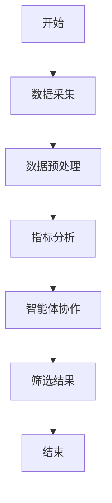

                 


# 《多智能体系统在费雪成长股筛选中的创新应用》

> 关键词：多智能体系统，费雪成长股，创新应用，投资策略，智能筛选

> 摘要：本文探讨了多智能体系统（MAS）在费雪成长股筛选中的创新应用，结合MAS的协作优势与费雪成长股的筛选标准，提出了一种基于多智能体的股票筛选方法。通过分析MAS的核心原理、算法设计、系统架构及实际案例，展示了MAS在提升股票筛选效率和准确性方面的优势。

---

## 目录大纲

### 第一章：背景介绍
1.1 多智能体系统的基本概念
1.2 费雪成长股的定义与筛选标准
1.3 多智能体系统与费雪成长股的结合

### 第二章：多智能体系统的核心原理
2.1 多智能体系统的组成与协作机制
2.2 多智能体系统的通信与协调
2.3 多智能体系统的决策算法

### 第三章：费雪成长股筛选的标准与流程
3.1 费雪成长股的核心指标
3.2 费雪成长股的传统筛选方法
3.3 费雪成长股筛选的流程优化

### 第四章：多智能体系统在费雪成长股筛选中的应用
4.1 多智能体系统在数据采集中的作用
4.2 多智能体系统在指标分析中的应用
4.3 多智能体系统的协作机制对筛选结果的影响

### 第五章：算法设计与数学模型
5.1 多智能体协作的数学模型
5.2 算法流程图（Mermaid）
5.3 代码实现（Python）

### 第六章：系统架构与设计
6.1 系统功能模块设计
6.2 系统架构图（Mermaid）
6.3 系统接口设计

### 第七章：项目实战与案例分析
7.1 环境安装与配置
7.2 代码实现与解读
7.3 案例分析与结果展示

### 第八章：总结与展望
8.1 研究总结
8.2 创新点与不足
8.3 未来研究方向

---

### 详细章节内容示例

#### 第二章：多智能体系统的核心原理
2.1 多智能体系统的组成与协作机制
- 智能体的定义与特征
- 多智能体系统的组成结构
- 协作机制的分类与对比

2.2 多智能体系统的通信与协调
- 通信方式：直接通信与间接通信
- 协调算法：协商算法与一致性算法
- 通信与协调的实现案例

2.3 多智能体系统的决策算法
- 分布式决策算法
- 聚类算法与分类算法
- 自适应算法在决策中的应用

#### 第五章：算法设计与数学模型
5.1 多智能体协作的数学模型
- 股票筛选的优化目标
- 多智能体协作的数学表达
- 模型的参数设置与优化

5.2 算法流程图（Mermaid）


5.3 代码实现（Python）
```python
import pandas as pd
import numpy as np

def fisher_growth_stock_screening(data):
    # 数据预处理
    data = data.dropna()
    data['增长率'] = (data['营收'] / data['营收'].shift(1)) - 1
    # 多智能体协作筛选
    selected = data[data['增长率'] > 0.1]
    return selected

# 示例数据
data = pd.DataFrame({
    '营收': [100, 120, 150, 180],
    '净利润': [20, 25, 30, 35]
})
result = fisher_growth_stock_screening(data)
print(result)
```

#### 第六章：系统架构与设计
6.1 系统功能模块设计
- 数据采集模块
- 数据处理模块
- 筛选算法模块
- 结果展示模块

6.2 系统架构图（Mermaid）


6.3 系统接口设计
- 数据接口：API设计与实现
- 筛选结果接口：JSON格式输出

---

### 总结
本文通过系统地分析多智能体系统的核心原理与费雪成长股筛选的创新应用，结合算法设计与实际案例，展示了MAS在提升股票筛选效率和准确性方面的潜力。未来的研究可以进一步优化算法和系统架构，探索更多应用场景。

