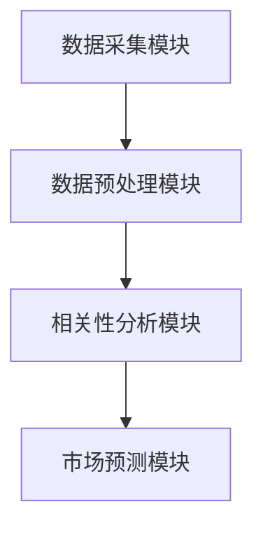
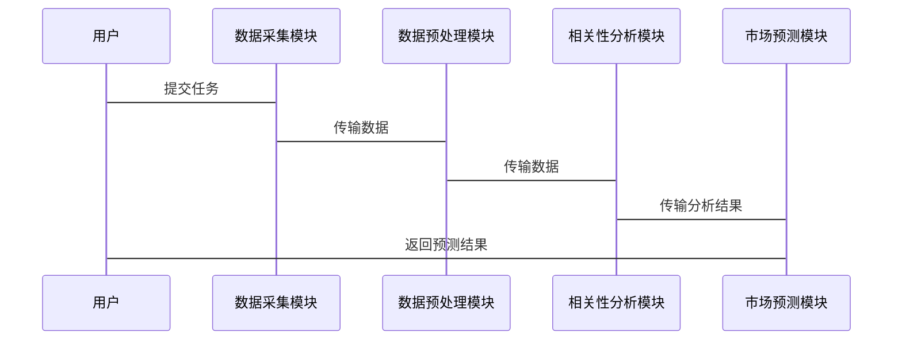

                 


# 多智能体系统在跨市场相关性分析中的应用

## 关键词：
多智能体系统, 跨市場相關性分析, 分布式计算, 博弈论, 金融市场, 数据挖掘

## 摘要：
多智能体系统（Multi-Agent Systems, MAS）是一种分布式计算范式，由多个智能体协同工作以实现复杂任务。本文探讨MAS在跨市场相关性分析中的应用，涵盖MAS的基本概念、跨市场数据特征、MAS在相关性分析中的具体应用、算法原理、系统架构设计以及项目实战。通过分析多智能体系统在金融市场中的协同学习、分布式计算和博弈论模型，本文展示了如何利用MAS提高跨市场相关性分析的效率和准确性。结合实际案例，本文详细讲解了MAS在外汇市场和股票市场中的应用，为读者提供了从理论到实践的完整指导。

---

# 第1章 多智能体系统概述

## 1.1 多智能体系统的基本概念
### 1.1.1 智能体的定义与分类
- **智能体的定义**：智能体是具有感知环境、自主决策和执行任务能力的实体。
- **智能体的分类**：
  - **简单反应式智能体**：基于当前感知做出反应。
  - **基于模型的反射式智能体**：利用内部模型和记忆进行决策。
  - **目标驱动智能体**：基于目标导向的行为。
  - **效用驱动智能体**：基于效用函数优化决策。

### 1.1.2 多智能体系统的特征与优势
- **分布性**：多个智能体协同工作，避免单点故障。
- **自主性**：智能体能够自主决策。
- **协作性**：智能体之间通过通信和协作完成复杂任务。
- **动态性**：系统能够适应环境变化。

### 1.1.3 多智能体系统与传统单智能体系统的区别
- **单智能体系统**：集中控制，单一决策中心。
- **多智能体系统**：分布式控制，多个智能体协同工作。

## 1.2 跨市場相關性分析的背景与意义
### 1.2.1 跨市場相關性分析的定义
- 跨市場相關性分析：研究不同市场之间资产价格波动的相关性，识别市场间的相互影响。

### 1.2.2 跨市場相關性分析的重要性
- **风险分散**：了解市场间的相关性有助于优化投资组合。
- **市场预测**：相关性分析可帮助预测市场走势。
- **全球化的金融市场**：跨市场相关性分析成为现代金融研究的核心内容。

### 1.2.3 多智能体系统在跨市場相關性分析中的应用前景
- **分布式计算**：MAS能够高效处理跨市场的海量数据。
- **协同学习**：MAS可以通过多个智能体协同学习，提高分析精度。
- **博弈论模型**：MAS可以模拟市场参与者的博弈行为，预测市场趋势。

## 1.3 本章小结
本章介绍了多智能体系统的基本概念及其在跨市場相關性分析中的应用前景，为后续章节奠定了基础。

---

# 第2章 多智能体系统的核心概念与原理

## 2.1 多智能体系统的体系结构
### 2.1.1 分布式多智能体系统
- **特点**：去中心化，无单一控制中心。
- **应用场景**：适合复杂、动态的环境。

### 2.1.2 集中式多智能体系统
- **特点**：有一个中央控制节点，协调各智能体的行为。
- **应用场景**：适合任务简单、控制需求高的场景。

### 2.1.3 混合式多智能体系统
- **特点**：结合分布式和集中式的特点，部分任务由中央控制，部分任务去中心化。

## 2.2 多智能体系统的通信与协作
### 2.2.1 智能体之间的通信机制
- **直接通信**：智能体之间通过消息传递进行通信。
- **间接通信**：通过共享数据库或中间件进行通信。

### 2.2.2 协作协议与协调算法
- **协商算法**：智能体之间通过协商确定任务分配。
- **协调算法**：基于协商结果，协调各智能体的行为。

### 2.2.3 冲突解决与协商机制
- **冲突检测**：识别潜在的冲突。
- **协商与仲裁**：通过协商解决冲突，确定最优解。

## 2.3 多智能体系统的智能体模型
### 2.3.1 BDI模型
- **B表示信念（Belief）**：智能体对世界的认知。
- **D表示愿望（Desire）**：智能体的目标。
- **I表示意图（Intention）**：智能体为实现愿望而采取的行动。

### 2.3.2 组织模型
- **组织结构**：定义智能体之间的角色和责任。
- **协作规则**：定义智能体之间的协作方式。

### 2.3.3 基于规则的智能体模型
- **规则表示**：使用条件-动作规则描述智能体的行为。
- **规则推理**：基于规则进行推理，做出决策。

## 2.4 本章小结
本章详细介绍了多智能体系统的体系结构、通信机制和智能体模型，为后续章节的应用奠定了理论基础。

---

# 第3章 跨市場相關性分析的核心概念

## 3.1 跨市場相關性分析的定义与特征
### 3.1.1 跨市場相關性分析的定义
- 跨市場相關性分析：研究不同市场之间资产价格波动的相关性，识别市场间的相互影响。

### 3.1.2 跨市場相關性的特征
- **相关性强度**：相关系数的大小。
- **相关性方向**：正相关或负相关。
- **相关性稳定性**：相关性随时间的变化情况。

### 3.1.3 跨市場相關性分析的数学模型
- **相关系数公式**：
  $$ r = \frac{\sum (x_i - \bar{x})(y_i - \bar{y})}{\sqrt{\sum (x_i - \bar{x})^2 \sum (y_i - \bar{y})^2}} $$
- **协方差矩阵**：
  $$ \text{Cov}(x, y) = \frac{1}{n-1} \sum (x_i - \bar{x})(y_i - \bar{y}) $$

## 3.2 跨市場數據的特征与预处理
### 3.2.1 跨市場數據的特征
- **多维性**：涉及多个市场和资产。
- **时序性**：数据具有时间序列特征。
- **异质性**：不同市场的数据特征差异显著。

### 3.2.2 数据清洗与预处理
- **缺失值处理**：填充、删除或插值。
- **异常值处理**：识别并处理异常值。
- **数据标准化**：标准化或归一化处理。

### 3.2.3 数据特征提取
- **主成分分析（PCA）**：降维，提取主要特征。
- **波段分解**：分析数据的时间序列特征。

## 3.3 跨市場相關性分析的方法
### 3.3.1 基于统计学的相关性分析
- **皮尔逊相关系数**：衡量线性相关性。
- **斯皮尔曼相关系数**：衡量秩相关性。

### 3.3.2 基于机器学习的相关性分析
- **主成分分析（PCA）**：降维，提取主要特征。
- **聚类分析**：识别相关市场集群。
- **深度学习模型**：如LSTM网络，用于时间序列分析。

## 3.4 本章小结
本章介绍了跨市场相关性分析的核心概念、数据特征和分析方法，为后续章节的应用提供了理论支持。

---

# 第4章 多智能体系统在跨市場相關性分析中的应用

## 4.1 市场预测与风险评估
### 4.1.1 市场预测模型
- **多智能体协同学习**：多个智能体分别负责不同市场的数据分析，协同预测市场趋势。

### 4.1.2 风险评估模型
- **多智能体风险评估**：通过智能体之间的协作，评估市场间的相互影响。

## 4.2 投资组合优化
### 4.2.1 投资组合优化模型
- **基于多智能体的优化算法**：利用智能体之间的协作，优化投资组合。

### 4.2.2 投资组合优化的实现
- **智能体分工**：每个智能体负责一部分资产的分析和优化。
- **协作机制**：智能体之间共享信息，优化整体投资组合。

## 4.3 跨市場数据挖掘与模式识别
### 4.3.1 数据挖掘算法
- **关联规则挖掘**：发现市场间的关联规则。
- **聚类分析**：识别相关市场的集群。

### 4.3.2 模式识别
- **时间序列分析**：识别市场间的价格波动模式。
- **异常检测**：识别异常的市场波动。

## 4.4 本章小结
本章详细介绍了多智能体系统在跨市场相关性分析中的具体应用，包括市场预测、风险评估和投资组合优化。

---

# 第5章 跨市場相關性分析的算法原理

## 5.1 多智能体协同学习算法
### 5.1.1 协同学习模型
- **分布式协同学习**：智能体分布在不同节点，协同学习跨市场数据。

### 5.1.2 协同学习的实现
- **通信机制**：智能体之间通过消息传递共享信息。
- **协商机制**：智能体协商任务分工和结果整合。

## 5.2 分布式计算与并行处理
### 5.2.1 分布式计算模型
- **MapReduce模型**：适用于大规模数据处理。
- **分布式并行计算**：利用多智能体协同处理数据。

### 5.2.2 并行计算的实现
- **任务分配**：智能体之间分配任务。
- **结果汇总**：智能体之间汇总计算结果。

## 5.3 博弈论模型在相关性分析中的应用
### 5.3.1 博弈论模型
- **纳什均衡**：市场参与者在均衡状态下，不会改变策略。
- **博弈树模型**：模拟市场参与者的博弈过程。

### 5.3.2 博弈论模型的实现
- **博弈树构建**：构建市场参与者的博弈树。
- **纳什均衡求解**：求解博弈树中的纳什均衡。

## 5.4 本章小结
本章详细介绍了多智能体系统在跨市场相关性分析中的算法原理，包括协同学习、分布式计算和博弈论模型。

---

# 第6章 跨市場相關性分析的系统架构设计

## 6.1 系统功能设计
### 6.1.1 系统功能模块
- **数据采集模块**：采集跨市场的数据。
- **数据预处理模块**：对数据进行清洗和特征提取。
- **相关性分析模块**：进行跨市场相关性分析。
- **市场预测模块**：基于分析结果预测市场趋势。

### 6.1.2 功能模块的交互
- **数据流**：数据从采集模块流向预处理模块，再流向分析模块。
- **结果输出**：分析结果输出到预测模块，用于市场预测。

## 6.2 系统架构设计
### 6.2.1 系统架构图


### 6.2.2 系统组件之间的通信
- **组件间通信**：通过消息队列或数据库进行通信。
- **通信协议**：使用HTTP或WebSocket进行实时通信。

## 6.3 系统接口设计
### 6.3.1 数据接口
- **数据输入接口**：接收跨市场的数据。
- **数据输出接口**：输出分析结果。

### 6.3.2 用户接口
- **用户界面**：供用户输入参数和查看结果。
- **API接口**：供其他系统调用。

## 6.4 系统交互设计
### 6.4.1 用户登录与权限管理
- **用户登录**：用户登录系统。
- **权限管理**：根据用户权限限制操作。

### 6.4.2 数据分析流程


## 6.5 本章小结
本章详细介绍了跨市场相关性分析系统的功能设计、架构设计和交互设计，为后续章节的项目实现奠定了基础。

---

# 第7章 跨市場相關性分析的项目实战

## 7.1 项目背景与目标
### 7.1.1 项目背景
- **研究背景**：跨市场相关性分析在金融领域的应用越来越重要。
- **项目目标**：利用多智能体系统实现跨市场相关性分析。

## 7.2 项目环境与工具
### 7.2.1 环境安装
- **操作系统**：Linux或Windows。
- **编程语言**：Python 3.8及以上版本。
- **开发工具**：PyCharm或VS Code。
- **依赖库**：numpy、pandas、scikit-learn、tensorflow。

### 7.2.2 数据来源
- **数据集**：外汇市场和股票市场的历史数据。
- **数据获取**：通过API接口获取实时数据。

## 7.3 项目核心实现
### 7.3.1 数据采集模块
```python
import requests

def get_data(api_key):
    url = f"https://api.example.com/forex?api_key={api_key}"
    response = requests.get(url)
    return response.json()
```

### 7.3.2 数据预处理模块
```python
import pandas as pd

def preprocess_data(data):
    df = pd.DataFrame(data)
    df.dropna(inplace=True)
    df['date'] = pd.to_datetime(df['date'])
    return df
```

### 7.3.3 相关性分析模块
```python
import numpy as np

def calculate_correlation(df1, df2):
    correlation = np.corrcoef(df1, df2)[0, 1]
    return correlation
```

### 7.3.4 市场预测模块
```python
import tensorflow as tf
from tensorflow.keras import layers

def build_model(input_shape):
    model = tf.keras.Sequential()
    model.add(layers.Dense(64, activation='relu', input_shape=input_shape))
    model.add(layers.Dense(1, activation='sigmoid'))
    model.compile(optimizer='adam', loss='binary_crossentropy', metrics=['accuracy'])
    return model
```

## 7.4 项目实现与测试
### 7.4.1 项目实现
- **数据采集**：通过API获取外汇和股票市场数据。
- **数据预处理**：清洗数据，提取特征。
- **相关性分析**：计算市场间的相关性系数。
- **市场预测**：利用深度学习模型预测市场趋势。

### 7.4.2 项目测试
- **测试数据集**：使用部分数据进行测试。
- **模型评估**：评估模型的准确率和召回率。

## 7.5 本章小结
本章通过一个实际项目展示了多智能体系统在跨市场相关性分析中的应用，详细讲解了项目的实现过程和测试方法。

---

# 第8章 总结与展望

## 8.1 总结
- **MAS的核心作用**：MAS在跨市场相关性分析中的协同学习和分布式计算优势。
- **算法与系统设计**：MAS在算法和系统设计上的创新点。
- **项目实现成果**：通过实际项目验证MAS的应用价值。

## 8.2 未来展望
### 8.2.1 技术进步
- **更高效的算法**：如强化学习和图神经网络。
- **更强大的计算能力**：如量子计算和边缘计算。

### 8.2.2 应用场景扩展
- **更复杂的金融市场分析**：如多资产类别和多层次市场的相关性分析。
- **实时分析与决策支持**：MAS在实时市场监控和决策支持中的应用。

## 8.3 小结
未来，随着技术的进步和应用场景的扩展，MAS在跨市场相关性分析中的应用将更加广泛和深入。

---

# 参考文献
- [1] 维基百科：多智能体系统
- [2] 《多智能体系统的理论与应用》
- [3] 《跨市场相关性分析的理论与实践》
- [4] 相关学术论文和研究报告

---

# 附录
## 附录A：数学公式汇总
- 相关系数公式：
  $$ r = \frac{\sum (x_i - \bar{x})(y_i - \bar{y})}{\sqrt{\sum (x_i - \bar{x})^2 \sum (y_i - \bar{y})^2}} $$
- 协方差矩阵公式：
  $$ \text{Cov}(x, y) = \frac{1}{n-1} \sum (x_i - \bar{x})(y_i - \bar{y}) $$

## 附录B：系统架构图


## 附录C：系统交互序列图


---

# 作者简介
[此处可以添加作者简介，如作者的研究领域、著作和研究成果等。]

