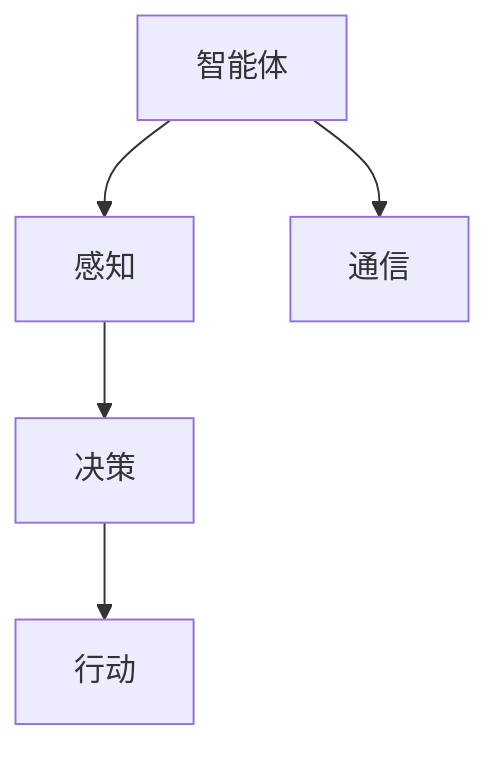
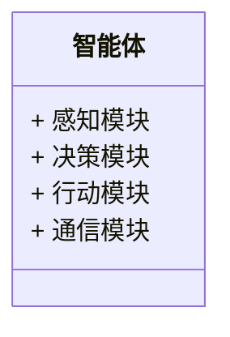
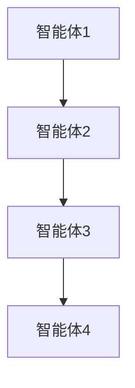
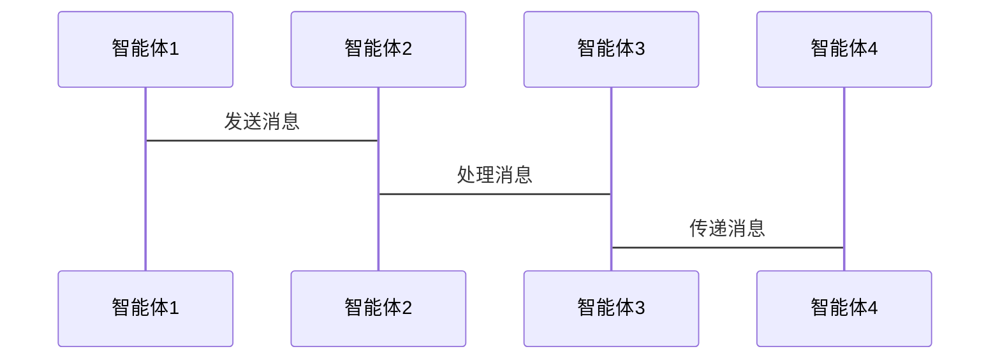

                 


# 多智能体系统在长期价值创造分析中的应用

> 关键词：多智能体系统，长期价值创造，分布式计算，人工智能，协同优化

> 摘要：本文探讨多智能体系统（Multi-Agent Systems, MAS）在长期价值创造分析中的应用，分析其核心算法、系统架构设计、项目实战及在不同领域的应用案例，深入剖析MAS在长期价值创造中的优势与挑战。

---

## 第一部分: 多智能体系统基础

### 第1章: 多智能体系统概述

#### 1.1 多智能体系统的基本概念

##### 1.1.1 多智能体系统的定义
多智能体系统（MAS）是由多个智能体组成的分布式系统，智能体是具有感知、决策和行动能力的实体，能够通过局部信息实现全局目标。

##### 1.1.2 多智能体系统的特点
| 特性 | 描述 |
|------|------|
| 分布式 | 智能体独立运行，通过通信协作完成任务 |
| 协作性 | 智能体之间通过协作实现整体目标 |
| 动态性 | 系统环境和智能体状态动态变化 |

##### 1.1.3 多智能体系统与其他相关概念的对比
- **分布式系统**：MAS是分布式系统的一种，但强调智能体的自主性和协作性。
- **人工智能**：MAS结合了AI技术，但更注重多智能体的协同。



#### 1.2 多智能体系统的组成与结构

##### 1.2.1 智能体的基本组成
智能体由感知模块、决策模块和行动模块组成。

##### 1.2.2 多智能体系统的层次结构
- **物理层**：智能体与环境交互。
- **逻辑层**：智能体的感知、决策和行动。
- **通信层**：智能体之间的通信与协作。

##### 1.2.3 多智能体系统的通信机制
- **同步通信**：智能体之间实时通信。
- **异步通信**：智能体之间非实时通信。

#### 1.3 多智能体系统的应用领域

##### 1.3.1 多智能体系统在分布式计算中的应用
- **分布式计算**：MAS通过分布式计算实现任务分解和协同。

##### 1.3.2 多智能体系统在人工智能中的应用
- **协作学习**：多个智能体协作完成复杂任务。

##### 1.3.3 多智能体系统在经济和社会模拟中的应用
- **经济模拟**：模拟市场行为和经济系统。

---

## 第2章: 长期价值创造分析的背景与需求

### 2.1 长期价值创造的定义与特点

#### 2.1.1 价值创造的定义
价值创造是通过优化资源分配和提高效率，为相关方创造可持续的价值。

#### 2.1.2 长期价值创造的核心要素
| 要素 | 描述 |
|------|------|
| 资源 | 优化资源配置 |
| 效率 | 提高系统效率 |
| 协作 | 多方协作 |

#### 2.1.3 长期价值创造与短期收益的关系
长期价值创造注重可持续性，短期收益注重快速见效。

### 2.2 长期价值创造分析的挑战

#### 2.2.1 数据的复杂性
长期价值创造涉及大量复杂数据，需要高效处理。

#### 2.2.2 时间跨度的问题
长期价值创造需要考虑时间的累积效应。

#### 2.2.3 多利益相关者的协调
涉及多方利益，需要协调一致。

### 2.3 多智能体系统在长期价值创造分析中的优势

#### 2.3.1 多智能体系统的分布式计算能力
通过分布式计算优化资源分配。

#### 2.3.2 多智能体系统的动态适应性
能够适应环境变化，实时调整策略。

#### 2.3.3 多智能体系统的协同优化能力
通过协作实现全局优化。

---

## 第3章: 多智能体系统的核心算法与实现

### 3.1 多智能体系统的典型算法

#### 3.1.1 分布式计算算法
- **Distributed Computing Algorithm**：通过分布式计算优化资源分配。

#### 3.1.2 多智能体强化学习算法
- **Multi-Agent Reinforcement Learning (MARL)**：多个智能体通过强化学习协作完成任务。

#### 3.1.3 多智能体协调与协作算法
- **Coordination and Collaboration Algorithms**：实现智能体之间的协调与协作。

### 3.2 多智能体系统的通信协议设计

#### 3.2.1 智能体之间的通信机制
- **Message Passing**：通过消息传递实现通信。

#### 3.2.2 通信协议的设计原则
- **简洁性**：协议设计简洁高效。
- **可靠性**：确保消息传递的可靠性。

#### 3.2.3 通信协议的实现案例
```python
def send_message(agent_id, message):
    # 实现消息发送逻辑
    pass

def receive_message(agent_id):
    # 实现消息接收逻辑
    pass
```

### 3.3 多智能体系统的协同优化算法

#### 3.3.1 协同优化的基本原理
通过智能体之间的协作实现全局优化。

#### 3.3.2 协同优化的数学模型
$$ \text{目标函数} = \sum_{i=1}^{n} f_i(x_i) $$

#### 3.3.3 协同优化的实现步骤
1. 初始化智能体。
2. 智能体感知环境。
3. 智能体决策并行动。
4. 智能体之间通信协作。
5. 优化目标函数。

---

## 第4章: 多智能体系统的架构设计与实现

### 4.1 系统需求分析

#### 4.1.1 功能需求
- **感知环境**：智能体感知环境信息。
- **决策与行动**：智能体根据感知信息决策并行动。
- **通信协作**：智能体之间通信协作。

#### 4.1.2 性能需求
- **实时性**：系统需要实时响应。
- **可靠性**：系统需要高可靠性。

### 4.2 系统功能设计

#### 4.2.1 领域模型


#### 4.2.2 系统架构设计


#### 4.2.3 系统接口设计
- **API接口**：智能体之间通过API接口通信。

#### 4.2.4 系统交互设计


---

## 第5章: 项目实战

### 5.1 项目背景与目标

#### 5.1.1 项目背景
以电商平台为例，分析MAS在长期价值创造中的应用。

#### 5.1.2 项目目标
优化电商平台的资源配置，提高用户体验。

### 5.2 系统环境搭建

#### 5.2.1 环境要求
- **操作系统**：Linux/Windows/MacOS
- **编程语言**：Python
- **开发工具**：PyCharm/VS Code

### 5.3 系统核心实现

#### 5.3.1 核心代码实现
```python
class Agent:
    def __init__(self, agent_id):
        self.agent_id = agent_id
        self.state = None

    def perceive(self, environment):
        self.state = environment.get_state()

    def decide(self):
        # 具体决策逻辑
        pass

    def act(self):
        # 具体行动逻辑
        pass

    def communicate(self, other_agent):
        # 智能体之间通信
        pass
```

#### 5.3.2 代码应用解读与分析
- **感知环境**：智能体通过环境接口获取信息。
- **决策与行动**：智能体根据感知信息进行决策并执行动作。
- **通信协作**：智能体之间通过通信模块协作完成任务。

### 5.4 案例分析与详细讲解

#### 5.4.1 案例分析
以电商平台为例，分析MAS如何优化资源配置。

#### 5.4.2 详细讲解
- **智能体协作**：多个智能体协作完成订单处理和物流配送。
- **动态调整**：根据实时数据动态调整策略。

### 5.5 项目小结

#### 5.5.1 实践总结
MAS在电商平台中的应用显著提高了效率和用户体验。

#### 5.5.2 经验教训
- **通信延迟**：需要优化通信机制。
- **计算资源**：需要更多的计算资源支持。

---

## 第6章: 多智能体系统在其他领域的应用

### 6.1 金融领域的应用

#### 6.1.1 金融市场的模拟与预测
- **市场行为分析**：通过MAS模拟市场行为，预测市场趋势。

#### 6.1.2 风险管理与控制
- **风险分散**：通过MAS实现风险分散和管理。

### 6.2 医疗领域的应用

#### 6.2.1 医疗资源优化配置
- **医疗资源分配**：优化医疗资源的分配，提高效率。

#### 6.2.2 疾病预测与诊断
- **疾病预测**：通过MAS预测疾病趋势，辅助诊断。

### 6.3 教育领域的应用

#### 6.3.1 教学资源优化
- **教学资源分配**：优化教学资源分配，提高教学效果。

#### 6.3.2 学生行为分析
- **学生行为分析**：分析学生行为，个性化教学。

---

## 第7章: 总结与展望

### 7.1 总结

#### 7.1.1 全文总结
MAS在长期价值创造中的应用广泛，具有显著优势。

#### 7.1.2 经验总结
- **协作优化**：MAS通过协作实现全局优化。
- **动态适应**：MAS能够动态适应环境变化。

### 7.2 展望

#### 7.2.1 未来发展方向
- **算法优化**：进一步优化MAS算法，提高效率。
- **领域扩展**：扩展MAS在更多领域的应用。

#### 7.2.2 技术趋势
- **智能化**：MAS将更加智能化。
- **协作性**：MAS协作将更加高效。

---

## 最佳实践 tips

- **算法优化**：在MAS设计中，注重算法的优化和效率提升。
- **通信机制**：设计高效的通信机制，减少延迟。
- **系统架构**：合理设计系统架构，确保系统的可扩展性和可维护性。

---

通过本文的详细讲解，可以了解到MAS在长期价值创造分析中的应用，以及其在不同领域的潜力和优势。希望本文能为相关领域的研究和实践提供有价值的参考。

