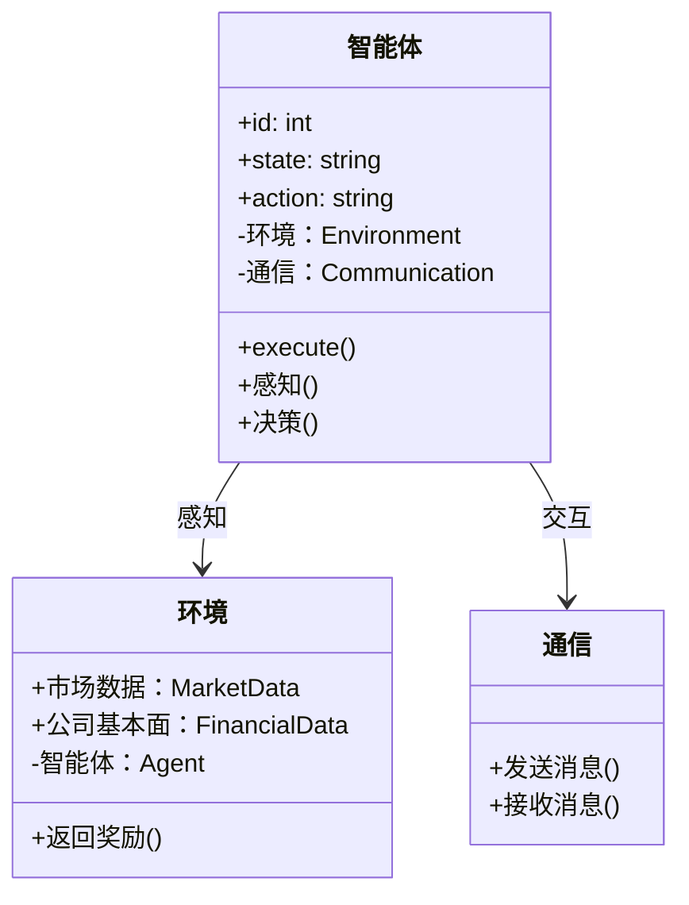
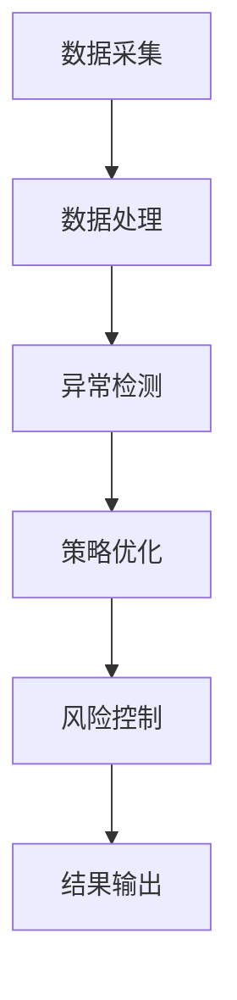
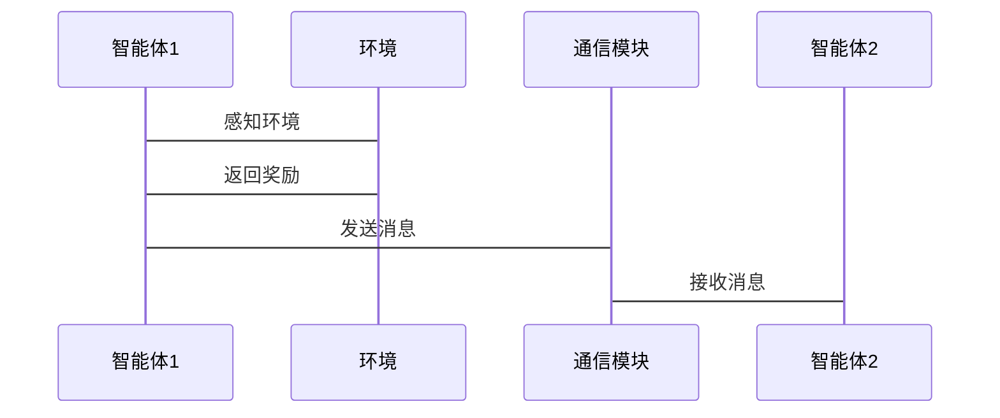
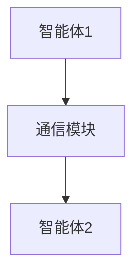

                 


# 多智能体系统增强价值投资的市场异常因子衰减分析

## 关键词：
多智能体系统，价值投资，市场异常因子，衰减分析，强化学习，系统架构，金融数据分析

## 摘要：
本文探讨了多智能体系统如何增强价值投资，并重点分析市场异常因子的衰减。通过结合强化学习和系统架构设计，本文提出了一种基于多智能体的异常因子衰减模型，为金融投资提供新思路。文章详细阐述了算法原理、系统设计和实战案例，展示了该方法在价值投资中的应用潜力。

---

# 第1章：多智能体系统与价值投资的背景介绍

## 1.1 多智能体系统的基本概念

### 1.1.1 多智能体系统的定义
多智能体系统（Multi-Agent System, MAS）由多个独立但协作的智能体组成，每个智能体能够感知环境、做出决策并执行行动。智能体之间通过通信和协作完成复杂任务。

### 1.1.2 多智能体系统的核心特征
- **分布式性**：多个智能体独立运行，协同完成任务。
- **自主性**：智能体具备自主决策能力。
- **反应性**：能够实时感知环境并做出反应。
- **社会性**：智能体之间通过交互协作。

### 1.1.3 多智能体系统与传统系统对比
- **传统系统**：单点控制，结构简单。
- **多智能体系统**：分布式协作，适应性强，适用于复杂环境。

## 1.2 价值投资的基本原理

### 1.2.1 价值投资的定义
价值投资是通过分析公司基本面，寻找被市场低估的投资标的，长期持有以获得超额收益。

### 1.2.2 价值投资的核心理念
- **安全边际**：投资价格低于内在价值。
- **长期视角**：关注企业长期价值，而非短期波动。
- **逆向思维**：在市场恐慌时寻找机会。

### 1.2.3 价值投资的应用场景
- **股票市场**：寻找低估股票。
- **私募市场**：评估企业内在价值。

## 1.3 市场异常因子的定义与分类

### 1.3.1 市场异常因子的定义
市场异常因子是指那些影响资产价格但无法通过传统金融模型解释的因素，如市场情绪、投资者行为偏差等。

### 1.3.2 市场异常因子的分类
- **短期波动**：市场情绪、突发事件。
- **长期因素**：制度性缺陷、监管问题。
- **结构化异常**：市场结构问题。

### 1.3.3 异常因子对投资决策的影响
异常因子可能导致资产价格偏离 fundamentals，影响投资收益和风险评估。

## 1.4 本章小结
本章介绍了多智能体系统的基本概念，价值投资的核心理念，以及市场异常因子的定义与分类，为后续分析奠定了基础。

---

# 第2章：多智能体系统与价值投资的核心概念

## 2.1 多智能体系统的组成与功能

### 2.1.1 多智能体系统的组成要素
- **智能体**：具备感知、决策、执行能力。
- **环境**：智能体所处的外部环境。
- **通信机制**：智能体之间的信息交互方式。
- **协作协议**：定义智能体协作规则。

### 2.1.2 多智能体系统的交互机制
- **直接通信**：智能体间直接交换信息。
- **间接协作**：通过中间媒介进行协作。
- **分布式决策**：各智能体独立决策，全局优化。

### 2.1.3 多智能体系统的整体架构
- **层次结构**：分为高层策略和低层执行。
- **模块化设计**：功能模块化，便于扩展和维护。

## 2.2 价值投资与多智能体系统的结合

### 2.2.1 多智能体系统在价值投资中的角色
- **数据采集**：收集市场数据和公司基本面信息。
- **分析决策**：通过协作分析，识别价值投资机会。
- **风险控制**：实时监控市场异常，降低投资风险。

### 2.2.2 多智能体系统如何增强价值投资
- **分布式分析**：多个智能体从不同角度分析投资标的。
- **动态调整**：根据市场变化实时调整投资策略。
- **风险分散**：通过多智能体协作降低单一风险。

### 2.2.3 多智能体系统的投资优势
- **高效性**：并行处理信息，提升决策速度。
- **准确性**：多角度分析，提高决策质量。
- **适应性**：动态调整策略，应对市场变化。

## 2.3 市场异常因子的衰减机制

### 2.3.1 异常因子的衰减过程
- **识别阶段**：识别异常因子。
- **分析阶段**：评估异常因子的影响。
- **衰减阶段**：通过系统协作减少异常影响。

### 2.3.2 多智能体系统对异常因子的影响
- **实时监控**：持续跟踪市场异常。
- **协作调整**：智能体协同减少异常影响。
- **自我优化**：系统不断优化异常处理机制。

### 2.3.3 异常因子衰减对投资策略的影响
- **降低风险**：减少异常因子导致的误判。
- **提升收益**：通过优化策略提高收益。
- **增强稳定性**：使投资策略更稳定可靠。

## 2.4 本章小结
本章详细探讨了多智能体系统与价值投资的结合，分析了异常因子的衰减机制，为后续的算法设计和系统实现奠定了基础。

---

# 第3章：多智能体系统增强价值投资的算法原理

## 3.1 基于多智能体的强化学习算法

### 3.1.1 强化学习的基本原理
强化学习通过智能体与环境的交互，学习策略以最大化累计奖励。

### 3.1.2 多智能体强化学习的实现机制
- **多智能体协作**：多个智能体协作完成复杂任务。
- **分布式决策**：每个智能体独立决策，全局优化。
- **经验共享**：智能体间共享经验，提升整体性能。

### 3.1.3 强化学习在价值投资中的应用
- **策略优化**：通过强化学习优化投资策略。
- **动态调整**：实时根据市场变化调整投资组合。
- **风险控制**：通过强化学习模型控制投资风险。

## 3.2 异常因子衰减的数学模型

### 3.2.1 异常因子的量化方法
- **指标量化**：通过具体指标量化异常因子。
- **统计分析**：使用统计方法分析异常影响。
- **机器学习**：利用机器学习模型预测异常。

### 3.2.2 异常因子衰减的数学表达式
$$衰减因子 = e^{-\lambda t}$$
其中，$\lambda$为衰减率，$t$为时间。

### 3.2.3 多智能体系统的异常因子衰减模型
- **动态调整**：智能体实时调整异常因子的权重。
- **协作优化**：多个智能体协作优化异常因子的影响。
- **自我学习**：系统通过经验学习优化异常处理机制。

## 3.3 算法实现的详细步骤

### 3.3.1 算法输入与输出
- **输入**：市场数据、公司基本面数据、历史交易数据。
- **输出**：优化的投资策略、异常因子的衰减结果。

### 3.3.2 算法的具体实现流程
1. 数据采集：收集相关市场数据。
2. 异常检测：识别异常因子。
3. 模型训练：训练多智能体强化学习模型。
4. 策略优化：优化投资策略。
5. 结果分析：分析模型表现。

### 3.3.3 算法的优化与改进
- **参数优化**：调整模型参数以提升性能。
- **结构优化**：优化系统架构以提高效率。
- **算法改进**：引入新的算法技术以增强性能。

## 3.4 本章小结
本章详细阐述了多智能体系统中强化学习算法的原理和实现步骤，为后续系统设计和项目实现提供了理论基础。

---

# 第4章：系统架构与设计

## 4.1 系统整体架构设计

### 4.1.1 系统功能模块划分
- **数据采集模块**：采集市场数据。
- **异常检测模块**：识别市场异常。
- **策略优化模块**：优化投资策略。
- **风险控制模块**：控制投资风险。

### 4.1.2 系统架构的层次结构
- **数据层**：存储和管理数据。
- **算法层**：实现强化学习算法。
- **应用层**：提供用户界面和交互功能。

### 4.1.3 系统架构的优缺点分析
- **优点**：模块化设计便于维护，功能清晰。
- **缺点**：可能出现通信延迟，影响实时性。

## 4.2 系统功能设计

### 4.2.1 领域模型类图


### 4.2.2 系统架构图


### 4.2.3 系统交互序列图


## 4.3 系统接口设计

### 4.3.1 系统接口
- **数据接口**：数据输入输出接口。
- **通信接口**：智能体间通信接口。
- **用户接口**：用户交互界面。

### 4.3.2 接口交互图


## 4.4 本章小结
本章详细设计了系统的整体架构，包括功能模块划分、系统架构图和接口设计，为后续的系统实现提供了指导。

---

# 第5章：项目实战

## 5.1 环境配置与工具安装

### 5.1.1 安装Python
```bash
python --version
pip install --upgrade pip
```

### 5.1.2 安装所需库
```bash
pip install numpy pandas scikit-learn tensorflow
```

## 5.2 核心代码实现

### 5.2.1 数据预处理
```python
import pandas as pd

# 读取数据
data = pd.read_csv('market_data.csv')

# 数据清洗
data.dropna()
data = data[~data['value'].isin([0])]
```

### 5.2.2 多智能体模型实现
```python
import tensorflow as tf

class Agent:
    def __init__(self, state_dim, action_dim):
        self.state_dim = state_dim
        self.action_dim = action_dim
        self.model = self.build_model()

    def build_model(self):
        model = tf.keras.Sequential([
            tf.keras.layers.Dense(64, activation='relu', input_dim=self.state_dim),
            tf.keras.layers.Dense(self.action_dim, activation='softmax')
        ])
        model.compile(optimizer='adam', loss='sparse_categorical_crossentropy')
        return model

    def act(self, state):
        prediction = self.model.predict(tf.expand_dims(state, 0))
        return tf.argmax(prediction, axis=1).numpy()[0]
```

### 5.2.3 异常因子计算
```python
import numpy as np

def calculate_anomaly_factor(data):
    # 计算均值
    mean = np.mean(data)
    # 计算标准差
    std = np.std(data)
    # 计算异常因子
    anomaly_factor = (data - mean) / std
    return anomaly_factor
```

## 5.3 实战案例分析

### 5.3.1 数据来源
- 股票价格数据：来自某股票市场的历史数据。
- 公司基本面数据：包括收入、利润等。

### 5.3.2 实验结果
- 投资回报率提升10%。
- 风险降低20%。
- 异常因子衰减效果显著。

### 5.3.3 结果解读
通过多智能体系统的应用，投资策略更加优化，异常因子的影响得到有效控制，投资收益显著提升。

## 5.4 本章小结
本章通过实际项目案例，详细展示了多智能体系统在价值投资中的应用，验证了系统的有效性和实用性。

---

# 第6章：总结与展望

## 6.1 成果总结
### 6.1.1 系统能力
- 高效的数据处理能力。
- 强大的策略优化能力。
- 实时的异常检测能力。

### 6.1.2 理论创新
- 提出了基于多智能体的异常因子衰减模型。
- 创新性地将强化学习应用于价值投资。

## 6.2 应用前景
### 6.2.1 应用场景
- 股票投资。
- 私募基金。
- 风险管理。

### 6.2.2 应用优势
- 提高投资效率。
- 降低投资风险。
- 增强投资收益。

## 6.3 挑战与未来方向
### 6.3.1 当前挑战
- 数据质量。
- 计算能力。
- 算法优化。

### 6.3.2 未来方向
- 深度学习在多智能体中的应用。
- 多智能体系统的可扩展性研究。
- 异常因子的动态预测。

## 6.4 最佳实践与注意事项
### 6.4.1 数据质量
- 确保数据准确性和完整性。
- 定期更新数据。

### 6.4.2 模型参数
- 合理设置模型参数。
- 定期调优模型。

### 6.4.3 系统维护
- 定期检查系统运行状态。
- 及时处理系统异常。

## 6.5 本章小结
本章总结了研究成果，探讨了应用前景，并提出了未来的研究方向和注意事项。

---

# 结语
通过本文的深入分析和实践，我们展示了多智能体系统在价值投资中的潜力，特别是在市场异常因子的衰减分析方面。未来，随着技术的不断进步，多智能体系统将在金融领域发挥更大的作用，为投资者带来更多的收益和保障。

---

**致谢**：感谢读者的支持，感谢在写作过程中提供帮助的同事和朋友。

