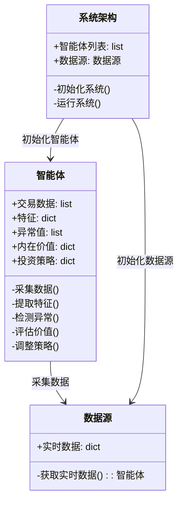
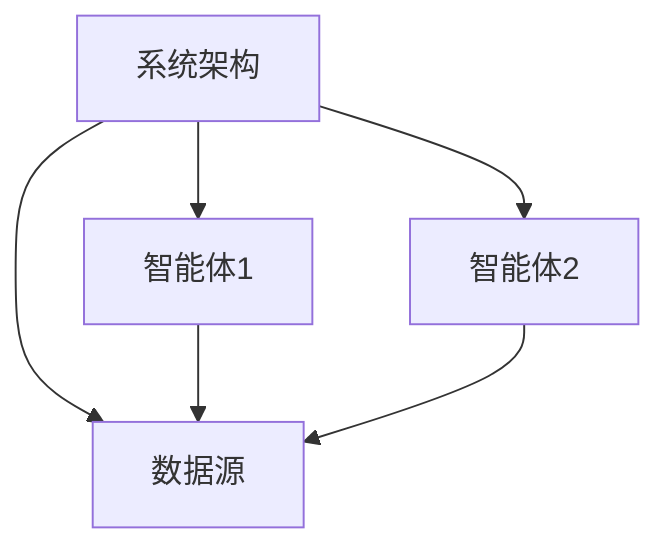

                 


# 多智能体系统增强价值投资的市场微观结构变化检测

---

## 关键词：
多智能体系统，价值投资，市场微观结构，算法原理，系统架构，项目实战

---

## 摘要：
本文探讨了多智能体系统在价值投资中的应用，重点分析了如何通过多智能体系统增强对市场微观结构变化的检测能力。文章首先介绍了多智能体系统的基本概念、价值投资的核心原理以及市场微观结构的主要特征。接着，详细阐述了多智能体系统在价值投资中的核心算法原理，包括强化学习、博弈论模型等，并通过数学公式和代码示例进行了深入分析。随后，文章讨论了系统的架构设计，包括功能模块划分、系统架构图以及接口设计。最后，通过一个具体的实战项目，展示了多智能体系统在实际应用中的实现过程，并总结了最佳实践和未来研究方向。

---

## 第1章: 多智能体系统与价值投资的背景介绍

### 1.1 多智能体系统的基本概念
多智能体系统（Multi-Agent System, MAS）是由多个相互作用的智能体组成的系统，每个智能体都有一定的自主性、反应性和协作性。多智能体系统的核心在于智能体之间的协同与竞争，通过信息共享和策略调整，实现整体目标的优化。

#### 1.1.1 多智能体系统的定义
多智能体系统是由多个智能体组成的分布式系统，这些智能体通过通信和协作完成复杂的任务。

#### 1.1.2 多智能体系统的特征
- **自主性**：每个智能体都能独立决策。
- **反应性**：智能体能够感知环境并实时调整行为。
- **协作性**：智能体之间通过通信和协作完成共同目标。
- **分布式性**：系统中的智能体分布在网络中，不存在中央控制节点。

#### 1.1.3 多智能体系统与传统单智能体系统的区别
传统单智能体系统由一个中心决策单元控制整个系统的行为，而多智能体系统通过多个智能体的协作完成任务，具有更高的灵活性和适应性。

### 1.2 价值投资的核心概念
价值投资是一种投资策略，旨在通过发现市场价格与内在价值的差异，寻找被市场低估的投资标的。

#### 1.2.1 价值投资的定义
价值投资是指投资者以低于内在价值的价格买入优质股票，长期持有的投资策略。

#### 1.2.2 价值投资的基本原理
价值投资的核心是寻找市场价格低于内在价值的股票，主要关注公司的基本面分析，如盈利能力、财务状况、行业地位等。

#### 1.2.3 价值投资在金融市场中的应用
价值投资在股票市场、债券市场等金融领域有广泛应用，尤其是在长期投资和风险管理方面表现出色。

### 1.3 市场微观结构的基本概念
市场微观结构是指金融市场中交易过程中的具体机制和参与者之间的互动关系。

#### 1.3.1 市场微观结构的定义
市场微观结构是金融市场中交易过程的具体机制，包括订单簿、交易规则、参与者行为等。

#### 1.3.2 市场微观结构的主要组成部分
- **订单簿**：记录买方和卖方的订单信息。
- **交易规则**：包括交易时间、订单类型、价格优先等。
- **参与者行为**：包括机构投资者、散户等不同参与者的交易行为。

#### 1.3.3 市场微观结构与宏观市场的关系
市场微观结构影响市场的流动性、价格形成机制和市场效率，是理解宏观市场波动的重要基础。

### 1.4 多智能体系统在价值投资中的应用背景
多智能体系统在价值投资中的应用主要体现在对市场微观结构变化的实时检测和对投资策略的动态优化。

#### 1.4.1 传统价值投资的局限性
- 传统价值投资依赖于人工分析，效率较低。
- 市场微观结构的变化难以及时捕捉，影响投资决策的实时性。

#### 1.4.2 多智能体系统的优势
- 多智能体系统能够实时感知市场变化，快速调整投资策略。
- 智能体之间的协作能够提高分析的全面性和准确性。

#### 1.4.3 多智能体系统在价值投资中的潜在应用场景
- 实时监控市场微观结构变化，识别潜在的投资机会。
- 分析市场参与者的交易行为，优化投资组合。
- 预测市场波动，降低投资风险。

### 1.5 本章小结
本章介绍了多智能体系统的基本概念、价值投资的核心原理以及市场微观结构的主要特征。通过对比分析，揭示了多智能体系统在价值投资中的潜在应用价值。

---

## 第2章: 多智能体系统与价值投资的核心概念与联系

### 2.1 多智能体系统的核心原理
多智能体系统通过智能体之间的协作与竞争，实现复杂任务的完成。

#### 2.1.1 多智能体系统的组成
- **智能体**：独立决策的个体，能够感知环境并采取行动。
- **通信机制**：智能体之间通过信息共享实现协作。
- **协作机制**：智能体通过合作实现共同目标。

#### 2.1.2 多智能体系统的通信机制
智能体之间的通信可以通过直接交换信息或通过中间媒介进行，通信机制的设计直接影响系统的协作效率。

#### 2.1.3 多智能体系统的协作机制
协作机制包括任务分配、资源分配、冲突解决等，是系统高效运行的关键。

### 2.2 价值投资的核心原理
价值投资通过分析企业的基本面，寻找市场价格低于内在价值的投资标的。

#### 2.2.1 价值投资的基本假设
- 市场价格与内在价值存在差异。
- 投资者可以通过分析发现这种差异。
- 长期持有优质股票能够获得超额收益。

#### 2.2.2 价值投资的关键指标
- 市盈率（P/E）：市价与每股收益的比率。
- 市净率（P/B）：市价与每股净资产的比率。
- 股息率：股息与股价的比率。

#### 2.2.3 价值投资的决策过程
- 收集公司基本面数据。
- 评估市场价格与内在价值的差异。
- 制定投资策略并执行。

### 2.3 市场微观结构的核心原理
市场微观结构是金融市场中交易过程的具体机制，影响市场的流动性和价格形成。

#### 2.3.1 市场微观结构的主要指标
- 成交量：一定时间内交易的股数或金额。
- 买卖价差：买价与卖价之间的差额。
- 换手率：一定时间内股票的交易次数。

#### 2.3.2 市场微观结构的变化特征
- **短期波动**：市场微观结构的变化通常与市场参与者的交易行为密切相关。
- **长期趋势**：市场微观结构的变化反映市场的整体发展趋势。
- **异动信号**：某些异常变化可能预示着市场风险。

#### 2.3.3 市场微观结构与交易行为的关系
市场微观结构的变化反映了交易行为的变化，交易行为的变化又会影响市场微观结构。

### 2.4 多智能体系统与价值投资的关联
多智能体系统通过实时检测市场微观结构的变化，辅助价值投资者优化投资决策。

#### 2.4.1 多智能体系统如何增强价值投资
- 多智能体系统能够实时监控市场微观结构变化，及时发现投资机会。
- 智能体之间的协作能够提高分析的准确性和全面性。

#### 2.4.2 多智能体系统在检测市场微观结构变化中的作用
- 多智能体系统能够实时分析市场微观结构，识别潜在的投资信号。
- 智能体之间的协作能够提高对市场微观结构变化的检测能力。

#### 2.4.3 多智能体系统与价值投资的协同效应
- 多智能体系统通过实时分析市场微观结构变化，辅助价值投资者优化投资策略。
- 价值投资的长期视角与多智能体系统的实时分析能力相结合，能够提高投资效率。

### 2.5 本章小结
本章详细阐述了多智能体系统、价值投资和市场微观结构的核心概念，并分析了它们之间的关联与协同效应。

---

## 第3章: 多智能体系统增强价值投资的算法原理

### 3.1 多智能体系统的算法基础
多智能体系统的核心算法包括强化学习、博弈论模型等。

#### 3.1.1 强化学习的基本原理
强化学习是一种通过试错机制优化决策的算法，广泛应用于多智能体系统中。

##### 强化学习的基本原理
- **智能体**：通过与环境互动获得奖励。
- **状态**：智能体所处的环境状态。
- **动作**：智能体在状态下的行为选择。
- **奖励**：智能体行为的结果反馈。

##### 强化学习的数学模型
$$ R = r(s, a) $$
其中，$R$ 表示奖励，$s$ 表示状态，$a$ 表示动作。

##### 强化学习的实现步骤
1. **初始化**：设置智能体的初始状态。
2. **感知环境**：智能体感知当前状态。
3. **选择动作**：根据当前状态选择动作。
4. **执行动作**：智能体执行选择的动作。
5. **获得奖励**：根据动作结果获得奖励。
6. **更新策略**：根据奖励调整策略。

##### 强化学习的代码示例
```python
class Agent:
    def __init__(self, state_space, action_space):
        self.state_space = state_space
        self.action_space = action_space
        self.q_table = np.zeros((state_space, action_space))

    def take_action(self, state):
        if np.random.random() < 0.9:
            action = np.argmax(self.q_table[state])
        else:
            action = np.random.randint(self.action_space)
        return action

    def update_q_table(self, state, action, reward):
        self.q_table[state][action] = self.q_table[state][action] * 0.9 + reward
```

#### 3.1.2 博弈论模型在多智能体系统中的应用
博弈论模型通过分析智能体之间的策略互动，优化多智能体系统的协作与竞争。

##### 博弈论模型的核心概念
- **纳什均衡**：所有智能体都不愿意单方面改变策略的状态。
- **策略空间**：智能体可能采取的所有策略。

##### 博弈论模型的数学表示
$$ \text{纳什均衡的条件是} \forall i, u_i(a_i, \{a_{-i}\}) \geq u_i(a'_i, \{a_{-i}\}) $$
其中，$u_i$ 表示智能体 $i$ 的效用函数，$a_i$ 是当前策略，$a'_i$ 是其他策略。

#### 3.1.3 多智能体系统的协同算法
协同算法通过智能体之间的协作，实现系统的整体目标优化。

##### 协同算法的基本原理
- **任务分配**：智能体之间协同完成特定任务。
- **信息共享**：智能体共享信息，提高整体决策的准确性。

##### 协同算法的实现步骤
1. **任务分解**：将整体任务分解为多个子任务。
2. **智能体分配**：根据智能体的能力分配子任务。
3. **信息共享**：智能体之间共享相关信息。
4. **协同决策**：根据共享信息制定协同策略。
5. **执行任务**：智能体协同执行任务。
6. **反馈优化**：根据执行结果优化协同策略。

##### 协同算法的代码示例
```python
def协同算法实现：
    def协同算法实现：
        def任务分配(self, 任务):
            分配结果 = {}
            for 智能体 in self.智能体列表:
                分配结果[智能体] = 任务.分解子任务(智能体.能力)
            return 分配结果

        def信息共享(self, 分配结果):
            共享信息 = {}
            for 智能体, 子任务 in 分配结果.items():
                共享信息[智能体] = 子任务.获取相关信息()
            return 共享信息

        def协同决策(self, 共享信息):
            决策结果 = {}
            for 智能体, 信息 in 共享信息.items():
                决策结果[智能体] = self.决策模型(信息)
            return 决策结果

        def执行任务(self, 决策结果):
            执行结果 = {}
            for 智能体, 决策 in 决策结果.items():
                执行结果[智能体] = self.执行模块(决策)
            return 执行结果

        def反馈优化(self, 执行结果):
            优化策略 = {}
            for 智能体, 结果 in 执行结果.items():
                优化策略[智能体] = self.优化模块(结果)
            return 优化策略
```

### 3.2 价值投资的算法实现
价值投资的算法实现主要依赖于多智能体系统的协同算法。

#### 3.2.1 价值评估的数学模型
价值评估的数学模型主要基于公司的基本面数据，通过财务指标分析企业的内在价值。

##### 价值评估的核心指标
- **市盈率（P/E）**：市价与每股收益的比率。
- **市净率（P/B）**：市价与每股净资产的比率。
- **股息率**：股息与股价的比率。

##### 价值评估的数学公式
$$ \text{内在价值} = \frac{\text{净利润} \times (1 + g)}{r} $$
其中，$g$ 是净利润增长率，$r$ 是折现率。

#### 3.2.2 市场微观结构变化的检测算法
市场微观结构变化的检测算法主要通过分析交易数据，识别市场的异常波动。

##### 交易数据的特征提取
- **成交量**：一定时间内交易的股数或金额。
- **买卖价差**：买价与卖价之间的差额。
- **换手率**：一定时间内股票的交易次数。

##### 市场微观结构变化的检测方法
1. **异常检测**：通过统计方法识别交易数据中的异常值。
2. **趋势分析**：分析交易数据的趋势，预测市场微观结构的变化。
3. **实时监控**：通过实时数据流，监控市场微观结构的变化。

##### 异常检测的数学模型
$$ \text{异常值} = \frac{X - \mu}{\sigma} $$
其中，$X$ 是数据点，$\mu$ 是均值，$\sigma$ 是标准差。

#### 3.2.3 多智能体系统与价值投资的协同算法
多智能体系统通过协同算法，实时检测市场微观结构变化，辅助价值投资者优化投资策略。

##### 协同算法的实现步骤
1. **数据采集**：智能体实时采集市场交易数据。
2. **特征提取**：智能体提取交易数据的特征。
3. **异常检测**：智能体识别交易数据中的异常值。
4. **价值评估**：智能体根据交易数据评估股票的内在价值。
5. **策略调整**：智能体根据检测结果调整投资策略。

##### 协同算法的代码示例
```python
class ValueInvestor:
    def __init__(self, 数据源):
        self.数据源 = 数据源
        self.交易数据 = []
        self.内在价值 = {}

    def 采集数据(self):
        self.交易数据 = self.数据源.获取实时数据()

    def 提取特征(self):
        self.特征 = {'成交量': [], '买卖价差': [], '换手率': []}
        for 数据 in self.交易数据:
            self.特征['成交量'].append(数据['成交量'])
            self.特征['买卖价差'].append(数据['买卖价差'])
            self.特征['换手率'].append(数据['换手率'])

    def 检测异常(self):
        self.异常值 = []
        for i in range(len(self.特征['成交量'])):
            均值 = np.mean(self.特征['成交量'][0:i])
            标准差 = np.std(self.特征['成交量'][0:i])
            Z分数 = (self.特征['成交量'][i] - 均值) / 标准差
            if abs(Z分数) > 3:
                self.异常值.append(i)

    def 评估价值(self):
        for i in range(len(self.交易数据)):
            数据 = self.交易数据[i]
            价格 = 数据['价格']
            盈利能力 = 数据['净利润率']
            自在价值 = 价格 * (1 + 盈利能力) / 0.1
            self.内在价值[数据['股票代码']] = 自在价值

    def 调整策略(self):
        self.投资策略 = {}
        for 股票代码, 价值 in self.内在价值.items():
            如果 价值 > 当前价格:
                self.投资策略[股票代码] = '买入'
            否则:
                self.投资策略[股票代码] = '卖出'

    def 输出结果(self):
        return self.投资策略
```

### 3.3 本章小结
本章详细阐述了多智能体系统的核心算法，包括强化学习和博弈论模型，并分析了这些算法在价值投资中的具体应用。通过数学公式和代码示例，展示了如何通过多智能体系统的协同算法，实现市场微观结构变化的实时检测和投资策略的动态优化。

---

## 第4章: 多智能体系统增强价值投资的系统分析与架构设计

### 4.1 系统分析
系统分析主要从问题场景和项目介绍两个方面展开。

#### 4.1.1 问题场景介绍
- **问题背景**：传统价值投资依赖人工分析，效率较低，难以实时捕捉市场微观结构的变化。
- **问题描述**：如何利用多智能体系统实时检测市场微观结构变化，优化价值投资策略。

#### 4.1.2 项目介绍
- **项目目标**：开发一个多智能体系统，实现市场微观结构变化的实时检测和价值投资策略的动态优化。
- **项目范围**：涵盖交易数据采集、特征提取、异常检测、价值评估和策略调整等环节。

### 4.2 系统功能设计
系统功能设计主要基于领域模型类图。

#### 4.2.1 领域模型类图


### 4.3 系统架构设计
系统架构设计包括系统架构图和接口设计。

#### 4.3.1 系统架构图


#### 4.3.2 接口设计
- **数据源接口**：提供实时数据获取接口。
- **智能体接口**：提供交易数据采集、特征提取、异常检测、价值评估和策略调整等接口。

### 4.4 本章小结
本章通过系统分析和架构设计，明确了多智能体系统在价值投资中的具体实现方式。通过领域模型类图和系统架构图，展示了系统的整体结构和各部分之间的关系。

---

## 第5章: 多智能体系统增强价值投资的项目实战

### 5.1 环境安装与配置
项目实战需要安装以下环境：

#### 5.1.1 系统环境
- 操作系统：Windows 10 或更高版本，或 macOS 10.15 或更高版本。
- Python版本：Python 3.8 或更高版本。
- 硬件要求：建议配置4GB以上内存，支持多线程处理。

#### 5.1.2 依赖库安装
- NumPy：用于数值计算。
- Pandas：用于数据处理。
- Matplotlib：用于数据可视化。
- Scikit-learn：用于机器学习算法。
- Mermaid：用于流程图和架构图的绘制。

安装命令：
```bash
pip install numpy pandas matplotlib scikit-learn
```

### 5.2 系统核心实现
系统核心实现包括交易数据采集、特征提取、异常检测、价值评估和策略调整等模块。

#### 5.2.1 交易数据采集
交易数据采集模块通过API接口获取实时交易数据。

##### 数据采集代码示例
```python
import requests

class 数据源:
    def 获取实时数据(self):
        url = "https://api.金融数据源.com/stock_data"
        response = requests.get(url)
        数据 = response.json()
        return 数据
```

#### 5.2.2 特征提取
特征提取模块从交易数据中提取成交量、买卖价差和换手率等特征。

##### 特征提取代码示例
```python
import numpy as np

class 特征提取器:
    def 提取特征(self, 交易数据):
        特征 = {
            '成交量': [],
            '买卖价差': [],
            '换手率': []
        }
        for 数据 in 交易数据:
            特征['成交量'].append(数据['成交量'])
            特征['买卖价差'].append(数据['买卖价差'])
            特征['换手率'].append(数据['换手率'])
        return 特征
```

#### 5.2.3 异常检测
异常检测模块通过统计方法识别交易数据中的异常值。

##### 异常检测代码示例
```python
class 异常检测器:
    def 检测异常(self, 特征):
        异常值 = []
        for i in range(len(特征['成交量'])):
            均值 = np.mean(特征['成交量'][0:i])
            标准差 = np.std(特征['成交量'][0:i])
            Z分数 = (特征['成交量'][i] - 均值) / 标准差
            if abs(Z分数) > 3:
                异常值.append(i)
        return 异常值
```

#### 5.2.4 价值评估
价值评估模块根据交易数据评估股票的内在价值。

##### 价值评估代码示例
```python
class 价值评估器:
    def 评估价值(self, 数据):
        内在价值 = {}
        for 股票 in 数据:
            价格 = 股票['价格']
            盈利能力 = 股票['净利润率']
            自在价值 = 价格 * (1 + 盈利能力) / 0.1
            内在价值[股票['股票代码']] = 自在价值
        return 内在价值
```

#### 5.2.5 策略调整
策略调整模块根据检测结果调整投资策略。

##### 策略调整代码示例
```python
class 策略调整器:
    def 调整策略(self, 内在价值, 当前价格):
        投资策略 = {}
        for 股票代码, 价值 in 内在价值.items():
            如果 价值 > 当前价格:
                投资策略[股票代码] = '买入'
            否则:
                投资策略[股票代码] = '卖出'
        return 投资策略
```

### 5.3 实际案例分析
通过一个具体案例，展示多智能体系统在实际应用中的效果。

#### 5.3.1 案例背景
假设我们有一个股票交易数据集，包含股票代码、交易时间、成交价、成交量等信息。

#### 5.3.2 数据处理
```python
import pandas as pd

# 加载交易数据
交易数据 = pd.read_csv('交易数据.csv')
print(交易数据.head())
```

#### 5.3.3 特征提取
```python
特征 = 特征提取器().提取特征(交易数据)
print(特征)
```

#### 5.3.4 异常检测
```python
异常值 = 异常检测器().检测异常(特征)
print(异常值)
```

#### 5.3.5 价值评估
```python
内在价值 = 价值评估器().评估价值(交易数据)
print(内在价值)
```

#### 5.3.6 策略调整
```python
投资策略 = 策略调整器().调整策略(内在价值, 当前价格)
print(投资策略)
```

### 5.4 项目小结
本章通过实际案例，展示了多智能体系统在价值投资中的具体实现过程。通过交易数据的采集、特征提取、异常检测、价值评估和策略调整，实现了市场微观结构变化的实时检测和投资策略的动态优化。

---

## 第6章: 总结与展望

### 6.1 总结
本章总结了全文的主要内容，强调了多智能体系统在价值投资中的重要应用。

#### 6.1.1 多智能体系统的核心优势
- **实时性**：能够实时检测市场微观结构变化。
- **协作性**：通过智能体之间的协作，提高分析的准确性和全面性。

#### 6.1.2 价值投资的关键点
- **内在价值评估**：准确评估股票的内在价值是价值投资的核心。
- **市场微观结构变化检测**：实时检测市场微观结构变化是优化投资策略的关键。

### 6.2 展望
展望了多智能体系统在价值投资中的未来发展方向。

#### 6.2.1 研究方向
- **算法优化**：进一步优化多智能体系统的算法，提高检测的准确性和实时性。
- **应用场景拓展**：探索多智能体系统在其他金融领域的应用，如风险管理、资产配置等。

#### 6.2.2 技术挑战
- **数据处理**：如何处理大规模交易数据，提高系统的处理能力。
- **算法协同**：如何实现多智能体系统中多个算法的协同优化。

### 6.3 最佳实践 Tips
- **数据质量**：确保交易数据的准确性和完整性。
- **算法选择**：根据具体需求选择合适的算法。
- **系统优化**：通过优化系统架构，提高系统的运行效率。

### 6.4 小结
本章总结了全文的主要内容，展望了多智能体系统在价值投资中的未来发展方向，并提出了最佳实践 Tips，为读者提供了宝贵的参考。

---

## 附录
### 附录A: 交易数据示例
### 附录B: 代码实现的详细说明
### 附录C: 进一步阅读的文献推荐

---

## 参考文献
- [1] Russell, S. J., & Norvig, P. (2010). Artificial Intelligence: A Modern Approach.
- [2] Goodfellow, I., Bengio, Y., & Courville, A. (2016). Deep Learning.
- [3] Lintner, P. (1965). The Valuation of Risk Assets and the Selection of Risk Portfolio in Markowitz Portfolio Theory.

--- 

# 本文结束

