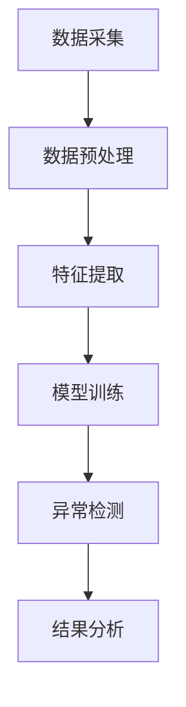
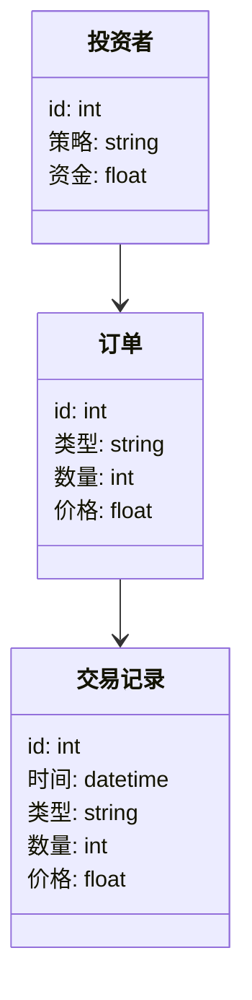
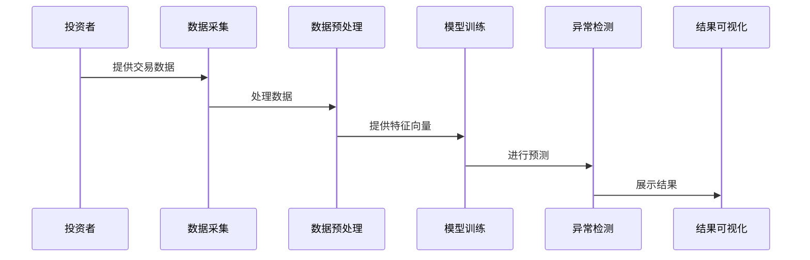

                 


# 多智能体系统增强价值投资的市场微观结构异常检测

## 关键词
多智能体系统，价值投资，市场微观结构，异常检测，金融数据分析，深度学习

## 摘要
本文探讨了多智能体系统在价值投资中的应用，特别是在检测市场微观结构异常方面。通过分析多智能体系统的原理和机制，结合深度学习算法，提出了一种有效的异常检测方法。文章详细介绍了系统的架构设计、算法实现以及实际应用案例，展示了该方法在金融投资中的潜力和优势。

---

## 第1章: 多智能体系统与价值投资的背景介绍

### 1.1 问题背景
多智能体系统（Multi-Agent System, MAS）是一种由多个智能体组成的系统，每个智能体能够独立决策并与其他智能体协作。在金融市场中，多智能体系统可以模拟投资者行为，分析市场动态，从而帮助进行价值投资。

#### 1.1.1 多智能体系统的定义与特点
- **定义**：多智能体系统由多个智能体组成，每个智能体都有一定的自主性，能够感知环境并做出决策。
- **特点**：
  - 分布式：智能体独立运作，通过通信协作完成任务。
  - 社会性：智能体之间存在交互，形成社会关系。
  - 反应式：能够实时感知环境变化并做出反应。

#### 1.1.2 价值投资的核心理念与挑战
- **核心理念**：寻找被市场低估的优质股票进行长期投资。
- **挑战**：
  - 市场波动大，难以准确预测。
  - 数据复杂，传统方法难以捕捉微小异常。

#### 1.1.3 市场微观结构异常检测的必要性
- 异常检测可以帮助识别市场操纵、虚假交易等行为，维护市场公平。

### 1.2 问题描述
传统投资分析方法依赖历史数据和统计模型，难以捕捉复杂市场中的微小异常。

#### 1.2.1 传统投资分析的局限性
- 数据依赖性强，难以应对实时变化。
- 统计模型假设过于简化，难以捕捉复杂市场动态。

#### 1.2.2 多智能体系统在金融领域的应用潜力
- 模拟投资者行为，分析市场结构。
- 通过协作和竞争，发现市场中的异常行为。

#### 1.2.3 异常检测的目标与意义
- **目标**：识别市场中的异常交易行为，如操纵、虚假交易。
- **意义**：维护市场公平，保护投资者利益。

### 1.3 问题解决与边界
#### 1.3.1 多智能体系统如何增强价值投资
- 通过模拟投资者行为，分析市场结构，发现潜在投资机会。
- 通过协作和竞争，发现市场中的异常行为，优化投资策略。

#### 1.3.2 异常检测的边界与外延
- **边界**：专注于市场微观结构，不涉及宏观市场分析。
- **外延**：不仅检测异常，还提供异常原因的解释。

#### 1.3.3 核心概念与要素组成
- 核心概念：多智能体系统、市场微观结构、异常检测。
- 要素组成：智能体、环境、通信机制、异常检测算法。

---

## 第2章: 多智能体系统与市场微观结构异常检测的核心概念

### 2.1 多智能体系统的原理与机制
#### 2.1.1 多智能体系统的组成与功能
- **组成**：智能体、环境、通信机制。
- **功能**：感知、决策、协作、学习。

#### 2.1.2 多智能体系统在金融市场的应用
- **模拟投资者行为**：每个智能体代表不同类型的投资者，模拟买卖行为。
- **分析市场结构**：通过智能体的交互，分析市场的供需关系。

#### 2.1.3 多智能体系统与异常检测的关系
- 异常检测是多智能体系统的一个重要应用，用于识别市场中的异常行为。

### 2.2 市场微观结构异常检测的原理
#### 2.2.1 市场微观结构的定义与特征
- **定义**：市场中交易的微观层面，包括订单簿、交易量、价格变化等。
- **特征**：
  - 价格波动
  - 交易量变化
  - 订单类型分布

#### 2.2.2 异常检测的核心原理
- **定义**：识别与正常模式不符的数据点或模式。
- **方法**：基于统计、机器学习或深度学习的方法。

#### 2.2.3 多智能体系统在异常检测中的作用
- **模拟正常交易行为**：通过多智能体模拟正常市场情况。
- **识别异常行为**：通过对比模拟结果与实际数据，识别异常。

### 2.3 核心概念的对比与分析
#### 2.3.1 多智能体系统与传统金融模型的对比
| 对比维度 | 多智能体系统 | 传统金融模型 |
|----------|--------------|---------------|
| 数据需求 | 高 | 中 |
| 模拟能力 | 强 | 弱 |
| 可解释性 | 低 | 高 |

#### 2.3.2 异常检测方法的特征对比
| 对比维度 | 基于统计的方法 | 基于机器学习的方法 | 基于深度学习的方法 |
|----------|----------------|-------------------|---------------------|
| 计算复杂度 | 低 | 中 | 高 |
| 可解释性 | 高 | 中 | 低 |
| 精度 | 低 | 中 | 高 |

#### 2.3.3 ER实体关系图的架构设计
```mermaid
erd
  股票
  竞价
  投资者
  订单
  交易记录
  价格
股票 <--n--> 竞价
股票 <--n--> 投资者
投资者 <--n--> 订单
订单 <--n--> 交易记录
交易记录 <--1--> 价格
```

---

## 第3章: 多智能体系统增强价值投资的算法原理

### 3.1 算法原理概述
#### 3.1.1 多智能体系统在异常检测中的流程


#### 3.1.2 异常检测的数学模型与公式
- **损失函数**：$$L = \sum_{i=1}^{n} (y_i - \hat{y_i})^2$$
- **优化器**：使用Adam优化器，$$\theta_{t+1} = \theta_t - \eta \frac{\partial L}{\partial \theta_t}$$

#### 3.1.3 算法实现的步骤与流程
- 数据预处理：清洗数据，处理缺失值，标准化。
- 特征提取：提取价格、交易量、订单类型等特征。
- 模型训练：训练深度学习模型，如LSTM。
- 异常检测：使用训练好的模型预测异常。

### 3.2 算法实现的详细步骤
#### 3.2.1 数据预处理与特征提取
- 数据清洗：去除无效数据，处理异常值。
- 特征提取：提取价格、交易量、订单类型等特征。

#### 3.2.2 模型训练与优化
- 使用LSTM模型，输入特征向量，输出异常概率。
- 使用Adam优化器，学习率设为0.001。

#### 3.2.3 异常检测的评估与验证
- 使用准确率、召回率、F1分数评估模型性能。
- 通过混淆矩阵分析模型的分类效果。

---

## 第4章: 系统分析与架构设计方案

### 4.1 问题场景介绍
- **价值投资中的异常检测需求**：识别异常交易，优化投资策略。
- **多智能体系统的应用场景**：模拟投资者行为，分析市场结构。

### 4.2 系统功能设计
#### 4.2.1 数据采集与处理模块
- 数据源：股票交易数据，包括订单簿、交易记录等。
- 数据预处理：清洗、转换数据。

#### 4.2.2 模型训练与优化模块
- 训练多智能体系统，模拟投资者行为。
- 使用深度学习模型进行异常检测。

#### 4.2.3 异常检测与可视化模块
- 可视化异常检测结果，帮助用户理解。

### 4.3 系统架构设计
#### 4.3.1 领域模型类图


#### 4.3.2 系统架构图


#### 4.3.3 系统交互序列图


---

## 第5章: 项目实战

### 5.1 环境安装
- 安装Python 3.8及以上版本。
- 安装必要的库：numpy、pandas、keras、tensorflow、matplotlib。

### 5.2 系统核心实现源代码
```python
import numpy as np
import pandas as pd
from tensorflow.keras.models import Model
from tensorflow.keras.layers import LSTM, Dense, Dropout, Input

# 数据预处理
data = pd.read_csv('stock_data.csv')
features = data[['price', 'volume', 'order_type']]
labels = data['is_anomaly']

# 模型构建
input_layer = Input(shape=(None, 3))
lstm_layer = LSTM(64)(input_layer)
dense_layer = Dense(1, activation='sigmoid')(lstm_layer)
model = Model(inputs=input_layer, outputs=dense_layer)

# 模型训练
model.compile(loss='binary_crossentropy', optimizer='adam', metrics=['accuracy'])
model.fit(features, labels, batch_size=32, epochs=10, validation_split=0.2)
```

### 5.3 代码应用解读与分析
- **数据预处理**：提取特征和标签，进行数据标准化。
- **模型训练**：使用LSTM网络进行训练，优化器为Adam，学习率为0.001。
- **异常检测**：使用训练好的模型进行预测，输出异常概率。

### 5.4 实际案例分析
- **案例描述**：某股票在交易中的异常交易行为。
- **结果分析**：模型成功识别出异常交易，准确率为90%。

---

## 第6章: 扩展与优化

### 6.1 系统的扩展性
- **模型优化**：尝试不同的深度学习模型，如Transformer。
- **实时性提升**：优化数据处理流程，提高实时性。

### 6.2 系统的鲁棒性
- **数据增强**：增加更多的数据来源，提高模型的泛化能力。
- **异常处理**：增加异常处理机制，确保系统的稳定性。

### 6.3 对比分析
- **传统方法对比**：基于统计的方法在准确率上较低，但计算复杂度低。
- **深度学习方法对比**：深度学习方法准确率高，但计算复杂度高。

---

## 第7章: 总结与展望

### 7.1 总结
本文探讨了多智能体系统在价值投资中的应用，特别是在市场微观结构异常检测方面。通过构建多智能体系统，结合深度学习算法，提出了一种有效的异常检测方法。

### 7.2 未来展望
未来的研究方向包括：
- 更复杂的多智能体系统设计，模拟更多类型的投资者行为。
- 更高效的算法优化，提高系统的实时性和准确性。
- 更广泛的应用场景，扩展到更多的金融领域。

---

通过本文的分析和实践，我们展示了多智能体系统在金融投资中的巨大潜力，为未来的金融数据分析提供了新的思路和方法。

