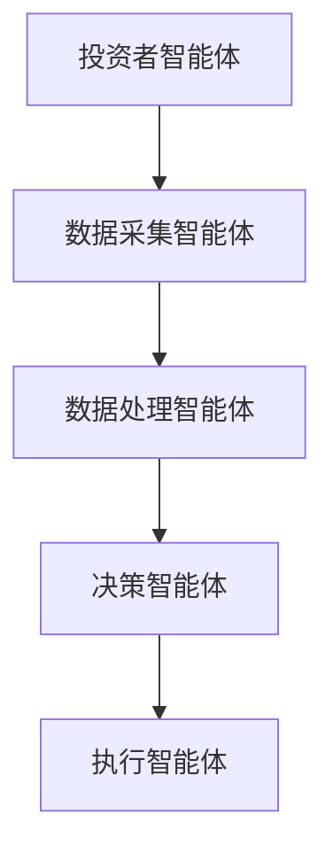
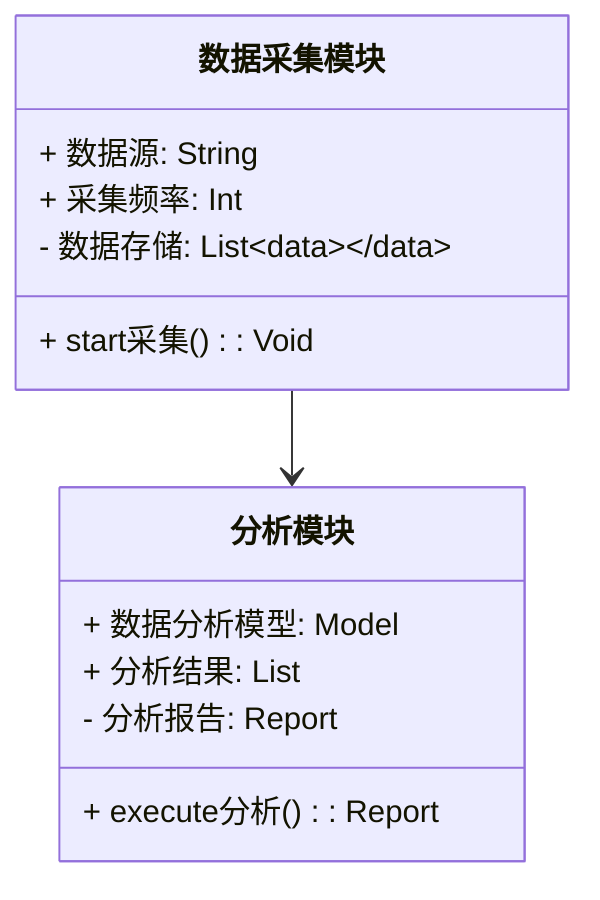

                 


# 多智能体系统增强价值投资的行业生命周期分析

> 关键词：多智能体系统，价值投资，行业生命周期，投资策略，算法实现

> 摘要：本文探讨了多智能体系统（MAS）在价值投资中的应用，结合行业生命周期的分析，提出了基于MAS的价值投资模型。通过详细分析MAS在数据采集、决策支持、组合管理等方面的作用，结合实际案例和算法实现，展示了MAS如何增强价值投资的科学性和效率。

---

## 第一部分：多智能体系统与价值投资概述

### 第1章：多智能体系统概述

#### 1.1 多智能体系统的定义与特点

多智能体系统（Multi-Agent System, MAS）是由多个智能体（Agent）组成的分布式系统，每个智能体能够感知环境、自主决策并与其他智能体协作。MAS的核心特点包括：

- **自主性**：智能体能够独立决策。
- **反应性**：能够实时感知环境变化。
- **协作性**：多个智能体通过协作完成复杂任务。
- **分布性**：系统由多个分散的智能体组成，无集中控制节点。

与分布式系统和群智系统的区别如下：

| 特性       | 分布式系统         | 群智系统         | 多智能体系统（MAS） |
|------------|------------------|----------------|------------------|
| 结构特点     | 任务分解，节点协作 | 大规模用户参与   | 智能体自主决策     |
| 智能水平     | 低                | 高（用户贡献）    | 中等（智能体协作）  |
| 应用场景     | 网络通信、分布式计算 | 社交网络、群体决策 | 机器人、自动驾驶、金融分析 |

#### 1.2 多智能体系统的分类与应用

多智能体系统可以根据智能体的类型和功能进行分类：

- **反应式MAS**：基于当前感知做出反应，如自动驾驶中的路径规划。
- **认知式MAS**：具备复杂推理能力，如法律推理系统。
- **分布式MAS**：智能体分布在网络中，如分布式数据库。

MAS在金融领域的典型应用包括：

- 量化交易：智能体实时分析市场数据，执行交易。
- 风险管理：多个智能体协作评估风险。

---

### 第2章：价值投资理论概述

#### 2.1 价值投资的核心思想

价值投资由本杰明·格雷厄姆提出，强调以低于内在价值的价格买入股票。其核心思想包括：

- **安全边际**：买入价格远低于内在价值。
- **长期视角**：关注企业的基本面，而非短期市场波动。

#### 2.2 行业生命周期的定义与阶段划分

行业生命周期分为四个阶段：

1. **导入期**：市场需求不足，企业数量少，竞争小。
2. **成长期**：市场需求快速增长，企业数量增加。
3. **成熟期**：市场需求稳定，企业竞争加剧。
4. **衰退期**：市场需求下降，企业数量减少。

#### 2.3 价值投资与行业生命周期的关系

在不同行业生命周期阶段，价值投资策略有所调整：

- **导入期**：寻找具有潜力的新兴行业。
- **成长期**：投资于行业龙头。
- **成熟期**：选择具有稳定收益的企业。
- **衰退期**：规避衰退行业，寻找转型机会。

---

## 第二部分：多智能体系统在价值投资中的应用

### 第3章：多智能体系统在价值投资中的核心作用

#### 3.1 多智能体系统在价值投资中的数据采集与分析

多智能体系统能够实时采集多源数据，如市场数据、新闻数据、社交媒体数据等。通过自然语言处理（NLP）和机器学习（ML）算法，分析数据并生成投资信号。

**案例分析**：某MAS通过分析社交媒体情绪和新闻标题，提前发现市场趋势。

#### 3.2 多智能体系统在投资决策中的应用

MAS能够模拟多个投资策略，评估不同策略在不同生命周期阶段的表现，并推荐最优投资组合。

**算法实现**：使用分布式计算框架（如Spark）处理海量数据，通过遗传算法优化投资组合。

#### 3.3 多智能体系统在组合管理与风险控制中的应用

MAS能够实时监控投资组合的风险指标（如VaR、波动率），并根据市场变化动态调整持仓。

**数学模型**：使用马科维茨投资组合理论，结合MAS进行动态优化。

---

## 第三部分：多智能体系统的算法实现

### 第4章：多智能体系统的算法实现

#### 4.1 分布式计算与MAS的实现

MAS的分布式特性可以通过分布式计算框架实现。以下是一个简单的MAS框架：



#### 4.2 基于MAS的投资策略优化算法

以下是一个基于MAS的投资策略优化算法：

```python
import numpy as np
from sklearn import datasets

# 数据集加载
X, y = datasets.load_iris(return_X_y=True)

# 分布式计算
from distributed import Client
client = Client('scheduler:port')

# 并行计算
import dask
from dask import delayed

@delayed
def process_chunk(chunk):
    return np.mean(chunk)

means = client.submit(process_chunk, X).compute()

print(means)
```

---

## 第四部分：数学模型与公式

### 第5章：数学模型与公式

#### 5.1 价值投资的数学模型

资产的内在价值可以用以下公式计算：

$$ V = \sum_{t=1}^{n} \frac{C_t}{(1 + r)^t} $$

其中，\( V \) 是内在价值，\( C_t \) 是第 \( t \) 年的现金流，\( r \) 是折现率。

#### 5.2 多智能体系统的动态模型

MAS的动态模型可以用以下公式表示：

$$ S_{t+1} = f(S_t, A_t) $$

其中，\( S_t \) 是系统状态，\( A_t \) 是智能体的行动。

---

## 第五部分：系统架构与设计

### 第6章：系统架构与设计

#### 6.1 系统功能设计

系统功能需求包括：

- 数据采集模块：采集市场数据。
- 分析模块：分析数据并生成投资信号。
- 决策模块：制定投资策略。
- 执行模块：执行交易指令。

**领域模型类图**：



#### 6.2 系统架构设计

系统架构采用分层设计：

- 数据层：存储原始数据。
- 业务逻辑层：处理数据并生成策略。
- 表示层：展示结果。

**系统架构图**：


---

## 第六部分：项目实战

### 第7章：项目实战

#### 7.1 环境安装与配置

安装Python环境和相关库：

```bash
pip install numpy pandas scikit-learn distributed
```

#### 7.2 核心代码实现

实现MAS的简单投资策略：

```python
import numpy as np
import pandas as pd

# 数据准备
data = pd.read_csv('market_data.csv')

# 分布式计算
from distributed import Client
client = Client('scheduler:port')

@delayed
def compute_return(arr):
    return np.mean(arr)

returns = client.submit(compute_return, data['return']).compute()

print(returns)
```

---

## 结论与展望

通过本文的探讨，我们展示了多智能体系统在价值投资中的潜力，特别是在行业生命周期分析中的应用。MAS能够显著提高投资决策的效率和准确性。未来的研究可以进一步探索MAS在风险管理中的应用，以及如何结合区块链技术增强系统的安全性。

---

**感谢您的阅读！希望本文对您理解多智能体系统在金融领域的应用有所帮助。**

