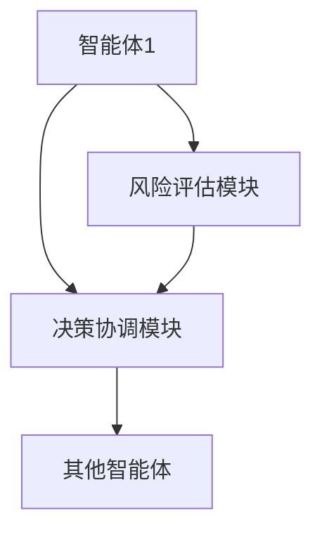
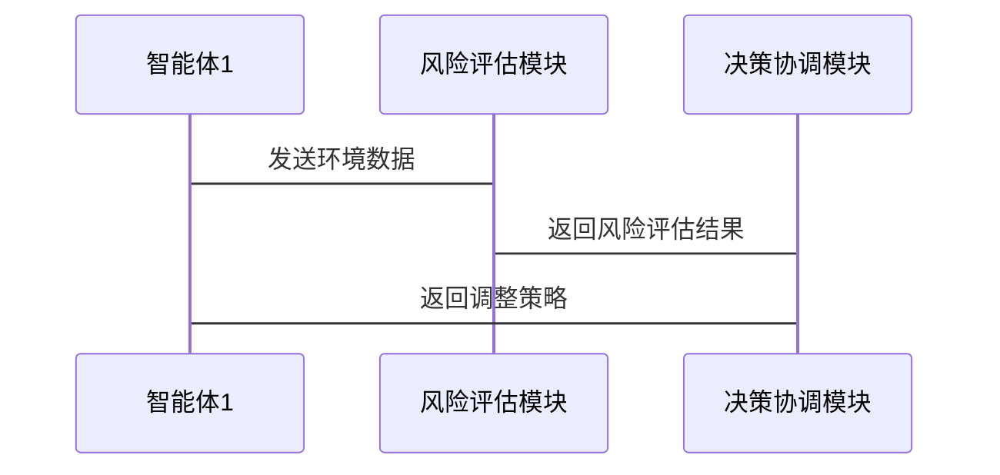

                 


# 多智能体系统如何实现动态风险平衡

---

## 关键词：多智能体系统、动态风险平衡、博弈论、分布式计算、系统架构

---

## 摘要：多智能体系统是指多个智能体协作完成任务的系统，其核心挑战在于实现动态风险平衡。本文从多智能体系统的定义与特点出发，详细分析动态风险平衡的核心概念、算法原理、系统架构及实际应用。通过博弈论和分布式计算等方法，结合具体案例，展示如何在多智能体系统中实现动态风险平衡，确保系统的高效与稳定。

---

# 第一部分：多智能体系统与动态风险平衡概述

## 第1章：多智能体系统基础

### 1.1 多智能体系统概述

#### 1.1.1 多智能体系统的定义
多智能体系统（Multi-Agent System, MAS）是由多个智能体组成的分布式系统，每个智能体具备自主性、反应性和目标导向性。智能体能够感知环境、做出决策并执行动作，以实现特定目标。

#### 1.1.2 多智能体系统的特性
| 特性 | 描述 |
|------|------|
| 分布式 | 智能体独立运行，通过通信协作完成任务。 |
| 自主性 | 智能体能够自主决策，无需外部干预。 |
| 反应性 | 智能体能够实时感知环境变化并做出反应。 |
| 协作性 | 智能体之间通过协作完成共同目标。 |

#### 1.1.3 多智能体系统的应用场景
- **智能交通系统**：协调交通信号灯、自动驾驶车辆。
- **分布式计算**：任务分配与负载均衡。
- **机器人网络**：多机器人协作完成复杂任务。

### 1.2 动态风险平衡的定义与重要性

#### 1.2.1 动态风险平衡的定义
动态风险平衡是指在多智能体系统中，智能体通过动态调整策略和协作，使整体风险在系统中保持均衡，确保系统稳定运行。

#### 1.2.2 动态风险平衡的重要性
- **系统稳定性**：避免单点故障，提高系统鲁棒性。
- **效率优化**：动态调整资源分配，提高整体效率。
- **实时适应性**：应对环境变化，快速响应风险。

---

## 第2章：多智能体系统中的核心概念与联系

### 2.1 多智能体系统的核心概念

#### 2.1.1 智能体的定义与属性
智能体具备以下属性：
- **自主性**：独立决策。
- **反应性**：实时感知环境。
- **目标导向性**：为实现目标而行动。

#### 2.1.2 多智能体系统的组成结构
多智能体系统的组成结构包括：
1. **智能体**：独立决策的个体。
2. **通信机制**：智能体之间的信息交互。
3. **协调机制**：智能体协作完成任务。

#### 2.1.3 多智能体系统与传统AI的区别
| 方面 | 多智能体系统 | 传统AI系统 |
|------|--------------|------------|
| 结构 | 分布式       | 集中式     |
| 智能体 | 多个         | 单个       |
| 协作 | 强调协作     | 独立运行    |

### 2.2 动态风险平衡的核心原理

#### 2.2.1 风险评估的基本概念
风险评估是动态风险平衡的基础，涉及以下几个步骤：
1. **风险识别**：识别可能的风险来源。
2. **风险量化**：评估每个风险的影响程度。
3. **风险排序**：根据影响程度对风险进行排序。

#### 2.2.2 动态风险平衡的机制
动态风险平衡通过以下机制实现：
1. **风险分配**：根据智能体的能力和角色分配风险。
2. **风险控制**：实时调整策略以降低风险。

#### 2.2.3 动态风险平衡的实现目标
- **风险均衡**：确保每个智能体承担的风险与其能力相匹配。
- **系统稳定**：避免因某一智能体风险过高而导致系统崩溃。

---

## 第3章：多智能体系统中的风险分析与建模

### 3.1 风险分析的基本方法

#### 3.1.1 风险识别与评估
风险识别是通过分析系统可能面临的风险来源，如环境变化、智能体故障等。

#### 3.1.2 风险优先级的确定
根据风险的影响程度和发生概率，对风险进行优先级排序。

#### 3.1.3 风险建模的步骤
1. **确定风险因素**：识别可能影响系统的关键风险。
2. **建立数学模型**：使用概率论或博弈论建立风险模型。
3. **验证与优化**：通过实验验证模型的准确性并进行优化。

### 3.2 多智能体系统中的风险建模

#### 3.2.1 基于博弈论的风险建模
博弈论是分析多智能体系统风险的重要工具。例如，可以通过纳什均衡分析智能体之间的策略选择。

#### 3.2.2 基于概率论的风险建模
使用概率论模型（如马尔可夫链）预测风险发生的概率。

#### 3.2.3 基于图论的风险建模
通过图论方法分析系统中风险的传播路径。

---

# 第二部分：多智能体系统中的动态风险平衡算法

## 第4章：动态风险平衡的算法原理

### 4.1 基于博弈论的动态风险平衡算法

#### 4.1.1 博弈论的基本概念
博弈论研究多个参与者在策略选择中的互动，适用于分析多智能体系统的决策过程。

#### 4.1.2 基于纳什均衡的算法实现
纳什均衡是博弈论中的核心概念，表示在给定其他智能体策略的情况下，智能体无法通过单方面改变策略而提高自身收益的状态。

#### 4.1.3 基于极大极小算法的优化
极大极小算法（Minimax）用于在博弈中找到最优策略，常用于游戏树的分析。

### 4.2 基于分布式计算的动态风险平衡算法

#### 4.2.1 分布式计算的基本原理
分布式计算将任务分解成多个部分，由不同的智能体独立完成。

#### 4.2.2 基于分布式计算的动态风险平衡实现
通过分布式计算，智能体可以在不依赖中央控制的情况下，动态调整风险。

#### 4.2.3 分布式算法的优缺点分析
- **优点**：去中心化，避免单点故障。
- **缺点**：通信开销大，协调困难。

---

## 第5章：动态风险平衡的数学模型与公式

### 5.1 风险评估的数学模型

#### 5.1.1 风险评估的基本公式
$$ R = \sum_{i=1}^{n} p_i \times r_i $$
其中，$R$ 是总风险，$p_i$ 是风险 $i$ 的概率，$r_i$ 是风险 $i$ 的影响程度。

#### 5.1.2 基于博弈论的风险评估模型
$$ u_i = \max_{s_i} \min_{s_{-i}} u_i(s_i, s_{-i}) $$
其中，$u_i$ 是智能体 $i$ 的效用函数，$s_i$ 是智能体 $i$ 的策略，$s_{-i}$ 是其他智能体的策略组合。

---

## 第三部分：多智能体系统中的动态风险平衡实现

## 第6章：多智能体系统的系统分析与架构设计

### 6.1 问题场景介绍

#### 6.1.1 智能交通系统
在智能交通系统中，多个智能体（如车辆、交通灯）需要协作以减少拥堵和事故风险。

### 6.2 系统功能设计

#### 6.2.1 风险评估模块
功能：实时评估系统中的风险。
实现：使用概率模型计算风险发生的概率。

#### 6.2.2 决策协调模块
功能：根据风险评估结果，协调智能体的决策。
实现：基于博弈论的算法实现策略调整。

### 6.3 系统架构设计

#### 6.3.1 系统架构图


#### 6.3.2 系统交互序列图


---

## 第7章：项目实战：智能交通系统的动态风险平衡实现

### 7.1 环境安装

#### 7.1.1 安装Python库
```bash
pip install numpy matplotlib
```

### 7.2 核心代码实现

#### 7.2.1 风险评估函数
```python
import numpy as np

def risk_assessment(data):
    # 数据预处理
    probabilities = np.array(data['probabilities'])
    impacts = np.array(data['impacts'])
    # 计算总风险
    total_risk = np.dot(probabilities, impacts)
    return total_risk
```

#### 7.2.2 博弈论算法实现
```python
def nash_equilibrium(players, strategies):
    # 计算纳什均衡
    pass
```

### 7.3 案例分析与效果展示

#### 7.3.1 案例分析
以智能交通系统为例，分析系统在高峰时段和非高峰时段的动态风险平衡实现效果。

#### 7.3.2 效果展示
展示系统在不同场景下的运行效果，对比有无动态风险平衡的系统表现。

---

## 第8章：总结与展望

### 8.1 内容回顾
总结本文的主要内容，强调动态风险平衡在多智能体系统中的重要性。

### 8.2 未来展望
探讨未来的研究方向，如更高效的算法设计、结合机器学习的动态调整等。

### 8.3 最佳实践 tips
- **系统设计**：确保智能体具备足够的自主性和反应性。
- **算法选择**：根据具体场景选择合适的算法。
- **数据实时性**：确保数据的实时更新以支持动态调整。

### 8.4 拓展阅读
推荐相关领域的书籍和论文，供读者深入学习。

---

# 结语
通过本文的详细分析与讲解，读者可以全面了解多智能体系统中动态风险平衡的实现方法，并能够将其应用于实际项目中。未来，随着人工智能技术的不断发展，动态风险平衡将在更多领域发挥重要作用。

